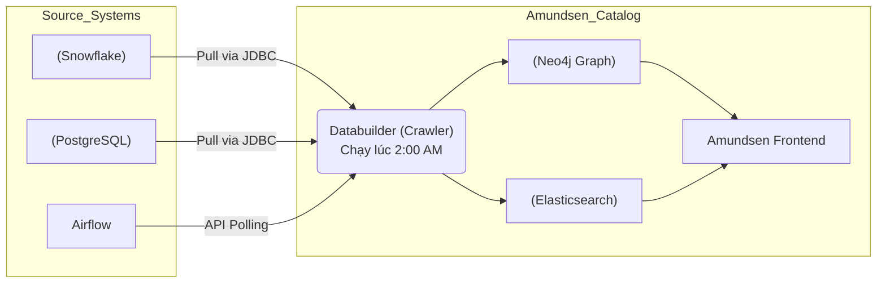
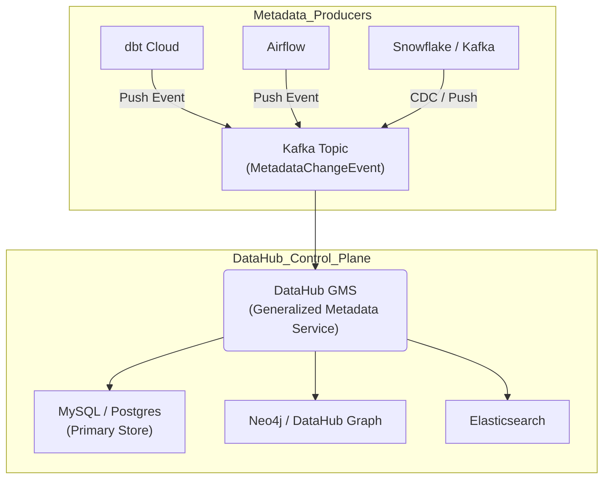

Data Catalog thường bị hiểu nhầm là một công cụ UI đơn giản để gõ từ khóa và tìm kiếm bảng. Tuy nhiên, ở quy mô Mega-Tech hoặc Enterprise - nơi hàng nghìn pipelines chạy liên tục tạo ra hàng Petabyte dữ liệu mỗi ngày, Data Catalog đóng vai trò là một **Metadata Control Plane** trung tâm.

Nếu không có Data Catalog, các Data Engineer và Data Scientist sẽ phải đối mặt với **Dark Data** (dữ liệu rác không ai biết từ đâu tới), thời gian Data Discovery kéo dài hàng tháng, và nguy hiểm hơn là hiện tượng **Metadata Drift** - khi lược đồ (schema) vật lý đã thay đổi nhưng các hệ thống hạ nguồn (downstream) và Dashboard báo cáo vẫn dùng định nghĩa cũ, dẫn đến sai lệch nghiêm trọng về tài chính.

Bài viết này sẽ mổ xẻ kiến trúc của các thế hệ Data Catalog hiện đại, đặc biệt tập trung vào các hệ thống mã nguồn mở kinh điển như **LinkedIn DataHub** (thế hệ 3) và **Lyft Amundsen** (thế hệ 2), từ đó rút ra các bài học về kiến trúc vật lý và những đánh đổi (Trade-offs) khốc liệt trong thiết kế phân tán.

---

## 1. Sự Tiến Hóa & Kiến trúc Vật lý (Physical Architecture)

Hệ thống Data Catalog quy mô lớn thường được cấu thành từ 4 lớp:
1.  **Ingestion Layer:** Thu thập Metadata từ Source (Snowflake, BigQuery, Kafka, Airflow).
2.  **Metadata Storage:** Lưu trữ dữ liệu quan hệ (schema, data types) và dữ liệu đồ thị (Graph) để phục vụ **Data Lineage**.
3.  **Search Index:** Cung cấp Full-text search (Elasticsearch).
4.  **Serving Layer (API):** Cung cấp GraphQL/REST API cho UI và các dịch vụ tự động hóa (Data Quality gating).

Sự khác biệt cốt lõi giữa các thế hệ Catalog nằm ở **Ingestion Layer**. Cuộc chiến khốc liệt nhất diễn ra giữa hai mô hình: **Pull-based (Batch)** và **Push-based (Event-Driven)**.

### 1.1. Thế hệ 2 (Pull-Based / Batch): Kiến trúc của Lyft Amundsen

Ở mô hình này, Catalog đóng vai trò chủ động (Active Consumer). Một cron job (trong Amundsen gọi là *Databuilder*) sẽ quét (crawl) qua các hệ thống nguồn theo lịch định kỳ (thường là nửa đêm) để kéo (pull) metadata về.



-   **Systemic Advantage (Ưu điểm):** Dễ triển khai. Hệ thống nguồn (Snowflake, Postgres) hoàn toàn "ngu ngơ" và không cần biết về sự tồn tại của Catalog (Decoupled architecture).
-   **Trade-off khốc liệt (Nhược điểm):** 
    -   **Staleness (Độ trễ cao):** Metadata luôn bị trễ (Out-of-sync) so với thực tế. Nếu một kỹ sư Data Engineer drop một cột quan trọng lúc 9h sáng, Catalog vẫn hiển thị cột đó cho đến đợt quét đêm hôm sau.
    -   **Thảm họa FinOps:** Khi công ty bạn có 100,000 bảng trên Snowflake, việc dùng lệnh `SHOW TABLES` hoặc quét `INFORMATION_SCHEMA` mỗi đêm sẽ đánh thức (wake up) các Warehouse đang ngủ, gây tốn Compute Credit một cách vô ích.

### 1.2. Thế hệ 3 (Push-Based / Real-time): Kiến trúc của LinkedIn DataHub

Để giải quyết triệt để bài toán độ trễ, LinkedIn giới thiệu **DataHub** với kiến trúc **Event-Driven / Push-based**. Hệ thống nguồn (hoặc CI/CD pipeline) chủ động đẩy (push) metadata changes dưới dạng sự kiện (events) vào Kafka.



-   **Systemic Advantage (Ưu điểm):** Real-time Metadata. DataHub đóng vai trò "Reactive". Bất kỳ sự thay đổi schema nào cũng được phát sóng (broadcast) qua Kafka và phản ánh ngay lập tức trên UI. Nó cho phép xây dựng các tính năng Active Governance (ví dụ: gửi Slack alert ngay khi phát hiện bảng có cột chứa dữ liệu PII nhạy cảm).
-   **Trade-off (Nhược điểm):** 
    -   Yêu cầu vận hành hạ tầng Messaging phức tạp (Kafka).
    -   Sự phụ thuộc (Coupling): Mọi hệ thống nguồn hoặc ETL engine phải được cài đặt SDK (được "độ" / instrumented) để biết cách nói chuyện với Kafka hoặc DataHub REST API.

---

## 2. Thiết kế Mô hình Dữ liệu (Schema-First vs. JSON Blob)

Một trong những bài học đắt giá nhất từ LinkedIn DataHub là **Schema-First Approach**. Metadata rất phức tạp, phân tán và đa hình. Nếu bạn thiết kế database lưu trữ metadata dưới dạng cột JSON phi cấu trúc (NoSQL Blob), hệ thống sẽ nhanh chóng chìm trong rác.

DataHub sử dụng **PDL (Pegasus Data Language)** hoặc **Avro** để định nghĩa chặt chẽ metadata (entities, aspects). Một Data Asset (như một bảng) được cấu thành từ nhiều "Aspects" (khía cạnh độc lập): SchemaMetadata, Ownership, DatasetProfile, DataLineage.

### Code Thực Chiến: Gửi Metadata Event (MCP) bằng Python SDK
Dưới đây là cách một Staff Engineer cấu hình một tác vụ gửi Metadata Change Proposal (MCP) lên DataHub mỗi khi schema thay đổi. Code này thường được nhúng vào CI/CD pipeline của Data Warehouse.

```python
import datahub.emitter.mce_builder as builder
from datahub.emitter.rest_emitter import DatahubRestEmitter
from datahub.metadata.schema_classes import (
    SchemaMetadataClass,
    SchemaFieldClass,
    SchemaFieldDataTypeClass,
    StringTypeClass,
    NumberTypeClass,
)

# 1. Định nghĩa các cột (Fields) với Schema chuẩn xác
fields = [
    SchemaFieldClass(
        fieldPath="user_id",
        type=SchemaFieldDataTypeClass(type=StringTypeClass()),
        nativeDataType="VARCHAR(50)",
        description="Mã định danh người dùng độc nhất. Cấp độ bảo mật: Cao."
    ),
    SchemaFieldClass(
        fieldPath="revenue",
        type=SchemaFieldDataTypeClass(type=NumberTypeClass()),
        nativeDataType="DECIMAL(10,2)",
        description="Doanh thu tính bằng USD."
    )
]

# 2. Xây dựng Schema Metadata Aspect (Cập nhật riêng phần Schema)
schema_metadata = SchemaMetadataClass(
    schemaName="public.users",
    platform="urn:li:dataPlatform:snowflake",
    version=1,
    hash="",
    platformSchema=builder.make_schema_field("urn:li:dataPlatform:snowflake"),
    fields=fields
)

# 3. Đẩy (Push) sự kiện cập nhật Metadata (MetadataChangeEvent)
emitter = DatahubRestEmitter("http://datahub-gms:8080")
mcp = builder.make_mcp(
    urn="urn:li:dataset:(urn:li:dataPlatform:snowflake,public.users,PROD)",
    aspect=schema_metadata,
)
emitter.emit(mcp)
print("Đã push schema update lên DataHub. Ownership và Lineage giữ nguyên!")
```

Việc module hóa thành các Aspect giúp kiến trúc hoạt động hoàn hảo: Nếu team Data Quality chạy job cập nhật Aspect `DatasetProfile` (ví dụ: tỉ lệ NULL), nó không hề ghi đè lên Aspect `Ownership` do team Data Governance đang quản lý.

---

## 3. Rủi ro Vận hành và Sự cố Thực tế (Real-world Incidents)

Khi tự host một hệ thống Data Catalog khổng lồ, đội ngũ Platform Engineering thường vấp phải các bãi mìn sau:

### 3.1. Sự cố: Elasticsearch Mapping Explosion
-   **Ngữ cảnh:** Trong DataHub hoặc Amundsen, Elasticsearch được dùng làm Text Search. Kỹ sư đôi khi ingest logs hoặc Custom Properties (với các key động do user tự sinh) vào metadata payload mà quên cấu hình Elasticsearch.
-   **Hậu quả:** Elasticsearch sẽ tự động tạo mapping fields mới cho mỗi key động. Khi số lượng fields vượt quá limit (mặc định 1000 fields/index), cluster sẽ từ chối ghi (Write Rejection) hoặc bị **OOMKilled** do tốn quá nhiều Heap RAM để quản lý meta-mapping.
-   **Khắc phục (Troubleshooting):** 
    -   Trong Elasticsearch Index Template, bắt buộc đặt `dynamic: false` hoặc `dynamic: strict` cho các metadata index.
    -   Sử dụng kiểu dữ liệu `flattened` cho các custom JSON properties không cần full-text search.

### 3.2. Sự cố: Cartesian Explosion trong Data Lineage (Graph Query)
-   **Ngữ cảnh:** Luồng dữ liệu (Lineage) được lưu trong Graph Database (như Neo4j). Giả sử một bảng tổng hợp `Daily_Active_Users` được đọc bởi 10,000 dashboards khác nhau (Downstream), và nó lại được tạo ra từ 50 bảng gốc (Upstream).
-   **Hậu quả:** Khi người dùng mở UI để xem Lineage Graph, Graph Traversal Query sẽ bùng nổ tổ hợp chập (Cartesian Explosion). GraphDB CPU chạm mức 100%, query time-out, sập luôn GMS Server.
-   **Khắc phục:**
    -   Cấu hình Hard-limit độ sâu của Graph Traversal (ví dụ: max 2 hops).
    -   Phát hiện các Node có Degree quá lớn (Super-nodes - ví dụ các bảng Core Foundation) và buộc UI phải phân trang (Pagination) khi mở rộng.

### 3.3. Hiện tượng "Bãi rác có mục lục" [Garbage In, Garbage Out]
Đây là rủi ro về mặt kiến trúc thông tin (Information Architecture). Nếu công ty bạn có 500,000 bảng trên BigQuery, trong đó 90% là bảng tạm (temp tables) do dbt sinh ra hoặc bảng nháp của Data Scientist, việc đẩy tất cả lên Catalog sẽ khiến nó trở nên vô dụng.
-   **Giải pháp (Curated Data):** Catalog cần được thiết lập hàng rào (Ingestion Filters). Chỉ ingest những bảng nằm trong schema `PROD` hoặc `ANALYTICS`. Khai thác tính năng PageRank (như cách Amundsen làm) để xếp hạng bảng: Bảng nào được query nhiều nhất trong 30 ngày qua (dựa trên audit logs) sẽ được ưu tiên hiển thị trên cùng.

---

## 4. Nguồn Tham Khảo (References)

1.  **Open Sourcing DataHub: A Generalized Metadata Search & Discovery Platform** - *LinkedIn Engineering Blog*.
2.  **Open Sourcing Amundsen: A Data Discovery And Metadata Platform** - *Lyft Engineering Blog*.
3.  **Data Mesh Principles and Logical Architecture** - *Zhamak Dehghani (O'Reilly)*.
4.  **Designing Data-Intensive Applications** - *Martin Kleppmann*.
5.  **DataHub Official Architecture Documentation** - [docs.datahub.com](https://datahubproject.io/docs/architecture/architecture/]
