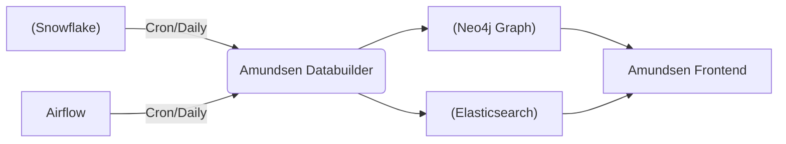
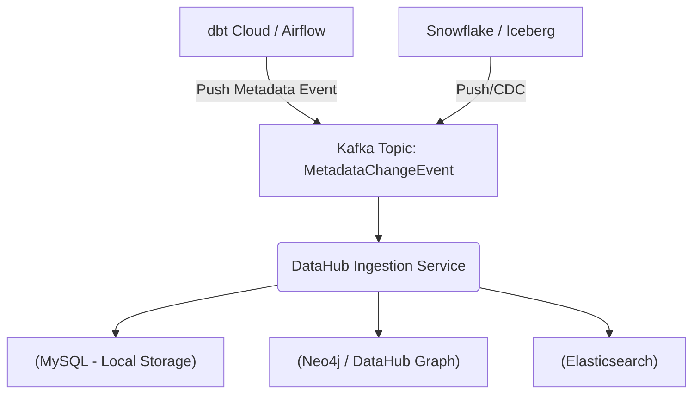

Data Catalog thường bị nhầm lẫn là một công cụ UI đơn giản để gõ từ khóa và tìm kiếm bảng. Tuy nhiên, ở quy mô Enterprise, nơi hàng nghìn pipelines chạy liên tục tạo ra hàng Petabyte dữ liệu, Data Catalog đóng vai trò là một **Metadata Control Plane** trung tâm.

Nếu không có Data Catalog, các kỹ sư sẽ phải đối mặt với **Dark Data**, thời gian Data Discovery kéo dài, và nguy hiểm hơn là hiện tượng **Metadata Drift** - khi lược đồ (schema) vật lý đã thay đổi nhưng các hệ thống hạ nguồn (downstream) và báo cáo vẫn dùng định nghĩa cũ, dẫn đến sai lệch nghiêm trọng.

Bài viết này sẽ mổ xẻ kiến trúc của các thế hệ Data Catalog hiện đại, đặc biệt tập trung vào các hệ thống mã nguồn mở kinh điển như **LinkedIn DataHub** và **Lyft Amundsen**, từ đó rút ra các bài học về kiến trúc vật lý và những đánh đổi (Trade-offs) trong thiết kế.

---

## 1. Kiến trúc Vật lý (Physical Architecture)

Một hệ thống Data Catalog quy mô lớn thường được cấu thành từ 4 lớp chính:

1. **Ingestion Layer (Thu thập Metadata):** Cần thu thập thông tin từ Database, Data Warehouse (Snowflake, BigQuery), Data Lake (Iceberg, Hudi), ETL Orchestrators (Airflow, Dagster), và BI Tools (Tableau, Superset).
2. **Metadata Storage (Lưu trữ Metadata):** Lưu trữ cả dữ liệu quan hệ (schema, data types) lẫn dữ liệu đồ thị (Graph) để phục vụ **Data Lineage**.
3. **Search Index (Chỉ mục Tìm kiếm):** Đảm bảo khả năng Full-text search, filtering tốc độ cao (thường dùng Elasticsearch).
4. **Serving Layer (API & UI):** Cung cấp GraphQL hoặc REST API cho người dùng và các dịch vụ khác (ví dụ: tự động chặn pipeline nếu data quality score quá thấp).

### Đánh đổi Cốt lõi: Pull-based vs Push-based Ingestion

Các thế hệ Data Catalog được phân loại rõ rệt dựa trên cách chúng thu thập Metadata.

#### Thế hệ 2 (Pull-based / Batch): Lyft Amundsen, Apache Atlas
Ở mô hình này, Catalog đóng vai trò chủ động (Active). Một cron job (thường gọi là *Databuilder*) sẽ quét (crawl) qua các hệ thống nguồn theo lịch định kỳ (thường là hàng đêm) để kéo (pull) metadata về.



- **Ưu điểm:** Hệ thống nguồn không cần biết về sự tồn tại của Catalog (Decoupled). Dễ triển khai ban đầu.
- **Nhược điểm (Trade-offs):** 
  - **High Latency:** Metadata luôn bị trễ (Out-of-sync) so với thực tế. Một cột bị rớt (dropped) lúc 9h sáng sẽ không được cập nhật trên Catalog cho đến đêm.
  - **Scale Bottleneck:** Khi số lượng bảng lên tới hàng trăm ngàn, việc quét toàn bộ (Full scan) `INFORMATION_SCHEMA` của Snowflake mỗi đêm sẽ cực kỳ đắt đỏ (Compute Cost) và gây áp lực lên database nguồn.

#### Thế hệ 3 (Push-based / Real-time): LinkedIn DataHub, Netflix Metacat
Để giải quyết bài toán độ trễ, LinkedIn giới thiệu **DataHub** với kiến trúc **Event-Driven / Push-based**. Hệ thống nguồn (hoặc CI/CD pipeline) chủ động đẩy (push) metadata changes dưới dạng sự kiện (events) vào Kafka.



- **Ưu điểm:** Real-time Metadata. Bất kỳ sự thay đổi schema nào cũng được phản ánh ngay lập tức trên Catalog.
- **Nhược điểm (Trade-offs):** 
  - **High Complexity:** Yêu cầu các hệ thống nguồn phải được "độ" (instrumented) để sinh ra sự kiện. Phải vận hành thêm hệ thống Messaging (Kafka).

---

## 2. Thiết kế Mô hình Dữ liệu (Schema-First Metadata Modeling)

Một trong những bài học đắt giá nhất từ LinkedIn DataHub là **Schema-First Approach**. Metadata rất phức tạp và đa hình. Nếu dùng JSON phi cấu trúc, hệ thống sẽ chìm trong rác (Garbage In, Garbage Out).

DataHub sử dụng **PDL (Pegasus Data Language)** hoặc **Avro** để định nghĩa chặt chẽ metadata (entities, aspects). Một Data Asset (như một bảng) được cấu thành từ nhiều "Aspects" (khía cạnh): SchemaMetadata, Ownership, DatasetProfile, DataLineage.

Dưới đây là một ví dụ Python code (giả lập) dùng để đẩy (Push) một Aspect lên DataHub qua Kafka/REST khi schema thay đổi:

```python
import datahub.emitter.mce_builder as builder
from datahub.emitter.rest_emitter import DatahubRestEmitter
from datahub.metadata.schema_classes import (
    SchemaMetadataClass,
    SchemaFieldClass,
    SchemaFieldDataTypeClass,
    StringTypeClass,
    NumberTypeClass,
)

# 1. Định nghĩa các cột (Fields)
fields = [
    SchemaFieldClass(
        fieldPath="user_id",
        type=SchemaFieldDataTypeClass(type=StringTypeClass()),
        nativeDataType="VARCHAR(50)",
        description="Mã định danh người dùng độc nhất."
    ),
    SchemaFieldClass(
        fieldPath="revenue",
        type=SchemaFieldDataTypeClass(type=NumberTypeClass()),
        nativeDataType="DECIMAL(10,2)",
        description="Doanh thu tính bằng USD."
    )
]

# 2. Xây dựng Schema Metadata Aspect
schema_metadata = SchemaMetadataClass(
    schemaName="public.users",
    platform="urn:li:dataPlatform:snowflake",
    version=1,
    hash="",
    platformSchema=builder.make_schema_field("urn:li:dataPlatform:snowflake"),
    fields=fields
)

# 3. Đẩy (Push) sự kiện cập nhật Metadata (MetadataChangeEvent)
emitter = DatahubRestEmitter("http://datahub-gms:8080")
mcp = builder.make_mcp(
    urn="urn:li:dataset:(urn:li:dataPlatform:snowflake,public.users,PROD)",
    aspect=schema_metadata,
)
emitter.emit(mcp)
print("Pushed schema update to DataHub successfully!")
```

Việc module hóa thành các Aspect giúp kiến trúc **Event-Sourcing** hoạt động hoàn hảo. Nếu team Data Quality cập nhật Aspect `DatasetProfile` (ví dụ: tỉ lệ NULL), nó không ghi đè lên Aspect `Ownership` do team Governance quản lý.

---

## 3. Rủi ro Vận hành và Sự cố Thực tế (Real-world Incidents)

Khi vận hành Data Catalog ở quy mô lớn, Staff Engineer cần lường trước các sự cố sập hệ thống.

### 3.1. Sự cố: Elasticsearch Mapping Explosion
- **Ngữ cảnh:** Trong DataHub hoặc Amundsen, Elasticsearch được dùng để search. Nếu chúng ta ingest logs hoặc JSON payload (với các key động, tự sinh) như một phần của metadata mà không tắt `dynamic_mapping`.
- **Hậu quả:** Elasticsearch sẽ tự động tạo hàng triệu mapping fields mới. Khi số lượng fields vượt quá limit (mặc định 1000 fields/index), cluster sẽ từ chối ghi (Write Rejection) hoặc bị **OOMKilled** do tốn quá nhiều Heap RAM để quản lý mapping.
- **Khắc phục:** 
  - Đặt `dynamic: false` hoặc `dynamic: strict` cho các index metadata.
  - Sử dụng kiểu dữ liệu `flattened` trong Elasticsearch cho các custom properties không cần full-text search.

### 3.2. Sự cố: Cartesian Explosion trong Data Lineage
- **Ngữ cảnh:** Lineage (Luồng dữ liệu) được lưu trong Graph Database (như Neo4j). Giả sử một bảng tổng hợp `Daily_Active_Users` được đọc bởi 10,000 dashboards khác nhau (Downstream), và nó lại được tạo ra từ 5 bảng gốc, mỗi bảng gốc có hàng trăm cột (Upstream).
- **Hậu quả:** Khi người dùng click vào bảng `Daily_Active_Users` để xem Lineage Graph (ở cả mức Table và Column), truy vấn Graph (Cypher query) sẽ bùng nổ tổ hợp chập (Cartesian Explosion). Database CPU chạm 100%, query time-out.
- **Khắc phục:**
  - Hạn chế độ sâu mặc định của Graph Traversal (ví dụ: chỉ load 1 hoặc 2 hops (bước) thay vì toàn bộ đồ thị).
  - Áp dụng Pagination cho các node có Degree quá lớn (Super-nodes).

### 3.3. Hiện tượng "Bãi rác có mục lục" (Garbage In, Garbage Out)
Đây là rủi ro về mặt kiến trúc thông tin (Information Architecture). Nếu công ty bạn có 500,000 bảng trên Snowflake, trong đó 90% là bảng tạm (temp tables) do dbt sinh ra hoặc bảng rác do user tự tạo rồi bỏ quên, việc kéo tất cả vào Data Catalog sẽ khiến hệ thống search trở nên vô dụng.
- **Giải pháp (Curated Data):** Data Catalog cần cấu hình bộ lọc nghiêm ngặt ở lớp Ingestion. Chỉ pull/push những bảng nằm trong schema `PROD` hoặc `ANALYTICS`. Khai thác tính năng PageRank (như Amundsen) để xếp hạng bảng: Bảng nào được query nhiều nhất trong 30 ngày qua (dựa trên audit logs) sẽ được ưu tiên hiển thị trên cùng.

---

## 4. Tối ưu Chi phí (FinOps) cho Data Catalog

Vận hành Data Catalog cũng tiêu tốn tài nguyên. Một hệ thống DataHub hoặc Amundsen đầy đủ đòi hỏi Kafka, Neo4j, Elasticsearch, MySQL, và nhiều dịch vụ frontend/backend.
- **Cold Start Cost:** Việc dựng toàn bộ stack này trên Kubernetes tốn kém (ít nhất 3-4 Nodes loại lớn). Nếu startup/SME chưa có sẵn Kafka, chi phí duy trì Managed Kafka (MSK/Confluent) chỉ để chạy Data Catalog là sự lãng phí.
- **Compute Cost khi Pull:** Nếu chạy Pull-based Ingestion (dùng crawler) quét qua Snowflake, các truy vấn `SHOW TABLES` hoặc quét `INFORMATION_SCHEMA` có thể kích hoạt (wake up) các Warehouse đang ngủ (Suspended). Thay vì quét, hãy lấy metadata từ các hệ thống trung gian như dbt (dùng file `manifest.json` và `catalog.json`), sẽ có giá $0.

---

## Tổng kết

Chuyển đổi từ Pull-based sang Push-based là xu hướng tất yếu của Data Catalog hiện đại. Nó biến Catalog từ một "thư viện tĩnh" thành một **Nervous System (Hệ thần kinh)** cho toàn bộ Data Platform. Bằng cách áp dụng Schema-First metadata, kiến trúc Event-Driven, và quản lý chặt chẽ chất lượng đầu vào, Data Catalog mới thực sự phát huy sức mạnh của mình thay vì trở thành "một bãi rác có mục lục".

## Nguồn Tham Khảo

1. **Open Sourcing DataHub: A Generalized Metadata Search & Discovery Platform** - LinkedIn Engineering.
2. **Open Sourcing Amundsen: A Data Discovery And Metadata Platform** - Lyft Engineering.
3. **Data Mesh Principles and Logical Architecture** - Zhamak Dehghani (O'Reilly).
4. **Designing Data-Intensive Applications** - Martin Kleppmann.
5. **DataHub Architecture & Documentation** - (https://docs.datahub.com).
