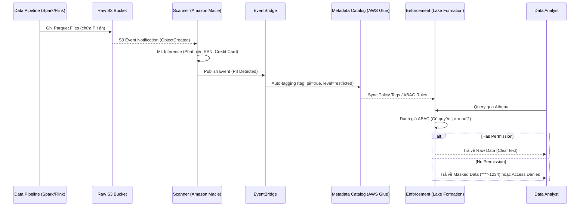

Vào thẳng vấn đề, Data Classification (phân loại dữ liệu) không phải là việc ngồi gán mác thủ công "Public" hay "Confidential" lên từng cột dữ liệu trong file Excel. Ở quy mô Data Lake (hàng Petabytes đến Exabytes) và kỷ nguyên Multi-Cloud, Data Classification là bài toán xây dựng các **Automated Discovery Pipeline** chạy ngầm để quét hàng tỷ object, trích xuất metadata, gán nhãn (tagging) tự động, và thực thi chính sách truy cập (Attribute-Based Access Control - ABAC) trước khi dữ liệu kịp đến tay end-user.

Đồng thời, quá trình quét này phải được kiểm soát chặt chẽ bằng các nguyên tắc FinOps. Nếu không tối ưu, việc gọi API quét toàn bộ kho dữ liệu sẽ tạo ra một thảm họa về hóa đơn Cloud (Billing Incident). 

Bài viết này đi sâu vào kiến trúc Data Classification sử dụng các nền tảng tiêu chuẩn như AWS Macie, Google Cloud Sensitive Data Protection (DLP) và Databricks Unity Catalog. Chúng ta sẽ phân tích các trade-offs về chi phí, độ trễ, khả năng tương thích và cách khắc phục điểm yếu chí mạng như việc "rơi rụng" nhãn bảo mật khi dữ liệu di chuyển qua các tầng ETL.

## 1. Kiến trúc vật lý: Automated Data Classification Pipeline

Một Data Classification Pipeline tiêu chuẩn trong Modern Data Stack hoạt động theo vòng đời "Discover, Tag, Protect, and Enforce". Về cơ bản, nó bao gồm 4 thành phần vật lý:

1. **Ingestion & Storage (S3/GCS):** Nơi dữ liệu thô (Raw) hạ cánh. Tại đây, dữ liệu chưa được kiểm duyệt và có thể chứa vô số thông tin nhạy cảm như thẻ tín dụng, SSN, hoặc địa chỉ email khách hàng.
2. **Scanner / Discovery Engine:** Các engine quét tự động, ví dụ như Amazon Macie, Google Cloud DLP, hoặc tính năng Data Classification của Unity Catalog. Engine này thực thi các quy tắc pattern-matching, regex, hoặc Machine Learning/LLM để nhận diện dữ liệu.
3. **Metadata Catalog:** Các hệ thống Data Catalog như AWS Glue, DataHub, Amundsen, hoặc Unity Catalog lưu trữ Tags và Metadata tập trung. Khi engine phát hiện dữ liệu nhạy cảm, nó sẽ ghi nhận nhãn (ví dụ: `pii=true`) vào Catalog.
4. **Enforcement Layer:** Lớp thực thi bảo mật như AWS Lake Formation, Snowflake hoặc BigQuery sẽ đọc các nhãn từ Catalog để áp dụng chính sách cấp quyền (ABAC) và Dynamic Data Masking.

### Luồng thực thi Event-Driven (Hướng sự kiện)

Cách tiếp cận an toàn nhất và tiết kiệm nhất cho dữ liệu mới (Incremental) là quét ngay khi nó hạ cánh. Thay vì sử dụng cơ chế quét định kỳ (Batch Scan) làm tăng độ trễ rủi ro, hệ thống thường sử dụng kiến trúc hướng sự kiện (Event-Driven).



Với kiến trúc này, bất cứ khi nào PII bị phát hiện, một sự kiện sẽ được gửi qua EventBridge hoặc Pub/Sub. Các hàm Serverless (như Lambda hoặc Cloud Functions) có thể được kích hoạt để tự động mã hóa object (Encryption at rest), cách ly file vào thư mục Quarantine, hoặc gán nhãn ngay lập tức mà không cần con người can thiệp. Việc cô lập rủi ro diễn ra gần như Real-time.

## 2. Các engine phân loại cốt lõi và Trade-offs Hệ thống

Khi kiến trúc sư quyết định thiết kế hệ thống phân loại, sự đánh đổi (trade-off) luôn xoay quanh bộ ba: **Chi phí quét (Scan Cost) vs. Độ trễ phát hiện (Detection Latency) vs. Điểm mù hệ thống (Blind Spots)**. Không có giải pháp nào là viên đạn bạc.

| Tiêu chí | AWS Macie | Google Cloud Sensitive Data Protection (DLP) | Databricks Unity Catalog |
| :--- | :--- | :--- | :--- |
| **Cơ chế phát hiện** | Dùng Pattern Matching & ML quét S3. Cung cấp tính năng *Automated Sensitive Data Discovery* (lấy mẫu thông minh diện rộng). | Cung cấp API linh hoạt, hỗ trợ quét streaming (Pub/Sub) và batch, sở hữu tính năng Masking/De-identification native mạnh mẽ. | Sử dụng Agentic AI (LLMs) để tự động quét incremental các bảng và đề xuất nhãn. |
| **Điểm mù (Blind spot)** | Chỉ hoạt động tự nhiên với S3. Rất khó quét trực tiếp các database đang chạy (như RDS hay DynamoDB) nếu không xuất ra S3. | Yêu cầu thiết lập pipeline gọi API thủ công nếu dữ liệu không nằm sẵn trong hệ sinh thái Google (như BigQuery hoặc GCS). | Giới hạn bên trong hệ sinh thái Databricks. Data nằm ngoài Unity Catalog sẽ nằm ngoài tầm với. |
| **Chi phí (FinOps)** | Rất đắt nếu cấu hình Full Scan định kỳ. Bắt buộc phải dùng cơ chế sampling và targeted audits để sinh tồn. | Tính phí dựa trên lượng byte truyền qua API. Tối ưu payload trước khi gọi API là yêu cầu sống còn. | Chi phí quét thực tế bị ẩn vào Compute chung của Databricks. Dễ bị ảo giác là "miễn phí". |

### 2.1. AWS Macie: Cạm bẫy FinOps và Chiến lược Sampling

AWS Macie tính phí theo lượng gigabyte được quét. Nếu một Data Engineer cấu hình Macie để quét 100% S3 bucket (Full Scan) trên một Data Lake lưu trữ lịch sử log clickstream dung lượng 5 PB, hệ thống sẽ gây ra hóa đơn khổng lồ vào cuối tháng (do AWS tính phí trung bình ~$1/GB cho mức đầu và $0.10/GB cho mức tiếp theo).

Để khắc phục, kiến trúc chuẩn của AWS yêu cầu áp dụng **Targeted Scanning** và **Sampling (lấy mẫu)**. 

```hcl
# Kích hoạt Macie
resource "aws_macie2_account" "primary" {
  finding_publishing_frequency = "FIFTEEN_MINUTES"
  status                       = "ENABLED"
}

# Tạo Custom Data Identifier (Regex phát hiện Mã định danh nội bộ)
resource "aws_macie2_custom_data_identifier" "internal_emp_id" {
  name                   = "Internal_Employee_ID"
  regex                  = "EMP-[0-9]{6}[A-Z]{2}"
  description            = "Phát hiện format ID nhân sự nội bộ công ty"
  maximum_match_distance = 50
}

# Cấu hình Classification Job có Sampling
resource "aws_macie2_classification_job" "sensitive_data_scan" {
  job_type = "SCHEDULED"
  schedule_frequency {
    daily_schedule = true
  }
  
  # TUYỆT ĐỐI KHÔNG để 100%. Chỉ lấy mẫu 10% dữ liệu để tiết kiệm chi phí.
  sampling_percentage = 10 
  
  s3_job_definition {
    bucket_definitions {
      account_id = data.aws_caller_identity.current.account_id
      buckets    = ["arn:aws:s3:::company-datalake-raw-zone"]
    }
  }

  custom_data_identifier_ids = [aws_macie2_custom_data_identifier.internal_emp_id.id]
}
```

Dựa trên nguyên lý xác suất thống kê, nếu 10% các block dữ liệu trong một partition Parquet được quét chứa SSN, hệ thống hoàn toàn đủ tự tin kết luận toàn bộ thư mục đó thuộc dạng `Restricted` mà không cần phải "đốt tiền" quét 90% dung lượng còn lại. Hơn nữa, AWS khuyến nghị kích hoạt tính năng **Automated Sensitive Data Discovery**. Tính năng này liên tục đánh giá rủi ro của bucket ở mức account và tự động chọn lọc lấy mẫu các S3 object có khả năng chứa dữ liệu nhạy cảm cao, giúp công ty duy trì baseline security mà không cần quản lý job thủ công.

### 2.2. Google Cloud DLP: De-identification và Tích hợp Bảo mật sâu

Khác với Macie chủ yếu làm nhiệm vụ "phát hiện" thụ động, Cloud DLP (Sensitive Data Protection) cung cấp một bộ công cụ trực tiếp xử lý dữ liệu (De-identification) bao gồm Masking, Tokenization, và Redaction. 

Một điểm mạnh khác của GCP là sự tích hợp sâu giữa DLP và Security Command Center (SCC). Khi DLP phát hiện một bucket trên GCS chứa hàng ngàn thông tin hộ chiếu (Passport) nhưng bucket này vô tình có IAM policy `allUsers`, SCC ngay lập tức nâng mức rủi ro (Risk severity) của bucket lên Critical. Nó kích hoạt pipeline tự động gỡ quyền công khai và cách ly dữ liệu. Điều này chuyển đổi Data Classification từ một hệ thống "đánh dấu thụ động" sang hệ thống "phòng thủ chủ động".

### 2.3. Unity Catalog: AI-Driven Auto-Tagging và Quản trị tập trung

Ở các kiến trúc Data Lakehouse thế hệ mới như Databricks, bài toán Data Classification đang dịch chuyển từ việc viết hàng ngàn Regex pattern sang ứng dụng Agentic AI. 

Tính năng Data Classification của Unity Catalog sử dụng các mô hình ngôn ngữ lớn (LLMs) được tinh chỉnh (fine-tuned) bởi Data Intelligence Engine để tự động đánh giá metadata và ngữ cảnh dữ liệu, sau đó đề xuất các nhãn quản trị (Governed Tags). Hệ thống này tự hiểu "cột dữ liệu chứa các chuỗi có định dạng X, nằm kề bên cột `FirstName`, rất có thể là `SSN`". Quá trình quét được thực thi dạng Incremental — chỉ tập trung vào dữ liệu mới thêm hoặc bị chỉnh sửa, giúp tiết kiệm chi phí compute đáng kể so với việc quét đi quét lại dữ liệu cũ.

## 3. Rủi ro vận hành (Operational Risks) và Điểm gãy hệ thống

### 3.1. Tag Propagation (Sự di truyền Tag) và Lỗ hổng rò rỉ PII

Một vấn đề chí mạng trong quá trình xử lý dữ liệu (Data Pipeline) là khi dữ liệu di chuyển qua các tầng kiến trúc Medallion (`Raw -> Silver -> Gold`), các metadata tags nhạy cảm rất dễ bị "rơi rụng" (dropped).

**Failure Mode:** Dữ liệu ở bảng `Raw` vừa hạ cánh, được phân loại chính xác là chứa PII và gắn tag khóa chặt. Tuy nhiên, khi Apache Spark thực thi một job ETL chạy lệnh `CREATE TABLE ... AS SELECT` (CTAS) để sinh ra bảng `Silver` (đã được làm sạch), bảng mới này lại nằm ở một logical schema khác và mất hoàn toàn nhãn `pii=true`. Hệ quả là, người dùng cuối truy cập bảng `Silver` và đọc được nguyên văn toàn bộ số thẻ tín dụng do lớp Enforcement không chặn được.

**Cơ chế Mitigation:** Hệ thống Data Catalog và Governance phải sở hữu tính năng **Lineage-based Tag Propagation**. Nghĩa là hệ thống theo dõi nguồn gốc dữ liệu (Data Lineage) ở mức độ cột (Column-level Lineage). Khi Spark hay dbt tạo bảng mới dựa trên cột `user.ssn` đang sở hữu nhãn `High_Risk`, Data Catalog sẽ tự động kế thừa (inherit) nhãn này sang cột phái sinh ở bảng đích. Unity Catalog và DataHub hiện tại đang hỗ trợ rất mạnh pattern này.

### 3.2. Đánh đổi giữa Static Masking và Dynamic Masking

Sau khi phân loại và gán tag (như `High_Security`), hệ thống cần che giấu dữ liệu đối với người dùng phổ thông.

Trong mô hình Attribute-Based Access Control (ABAC), chúng ta thường áp dụng **Dynamic Data Masking** ngay tại lúc người dùng truy vấn (Query Time). Ví dụ bằng Policy Tags trong Google BigQuery:

```sql
-- DDL tạo Data Masking Policy trong BigQuery
CREATE OR REPLACE DATA MASKING POLICY `my-gcp-project.us.mask_credit_cards`
GRANT TO ['group:data_analysts@company.com']
FILTER USING (
  policy_tags = 'projects/my-gcp-project/locations/us/taxonomies/data_classification/policyTags/High_Security'
)
OPTIONS (
  masking_expression = 'SHA256(credit_card_number)' -- Che bằng Deterministic Hashing
);
```

**Systemic Trade-off:** 
Việc sử dụng Dynamic Masking (ví dụ: băm SHA256) trên mỗi lượt chạy truy vấn sẽ đội thêm **CPU Compute Cost** và **Latency** đáng kể. Nếu dữ liệu có quy mô cực lớn và tần suất được truy cập bởi Analysts/Dashboards đạt hàng nghìn lượt mỗi ngày, việc tính toán Masking on-the-fly sẽ rất lãng phí. 

Trong những kịch bản High-Volume Analytics này, thiết kế tốt hơn là sử dụng **Static Masking**. Nghĩa là, ta mã hóa vật lý các cột nhạy cảm ngay trong bước Spark ETL batch job và ghi hẳn ra một bảng ẩn danh (Anonymized Table) phục vụ riêng cho Analytics. Bảng thô (Raw table) chứa dữ liệu thật thì bị khóa cứng và chỉ cho phép những tiến trình đặc biệt (như Machine Learning feature extraction hoặc Compliance auditing) truy cập.

## Thuật ngữ chính (Key terms)

| Term | Nghĩa ngắn |
| --- | --- |
| Data Classification | Quá trình quét, trích xuất metadata và tự động gán nhãn mức độ nhạy cảm cho dữ liệu (như PII, PHI). |
| ABAC (Attribute-Based Access Control) | Mô hình kiểm soát quyền truy cập linh hoạt dựa trên các thuộc tính của dữ liệu (ví dụ: tag `pii=true`) thay vì cấp quyền cứng theo từng người dùng (RBAC). |
| Dynamic Data Masking | Che giấu hoặc mã hóa dữ liệu nhạy cảm trực tiếp ở thời điểm truy vấn (Query Time) thông qua SQL policies. |
| Tag Propagation | Khả năng tự động di truyền (kế thừa) các nhãn bảo mật từ cột của bảng gốc sang cột của bảng phái sinh thông qua Data Lineage. |

## Tài liệu tham khảo

- [Amazon Macie features and best practices](https://aws.amazon.com/macie/features/)
- [Best practices for Sensitive Data Protection (Google Cloud)](https://cloud.google.com/sensitive-data-protection/docs/best-practices)
- [Data Classification in Unity Catalog (Databricks)](https://docs.databricks.com/en/data-governance/unity-catalog/data-classification.html)
