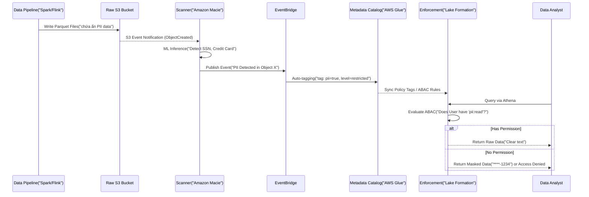

Vào thẳng vấn đề, Data Classification (Phân loại dữ liệu) không phải là việc ngồi gán mác thủ công "Public" hay "Confidential" lên từng cột dữ liệu trong file Excel. Ở quy mô Data Lake (hàng Exabytes), Data Classification là bài toán xây dựng **Automated Discovery Pipeline** chạy ngầm để quét hàng tỷ object, trích xuất metadata, gán tag (Tagging) tự động, và thực thi chính sách truy cập (Attribute-Based Access Control - ABAC) trước khi dữ liệu kịp đến tay end-user, đồng thời không làm cháy túi công ty vì chi phí gọi API quét (FinOps).

Bài viết này mổ xẻ kiến trúc Data Classification sử dụng các nền tảng kỹ thuật tiêu chuẩn như AWS Macie, Google Cloud DLP và Databricks Unity Catalog, cùng các trade-offs chí mạng về chi phí, độ trễ và rủi ro rò rỉ PII.

---

## 1. Kiến trúc Physical Execution: Automated Data Classification Pipeline

Một Data Classification Pipeline tiêu chuẩn (tham khảo từ kiến trúc bảo mật của Uber và AWS) hoạt động theo vòng đời "Discover, Tag, Protect, and Enforce", bao gồm 4 thành phần vật lý:

1. **Ingestion & Storage (S3/GCS):** Dữ liệu hạ cánh, chưa được kiểm duyệt.
2. **Scanner / Discovery Engine:** Các công cụ quét tự động như Amazon Macie, GCP DLP hoặc Unity Catalog Classifier.
3. **Metadata Catalog:** AWS Glue Data Catalog, Amundsen hoặc DataHub để lưu trữ Tags/Metadata tập trung.
4. **Enforcement Layer:** AWS Lake Formation, Snowflake hoặc Databricks để thực thi Dynamic Data Masking dựa trên tag.

### Luồng thực thi Event-Driven Data Classification



Nhờ kiến trúc Event-Driven (thông qua EventBridge), bất cứ khi nào PII bị phát hiện, hệ thống có thể kích hoạt các hàm Lambda để tự động mã hóa object (Encryption at rest), cách ly file, hoặc gán nhãn ngay lập tức mà không cần con người can thiệp.

---

## 2. Các công cụ cốt lõi và Trade-offs Hệ thống

Khi kiến trúc sư quyết định sử dụng giải pháp nào, sự đánh đổi (Trade-off) luôn nằm ở bộ ba: **Chi phí quét (Scan Cost) vs. Độ trễ phát hiện (Detection Latency) vs. Điểm mù hệ thống (Blind Spots)**.

| Tiêu chí | AWS Macie | Google Cloud DLP | Databricks Unity Catalog (AI/LLM) |
| :--- | :--- | :--- | :--- |
| **Cơ chế quét** | Quét S3 Bucket định kỳ hoặc event-driven, dùng Pattern Matching & ML. |" API cực mạnh, hỗ trợ quét streaming (Pub/Sub) và batch, tính năng Masking/De-identification native. "| Agentic AI (LLMs) tự động quét và gán tag trong Catalog mà không cần chuyển dữ liệu đi. |
| **Điểm mù (Blind spot)** |" Chỉ hoạt động với S3. Không quét được database đang chạy (RDS/DynamoDB). "| Cần pipeline đẩy dữ liệu qua API, dễ gặp nút thắt cổ chai mạng (Network Bottleneck). | Yêu cầu toàn bộ hệ sinh thái tính toán chạy trên Databricks. |
|" **Chi phí (FinOps)** "| Rất đắt nếu quét Full (Full Scan) toàn bộ object. | Tính phí theo GB quét, cần sampling cẩn thận trong payload. | Bao gồm trong chi phí Compute (Serverless) của Databricks. |

### 2.1. Executable Code: Cấu hình Terraform tự động gắn Tag với Macie

Tuyệt đối không bật Macie để quét 100% S3 bucket (Full Scan), điều đó sẽ dẫn đến **Billing Incident** (hóa đơn tăng vọt chỉ trong một đêm). Thay vào đó, cấu hình Terraform dưới đây chỉ quét các bucket cụ thể, thiết lập Custom Identifier và sử dụng **Sampling**:

```hcl
# Kích hoạt Macie
resource "aws_macie2_account" "primary" {
  finding_publishing_frequency = "FIFTEEN_MINUTES"
  status                       = "ENABLED"
}

# Tạo Custom Data Identifier (Regex phát hiện Mã định danh nội bộ)
resource "aws_macie2_custom_data_identifier" "internal_emp_id" {
  name                   = "Internal_Employee_ID"
  regex                  = "EMP-[0-9]{6}[A-Z]{2}"
  description            = "Detects internal employee ID format"
  maximum_match_distance = 50
}

# Cấu hình Classification Job (Chỉ quét 10% dữ liệu để tiết kiệm chi phí)
resource "aws_macie2_classification_job" "sensitive_data_scan" {
  job_type = "SCHEDULED"
  schedule_frequency {
    daily_schedule = true
  }
  
  # KHÔNG BAO GIỜ để 100% đối với bucket Petabyte, sử dụng Sampling
  sampling_percentage = 10 
  
  s3_job_definition {
    bucket_definitions {
      account_id = data.aws_caller_identity.current.account_id
      buckets    = ["arn:aws:s3:::company-datalake-raw-zone"]
    }
  }

  custom_data_identifier_ids = [aws_macie2_custom_data_identifier.internal_emp_id.id]
}
```

---

## 3. Rủi ro Vận hành (Operational Risks] & Real-world Incidents

### 3.1. Incident: Bùng nổ chi phí do Macie Full Scan (Macie Billing Explosion)
* **Tình huống (Incident):** Một Data Engineer mới vào nghề kích hoạt Macie Classification Job cho toàn bộ `Raw Zone Bucket` chứa 5 PB dữ liệu lịch sử log clickstream (hoàn toàn không chứa PII).
* **Hậu quả:** Cuối tháng, hóa đơn AWS báo hệ thống Macie ngốn \$10,000+ vì nó tính phí \$1.00/GB cho 500GB đầu và \$0.10/GB cho các GB tiếp theo.
* **Cách khắc phục (FinOps):** 
    * Triển khai mô hình **Targeted Scanning**: Chỉ cấp phát quét các thư mục (prefix) có rủi ro cao (ví dụ: `/users/`, `/payments/`, `/onboarding/`).
    * Sử dụng **Sampling (5-10%)**: Theo nguyên lý xác suất thống kê, nếu 10% các block dữ liệu trong một partition Parquet chứa PII, hệ thống hoàn toàn có thể kết luận toàn bộ partition đó là `Restricted` mà không cần tốn chi phí quét 90% phần dung lượng còn lại.

### 3.2. Vấn đề Tag Propagation (Di truyền Tag) dẫn đến Rò rỉ PII
Khi dữ liệu di chuyển qua các kiến trúc Medallion: `Raw -> Silver (Cleansed) -> Gold (Aggregated)`, các Metadata Tags nhạy cảm thường bị rơi rụng (dropped) do quá trình ETL tạo ra các file mới.
* **Hậu quả:** Dữ liệu ở Raw Bucket bị khóa chặt, nhưng khi được Spark ETL đọc và ghi ra bảng Gold, nó mất đi tag `pii=true`. Kết quả là các Data Analyst ở hạ nguồn truy cập được số thẻ tín dụng hoặc số điện thoại chưa bị che (Masked).
* **Giải pháp (Data Lineage):** Hệ thống Data Catalog cần hỗ trợ **Lineage-based Tag Propagation**. Khi engine (Spark/Snowflake) thực hiện lệnh `CREATE TABLE AS SELECT (CTAS)`, hệ thống Lineage nội tại phát hiện cột gốc `user.ssn` có tag `pii=true`, nó sẽ tự động kế thừa (inherit) tag này cho cột phái sinh ở bảng mới.

---

## 4. Kiểm soát Truy cập (RBAC vs ABAC) và Data Masking

Thay vì quản lý hàng trăm quyền truy cập riêng lẻ (Role-Based Access Control - RBAC) kiểu "User A được phép đọc Bảng X", các tổ chức chuyển sang **Attribute-Based Access Control (ABAC)**. ABAC cho phép quản lý linh hoạt hơn: "User thuộc nhóm Marketing chỉ được đọc dữ liệu CÓ TAG `clearance=low`".

**Code thực chiến: GCP BigQuery Policy Tags (YAML & SQL)**

Đầu tiên, định nghĩa Policy Tag `High_Security` cho cột `credit_card_number` bằng YAML/Terraform.

```yaml
# bigquery_schema_definition.yaml
- name: credit_card_number
  type: STRING
  mode: NULLABLE
  policyTags:
    names:
      - "projects/my-gcp-project/locations/us/taxonomies/data_classification/policyTags/High_Security"
```

Tiếp theo, thay vì block hoàn toàn truy cập khiến Analyst không thể làm việc, chúng ta cấu hình **Dynamic Data Masking** ngay tại Data Warehouse để Analyst vẫn có thể chạy COUNT, GROUP BY mà không nhìn thấy dữ liệu thô:

```sql
-- DDL tạo Data Masking Policy trong BigQuery
CREATE OR REPLACE DATA MASKING POLICY `my-gcp-project.us.mask_credit_cards`
GRANT TO ['group:data_analysts@company.com']
FILTER USING (
  policy_tags = 'projects/my-gcp-project/locations/us/taxonomies/data_classification/policyTags/High_Security'
)
OPTIONS (
  masking_expression = 'SHA256(credit_card_number)' -- Sử dụng Deterministic Hashing
);
```

**Systemic Trade-off trong Data Masking:**
Áp dụng **Dynamic Masking** (như hàm băm SHA256 phía trên) ngay tại lúc truy vấn (Query Time) sẽ làm tăng **CPU Compute Cost** và **Latency** của mỗi câu truy vấn. Nếu dữ liệu có quy mô cực lớn và tần suất truy cập cao (hàng Terabyte truy vấn mỗi ngày), tốt hơn hết nên chuyển sang áp dụng **Static Masking** (mã hóa vật lý lúc Spark ETL chạy batch job) và ghi ra một bảng ẩn danh (Anonymized Table) riêng biệt dành riêng cho Analytics.

---

## Nguồn Tham Khảo (References)
* [AWS Architecture Blog: Data Classification and Security][https://aws.amazon.com/blogs/architecture/]
* [Databricks Unity Catalog - Automated Data Classification][https://www.databricks.com/product/unity-catalog]
* [Uber Engineering - Data Security and Access Control][https://www.uber.com/en-VN/blog/engineering/]
* [Google Cloud DLP: Best practices for data loss prevention (DLP]](https://cloud.google.com/dlp/docs)
