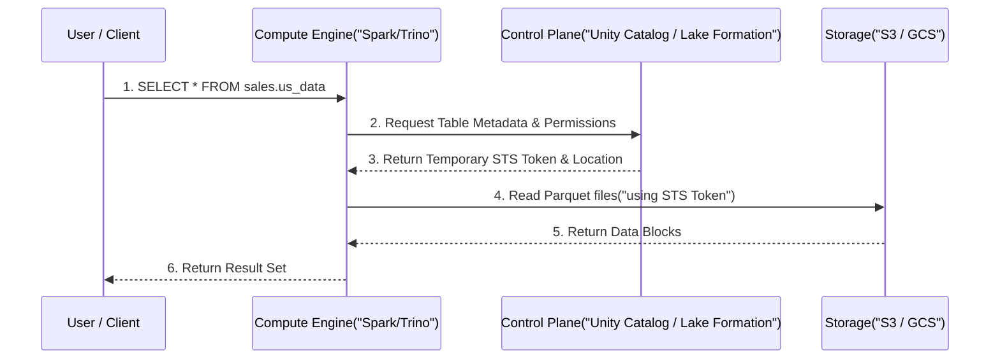

# Kiến trúc Hệ thống Quản trị Dữ liệu (Data Governance Architecture)

Trong thế giới thực, **Data Governance** không phải là những cuốn tài liệu lưu trên Google Drive về các "quy chuẩn" mà không ai đọc. Ở cấp độ hệ thống (System level), Data Governance chính là một **Data Control Plane** – một lớp dịch vụ (Service Layer) liên tục đánh chặn (intercept), kiểm tra quyền (authorize), và lưu vết (audit) mọi truy vấn từ Compute Engine xuống Storage Layer. 

Nếu bạn thiết kế Control Plane này tồi, hệ thống sẽ sụp đổ dưới hàng triệu request cấp quyền mỗi giây, tạo ra single-point-of-failure (SPOF) cho toàn bộ Data Platform.

---

## 1. Kiến trúc Thực thi Vật lý (Physical Execution)

Một hệ thống Data Governance hiện đại (như Databricks Unity Catalog hoặc AWS Lake Formation) tách biệt hoàn toàn **Control Plane** (quản lý siêu dữ liệu, phân quyền) và **Data Plane** (nơi dữ liệu thực sự được đọc/ghi).

### Kiến trúc Đánh chặn (Interception Architecture)

Khi một User chạy câu lệnh `SELECT * FROM sales_data`, request không đi thẳng xuống S3 hay GCS. Nó phải đi qua một **Policy Enforcement Point (PEP)**.



Quá trình này sử dụng cơ chế **Vending Credentials** (cấp phát token tạm thời). Thay vì cấp cho Compute Engine một IAM Role có quyền đọc toàn bộ S3, Control Plane sẽ gọi Security Token Service (như AWS STS) để sinh ra một token chỉ có hiệu lực trong 15 phút, và chỉ có quyền đọc đúng thư mục chứa bảng.


### Triển khai Infrastructure as Code (Terraform)

Đây là cách bạn định nghĩa quyền truy cập bằng Terraform cho AWS Lake Formation thay vì click UI (nguyên nhân số 1 gây ra drift configuration):

```hcl
# Thiết lập Data Lake Settings
resource "aws_lakeformation_data_lake_settings" "main" {
  admins = [aws_iam_role.data_eng_role.arn]
}

# Đăng ký S3 path vào Lake Formation
resource "aws_lakeformation_resource" "sales_bucket" {
  arn = aws_s3_bucket.sales_data.arn
}

# Cấp quyền SELECT ở cấp độ cột (Column-level security)
resource "aws_lakeformation_permissions" "analyst_select" {
  principal   = aws_iam_role.data_analyst.arn
  permissions = ["SELECT"]

  table_with_columns {
    database_name = aws_glue_catalog_database.sales_db.name
    name          = aws_glue_catalog_table.us_sales.name
    column_names  = ["order_id", "amount", "order_date"]
    # Loại trừ cột PII như 'customer_ssn'
  }
}
```

---

## 2. RBAC vs ABAC và Nỗi đau "Role Explosion"

### Role-Based Access Control (RBAC)
Trong RBAC, bạn cấp quyền dựa trên Role (ví dụ: `Data_Analyst`). 
**Trade-off:** Rất dễ cài đặt ban đầu. Tuy nhiên, khi công ty lớn lên, bạn có `Data_Analyst_US`, `Data_Analyst_UK`, `Data_Analyst_US_PII`, dẫn đến hiện tượng **Role Explosion**. Việc duy trì hàng ngàn roles trong hệ thống IAM (Identity and Access Management) sẽ nhanh chóng chạm giới hạn (Hard Limit) của cloud provider.

### Attribute-Based Access Control (ABAC)
ABAC giải quyết Role Explosion bằng cách match tags (thuộc tính). Nếu thẻ của User (`Department = Sales`, `Region = US`) khớp với thẻ của Data (`Domain = Sales`, `Region = US`), họ được phép đọc.

**Cấu hình YAML cho ABAC Data Policy (ví dụ với OPA - Open Policy Agent):**

```yaml
package data.governance.abac

default allow = false

allow {
    # Người dùng phải có clearance level lớn hơn hoặc bằng data classification
    input.user.clearance_level >= input.data.classification_level
    
    # Người dùng phải thuộc cùng region với dữ liệu
    input.user.region == input.data.region
}
```

---

## 3. Rủi ro Vận hành (Operational Risks & Incidents)

Làm Data Governance không chỉ là quản lý quyền, mà là bảo vệ hệ thống khỏi các thảm họa vận hành.

### Incident 1: "IAM Policy Limit Exceeded" & Token Bloat
- **Triệu chứng:** Khi dùng ABAC hoặc RBAC phức tạp trên AWS, các IAM Policy đính kèm vào User có thể vượt quá giới hạn độ dài của AWS (ví dụ 6144 ký tự).
- **Hệ quả:** Việc deploy Terraform thất bại. User không thể login. Các cụm Spark bị OOM hoặc Timeout khi cố gắng parse một JWT/SAML token quá lớn (Token Bloat) vì mang theo hàng ngàn tags.
- **Khắc phục:** Sử dụng **Resource-based policies** kết hợp với **Session Tags**, hoặc chuyển việc quản lý quyền lên lớp cao hơn như Unity Catalog thay vì đè hết xuống AWS IAM.

### Incident 2: Control Plane Throttling (Thắt cổ chai cấp quyền)
- **Triệu chứng:** Hàng ngàn Spark tasks đồng loạt gửi request tới AWS Lake Formation / Glue Data Catalog để xin quyền đọc từng file Parquet.
- **Hệ quả:** Lỗi `RateExceededException` hoặc `ThrottlingException` từ AWS API. Job batch delay hàng giờ.
- **Khắc phục:** 
  - Compute Engine (như Databricks) phải thiết kế cơ chế **Metadata Caching** tốt. Nó chỉ gọi Control Plane 1 lần để lấy thông tin phân quyền của toàn bộ Table, sau đó cache lại ở Driver node và phân phối xuống các Worker nodes thay vì bắt từng worker tự xin quyền.

### Incident 3: Orphaned Data & FinOps Nightmare
- **Triệu chứng:** Các team tự do tạo bảng, drop bảng trên catalog nhưng không xóa file vật lý trên S3. (Sự chênh lệch giữa Managed Table và External Table).
- **Hệ quả:** Hàng Petabyte dữ liệu rác không ai sở hữu, chi phí storage tăng phi mã.
- **Khắc phục:** Data Governance phải đi kèm quy trình **Data Lifecycle Management (DLM)**.

```hcl
# S3 Lifecycle Rule (Terraform) tự động dọn rác
resource "aws_s3_bucket_lifecycle_configuration" "data_retention" {
  bucket = aws_s3_bucket.sales_data.id

  rule {
    id     = "archive-and-delete"
    status = "Enabled"

    # Chuyển sang Glacier sau 90 ngày để giảm cost
    transition {
      days          = 90
      storage_class = "GLACIER"
    }

    # Xóa cứng sau 365 ngày nếu không có tags [Retention = LongTerm]
    expiration {
      days = 365
    }
  }
}
```

---

## 4. Tối ưu Chi phí (FinOps) & Trade-offs

Việc áp dụng Data Governance nghiêm ngặt luôn đi kèm với sự đánh đổi (Trade-offs):

1. **Compute Overhead:** Mọi truy vấn đều phải tốn thêm milliseconds đến seconds để check quyền và sinh STS token. Điều này ảnh hưởng nặng nề đến các hệ thống Real-time Analytics đòi hỏi low-latency (đánh đổi Latency lấy Security).
2. **Quản lý Meta-data (Storage Cost):** Data Catalog (ví dụ Alation, Amundsen) cần chạy các job quét (crawler) dữ liệu liên tục. Việc AWS Glue Crawlers quét hàng triệu file S3 mỗi ngày sẽ tốn hàng ngàn đô la nếu không tối ưu thư mục partition.
3. **Giải pháp FinOps:** Thay vì chạy Glue Crawler quét định kỳ toàn bộ bucket, hãy sử dụng **Event-Driven Metadata Update**. Khi một file mới rơi vào S3, sự kiện `s3:ObjectCreated:*` sẽ trigger SQS/Lambda để cập nhật trực tiếp vào Data Catalog. Điều này giảm 90% chi phí crawling.

---

## 5. Nguồn Tham Khảo (References)

* [AWS Architecture Blog: Data Governance on AWS Lake Formation](https://aws.amazon.com/blogs/architecture/)
* [Netflix TechBlog: Data Projects - Managing Data Assets at Netflix Scale](https://netflixtechblog.com/data-projects-managing-data-assets-at-netflix-scale-a590209dfb36)
* [Databricks: What is Unity Catalog?](https://www.databricks.com/product/unity-catalog)
* **Designing Data-Intensive Applications** - Martin Kleppmann.
