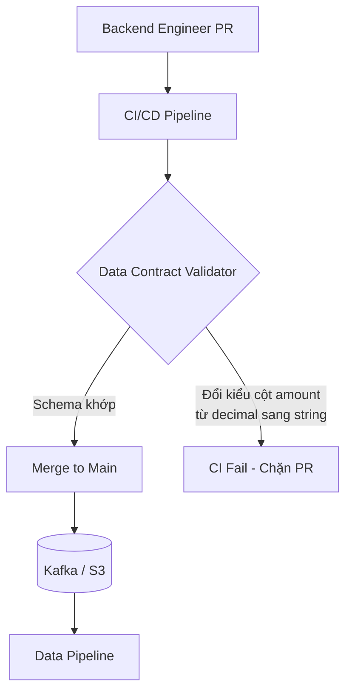
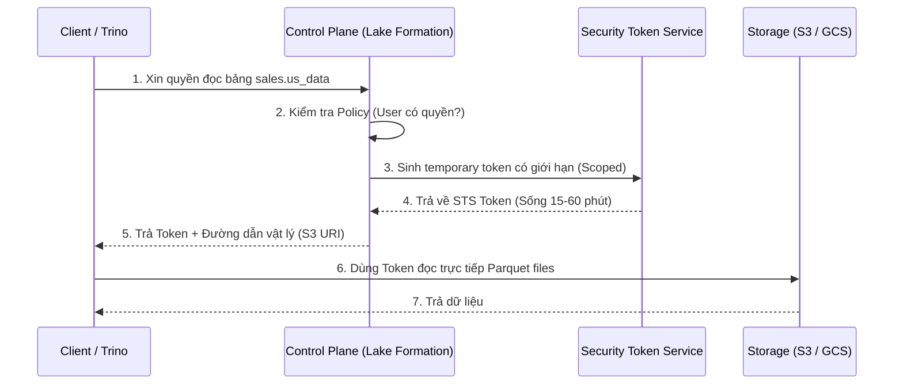

Trong nhiều tổ chức, **Data Governance** (Quản trị dữ liệu) thường bị nhầm lẫn với những cuốn tài liệu PDF dài hàng trăm trang về "quy chuẩn" mà không kỹ sư nào đọc. Hậu quả là dữ liệu rác vẫn chảy vào Data Warehouse, các kỹ sư dữ liệu phải liên tục sửa lỗi pipeline, và hệ thống phân quyền phình to dưới sự phức tạp của quá nhiều role khác nhau.

Ở cấp độ nền tảng dữ liệu hiện đại, Data Governance không phải là giấy tờ. Nó là sự kết hợp của các cơ chế kỹ thuật có thể thực thi: **Shift-Left Data Contracts** (dịch chuyển kiểm tra chất lượng sang trái) và **Data Control Plane** (lớp dịch vụ đánh chặn, kiểm tra quyền và cấp phát token). Nếu thiết kế tồi, lớp governance có thể trở thành nút thắt cổ chai (Single Point of Failure) của Data Platform.

---

## 1. Shift-Left Governance & Data Contracts

Cách làm truyền thống (Reactive) là để dữ liệu chảy từ database của ứng dụng (app/backend) vào Data Lake/Warehouse, sau đó chạy các công cụ kiểm tra (như Great Expectations hoặc dbt tests) để phát hiện lỗi. Khi lỗi xảy ra, Data Engineer phải đi "năn nỉ" Backend Engineer sửa. 

Triết lý **Shift-Left (Dịch sang trái)** thay đổi điều này bằng cách đẩy trách nhiệm về chất lượng và cấu trúc dữ liệu về phía hệ thống nguồn (Data Producers) ngay từ trong luồng CI/CD. 

Cốt lõi của cơ chế này là **Data Contracts (Hợp đồng dữ liệu)**. Giống như API OpenAPI/Swagger định nghĩa giao tiếp giữa các service, Data Contract là một cam kết bằng máy đọc được (machine-readable) giữa người tạo dữ liệu và người dùng dữ liệu. Tiêu chuẩn như **Open Data Contract Standard (ODCS)** do PayPal và các công ty công nghệ lớn đóng góp đang định hình cách viết các hợp đồng này.

**Ví dụ một Data Contract (định dạng YAML) dùng để chặn lỗi từ vòng Build:**

```yaml
# data_contract_orders.yaml
dataset: sales.orders
owner: checkout_team@company.com
schema:
  - column: order_id
    type: string
    constraints:
      - is_primary_key: true
  - column: amount
    type: decimal
    constraints:
      - min_value: 0.0 # Không cho phép đơn hàng âm
service_level_agreement:
  freshness: "15m" # Dữ liệu không được trễ quá 15 phút
security:
  classification: "confidential"
  pii: false
```



Nếu một kỹ sư backend vô tình đổi kiểu dữ liệu cột `amount` thành `string`, bước Contract Validation trong GitHub Actions/GitLab CI sẽ đánh rớt (Fail) PR ngay lập tức. Dữ liệu rác không bao giờ có cơ hội chạm tới hạ tầng dữ liệu.

---

## 2. Kiến trúc Thực thi Vật lý (Control Plane vs Data Plane)

Trong các hệ thống phân tán quy mô lớn, việc cấp phát tĩnh (như gán một IAM Role vĩnh viễn cho cụm Spark) là cực kỳ nguy hiểm. Các nền tảng như **Databricks Unity Catalog** hoặc **AWS Lake Formation** áp dụng kiến trúc tách biệt: **Control Plane** (chứa metadata, hợp đồng, chính sách) và **Data Plane** (nơi lưu trữ vật lý).

### Cơ chế Vending Credentials (Cấp phát Token Tạm thời)

Khi một Data Analyst chạy câu lệnh `SELECT * FROM sales_data`, request không được cấp quyền đâm thẳng xuống bucket S3. Nó phải đi qua một **Policy Enforcement Point (PEP)** để xin quyền.



Thay vì cấp cho engine một quyền đọc toàn bộ bucket, Control Plane chỉ sinh ra một token ngắn hạn, bị giới hạn (scoped-down) vào đúng vùng dữ liệu cần đọc. Nếu token bị lộ, phạm vi thiệt hại nhỏ hơn nhiều so với credential dài hạn, miễn là thời gian sống và phạm vi token được cấu hình đúng.

---

## 3. RBAC, ABAC và Nỗi đau "Role Explosion"

Khi công ty phát triển từ vài chục lên hàng nghìn nhân sự, cách định nghĩa quyền quyết định DataOps có còn audit được hệ thống hay không.

### Sự bùng nổ Role (Role Explosion) với RBAC
**Role-Based Access Control (RBAC)** cấp quyền dựa trên chức vụ (ví dụ: `Data_Analyst`). 
- **Vấn đề:** Ban đầu bạn chỉ có `Data_Analyst`. Khi công ty mở rộng, bạn cần `Data_Analyst_US`, `Data_Analyst_EU_NoPII`, `Data_Analyst_VN_Finance_Readonly`... Số role tăng nhanh khiến hệ thống Cloud IAM dễ chạm giới hạn cứng (hard limit), còn audit thì khó chứng minh vì quyền bị phân tán qua nhiều tầng kế thừa.

### ABAC và PBAC (Policy-Based Access Control)
Để giải quyết Role Explosion, các hệ thống chuyển sang **Attribute-Based Access Control (ABAC)** — quyết định quyền dựa trên việc so khớp Thẻ thuộc tính (Tags).
Ví dụ: User có thẻ `Department = Finance`, dữ liệu có thẻ `Domain = Finance`. Hệ thống so khớp tại Runtime và cho phép truy cập. Không cần tạo thêm role.

Cao cấp hơn là **PBAC (Policy-Based Access Control)**, tiêu biểu là **Open Policy Agent (OPA)**. PBAC tách rời logic phân quyền khỏi mã nguồn ứng dụng, chuyển nó thành Code (Policy-as-Code) sử dụng ngôn ngữ Rego.

```rego
# Ví dụ PBAC dùng ngôn ngữ Rego (OPA)
package data.governance.abac

default allow = false

allow {
    # 1. Clearance của User phải cao hơn hoặc bằng Classification của Data
    input.user.clearance_level >= input.data.classification_level
    
    # 2. User phải thuộc cùng Region, hoặc là Global Admin
    input.user.region == input.data.region
}
allow {
    # Override cho Global Admin
    input.user.is_global_admin == true
}
```
PBAC cho phép triển khai kiến trúc Zero Trust: mọi request đều được đánh giá lại trong thời gian thực dựa trên bối cảnh hiện tại.

---

## 4. Rủi ro Vận hành (Operational Risks)

Xây dựng hệ thống Data Governance không chỉ là quản lý truy cập, mà còn là bảo vệ hạ tầng khỏi các sự cố nghẽn cổ chai.

### 4.1. Token Bloat và "IAM Policy Limit Exceeded"
- **Triệu chứng:** Khi dùng ABAC và nhồi quá nhiều Attribute/Tags vào JWT Token hoặc SAML, kích thước token phình to (Token Bloat).
- **Hệ quả:** Request gửi từ Spark Executor bị từ chối với lỗi HTTP 400 (Header too large). AWS IAM từ chối lưu policy vì vượt quá 6.144 ký tự.
- **Cách xử lý:** Không dùng AWS IAM làm nơi chứa logic phân quyền chi tiết (row-level/column-level). Đẩy logic đó lên lớp Control Plane (Unity Catalog, Lake Formation) hoặc dùng OPA.

### 4.2. Control Plane Throttling
- **Triệu chứng:** Một cụm Spark 1.000 nodes khởi động và đồng loạt gửi 10.000 API calls tới Lake Formation để xin token.
- **Hệ quả:** Nhận lỗi `RateExceededException` (Throttling). Pipeline bị treo.
- **Cách xử lý:** Engine (như Spark Driver) phải cache token. Driver xin token một lần cho toàn bộ bảng, sau đó phân phối nội bộ xuống các Worker Nodes thay vì để từng Worker tự gọi API xin quyền.

### 4.3. Failure mode FinOps: Orphaned Data
- **Triệu chứng:** Khi sử dụng External Tables trên Data Lake, lệnh `DROP TABLE` chỉ xóa metadata trong Catalog, còn dữ liệu vật lý (file Parquet trên S3) vẫn nằm đó mãi mãi.
- **Hệ quả:** Sinh ra một bãi rác dữ liệu vô chủ (Orphaned Data) tiêu tốn hàng ngàn đô la chi phí lưu trữ mỗi tháng.
- **Cách xử lý:** Quản trị vòng đời dữ liệu (Data Lifecycle Management). Dùng Terraform để định nghĩa các S3 Lifecycle Rules: tự động chuyển dữ liệu cũ sang Glacier sau 90 ngày, và xóa cứng sau 365 ngày nếu không có tag `Retention = LongTerm`.

---

## 5. Khi nào nên và không nên dùng

### Nên đầu tư mạnh vào Governance & Contracts khi:
- Công ty có kiến trúc **Data Mesh** hoặc nhiều team phân tán cùng produce/consume dữ liệu.
- Làm việc trong môi trường chịu quy định khắt khe (Finance, Healthcare) cần Audit Trail rõ ràng và phân quyền Row/Column-level.
- Dữ liệu rác từ backend thường xuyên làm vỡ model ML hoặc báo cáo C-level.

### Không nên (hoặc nên làm đơn giản) khi:
- Team dữ liệu chỉ có 2-3 người, dữ liệu chủ yếu từ các hệ thống SaaS thứ ba (như Salesforce, Google Analytics) mà bạn không kiểm soát được schema. Việc ép "Data Contracts" lên API của bên thứ ba là bất khả thi.
- Công ty đang ở giai đoạn tìm kiếm Product-Market Fit. Hãy dùng RBAC cơ bản và dbt tests thay vì cố dựng OPA hay Unity Catalog ngay ngày đầu.

---

## Thuật ngữ chính (Key terms)

| Thuật ngữ | Ý nghĩa |
| --- | --- |
| **Data Contracts** | Hợp đồng định nghĩa schema, chất lượng và SLA của dữ liệu giữa Producer và Consumer. |
| **Shift-Left** | Đẩy việc kiểm tra chất lượng và validation về phía hệ thống nguồn (trong CI/CD) thay vì chờ dữ liệu vào kho. |
| **RBAC** | Role-Based Access Control: Cấp quyền dựa trên vai trò tĩnh (VD: `Admin`, `Analyst`). |
| **ABAC / PBAC** | Attribute/Policy-Based Access Control: Cấp quyền động dựa trên thuộc tính của user và data, được định nghĩa bằng Code (VD: OPA Rego). |
| **Vending Credentials** | Cơ chế sinh token tạm thời, quyền hạn hẹp để cấp quyền truy cập dữ liệu vật lý một cách an toàn. |
| **Orphaned Data** | Dữ liệu rác còn sót lại trên storage vật lý sau khi metadata đã bị xóa, gây lãng phí chi phí (FinOps). |

---

## References

- [Data Contracts: A New Architectural Pattern](https://medium.com/paypal-tech/data-contracts-a-new-architectural-pattern) - PayPal Engineering.
- [AWS Lake Formation Credential Vending](https://docs.aws.amazon.com/lake-formation/latest/dg/credential-vending.html) - AWS Documentation.
- [What is Unity Catalog?](https://docs.databricks.com/en/data-governance/unity-catalog/index.html) - Databricks Documentation.
- [Policy-based Access Control with OPA](https://www.openpolicyagent.org/docs/latest/) - Open Policy Agent Documentation.
