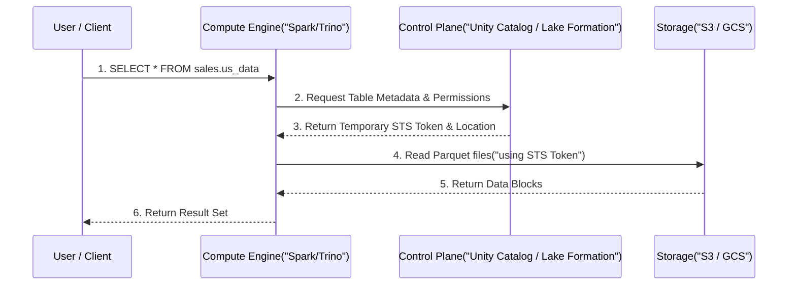

Trong thế giới thực, **Data Governance** không phải là những cuốn tài liệu PDF dài dòng về các "quy chuẩn" mà không kỹ sư nào thèm đọc. Ở cấp độ hệ thống (System level), Data Governance ngày nay là sự kết hợp của hai triết lý: **Shift-Left Data Contracts** (Dịch chuyển sang trái) và **Data Control Plane** (Lớp dịch vụ đánh chặn, kiểm tra quyền và cấp phát Token).

Nếu bạn thiết kế hệ thống phân quyền tồi, nó sẽ sụp đổ dưới hàng triệu request mỗi giây, tạo ra nút thắt cổ chai (Single Point of Failure) cho toàn bộ Data Platform.

---

## 1. Shift-Left Governance & Data Contracts

Thay vì để dữ liệu rác/lỗi chảy vào Data Warehouse rồi mới dùng Data Quality tools (như Great Expectations) để cảnh báo, các công ty công nghệ đang áp dụng triết lý **Shift-Left (Dịch sang trái)**: Đẩy trách nhiệm Governance và Quality về phía Data Producers (Team Backend/App) ngay trong luồng CI/CD.

Cốt lõi của Shift-left là **Data Contracts (Hợp đồng dữ liệu)**. Nó giống như API Swagger/OpenAPI nhưng dành cho Data.

**Ví dụ một Data Contract (YAML) chặn đứng lỗi từ vòng Build (CI/CD):**
```yaml
# data_contract_orders.yaml
dataset: sales.orders
owner: checkout_team@company.com
schema:
  - column: order_id
    type: string
    constraints:
      - is_primary_key: true
  - column: amount
    type: decimal
    constraints:
      - min_value: 0.0 # Không cho phép đơn hàng âm
service_level_agreement:
  freshness: "15m" # Dữ liệu không được trễ quá 15 phút
security:
  classification: "confidential"
```
Nếu Team Backend vô tình sửa cột `amount` thành kiểu `string`, Data Contract validation step trong GitHub Actions sẽ đánh rớt (Fail) PR của họ ngay lập tức, bảo vệ Data Platform ở hạ nguồn.

---

## 2. Kiến trúc Thực thi Vật lý (Physical Execution)

Một hệ thống Governance hiện đại (như Databricks Unity Catalog hoặc AWS Lake Formation) tách biệt hoàn toàn **Control Plane** (Nơi giữ Metadata, Data Contracts, Policies) và **Data Plane** (Nơi dữ liệu S3/GCS thực sự được đọc).

### Kiến trúc Đánh chặn (Interception Architecture)

Khi một Data Analyst chạy câu lệnh `SELECT * FROM sales_data`, request không được phép đi thẳng xuống S3. Nó phải đi qua một **Policy Enforcement Point (PEP)**.



Quá trình này sử dụng cơ chế **Vending Credentials** (Cấp phát token tạm thời). Thay vì cấp cho cụm Spark một IAM Role vĩnh viễn có quyền đọc toàn bộ bucket S3, Control Plane sẽ gọi Security Token Service (như AWS STS) để sinh ra một Token chỉ có hiệu lực 15 phút, và chỉ có quyền đọc đúng thư mục chứa bảng mà User được phép.

---

## 3. RBAC, ABAC và Nỗi đau "Role Explosion"

Khi công ty lớn lên, cách bạn định nghĩa quyền truy cập sẽ quyết định sự sống còn của đội ngũ DataOps.

### 3.1. Role-Based Access Control (RBAC)
Trong RBAC, bạn cấp quyền dựa trên Chức vụ (Ví dụ: `Data_Analyst`). 
**Trade-off:** Dễ cài đặt khi công ty có 50 người. Khi có 5000 người, bạn sẽ sinh ra các role như `Data_Analyst_US`, `Data_Analyst_UK`, `Data_Analyst_US_PII_Allowed`... Hiện tượng này gọi là **Role Explosion (Bùng nổ Role)**. Việc duy trì hàng ngàn Roles trong hệ thống Cloud IAM sẽ nhanh chóng chạm giới hạn Hard Limit.

### 3.2. Attribute-Based Access Control (ABAC) & PBAC
Để giải quyết Role Explosion, các hệ thống chuyển sang ABAC. Quyền truy cập được quyết định dựa trên việc khớp Thẻ thuộc tính (Tags/Attributes).
Ví dụ: User có thẻ `Region = US` và `Clearance = High`. Data có thẻ `Region = US` và `Clearance = Medium`. Hệ thống so khớp động tại Runtime và cho phép đọc.

Cao cấp hơn, ta có **Policy-Based Access Control (PBAC)**, sử dụng Open Policy Agent (OPA) để viết Code định nghĩa quyền.

```rego
# Ví dụ PBAC dùng ngôn ngữ Rego (OPA)
package data.governance.abac

default allow = false

allow {
    # 1. Clearance của User phải cao hơn hoặc bằng Classification của Data
    input.user.clearance_level >= input.data.classification_level
    
    # 2. User phải thuộc cùng Region, hoặc là Global Admin
    input.user.region == input.data.region
    # HOẶC
    input.user.is_global_admin == true
}
```

---

## 4. Rủi ro Vận hành (Operational Risks & Incidents)

Làm Data Governance không chỉ là vẽ Data Lineage cho đẹp, mà là bảo vệ hệ thống khỏi các thảm họa kỹ thuật.

### Incident 1: "IAM Policy Limit Exceeded" & Token Bloat
- **Triệu chứng:** Khi dùng ABAC nhồi quá nhiều Tags, kích thước của IAM Policy hoặc JWT SAML Token bị phình to (Token Bloat).
- **Hệ quả:** User không thể đăng nhập. Các luồng gọi API AWS từ Spark Executor văng lỗi 400 Bad Request vì HTTP Header quá lớn. AWS IAM từ chối lưu Policy vì vượt giới hạn 6144 characters.
- **Khắc phục:** Không dùng AWS IAM làm nơi chứa logic phân quyền chi tiết. Chuyển logic đó lên lớp Ứng dụng (Unity Catalog) hoặc dùng Session Tags động.

### Incident 2: Control Plane Throttling (Thắt cổ chai cấp quyền)
- **Triệu chứng:** Một cụm Spark 1000 nodes đồng loạt gửi request tới AWS Lake Formation để xin token đọc 100,000 files Parquet.
- **Hệ quả:** Nhận lỗi `RateExceededException` (Throttling) từ AWS. Job ETL bị Delay hàng giờ đồng hồ.
- **Khắc phục:** Thiết kế **Metadata Caching** ở Compute Engine. Spark Driver chỉ xin token 1 lần cho cả Table/Prefix, lưu vào bộ nhớ tạm (Cache), và phân phối nội bộ xuống các Worker Nodes thay vì bắt từng Worker tự đi xin quyền.

### Incident 3: Orphaned Data & FinOps Nightmare
- **Triệu chứng:** Người dùng dùng lệnh `DROP TABLE` trên Data Catalog, bảng biến mất khỏi giao diện, nhưng files vật lý (Parquet) trên S3/GCS thì... vẫn còn đó (Đặc điểm của External Tables).
- **Hệ quả:** Bãi rác khổng lồ (Orphaned Data) tiêu tốn hàng vạn USD chi phí lưu trữ mỗi tháng.
- **Khắc phục:** Thiết lập Data Lifecycle Management (DLM) tự động bằng Terraform.

```hcl
# S3 Lifecycle Rule (Terraform) dọn rác tự động bảo vệ FinOps
resource "aws_s3_bucket_lifecycle_configuration" "data_retention" {
  bucket = aws_s3_bucket.sales_data.id

  rule {
    id     = "archive-and-delete"
    status = "Enabled"

    # Chuyển dữ liệu cũ sang Glacier sau 90 ngày
    transition {
      days          = 90
      storage_class = "GLACIER"
    }

    # Xóa cứng sau 365 ngày nếu không có Tag [Retention = LongTerm]
    expiration {
      days = 365
    }
  }
}
```

---

## 5. Tổng Kết

Quản trị dữ liệu [Data Governance] đang trải qua một cuộc cách mạng Kỹ thuật phần mềm (Software Engineering). Bằng cách áp dụng **Data Contracts (Shift-Left)**, cấu hình **PBAC bằng mã (Governance as Code)**, và thiết kế một Control Plane mạnh mẽ (Vending Credentials), các Kỹ sư Dữ liệu có thể xây dựng một hệ thống vừa bảo mật tuyệt đối, vừa không làm chậm đi tốc độ phát triển của toàn công ty.

## Nguồn Tham Khảo (References)
* [Data Contracts: A New Architectural Pattern - PayPal Engineering][https://medium.com/paypal-tech/data-contracts-a-new-architectural-pattern]
* [AWS Architecture: Data Governance on AWS Lake Formation][https://aws.amazon.com/blogs/architecture/]
* [Databricks: What is Unity Catalog?][https://www.databricks.com/product/unity-catalog]
* [Open Policy Agent (OPA] Documentation](https://www.openpolicyagent.org/docs/latest/)
