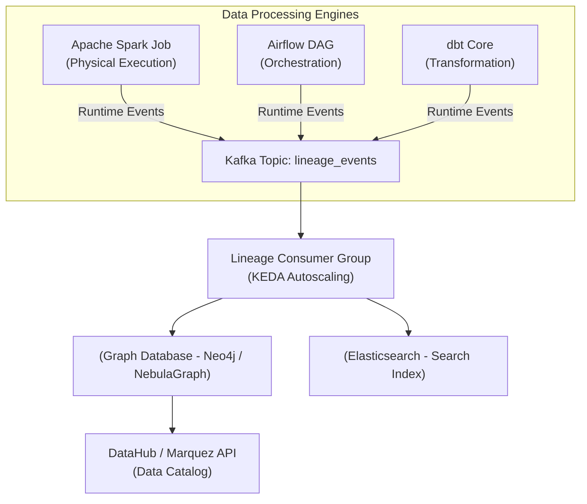

Khi nói về Data Lineage (Gia phả dữ liệu), hầu hết các bài viết cơ bản đều tập trung vào việc vẽ ra những biểu đồ mũi tên đẹp mắt trên giao diện UI để xem bảng nào sinh ra bảng nào. Tuy nhiên, ở góc nhìn của một Staff Data Engineer, Data Lineage là một hệ thống phân tán phức tạp (Distributed Metadata System).

Bài viết này bỏ qua các định nghĩa sách giáo khoa. Thay vào đó, chúng ta sẽ đi sâu vào thiết kế **Kiến trúc Thực thi Vật lý (Physical Execution Architecture)** của hệ thống Lineage, phân tích sâu về **Column-Level Lineage Overhead**, cách các Big Tech chuẩn hóa với **OpenLineage**, và mổ xẻ những tình huống sập hệ thống (real-world incidents) khi triển khai thu thập metadata ở scale lớn.

---

## 1. Kiến trúc Thực thi Vật lý (Physical Execution)

Thu thập Data Lineage ở quy mô Enterprise thường được chia làm hai hướng kiến trúc chính: **Code-time (Static Analysis)** và **Runtime (Event-driven)**.

### 1.1. Static Analysis (Phân tích tĩnh lúc Code-time)
Hệ thống (như SQLMesh, dbt) sẽ parse (phân tích cú pháp) các file `.sql` hoặc DAGs để vẽ ra luồng dữ liệu trước khi Job thực sự chạy. 
-   **Trade-off:** Phương pháp này rẻ, an toàn tuyệt đối (không tác động đến execution engine trên production), nhưng hệ thống sẽ **mù hoàn toàn** trước các luồng dữ liệu động (Dynamic SQL được generate lúc chạy) hoặc các câu query Ad-hoc của Data Scientist.

### 1.2. Runtime Event-Driven Lineage (Mô hình Push)
Netflix và Uber sử dụng kiến trúc Event-Driven, nơi các Data Processing Engines (Spark, Flink, Trino, Airflow) tự động phát xạ (emit) siêu dữ liệu ngay trong quá trình thực thi.



---

## 2. Tiêu chuẩn Mở OpenLineage [The OpenLineage Standard]

Việc mỗi Engine bắn ra một định dạng Lineage khác nhau sẽ tạo ra **Metadata Silos**. Nếu Spark bắn format A, dbt bắn format B, bạn sẽ phải viết hàng chục adapter để map chúng lại. [OpenLineage](https://openlineage.io/] giải quyết bài toán này bằng cách đưa ra một schema JSON chuẩn hóa dựa trên 3 thực thể lõi: `Run`, `Job`, `Dataset`, được mở rộng thông qua các `Facets`.

### Code Thực Chiến: Cấu hình Spark phát xạ OpenLineage Async vào Kafka

Tuyệt đối **không đẩy trực tiếp** HTTP Rest payload từ Spark Executors đến Catalog Server (như Marquez hay DataHub) ở môi trường Production. Việc này tạo ra Synchronous Call, nếu Catalog Server bị chậm, Spark Job của bạn cũng bị chậm theo (Thắt cổ chai mạng). Thay vào đó, ta sử dụng **Kafka Transport** để đạt **Asynchronous Emission**.

```properties
# spark-defaults.conf
# 1. Thêm thư viện OpenLineage Spark Agent
spark.jars.packages io.openlineage:openlineage-spark_2.12:1.13.0

# 2. Kích hoạt OpenLineage Listener chèn vào luồng thực thi của Spark
spark.extraListeners io.openlineage.spark.agent.OpenLineageSparkListener

# 3. Cấu hình Kafka Transport cho OpenLineage (Bắt buộc dùng Async)
spark.openlineage.transport.type kafka
spark.openlineage.transport.topic lineage.events.prod
spark.openlineage.transport.properties.bootstrap.servers broker1:9092,broker2:9092

# 4. Tối ưu Producer: Giảm độ trễ cho Job xử lý dữ liệu chính
# Chấp nhận acks=1 (Hy sinh một chút độ bền của metadata để đổi lấy tốc độ)
spark.openlineage.transport.properties.acks 1
spark.openlineage.transport.properties.linger.ms 5
spark.openlineage.transport.properties.compression.type snappy
```

---

## 3. Systemic Trade-offs: Column-Level Lineage vs. Compute Overhead

Lineage ở mức bảng (Table-Level) là chưa đủ. Để thực hiện các nghiệp vụ như truy vết lộ lọt dữ liệu PII (GDPR compliance) hoặc Root-Cause Analysis, hệ thống cần **Column-Level Lineage** (Biết chính xác cột `total_amount` ở bảng Fact được tính ra từ cột nào ở bảng Source).

**Kiến trúc bên dưới:** Để có Column-Level Lineage, OpenLineage Agent (được nhúng trong Spark) phải duyệt qua toàn bộ **LogicalPlan** của Catalyst Optimizer, móc nối các `ExprId` mapping để phân tích đầu vào và đầu ra. Việc này được tách riêng vào module `ColumnLineageDatasetFacet`.

**Sự đánh đổi khốc liệt (The Trade-off):**
-   **Granularity vs. Overhead:** Đối với một câu lệnh `SELECT` phức tạp có 15 lệnh `JOIN`, hàng chục UDFs (User Defined Functions) và Nested Structs, cây Abstract Syntax Tree (AST) / LogicalPlan trở nên khổng lồ. Việc traverse (duyệt) cây này để xuất ra Column-Level metadata có thể tiêu tốn hàng GB RAM.
-   Ở Scale của Enterprise, **overhead của việc trích xuất Lineage đôi khi nặng nề không kém gì bản thân Job xử lý dữ liệu chính**, dẫn đến các sự cố nghiêm trọng.

---

## 4. Rủi ro Vận hành (Operational Risks) & Real-world Incidents

### Incident 1: JVM OOMKilled do Cartesian Explosion trong Lineage Parser
**Bối cảnh:** Một Data Engineer viết câu SQL thực hiện Multi-Join trên 10 bảng lớn kèm theo các điều kiện lọc động (Dynamic Filtering). OpenLineage Agent bên trong Spark cố gắng duyệt qua Logical Plan để build Column-Level Lineage.
**Sự cố:** Số lượng node trong AST tăng theo cấp số nhân (Cartesian Explosion về mặt Graph logic). Spark Driver bị cạn kiệt Heap Memory trong lúc parse metadata, quăng lỗi `java.lang.OutOfMemoryError: Java heap space` và bị YARN/K8s chém chết (`OOMKilled`). Toàn bộ Data Pipeline sụp đổ chỉ vì cố lấy Metadata!
**Khắc phục (Troubleshooting):**
-   Giới hạn độ sâu phân tích (parsing depth limit) trong cấu hình Agent.
-   Tạo cơ chế **Fallback**: Nếu LogicalPlan quá phức tạp hoặc thời gian parse vượt quá 2 giây, Agent tự động từ bỏ Column-Level và chỉ bắn Table-Level Lineage để cứu sống Job chính.

### Incident 2: Retry Storms làm sập Lineage Backend (DataHub/Marquez)
**Bối cảnh:** Một cụm Airflow có 5,000 DAGs chạy hàng ngày. Một database nguồn (Source DB) gặp sự cố mạng (Network Partition).
**Sự cố:** Hàng loạt Airflow Sensor và Operator thất bại đồng loạt, lập tức kích hoạt chính sách `retries=5` với `retry_delay=1m`. Một luồng **Retry Storm (Cơn bão thử lại)** bùng nổ, bắn ra hàng chục nghìn events `RUN_START`, `RUN_FAIL` liên tục vào Lineage Backend. Backend API ngập lụt, cạn kiệt Connection Pool tới Database lưu trữ (PostgreSQL), gây hiệu ứng Domino làm sập toàn bộ hệ thống Catalog của công ty.
**Khắc phục:**
-   Triển khai **Circuit Breaker** (Ngắt mạch) ở Client Side (bên trong thư viện gửi OpenLineage).
-   Bắt buộc dùng **Exponential Backoff** cho cấu hình retry của Airflow.

### Incident 3: Consumer Lag & Stale Metadata
**Bối cảnh:** Spark bắn Lineage Events vào Kafka cực nhanh, nhưng Consumer Group (Python Worker đọc Kafka ghi vào GraphDB Neo4j) lại xử lý quá chậm do phải tạo các Edge trong Graph.
**Sự cố:** Xảy ra hiện tượng **Consumer Lag** khổng lồ. Metadata bị trễ (Stale Data). Kỹ sư Data Engineer vừa đổi tên bảng lúc 8h sáng, nhưng 11h trưa lên Data Catalog tra cứu vẫn thấy tên bảng cũ.
**Khắc phục:** Sử dụng KEDA (Kubernetes Event-driven Autoscaling) để tự động scale số lượng Consumer Pods dựa trên độ trễ Kafka Lag:

```yaml
# KEDA Autoscaling cho Lineage Consumer
apiVersion: keda.sh/v1alpha1
kind: ScaledObject
metadata:
  name: lineage-consumer-scaler
spec:
  scaleTargetRef:
    name: lineage-neo4j-consumer-deployment
  minReplicaCount: 2
  maxReplicaCount: 50 # Sẵn sàng phình to khi có Lag
  triggers:
  - type: kafka
    metadata:
      bootstrapServers: kafka-prod-cluster:9092
      consumerGroup: lineage_graph_writer_cg
      topic: lineage.events.prod
      lagThreshold: "1000" # Kích hoạt scale out khi Lag > 1000 messages
```

---

## 5. Tối ưu Chi phí (FinOps) bằng Data Lineage

Theo triết lý tại Netflix và Uber, Lineage không chỉ dùng để debug, mà còn để tính tiền (Cost Attribution & FinOps). Bằng cách kết nối Table-Level Lineage với hệ thống thanh toán (Billing API), nền tảng Data Engineering có thể:

1.  **Chi phí lan truyền (Propagated Cost):** Phân bổ chi phí chính xác. Bạn có thể chứng minh được Dashboard của phòng Marketing không chỉ tốn \$10 tiền query, mà nó còn kéo theo \$500 tiền Compute từ tận Data Ingestion -> Bronze -> Silver -> Gold.
2.  **Dọn rác tự động (Garbage Collection):** Dùng Lineage đếm số lượng "Đích đến (Downstream)" của một bảng. Nếu `downstream_count = 0` trong 30 ngày (không ai thèm đọc dữ liệu này), hệ thống kích hoạt xóa lạnh.

**Thực chiến: IaC Terraform Dọn Rác** 
Terraform cấu hình Lifecycle Rule trên AWS S3, tự động đưa các bảng "mồ côi" (Orphan Tables - được Lineage Catalog đánh tag `Usage: Cold`) xuống tầng lưu trữ lạnh Glacier để tiết kiệm 90% chi phí.

```hcl
resource "aws_s3_bucket_lifecycle_configuration" "finops_cold_storage" {
  bucket = aws_s3_bucket.data_lake_prod.id

  rule {
    id     = "archive_orphan_datasets"
    status = "Enabled"

    filter {
      tag {
        key   = "LineageUsage"
        value = "Cold" # Tag này do Lineage Catalog tự động gán thông qua Lambda
      }
    }

    transition {
      days          = 30
      storage_class = "GLACIER" # Chuyển xuống kho lạnh siêu rẻ
    }

    expiration {
      days = 365 # Xóa vĩnh viễn sau 1 năm không ai dùng
    }
  }
}
```

---

## 6. Nguồn Tham Khảo [References]

* [Building and Scaling Data Lineage at Netflix (Netflix TechBlog]][https://netflixtechblog.com/]
* [Data Lineage at Uber (Uber Engineering]][https://www.uber.com/en-VN/blog/data-lineage/]
* [OpenLineage Official Documentation & Column-Level Support][https://openlineage.io/docs/]
* [Designing Data-Intensive Applications - Martin Kleppmann](https://dataintensive.net/]
