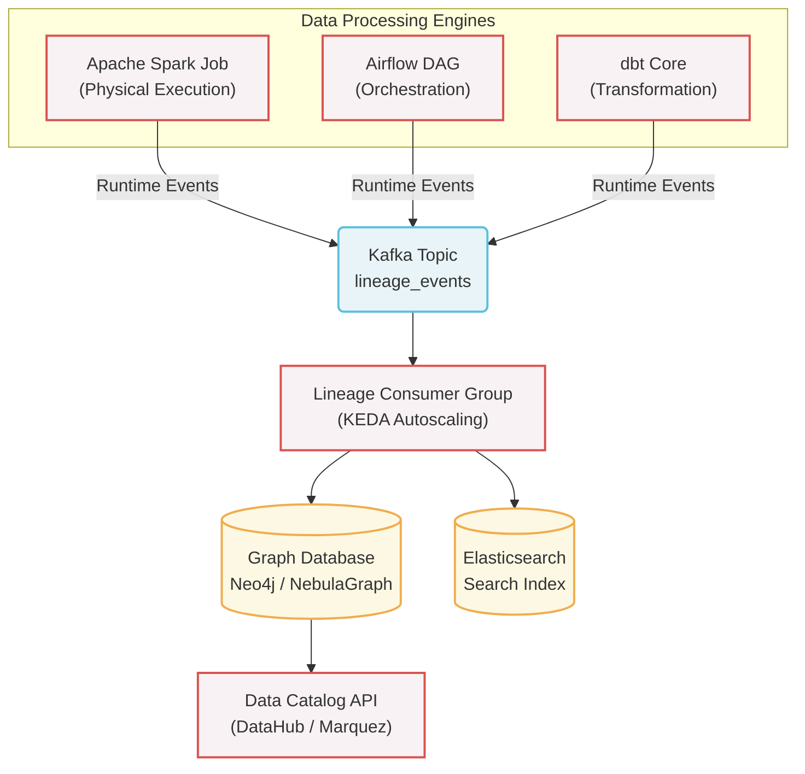

Khi nói về Data Lineage (Gia phả dữ liệu), ấn tượng đầu tiên thường là những biểu đồ mũi tên đẹp mắt trên giao diện UI, nối từ bảng nguồn đến dashboard. Tuy nhiên, đằng sau bề nổi đó, đối với một hệ thống dữ liệu quy mô lớn, Data Lineage là một bài toán hóc búa về kiến trúc phân tán (Distributed Metadata System). 

Vấn đề không nằm ở việc hiển thị một cái đồ thị. Vấn đề là làm sao để thu thập hàng triệu sự kiện (events) sinh ra từ hàng chục công cụ xử lý dữ liệu khác nhau (Spark, Flink, Airflow, dbt) một cách chính xác, theo thời gian thực, mà không làm chậm các pipeline chính.

## Kiến trúc Thực thi Vật lý (Physical Execution)

Có hai trường phái kiến trúc chính để thu thập lineage: Code-time (phân tích tĩnh) và Runtime (dựa trên sự kiện).

### 1. Static Analysis (Phân tích tĩnh lúc Code-time)

Các công cụ như dbt hoặc SQLMesh phân tích (parse) cú pháp SQL trong kho lưu trữ mã nguồn để xây dựng biểu đồ phụ thuộc (DAG) trước khi dữ liệu thực sự chạy. 
*   **Cách hoạt động:** Dựa vào các hàm như `{{ ref('table_name') }}`, hệ thống biết được bảng nào phụ thuộc vào bảng nào.
*   **Trade-off:** Cách này rất an toàn vì không can thiệp vào quá trình tính toán (compute engine). Nhược điểm lớn nhất là nó mù hoàn toàn trước các luồng dữ liệu động (như Dynamic SQL sinh ra lúc chạy) hoặc các truy vấn ad-hoc của Data Scientist. 

### 2. Runtime Event-Driven Lineage (Mô hình Push)

Đây là mô hình được Netflix và Uber lựa chọn để đối phó với quy mô hàng chục nghìn bảng dữ liệu. Thay vì đọc mã nguồn, các compute engines (Spark, Trino, Flink) sẽ tự động phát xạ (emit) các gói tin siêu dữ liệu (metadata events) ngay tại thời điểm chúng thực thi.



Mô hình Push bắt buộc phải thiết kế dưới dạng Asynchronous (Bất đồng bộ). Nếu Spark gửi HTTP request đồng bộ (Synchronous) trực tiếp đến Data Catalog và hệ thống Catalog bị chậm, job Spark xử lý dữ liệu chính cũng sẽ bị "treo" theo. Đưa Kafka vào giữa làm bộ đệm (buffer) là tiêu chuẩn thiết kế để tách biệt (decouple) hai hệ thống này.

## Tiêu chuẩn Mở OpenLineage

Một vấn đề nghiêm trọng của kiến trúc Push là "Metadata Silos" (ốc đảo siêu dữ liệu). Nếu Spark gửi payload format A, Flink gửi format B, và dbt gửi format C, backend của bạn sẽ phải viết và bảo trì hàng chục Adapter khác nhau.

[OpenLineage](https://openlineage.io/) giải quyết bài toán này. Nó là một tiêu chuẩn (specification) JSON chung cho toàn ngành, định nghĩa ba thực thể lõi: `Run` (Một lần thực thi), `Job` (Đoạn mã/tác vụ), và `Dataset` (Dữ liệu đầu vào/ra). Thông tin chi tiết được nhúng vào các `Facets`.

### Cấu hình Spark phát xạ OpenLineage qua Kafka

Dưới đây là cách một Data Engineer nhúng OpenLineage vào Apache Spark trên môi trường production. Chú ý cấu hình `acks` và `linger.ms` của Kafka Producer để tối ưu độ trễ, tránh làm chậm Spark:

```properties
# 1. Thêm thư viện OpenLineage Spark Agent
spark.jars.packages io.openlineage:openlineage-spark_2.12:1.13.0

# 2. Kích hoạt OpenLineage Listener chèn vào luồng thực thi (ListenerBus) của Spark
spark.extraListeners io.openlineage.spark.agent.OpenLineageSparkListener

# 3. Cấu hình Kafka Transport cho OpenLineage (Asynchronous)
spark.openlineage.transport.type kafka
spark.openlineage.transport.topic lineage.events.prod
spark.openlineage.transport.properties.bootstrap.servers broker1:9092,broker2:9092

# 4. Tối ưu Producer: Giảm độ trễ cho Job xử lý dữ liệu chính
spark.openlineage.transport.properties.acks 1
spark.openlineage.transport.properties.linger.ms 5
spark.openlineage.transport.properties.compression.type snappy
```

## Đánh đổi hệ thống: Nỗi đau Column-Level Lineage

Lineage mức bảng (Table-Level) nói cho bạn biết bảng B được tạo từ bảng A. Tuy nhiên, khi cần gỡ lỗi một chỉ số sai (Root-Cause Analysis) hoặc truy vết lộ lọt dữ liệu nhạy cảm PII, bạn cần biết chính xác *cột* `revenue` trong bảng B được tính từ *cột* nào trong bảng A. Đây gọi là Column-Level Lineage.

Để trích xuất được thông tin này lúc runtime, OpenLineage Agent bên trong Spark phải duyệt (traverse) qua **Logical Plan** của Catalyst Optimizer, móc nối các `ExprId` (Expression Identifier) từ đầu vào đến đầu ra. Việc này được đóng gói trong `ColumnLineageDatasetFacet`.

**Cái giá phải trả (The Trade-off):**
Việc duyệt AST (Abstract Syntax Tree) của Catalyst Optimizer là một thao tác cực kỳ đắt đỏ về bộ nhớ. Đối với một câu lệnh `SELECT` phức tạp chứa hàng chục phép `JOIN`, Window functions, và UDF (User Defined Functions), Logical Plan bùng nổ kích thước (Cartesian Explosion).
*   **Hệ lụy:** Spark Driver có thể bị cạn kiệt Heap Memory trong lúc cố gắng build Column-Level Lineage. Khi vượt giới hạn bộ nhớ, container bị trình quản lý tài nguyên (YARN/Kubernetes) dừng với lỗi `OOMKilled`. 
*   **Khắc phục:** Hệ thống lineage thực tế luôn phải cài đặt ngưỡng cắt (depth limit). Nếu thời gian parse một Logical Plan vượt quá 2 giây, Agent tự động từ bỏ Column-Level và thoái lui (fallback) về Table-Level Lineage để bảo vệ job chính.

## Failure Modes: Rủi ro vận hành Metadata

### Retry Storms làm sập Lineage Backend

Giả sử một Database nguồn bị sập mạng. Trong cụm Airflow, hàng trăm DAGs thất bại cùng lúc. Theo cấu hình mặc định, Airflow kích hoạt Retry Policy (ví dụ: thử lại 5 lần, cách nhau 1 phút).

Mỗi lần thử lại là một chuỗi sự kiện `RUN_START`, `RUN_FAIL` bắn ồ ạt về Lineage Backend (ví dụ DataHub hoặc Marquez). Cơn bão thử lại (Retry Storm) này nhanh chóng làm cạn kiệt Connection Pool của Database lưu trữ Metadata (như PostgreSQL), tạo hiệu ứng domino kéo sập toàn bộ hệ thống Catalog của công ty.

Để phòng tránh, thư viện gửi Lineage (Client Side) phải được trang bị Circuit Breaker (Ngắt mạch), và cấu hình Airflow bắt buộc phải dùng **Exponential Backoff** (tăng dần thời gian chờ giữa các lần retry) thay vì khoảng thời gian cố định.

### Consumer Lag và Stale Metadata

Khi sử dụng Kafka Transport, Spark bắn Lineage Events cực kỳ nhanh, nhưng Consumer Group (worker ghi dữ liệu vào Graph DB) lại xử lý chậm do bản chất việc tạo Cạnh (Edge) và Nút (Node) trong Graph Database khá đắt đỏ.

Hậu quả là Consumer Lag tăng cao và metadata bị trễ (stale data). Một kỹ sư đổi tên bảng lúc 8 giờ sáng, nhưng đến vài giờ sau tra cứu trên Data Catalog vẫn thấy sơ đồ cũ. Một cách xử lý phổ biến là dùng KEDA (Kubernetes Event-driven Autoscaling) kết nối với Kafka lag metric để scale out số lượng consumer pods khi có bão sự kiện.

## Ứng dụng: Tối ưu Chi phí (FinOps) bằng Data Lineage

Tại các tập đoàn lớn, Data Lineage không chỉ dành riêng cho kỹ sư debug, mà còn là trái tim của hệ thống FinOps (Quản trị chi phí Đám mây).

**1. Phân bổ chi phí lan truyền (Propagated Cost):**
Với Lineage, một phòng ban không thể nói "Dashboard của chúng tôi query trên BigQuery tốn có 10$ một ngày". Nhìn vào đồ thị Lineage, hệ thống billing tự động truy ngược (back-propagate) chi phí của toàn bộ luồng dbt transformation và Data Ingestion chạy ngầm phía trước để phục vụ riêng cho Dashboard đó. Chi phí thực tế có thể lên tới 500$.

**2. Dọn rác tự động (Automated Garbage Collection):**
Bằng cách phân tích Lineage Graph, hệ thống có thể đếm số lượng "Đích đến" (Downstream consumers) của mọi bảng. Nếu một bảng có `downstream_count = 0` trong 30 ngày (không có job nào đọc, không có dashboard nào query), nó là dữ liệu mồ côi (Orphan Data). 

Pipeline quản trị tự động gán tag `Usage: Cold` cho bảng đó. Kết hợp với IaC (Terraform), đám mây sẽ tự động dọn dẹp các bảng này xuống kho lưu trữ lạnh (như Amazon S3 Glacier), tiết kiệm đến 90% chi phí.

```hcl
resource "aws_s3_bucket_lifecycle_configuration" "finops_cold_storage" {
  bucket = aws_s3_bucket.data_lake_prod.id

  rule {
    id     = "archive_orphan_datasets"
    status = "Enabled"

    filter {
      tag {
        key   = "LineageUsage"
        value = "Cold" # Tag do Lineage Catalog quét và gán tự động
      }
    }

    transition {
      days          = 30
      storage_class = "GLACIER" # Kho lạnh tối ưu chi phí
    }
  }
}
```

## Thuật ngữ chính (Key terms)

| Term | Nghĩa ngắn |
| --- | --- |
| Column-Level Lineage | Theo vết sự phụ thuộc dữ liệu ở mức độ chi tiết nhất: Cột. |
| OpenLineage | Tiêu chuẩn mã nguồn mở định nghĩa JSON schema (Run, Job, Dataset) để thu thập lineage. |
| Cartesian Explosion | Sự bùng nổ tổ hợp kích thước của Logical Plan khi parse các câu SQL quá phức tạp. |
| Propagated Cost | Chi phí tính toán luân chuyển từ upstream xuống downstream, dùng trong FinOps. |

## References

- [Building and Scaling Data Lineage at Netflix](https://netflixtechblog.com/building-and-scaling-data-lineage-at-netflix-to-improve-data-infrastructure-reliability-and-1a52526a7977) - Netflix TechBlog.
- [Databook: Turning Big Data into Knowledge with Metadata at Uber](https://www.uber.com/en-VN/blog/databook-turning-big-data-into-knowledge-with-metadata-at-uber/) - Uber Engineering.
- [Column-Level Lineage Specification](https://openlineage.io/docs/spec/facets/column-level-lineage) - OpenLineage.
