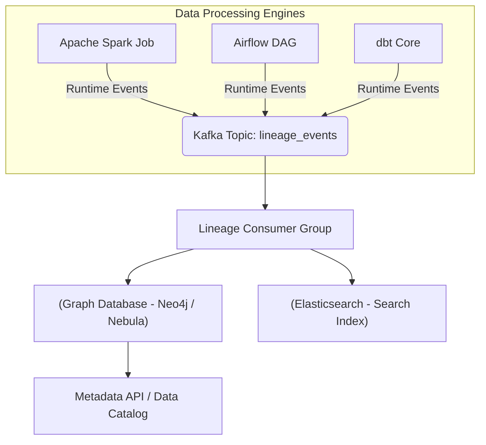

Bài viết này bỏ qua các định nghĩa sách giáo khoa về Data Lineage. Thay vào đó, chúng ta sẽ đi sâu vào thiết kế **Kiến trúc Thực thi Vật lý (Physical Execution Architecture)** của hệ thống Lineage, cách các Big Tech (Netflix, Uber) giải quyết bài toán scale, và mổ xẻ những tình huống sập hệ thống (real-world incidents) khi triển khai metadata collection.

## 1. Kiến trúc Thực thi Vật lý (Physical Execution)

Thu thập Data Lineage ở quy mô lớn thường được chia làm hai hướng kiến trúc chính: **Code-time (Static Analysis)** và **Runtime (Event-driven)**.

### 1.1. Static Analysis (Phân tích tĩnh Code-time)
Hệ thống sẽ parse (phân tích cú pháp) các dbt models, Airflow DAGs hay file `.sql` để vẽ ra luồng dữ liệu trước khi Job thực sự chạy. 
**Trade-off:** Phương pháp này rẻ, an toàn (không tác động đến production job), nhưng không thể bắt được các luồng dữ liệu động (Dynamic SQL) hoặc các job Ad-hoc.

### 1.2. Runtime Event-Driven Lineage (Mô hình Push)
Netflix và Uber sử dụng kiến trúc Event-Driven, nơi các Data Processing Engines (Spark, Flink, Trino) tự động phát xạ (emit) siêu dữ liệu (metadata) ngay trong quá trình thực thi.



## 2. Tiêu chuẩn Mở OpenLineage (The OpenLineage Standard)

Việc mỗi Engine bắn ra một định dạng Lineage khác nhau sẽ tạo ra **Metadata Silos**. [OpenLineage](https://openlineage.io/) giải quyết bài toán này bằng cách đưa ra một schema JSON chuẩn hóa dựa trên 3 thực thể lõi: `Run`, `Job`, `Dataset`, được mở rộng thông qua `Facets`.

### Code Thực Chiến: Cấu hình Spark phát xạ OpenLineage Async vào Kafka

Tuyệt đối không đẩy trực tiếp HTTP Rest payload từ Spark Executors đến Catalog Server (như Marquez) ở môi trường Production vì sẽ gây thắt cổ chai (bottleneck) mạng. Thay vào đó, ta sử dụng **Kafka Transport** để đạt **Asynchronous Emission**.

```properties
# spark-defaults.conf
spark.jars.packages io.openlineage:openlineage-spark_2.12:1.13.0

# Kích hoạt OpenLineage Listener
spark.extraListeners io.openlineage.spark.agent.OpenLineageSparkListener

# Cấu hình Kafka Transport cho OpenLineage
spark.openlineage.transport.type kafka
spark.openlineage.transport.topic lineage.events.prod
spark.openlineage.transport.properties.bootstrap.servers broker1:9092,broker2:9092

# Tối ưu Producer để giảm ảnh hưởng tới Spark Job (Latency vs Throughput Trade-off)
spark.openlineage.transport.properties.acks 1
spark.openlineage.transport.properties.linger.ms 5
spark.openlineage.transport.properties.compression.type snappy
```

*Phân tích Trade-off:*
Tại sao lại cấu hình `acks=1` thay vì `acks=all` cho Kafka Producer của OpenLineage?
- **Consistency vs. Performance:** Nếu đặt `acks=all`, Spark Job phải đợi tất cả In-Sync Replicas (ISR) của Kafka xác nhận đã lưu Lineage event. Điều này làm tăng độ trễ mạng (Network Latency) không cần thiết cho Job xử lý dữ liệu chính.
- `acks=1` chấp nhận rủi ro mất một lượng nhỏ metadata (nếu leader broker chết ngay sau khi nhận) đổi lấy tốc độ thực thi (Performance Overhead) tối thiểu.

## 3. Systemic Trade-offs trong Kiến trúc Lineage

Thiết kế một nền tảng Data Lineage đòi hỏi sự đánh đổi khốc liệt:

### 3.1. Synchronous vs Asynchronous Emission
- **Synchronous (HTTP):** Khi một Task trong Airflow thất bại, nó ngay lập tức gửi HTTP call `RUN_FAIL` đến DataHub. **Đánh đổi:** Nếu DataHub API bị chậm, Airflow Worker sẽ bị treo (blocked), dẫn đến cạn kiệt Worker Pool.
- **Asynchronous (Kafka):** Job gửi event vào Kafka và tiếp tục chạy. **Đánh đổi:** Nếu Executor bị Crash/OOMKilled đột ngột, event cuối cùng có thể nằm trong memory buffer chưa kịp xả (flush) vào Kafka, làm đồ thị Lineage bị khuyết (incomplete graph).

### 3.2. Column-Level Lineage vs Compute Overhead
Phân tích Column-Level ở các luồng SQL động (Dynamic SQL) cực kỳ tốn CPU. Các parser phải duyệt qua Cây Cú pháp Trừu tượng (AST).
- **Đánh đổi:** Để tính toán ra Column A phụ thuộc vào Column B, C trong một lệnh `SELECT với 15 lần JOIN`, Parser có thể tiêu tốn hàng GB RAM. Ở scale của Uber, tính toán này đôi khi nặng nề không kém Job xử lý dữ liệu chính.

## 4. Rủi ro Vận hành (Operational Risks) & Real-world Incidents

### Incident 1: JVM OOMKilled do Lineage Memory Leak (Cartesian Explosion)
**Bối cảnh:** Một Data Engineer viết câu SQL thực hiện Multi-Join trên 10 bảng khổng lồ. Spark OpenLineage Agent cố gắng parse AST để trích xuất Column-Level Lineage.
**Sự cố:** Số lượng nodes trong AST tăng theo cấp số nhân (Cartesian Explosion về mặt graph). Executor cạn kiệt Heap Memory trong lúc parse metadata, dẫn đến lỗi `java.lang.OutOfMemoryError: Java heap space` và bị YARN/K8s `OOMKilled`.
**Khắc phục (Troubleshooting):**
Giới hạn độ sâu phân tích (parsing depth) hoặc fallback về Table-Level Lineage đối với các truy vấn phức tạp. Giám sát memory footprint của các bytecode instrumentation.

### Incident 2: Retry Storms làm sập Lineage Backend
**Bối cảnh:** Một cụm Airflow có 5,000 DAGs chạy hàng ngày. Một database nguồn gặp sự cố mạng (Network Partition).
**Sự cố:** Hàng loạt Sensor và Operator thất bại, lập tức kích hoạt chính sách `retries=5` với `retry_delay=1m`. Một luồng **Retry Storm** (Cơn bão thử lại) bùng nổ, bắn ra hàng chục nghìn events `RUN_START`, `RUN_FAIL` liên tục vào Lineage Backend (ví dụ DataHub). Backend API ngập lụt, cạn kiệt Connection Pool tới Database lưu trữ (PostgreSQL), gây hiệu ứng Domino làm sập toàn bộ hệ thống Catalog.
**Khắc phục:**
- Triển khai **Circuit Breaker** (Ngắt mạch) ở client side (bên trong Airflow/Spark).
- Dùng **Exponential Backoff** cho cấu hình retry.

### Incident 3: Consumer Lag & Stale Metadata
**Bối cảnh:** Hệ thống Ingestion bắn Lineage Events vào Kafka rất nhanh, nhưng Consumer Group (Python Worker ghi vào GraphDB Neo4j) lại xử lý quá chậm.
**Sự cố:** Xảy ra hiện tượng **Consumer Lag** khổng lồ. Metadata bị trễ (Stale Data). Kỹ sư Data Engineer đổi tên bảng lúc 8h sáng, nhưng 11h trưa Lineage UI vẫn báo bảng cũ.
**Khắc phục (Executable YAML - Kafka Consumer Scaling):**
Sử dụng KEDA (Kubernetes Event-driven Autoscaling) để tự động scale số lượng Consumer Pods dựa trên Kafka Lag:

```yaml
apiVersion: keda.sh/v1alpha1
kind: ScaledObject
metadata:
  name: lineage-consumer-scaler
spec:
  scaleTargetRef:
    name: lineage-neo4j-consumer
  minReplicaCount: 2
  maxReplicaCount: 20
  triggers:
  - type: kafka
    metadata:
      bootstrapServers: kafka-cluster:9092
      consumerGroup: lineage_graph_writer_cg
      topic: lineage.events.prod
      lagThreshold: "1000" # Kích hoạt scale out khi Lag > 1000 messages
```

## 5. Tối ưu Chi phí (FinOps) & Data Lifecycle

Theo triết lý tại Netflix, Lineage không chỉ dùng để debug, mà còn để tính tiền (Cost Attribution). Bằng cách kết nối Table-Level Lineage với hệ thống thanh toán (Billing API), nền tảng Data Engineering có thể:
1. **Dọn rác tự động (Garbage Collection):** Dùng Lineage đếm số lượng "Đích đến (Downstream)" của một bảng. Nếu `downstream_count = 0` trong 30 ngày, hệ thống kích hoạt xóa lạnh.
2. **Chi phí lan truyền (Propagated Cost):** Tính được Dashboard của phòng Marketing tiêu tốn tổng cộng bao nhiêu Compute từ tận Data Ingestion -> Bronze -> Silver -> Gold.

**Code Thực chiến:** 
Terraform cấu hình Lifecycle Rule trên AWS S3, tự động đưa các bảng "mồ côi" (Orphan Tables - được Lineage Catalog đánh tag `Usage: Cold`) xuống Glacier.

```hcl
resource "aws_s3_bucket_lifecycle_configuration" "finops_cold_storage" {
  bucket = aws_s3_bucket.data_lake_prod.id

  rule {
    id     = "archive_orphan_datasets"
    status = "Enabled"

    filter {
      tag {
        key   = "LineageUsage"
        value = "Cold" # Tag này do Lineage Catalog tự động gán thông qua Lambda
      }
    }

    transition {
      days          = 30
      storage_class = "GLACIER"
    }

    expiration {
      days = 365
    }
  }
}
```

## 6. Nguồn Tham Khảo (References)

* [Building and Scaling Data Lineage at Netflix (Netflix TechBlog)](https://netflixtechblog.com/building-and-scaling-data-lineage-at-netflix-to-improve-data-infrastructure-reliability-and-efficiency-97593c681285)
* [Data Lineage at Uber (Uber Engineering)](https://www.uber.com/en-VN/blog/data-lineage/)
* [OpenLineage Official Documentation](https://openlineage.io/docs/)
* [Designing Data-Intensive Applications - Martin Kleppmann](https://dataintensive.net/)
