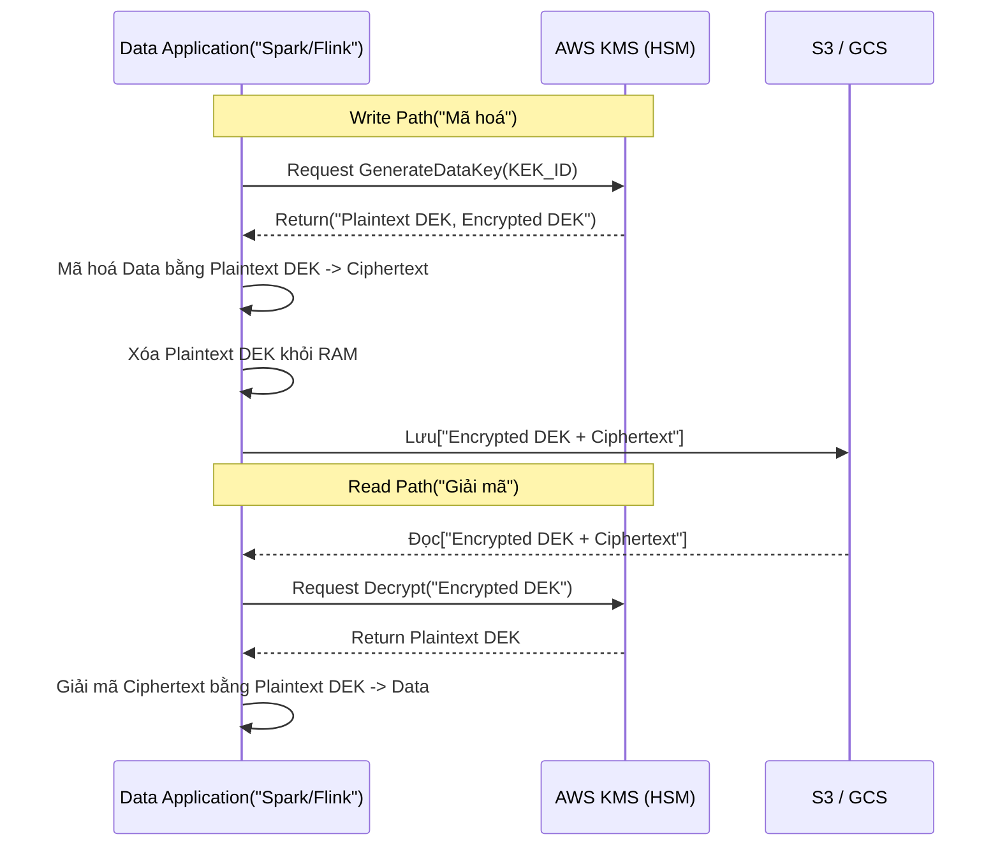
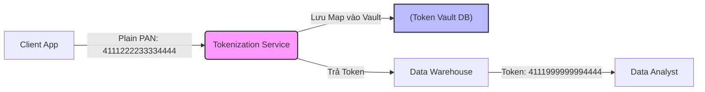

Bảo mật dữ liệu (Data Security) ở quy mô Petabyte không chỉ là câu chuyện của việc tuân thủ GDPR/HIPAA, mà là bài toán tối ưu giữa **Security (Bảo mật)**, **Performance (Hiệu năng)**, và **Cost (Chi phí)**. Khi mã hoá hoặc che giấu dữ liệu bị cấu hình sai, hệ thống sẽ phải trả giá bằng các sự cố như KMS Throttling, OOMKilled trên Worker Node, hoặc Query Latency tăng gấp 10 lần.

Bài viết này đi sâu vào kiến trúc thực thi vật lý của **Envelope Encryption** (Mã hóa bao thư) và **Dynamic Data Masking** (Che giấu dữ liệu động), cùng các Trade-offs hệ thống liên quan.

---

## 1. Kiến trúc Thực thi Vật lý: Envelope Encryption

Mã hóa dữ liệu ở trạng thái nghỉ (At-rest) hiếm khi sử dụng trực tiếp một khóa duy nhất cho toàn bộ Data Lake. Thay vào đó, tiêu chuẩn công nghiệp (AWS, GCP, Databricks) sử dụng **Envelope Encryption** với hệ thống quản lý khóa (KMS - Key Management Service).

### 1.1. Luồng thực thi (Physical Execution Flow)

Envelope Encryption sử dụng hai loại khóa:
1. **KEK (Key Encryption Key):** Khóa gốc, luôn nằm an toàn bên trong phần cứng HSM (Hardware Security Module) của KMS. Không bao giờ rời khỏi KMS.
2. **DEK (Data Encryption Key):** Khóa dùng để mã hóa dữ liệu thực tế. DEK được tạo ra từ KMS, có hai phiên bản: Plaintext DEK (để giải mã trên RAM) và Encrypted DEK (lưu cùng file dữ liệu).



### 1.2. Infrastructure as Code (Terraform)

Cấu hình AWS KMS với Customer Managed Key (CMK) và tính năng tự động luân chuyển khóa (Key Rotation) định kỳ hàng năm - một yêu cầu FinOps và Security bắt buộc.

```hcl
resource "aws_kms_key" "datalake_key" {
  description             = "KEK for Data Lake PII Encryption"
  deletion_window_in_days = 30
  enable_key_rotation     = true # Tự động xoay KEK mỗi năm, DEK cũ vẫn được giải mã bình thường
  
  policy = jsonencode({
    Version = "2012-10-17"
    Statement = [
      {
        Sid    = "Enable IAM User Permissions"
        Effect = "Allow"
        Principal = { AWS = "arn:aws:iam::123456789012:root" }
        Action = "kms:*"
        Resource = "*"
      },
      {
        Sid    = "Allow Spark IAM Role to Decrypt/Encrypt"
        Effect = "Allow"
        Principal = { AWS = aws_iam_role.spark_worker_role.arn }
        Action = [
          "kms:GenerateDataKey",
          "kms:Decrypt"
        ]
        Resource = "*"
      }
    ]
  })
}
```

### 1.3. Rủi ro Vận hành (Operational Risks) & Trade-offs

*   **Sự cố KMS Throttling (Rate Limit Exceeded):** Khi một Spark Job đọc hàng chục ngàn file Parquet nhỏ (Small Files Problem), mỗi file có một Encrypted DEK riêng. Spark sẽ gọi API `kms:Decrypt` hàng chục ngàn lần cùng lúc. AWS KMS có hard limit (VD: 10,000 requests/second), dẫn đến `ThrottlingException` và Job thất bại.
    *   *Khắc phục:* Sử dụng **AWS KMS Data Key Caching** hoặc gộp file (Compaction / `OPTIMIZE`) trước khi mã hoá.
*   **JVM OOMKilled (Out of Memory):** Giải mã dữ liệu yêu cầu nạp toàn bộ block Ciphertext và Plaintext DEK vào RAM. Nếu block size quá lớn hoặc partition bị Data Skew, Executor JVM sẽ bị cạn kiệt Heap Memory và crash.

---

## 2. Dynamic Data Masking (DDM) ở Data Warehouse

Trong khi Encryption bảo vệ dữ liệu khi ổ cứng bị đánh cắp, **Data Masking** bảo vệ dữ liệu khỏi những User/Analyst không có thẩm quyền truy cập PII, nhưng vẫn cho phép họ query data.

Thay vì tạo ra một bản copy dữ liệu đã bị che giấu (Static Data Masking) gây tốn gấp đôi chi phí Storage, kiến trúc hiện đại dùng **Dynamic Data Masking (DDM)**: Dữ liệu trên ổ cứng là bản gốc (Plaintext), việc che giấu xảy ra **On-the-fly (Lúc chạy)** thông qua UDF được inject vào Query Plan dựa trên Role.

### 2.1. Cấu hình DDM trên Databricks Unity Catalog

Databricks Unity Catalog (UC) xử lý DDM bằng SQL UDFs đóng vai trò như một Proxy Filter.

```sql
-- 1. Tạo Masking Function
CREATE OR REPLACE FUNCTION pii_mask_email(email STRING)
RETURNS STRING
RETURN CASE 
    WHEN is_account_group_member('data_engineers') THEN email -- Nhóm DE thấy dữ liệu gốc
    ELSE CONCAT(LEFT(email, 3), '***@***.com')               -- Nhóm khác thấy email bị mask
  END;

-- 2. Bind hàm Masking vào cột của Table
ALTER TABLE prod.customer_360.users 
ALTER COLUMN email SET MASK pii_mask_email;
```

Khi một Analyst chạy lệnh `SELECT email FROM users`, Unity Catalog Engine sẽ tự động viết lại (rewrite) câu lệnh thành:
`SELECT pii_mask_email(email) FROM users`.

### 2.2. Đánh đổi Hệ thống (Systemic Trade-offs)

Mặc dù DDM giải quyết bài toán Data Governance hoàn hảo, nó mang lại những rủi ro cực lớn về Compute và Performance:

1.  **Phá vỡ Predicate Pushdown & Partition Pruning:**
    Nếu Analyst query: `SELECT * FROM users WHERE email = 'abc@gmail.com'`, hệ thống không thể đẩy điều kiện `email = '...'` xuống tầng Storage (Parquet/Delta) vì cột `email` đã bị bọc bởi hàm UDF `pii_mask_email()`.
    *Hậu quả:* Engine phải thực hiện **Full Table Scan**, đọc toàn bộ TB dữ liệu lên RAM, chạy hàm Masking trên từng dòng, rồi mới filter. Query latency tăng từ vài giây lên vài giờ.

2.  **Cartesian Explosion khi JOIN:**
    Nếu hai bảng được JOIN bằng một cột PII bị masked (VD: Cùng bị mask thành `***@***.com`), hàng triệu bản ghi sẽ match với nhau, tạo ra Cartesian Product làm sập cụm (Cluster Crash).
    *Cách khắc phục:* Đừng Mask cột dùng làm khóa JOIN. Hãy sử dụng kỹ thuật **Tokenization (Mã thông báo hóa)** hoặc **Format-Preserving Encryption (FPE)** để thay thế PII bằng một Token duy nhất mang tính xác định (Deterministic) nhưng không thể dịch ngược.

---

## 3. Tokenization & Format-Preserving Encryption (FPE)

Khi hệ thống Legacy (hệ thống cũ) yêu cầu dữ liệu phải giữ đúng định dạng (ví dụ: Cột số thẻ tín dụng kiểu `INT`, độ dài 16, nếu ném chuỗi mã hoá AES `eyJhbG...` vào sẽ bị lỗi Data Type), ta dùng FPE hoặc Tokenization.



*   **Đánh đổi (Trade-off):** Tokenization Server trở thành **Single Point of Failure (SPOF)**. Nếu hệ thống Token Vault bị chậm, toàn bộ luồng Ingestion bị thắt cổ chai. Hơn nữa, Token Vault Database phải mở rộng cực lớn để lưu trữ mapping 1:1.

---

## 4. Tối ưu Chi phí (FinOps) cho Security

Bảo mật dữ liệu không hề miễn phí. Việc gọi API và Compute UDF sinh ra lượng chi phí (FinOps) khổng lồ:

1.  **Chi phí API KMS:** AWS KMS tính phí khoảng \$0.03 / 10,000 requests. Nếu Streaming Pipeline của bạn (ví dụ Flink) commit file liên tục mỗi phút, bạn có thể tốn hàng ngàn USD mỗi tháng chỉ riêng tiền gọi KMS.
    *   *Chiến lược FinOps:* Chỉnh `checkpoint.interval` lớn hơn trong Flink, hoặc dùng tính năng S3 Bucket Key (giảm 99% request KMS bằng cách dùng 1 DEK cấp Bucket để mã hóa nhiều Object).
2.  **Chi phí Compute của Dynamic Masking:** Việc đánh giá điều kiện `CASE WHEN` trên hàng tỷ dòng dữ liệu mỗi khi Data Analyst chạy query làm lãng phí Compute Credit (Snowflake Credits / DBU Databricks).
    *   *Chiến lược FinOps:* Tránh dùng DDM cho các bảng được query tần suất cực cao (Dashboard). Hãy dùng vật lý hóa (Materialization) - tức là sinh ra một bảng Static Data Masking riêng thông qua dbt để phục vụ BI Tool.

---

## Nguồn Tham Khảo
* [AWS Architecture Blog: Building a Customer Data Platform on AWS](https://aws.amazon.com/blogs/architecture/an-overview-and-architecture-of-building-a-customer-data-platform-on-aws/)
* [Databricks Documentation: Dynamic Data Masking with Unity Catalog](https://docs.databricks.com/en/data-governance/unity-catalog/dynamic-data-masking.html)
* *Designing Data-Intensive Applications* - Martin Kleppmann (Ch. 4: Encoding and Evolution).
* [Snowflake Documentation: Dynamic Data Masking Architecture](https://docs.snowflake.com/en/user-guide/security-column-ddm-intro)
