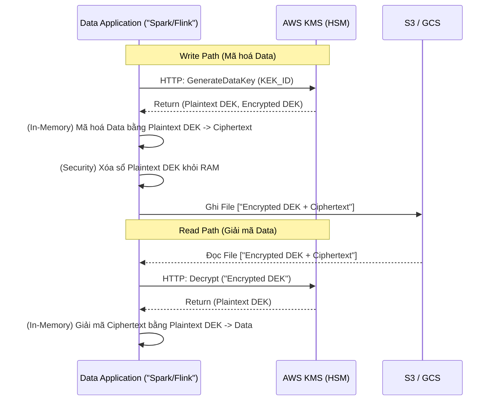
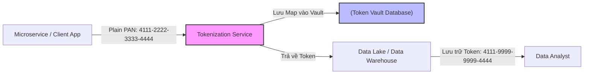

Bảo mật dữ liệu (Data Security) ở quy mô Petabyte không chỉ là câu chuyện của việc tuân thủ các chứng chỉ nhạt nhẽo như GDPR hay HIPAA. Dưới góc nhìn của một Kỹ sư Hệ thống (Staff Engineer), bảo mật là bài toán tối ưu sống còn giữa **Security (Bảo mật tuyệt đối)**, **Performance (Độ trễ I/O)**, và **Cost (Chi phí Compute & API)**. 

Khi mã hoá hoặc che giấu dữ liệu bị cấu hình sai thuật toán, hệ thống sẽ phải trả giá ngay lập tức bằng các sự cố thảm họa: KMS API Throttling làm sập Data Pipeline, OOMKilled trên Worker Node, hoặc Query Latency tăng gấp 100 lần do mất Predicate Pushdown.

Bài viết này đi sâu vào kiến trúc thực thi vật lý của **Envelope Encryption** (Mã hóa bao thư), **Format-Preserving Encryption (FPE)**, **Tokenization**, và **Dynamic Data Masking (DDM)**, cùng các Trade-offs hệ thống liên quan.

---

## 1. Kiến trúc Thực thi Vật lý: Envelope Encryption (AWS KMS)

Mã hóa dữ liệu ở trạng thái nghỉ (Data At-rest) hiếm khi sử dụng trực tiếp một khóa duy nhất cho toàn bộ Data Lake. Thay vào đó, tiêu chuẩn công nghiệp (AWS KMS, Google Cloud KMS) bắt buộc sử dụng **Envelope Encryption** (Mã hóa bao thư).

Tại sao không đẩy thẳng dữ liệu lên KMS để mã hóa? Vì KMS gọi qua mạng (Network API). Việc đẩy 1TB dữ liệu Parquet qua HTTP để KMS mã hóa sẽ làm quá tải mạng lưới toàn cầu của Cloud Provider và mất hàng giờ. Do đó, ta phải mã hóa tại chỗ (Local).

### 1.1. Luồng thực thi (Physical Execution Flow)

Envelope Encryption sử dụng hai loại khóa:
1. **KEK (Key Encryption Key - Khóa chủ):** Khóa gốc bảo vệ mọi thứ, luôn nằm an toàn bên trong phần cứng HSM (Hardware Security Module) của KMS. Không bao giờ rời khỏi KMS dưới định dạng Plaintext.
2. **DEK (Data Encryption Key - Khóa dữ liệu):** Khóa dùng để mã hóa dữ liệu thực tế. DEK được sinh ra từ KMS, có hai phiên bản: Plaintext DEK (để giải mã trên RAM của Spark) và Encrypted DEK (lưu cứng cùng file dữ liệu S3).



### 1.2. Infrastructure as Code (Terraform)
Là kỹ sư hạ tầng, bạn phải định nghĩa KMS bằng code, thiết lập tự động luân chuyển khóa (Key Rotation) định kỳ hàng năm - một yêu cầu Audit bắt buộc.

```hcl
# Terraform AWS KMS Configuration
resource "aws_kms_key" "datalake_key" {
  description             = "KEK for Data Lake PII Encryption"
  deletion_window_in_days = 30
  enable_key_rotation     = true # Tự động xoay KEK mỗi năm, DEK cũ vẫn được giải mã bình thường
  
  policy = jsonencode({
    Version = "2012-10-17"
    Statement = [
      {
        Sid    = "Enable IAM User Permissions"
        Effect = "Allow"
        Principal = { AWS = "arn:aws:iam::123456789012:root" }
        Action = "kms:*"
        Resource = "*"
      },
      {
        Sid    = "Allow Spark IAM Role to Decrypt/Encrypt"
        Effect = "Allow"
        Principal = { AWS = aws_iam_role.spark_worker_role.arn }
        Action = [
          "kms:GenerateDataKey",
          "kms:Decrypt"
        ]
        Resource = "*"
      }
    ]
  })
}
```

### 1.3. Rủi ro Vận hành (Operational Risks) & Trade-offs
*   **Thảm họa KMS Throttling (Rate Limit Exceeded):** Khi một Spark Job đọc hàng chục ngàn file Parquet nhỏ (The Small Files Problem), mỗi file mang một Encrypted DEK riêng biệt. 1000 Spark Executors sẽ đồng loạt gọi API `kms:Decrypt` hàng chục ngàn lần cùng lúc. AWS KMS có Hard Limit (VD: 10,000 requests/second). Kết quả: Bắn lỗi `ThrottlingException` và toàn bộ ETL Job thất bại.
    *   *Giải pháp (FinOps/Arch):* Sử dụng **S3 Bucket Keys** (Giảm 99% request KMS bằng cách dùng 1 DEK cấp Bucket để mã hóa nhiều Object) hoặc sử dụng **AWS Encryption SDK Data Key Caching**.
*   **JVM OOMKilled (Out of Memory):** Giải mã dữ liệu yêu cầu nạp toàn bộ block Ciphertext và Plaintext DEK vào RAM. Nếu block Parquet size quá lớn (>1GB) hoặc Data Skew, Executor JVM sẽ cạn kiệt Heap Memory và Crash.

---

## 2. Dynamic Data Masking (DDM) ở Data Warehouse

Trong khi Encryption bảo vệ ổ đĩa cứng (Bị hacker trộm ổ cứng S3), thì **Data Masking** bảo vệ dữ liệu khỏi chính những nhân sự nội bộ (Analyst) không có quyền đọc PII (Email, SSN).

Thay vì tạo ra một bản Copy thứ 2 đã bị bôi đen (Static Data Masking) gây tốn gấp đôi tiền Storage, kiến trúc hiện đại dùng **Dynamic Data Masking (DDM)**: Dữ liệu dưới ổ cứng S3 là bản rõ (Plaintext), việc che giấu xảy ra **On-the-fly (Lúc chạy)** thông qua SQL UDF được Inject vào Query Execution Plan.

### 2.1. Cấu hình DDM trên Databricks Unity Catalog

```sql
-- 1. Tạo Masking Function
CREATE OR REPLACE FUNCTION pii_mask_email(email STRING)
RETURNS STRING
RETURN CASE 
    -- RBAC: Nhóm Admin/DE thấy dữ liệu gốc
    WHEN is_account_group_member('data_engineers') THEN email 
    -- Nhóm khác thấy email bị mask một phần
    ELSE CONCAT(LEFT(email, 3), '***@***.com')               
  END;

-- 2. Bind (Trói) hàm Masking vào cột của Table vật lý
ALTER TABLE prod.customer_360.users 
ALTER COLUMN email SET MASK pii_mask_email;
```
Khi Analyst chạy `SELECT email FROM users`, Engine tự viết lại thành `SELECT pii_mask_email(email) FROM users`.

### 2.2. Đánh đổi Hệ thống (Systemic Trade-offs)
DDM là con dao hai lưỡi về mặt hiệu năng Compute:
1.  **Phá vỡ Predicate Pushdown & Partition Pruning (Tử huyệt hiệu năng):**
    Nếu Analyst query: `SELECT * FROM users WHERE email = 'bob@gmail.com'`. Hệ thống **KHÔNG THỂ** đẩy điều kiện này xuống tầng Parquet Reader (Storage), vì cột `email` đã bị bọc bởi hàm UDF `pii_mask_email()`. 
    *Hậu quả:* Engine buộc phải thực hiện **Full Table Scan**, đọc toàn bộ 100TB dữ liệu lên RAM, chạy hàm Masking UDF trên từng dòng (Billion times), rồi mới chạy lệnh WHERE. Query chậm đi 100 lần.
2.  **Lãng phí Compute (FinOps):** UDF `CASE WHEN` chạy trên từng dòng dữ liệu tiêu tốn CPU Cycles khủng khiếp. Tránh dùng DDM cho các bảng được Dashboard query liên tục mỗi 5 phút. Hãy dùng Static Masking qua dbt (Vật lý hóa) cho lớp Reporting.

---

## 3. Tokenization & Format-Preserving Encryption (FPE)

DDM giải quyết bài toán đọc (Read-path). Nhưng làm sao để lưu trữ PII một cách an toàn mà không phá vỡ Schema của các hệ thống Legacy (Hệ thống cũ)?
Ví dụ: Cột số thẻ tín dụng (Credit Card) mang kiểu dữ liệu `INT` (Độ dài 16 số). Nếu bạn dùng mã hóa AES-256, kết quả là chuỗi String `eyJhbG...` siêu dài. Ghi chuỗi này vào cột `INT` sẽ văng lỗi `Data Type Mismatch`.

Giải pháp là **Format-Preserving Encryption (FPE)** và **Tokenization**.

### 3.1. Format-Preserving Encryption (FPE)
Thuật toán FPE (như AES-FF3) đảm bảo kết quả mã hóa có **cùng định dạng và độ dài** với đầu vào. 
- Input: `4111222233334444` (16 chữ số)
- Output: `8923412356789123` (Cũng 16 chữ số, database Legacy vẫn chấp nhận).

### 3.2. Tokenization (Mã thông báo hóa Vault)
Thay vì mã hóa, Tokenization sinh ra một mã giả ngẫu nhiên (Token) và lưu bảng Map (Token <-> Real Data) vào một Database riêng biệt cực kỳ bảo mật (Token Vault).



**Sự đánh đổi [Trade-off]:**
- **Cartesian Explosion khi JOIN:** Tokenization thường mang tính xác định (Deterministic) - cùng một Email luôn sinh ra cùng một Token. Điều này cho phép Data Analyst JOIN 2 bảng dựa trên cột Token mà không cần biết Email gốc. Tuy nhiên, nếu bạn DDM Mask 100,000 email không hợp lệ thành `***@***.com`, và Analyst lỡ JOIN trên cột đó, họ sẽ tạo ra ma trận Cartesian Product $100,000 \times 100,000 = 10,000,000,000$ rows, làm nổ tung Memory của Cluster ngay lập tức.
- **Single Point of Failure (SPOF):** Tokenization Server là nút thắt cổ chai mạng lưới. Nếu Vault Database bị chậm, toàn bộ luồng Kafka Ingestion sẽ nghẽn, đẩy Consumer Lag lên vô cực. Hệ thống Vault phải scale cực lớn để chứa hàng tỷ bản ghi Mapping 1:1.

---

## 4. Tổng kết của Kiến trúc sư
- Dùng **Envelope Encryption (KMS)** ở tầng vật lý thấp nhất (S3/GCS) để chống trộm cắp vật lý. Bật Bucket Keys để tiết kiệm 99% chi phí KMS API.
- Dùng **Tokenization/FPE** khi luân chuyển dữ liệu từ hệ thống RDBMS cũ lên Cloud mà không muốn sửa Schema. Cẩn thận SPOF.
- Dùng **Dynamic Data Masking (ABAC)** cho lớp phân quyền Logical. Cẩn trọng rủi ro mất Predicate Pushdown gây nổ Compute Bill.

---

## Nguồn Tham Khảo (References)
*   **AWS Architecture Blog:** [Envelope Encryption in AWS KMS][https://docs.aws.amazon.com/kms/latest/developerguide/concepts.html#enveloping].
*   **Databricks Documentation:** [Dynamic Data Masking with Unity Catalog](https://docs.databricks.com/en/data-governance/unity-catalog/dynamic-data-masking.html].
*   Sách chuyên ngành: **Designing Data-Intensive Applications** - Martin Kleppmann (Part 1).
*   Nghiên cứu khoa học: Thuật toán Format-Preserving Encryption NIST SP 800-38G.
