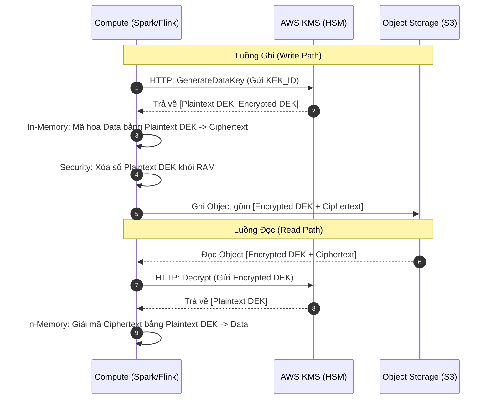
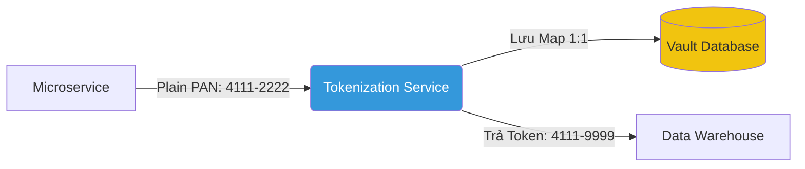

Bảo mật dữ liệu (Data Security) ở quy mô Petabyte hiếm khi là một tính năng cấu hình một lần rồi quên. Dưới góc nhìn thiết kế hệ thống, bảo mật là bài toán đánh đổi giữa **Security (Bảo mật)**, **Performance (Độ trễ I/O, thời gian tính toán)**, và **Cost (Chi phí API, Compute)**.

Nếu cấu hình sai thuật toán hoặc sai vị trí mã hóa trong luồng dữ liệu, hệ thống có thể gặp các sự cố thực tế: API throttling làm nghẽn luồng ingestion, OOMKilled trên worker node khi join dữ liệu, hoặc query latency tăng mạnh do engine buộc phải quét nhiều dữ liệu hơn dự kiến.

Ba cơ chế cần phân biệt rõ là **Envelope Encryption** ở tầng lưu trữ, **Dynamic Data Masking** ở tầng truy vấn, và **Tokenization / Format-Preserving Encryption** ở tầng tích hợp. Chúng giải quyết các loại rủi ro khác nhau và có failure mode vận hành khác nhau.

---

## 1. Tầng Storage: Envelope Encryption (Mã hóa bao thư)

Để bảo vệ dữ liệu ở trạng thái nghỉ (data at-rest) trên S3 hoặc GCS, các Cloud Provider bắt buộc sử dụng cơ chế **Envelope Encryption**.

Tại sao không đẩy thẳng dữ liệu qua API của KMS (Key Management Service) để mã hóa? KMS được thiết kế để quản lý khóa, không phải để nhận và mã hóa trực tiếp file dữ liệu lớn. Payload mã hóa trực tiếp qua KMS bị giới hạn rất nhỏ so với kích thước file Parquet, nên dữ liệu phải được mã hóa tại chỗ bằng data key, còn KMS chỉ bảo vệ khóa đó.

### Luồng thực thi vật lý (Physical Execution)

Envelope Encryption sử dụng hai loại khóa:
1. **KEK (Key Encryption Key - Khóa chủ):** Khóa gốc bảo vệ mọi thứ, nằm an toàn bên trong phần cứng HSM (Hardware Security Module) của KMS. Khóa này không bao giờ rời khỏi KMS dưới định dạng bản rõ (plaintext).
2. **DEK (Data Encryption Key - Khóa dữ liệu):** Khóa dùng để mã hóa dữ liệu thực tế. KMS sinh ra DEK dưới hai định dạng: Plaintext DEK (để Compute Node dùng ngay trên RAM) và Encrypted DEK (để lưu kèm file dữ liệu).



### Rủi ro vận hành: Throttling & Chi phí KMS

Lỗ hổng chết người của kiến trúc này nằm ở luồng đọc (Read Path) đối với các bảng dữ liệu bị phân mảnh (Small Files Problem). 

Nếu một Spark Job cần đọc 100,000 file Parquet nhỏ, mặc định mỗi file chứa một Encrypted DEK riêng. 1,000 Spark Executor sẽ đồng loạt gọi API `kms:Decrypt` về AWS KMS 100,000 lần. KMS có Hard Limit (ví dụ: 10,000 - 50,000 requests/second). Kết quả: AWS trả về `ThrottlingException`, toàn bộ ETL Job thất bại, và cuối tháng hóa đơn KMS tăng đột biến.

**Cách giải quyết (S3 Bucket Keys):** 
Bật tính năng **S3 Bucket Keys**. Thay vì KMS cấp một DEK cho *mỗi Object*, nó cấp một khóa tạm (Time-limited) cấp độ Bucket. S3 sử dụng khóa cấp Bucket này để tự sinh ra các DEK cho từng Object ở bên trong hạ tầng S3. Cơ chế này giảm đến 99% số lượng request gọi từ S3 ra ngoài KMS, loại bỏ hoàn toàn rủi ro Throttling và tiết kiệm phần lớn chi phí API.

---

## 2. Tầng Compute: Dynamic Data Masking (DDM)

Envelope Encryption chỉ bảo vệ ổ cứng vật lý (chống việc hacker đánh cắp data file từ S3). Nhưng nếu một Data Analyst có quyền query hợp lệ vào bảng, họ vẫn thấy toàn bộ PII (Personally Identifiable Information) dạng bản rõ.

Để giới hạn quyền truy cập logic (Column-level security), chúng ta dùng **Dynamic Data Masking (DDM)**. DDM che giấu dữ liệu *on-the-fly* (ngay lúc chạy) bằng cách chèn một hàm UDF (User-Defined Function) vào Kế hoạch thực thi truy vấn (Query Execution Plan).

Ví dụ cấu hình DDM trên Databricks Unity Catalog:

```sql
-- Tạo Masking Function
CREATE FUNCTION pii_mask_email(email STRING)
RETURNS STRING
RETURN CASE 
    WHEN is_account_group_member('data_engineers') THEN email 
    ELSE CONCAT(LEFT(email, 3), '***@***.com')               
  END;

-- Trói hàm Masking vào cột vật lý
ALTER TABLE prod.customer_360.users 
ALTER COLUMN email SET MASK pii_mask_email;
```

Khi người dùng chạy `SELECT email FROM users WHERE email = 'bob@gmail.com'`, Engine tự động biên dịch lại thành:
`SELECT pii_mask_email(email) FROM users WHERE pii_mask_email(email) = 'bob@gmail.com'`.

### Cái giá phải trả: Mất Predicate Pushdown

Cạm bẫy lớn nhất của DDM là làm **phá vỡ Predicate Pushdown**.

Predicate Pushdown là cơ chế tối ưu quan trọng nhất của các định dạng Columnar (Parquet/ORC). Nhờ metadata (min/max) ở đuôi file, hệ thống có thể bỏ qua toàn bộ các block dữ liệu không chứa giá trị cần tìm trước khi đọc chúng lên RAM.

Tuy nhiên, khi cột `email` bị bọc trong một hàm UDF (như `pii_mask_email`), Engine truy vấn (Spark, Trino, Snowflake) không thể biết trước kết quả của hàm UDF này là gì. Đứng trước sự lựa chọn giữa "Tối ưu hóa" (đẩy filter xuống tầng đĩa) và "Bảo mật" (đảm bảo hàm mask luôn chạy), hệ thống luôn chọn **Bảo mật**.

Kết quả là Engine không thể lọc dữ liệu từ metadata. Nó buộc phải đọc toàn bộ file Parquet từ S3 lên RAM (Network I/O bottleneck), giải nén (CPU bottleneck), chạy hàm Masking trên từng dòng dữ liệu (CPU bottleneck), rồi mới áp dụng điều kiện `WHERE`. 

Một query tìm kiếm 1 email thay vì tốn 1 giây (nhờ Partition Pruning / Predicate Pushdown) có thể tốn 10 phút vì **Full Table Scan**. Để giảm thiểu rủi ro này, nguyên tắc thiết kế là: **Không sử dụng logic phức tạp hoặc Regex trong hàm Masking**, và hạn chế đặt điều kiện `WHERE` / `JOIN` trực tiếp trên các cột đã bị che giấu bằng DDM.

---

## 3. Tầng Integration: Format-Preserving Encryption & Tokenization

Trong trường hợp cần luân chuyển dữ liệu từ hệ thống RDBMS cũ (Legacy) lên Cloud, Data Engineer gặp một rào cản khác: Schema Validation.

Nếu cột thẻ tín dụng (Credit Card) trong database Oracle định nghĩa kiểu dữ liệu `CHAR(16)`, bạn không thể ghi chuỗi mã hóa AES-256 dài ngoằng kiểu `eyJhbG...` vào cột đó. Database sẽ báo lỗi Mismatch Data Type. Giải pháp ở đây là sử dụng FPE hoặc Tokenization.

### Format-Preserving Encryption (FPE)

FPE (như chuẩn AES-FF3) là thuật toán mã hóa đảm bảo Ciphertext có **cùng định dạng và độ dài** với Plaintext.
- Đầu vào: `4111222233334444` (16 chữ số)
- Đầu ra sau mã hóa: `8923412356789123` (Cũng 16 chữ số).

FPE giữ nguyên định dạng, không yêu cầu thay đổi Schema, và là mã hóa không trạng thái (Stateless), tức là có thể giải mã ngược lại nếu có khóa mà không cần tra cứu database.

### Tokenization

Tokenization thay thế dữ liệu thật bằng một mã thông báo (Token) giả ngẫu nhiên.
- **Vaulted Tokenization:** Lưu mapping (Token <-> Dữ liệu gốc) vào một Database siêu bảo mật (Vault). Điểm yếu là Vault biến thành Single Point of Failure (SPOF). Nếu Vault bị chậm, luồng ghi Kafka Ingestion sẽ bị nghẽn (backpressure).
- **Vaultless Tokenization:** Sinh Token thông qua thuật toán mã hóa một chiều (thường kết hợp với salt), không cần lưu mapping.



### Rủi ro hệ thống: Vụ nổ Descartes (Cartesian Explosion)

Cả Tokenization và DDM thường mang tính xác định (Deterministic) — cùng một email lỗi luôn sinh ra cùng một chuỗi mask (ví dụ `***@***.com`), hoặc các user vãng lai chưa login đều nhận chung một Token định danh `UNKNOWN_USER`.

Việc này cho phép Data Analyst thực hiện phép JOIN giữa hai bảng đã mask mà không cần dữ liệu gốc. Tuy nhiên, nếu bảng `Orders` có 10 triệu dòng mang token `UNKNOWN_USER` và bảng `Clicks` có 20 triệu dòng mang token `UNKNOWN_USER`, phép JOIN trên cột định danh này sẽ tạo ra ma trận Descartes (Cartesian Product): $10,000,000 \times 20,000,000 = 200,000,000,000,000$ (200 nghìn tỷ) dòng.

Cluster của bạn sẽ lập tức crash với lỗi `OOMKilled` (Out of Memory) hoặc Spill to Disk đến khi đầy ổ cứng. Để xử lý, kỹ sư phải sử dụng kỹ thuật **Salting** (thêm nhiễu ngẫu nhiên vào các key bị skew) trước khi JOIN, hoặc lọc bỏ các token vô nghĩa (như `UNKNOWN_USER`, `***@***.com`) trước khi đưa vào phép tính.

---

## 4. Khung quyết định (Decision Framework)

Không có công nghệ bảo mật nào giải quyết được mọi tầng của kiến trúc dữ liệu. Dưới đây là cách phối hợp chúng trong môi trường Production:

1. **Ở tầng Vật lý (S3/GCS):** Luôn bật **Envelope Encryption** (AWS KMS / GCP KMS) kèm theo Bucket Keys. Điều này giải quyết rủi ro mất trộm ổ cứng đĩa và tuân thủ compliance với chi phí thấp nhất.
2. **Ở tầng Integration (Data Ingestion từ Legacy):** Dùng **Format-Preserving Encryption (FPE)** nếu hệ thống cũ có Schema quá cứng nhắc và không thể sửa code. Hạn chế dùng Vaulted Tokenization cho Streaming Pipeline vì dễ gây thắt cổ chai mạng.
3. **Ở tầng Truy cập (Data Warehouse / BI):** Dùng **Dynamic Data Masking (DDM)** để kiểm soát quyền truy cập theo từng Role (RBAC/ABAC). Hãy tạo ra các cụm data mart đã được mask sẵn (Static Masking) bằng dbt nếu các cột đó thường xuyên bị mang ra chạy điều kiện `WHERE` hoặc `JOIN`, để tránh vỡ Predicate Pushdown và tiết kiệm Compute.

---

## Thuật ngữ chính (Key terms)

| Term | Nghĩa ngắn |
| --- | --- |
| Envelope Encryption | Mã hóa khóa dữ liệu (DEK) bằng một khóa chủ (KEK) để tối ưu hiệu năng. |
| KMS Throttling | Lỗi vượt quá giới hạn gọi API của dịch vụ quản lý khóa. Giải quyết bằng Bucket Keys. |
| Predicate Pushdown | Cơ chế tối ưu hóa truy vấn bằng cách lọc dữ liệu từ metadata trước khi đọc file. |
| Format-Preserving Encryption | Mã hóa giữ nguyên định dạng và độ dài của dữ liệu gốc. |
| Cartesian Explosion | Sự phình to dữ liệu theo cấp số nhân do JOIN trên các khóa không duy nhất. |

## References
- AWS KMS Documentation. *Envelope encryption*. [docs.aws.amazon.com](https://docs.aws.amazon.com/kms/latest/developerguide/concepts.html#enveloping)
- AWS Documentation. *Reducing AWS KMS costs by using Amazon S3 Bucket Keys*. [docs.aws.amazon.com](https://docs.aws.amazon.com/AmazonS3/latest/userguide/bucket-key.html)
- Databricks Documentation. *Row filters and column masks*. [docs.databricks.com](https://docs.databricks.com/en/data-governance/unity-catalog/row-and-column-filters.html)
- NIST. *Recommendation for Block Cipher Modes of Operation: Methods for Format-Preserving Encryption (SP 800-38G)*. [csrc.nist.gov](https://csrc.nist.gov/pubs/sp/800/38/g/rev/1/final)
