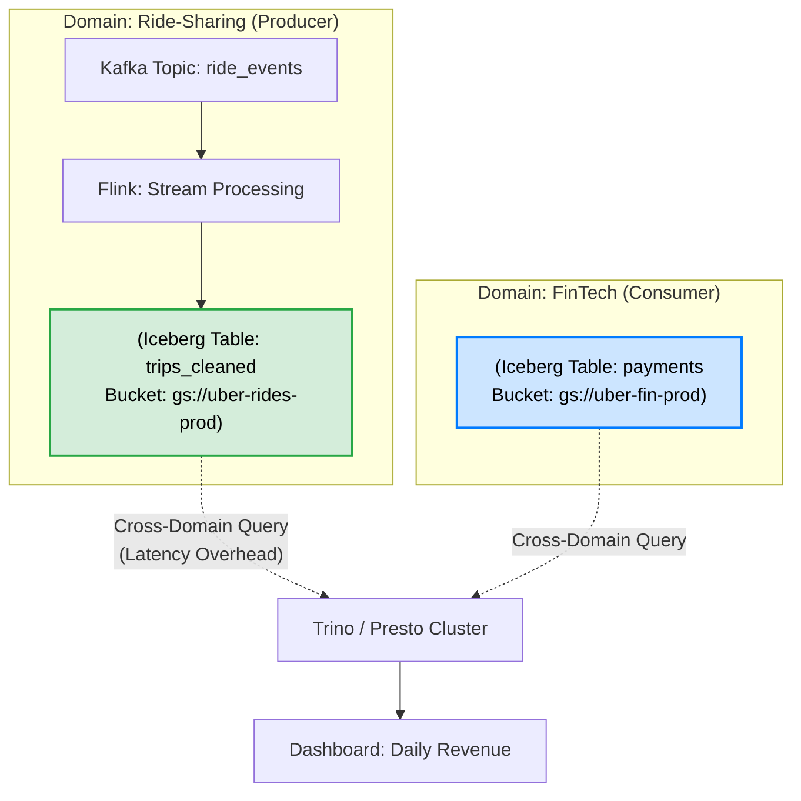

Bỏ qua các định nghĩa sách giáo khoa "Data Owner là ai?". Đối với một Kỹ sư Dữ liệu (Staff Data Engineer), **Data Ownership (Quyền sở hữu dữ liệu)** là bài toán thiết kế kiến trúc hệ thống (System Architecture) nhằm giải quyết nút thắt cổ chai (bottleneck) của mô hình Data Warehouse/Data Lake tập trung nguyên khối (Monolithic). 

Khi hệ thống mở rộng lên hàng nghìn pipelines, việc duy trì một đội ngũ Data Engineer trung tâm (Centralized Team) quản lý mọi logic ETL/ELT sẽ dẫn đến thảm họa: Đội Data không hiểu logic nghiệp vụ (`Network Shuffle` logic sai do sai key), các pipelines bị sập (`OOMKilled`) liên tục do Data Drift (Schema thay đổi ngầm), và chi phí đám mây (FinOps) bùng nổ do không ai chịu trách nhiệm dọn dẹp "dữ liệu rác".

Lý thuyết **Data Mesh**, được Zhamak Dehghani khởi xướng vào năm 2019, giải quyết bài toán này bằng cách áp dụng **Domain-Driven Design (DDD)** vào dữ liệu.

---

## 1. Bốn Nguyên Tắc Cốt Lõi của Data Mesh

Để Data Ownership thực sự hoạt động, tổ chức phải tuân thủ 4 nguyên tắc của kiến trúc Data Mesh:

1. **Domain-Oriented Decentralized Data Ownership (Sở hữu dữ liệu phân tán theo Domain):** Dữ liệu phải thuộc về team tạo ra nó (Ví dụ: Team Thanh Toán sở hữu dữ liệu giao dịch). Không đẩy trách nhiệm làm sạch dữ liệu cho team Data Engineer trung tâm.
2. **Data as a Product (Dữ liệu là một Sản phẩm):** Dữ liệu được đóng gói với Data Contract, SLAs (Độ trễ, Tính khả dụng), và Metadata rõ ràng, sẵn sàng cho các team khác tiêu thụ.
3. **Self-Serve Data Platform (Nền tảng hạ tầng tự phục vụ):** Đội ngũ Platform Engineer xây dựng công cụ (CI/CD, Terraform templates) để các Domain tự động cấp phát (provision) hạ tầng dữ liệu của họ mà không cần mở ticket chờ đợi.
4. **Federated Computational Governance (Quản trị tính toán liên kết):** Phân quyền sở hữu không có nghĩa là Vô chính phủ (Anarchy). Các tiêu chuẩn bảo mật toàn cầu (Ví dụ: Che giấu PII, Mã hóa) được thống nhất bởi một ủy ban liên kết (Federated) và được nền tảng thực thi tự động (Computational) lên mọi Data Products.

---

## 2. Kiến trúc Thực thi Vật lý (Physical Execution)

Trong kiến trúc truyền thống, dữ liệu của toàn bộ công ty nằm chung trong một "thùng chứa" khổng lồ với các schema chồng chéo. Với Data Mesh, ranh giới Ownership được dịch sang mức cơ sở hạ tầng vật lý (Physical Infrastructure). 

Ví dụ, khi Uber chuyển đổi sang GCP, họ đã phân rã Hive Metastore khổng lồ thành các Google Cloud Storage (GCS) Buckets riêng biệt cho từng Domain, được gắn thẻ (Tagging) chặt chẽ để thực hiện Chargeback (Tính phí cho từng Domain).

### Phân mảnh hạ tầng theo Domain (Domain-driven Storage)



Sự phân tách này mang lại lợi ích tuyệt đối về **Accountability (Minh bạch trách nhiệm)**. Nếu bucket `gs://uber-rides-prod` tăng vọt chi phí lưu trữ lên \$50.000, hệ thống FinOps sẽ tự động trừ thẳng vào ngân sách của bộ phận Ride-Sharing. Họ không thể đổ lỗi cho hệ thống chung.

---

## 3. Triển khai Data Ownership as Code (IaC)

Ownership không nên nằm trên giấy tờ hay file Excel (Data Stewardship kiểu cũ). Nó phải được thực thi ở cấp độ hạ tầng thông qua **Infrastructure as Code (IaC)**.

Dưới đây là cấu hình Terraform (AWS) tiêu chuẩn, do team Nền tảng (Self-Serve Platform) cung cấp để bộ phận Marketing tự khởi tạo Data Product, đảm bảo họ có quyền quản trị bucket nhưng không thể phá vỡ chính sách bảo mật chung.

```hcl
# Cấp phát S3 Bucket cho Data Product của Marketing
resource "aws_s3_bucket" "marketing_data_product" {
  bucket = "company-data-mesh-marketing-prod"
  
  # Tags bắt buộc để Federated Governance hoạt động
  tags = {
    Domain      = "Marketing"
    DataOwner   = "cmo@company.com"           # Người ra quyết định nghiệp vụ
    DataSteward = "martech-lead@company.com"  # Người chịu trách nhiệm kỹ thuật (Chất lượng dữ liệu)
    FinOps      = "CostCenter-8091"           # Mã bộ phận để thu tiền
    Sensitivity = "PII"                       # Kích hoạt DLP / Macie Scanner
  }
}

# IAM Role: Chỉ cho phép Marketing Domain ghi dữ liệu
resource "aws_iam_role" "marketing_producer_role" {
  name = "marketing-data-producer-role"
  assume_role_policy = jsonencode({
    Version = "2012-10-17"
    Statement = [{
      Action = "sts:AssumeRole"
      Effect = "Allow"
      Principal = { AWS = "arn:aws:iam::123456789012:user/MarketingETL" }
    }]
  })
}

# Policy bắt buộc (Computational Governance): Từ chối Public Access vĩnh viễn
resource "aws_s3_bucket_public_access_block" "block_public" {
  bucket                  = aws_s3_bucket.marketing_data_product.id
  block_public_acls       = true
  block_public_policy     = true
  ignore_public_acls      = true
  restrict_public_buckets = true
}
```

---

## 4. Systemic Trade-offs & Operational Incidents

Khi phân chia dữ liệu cho các Domain tự trị, chúng ta phải đối mặt với những đánh đổi hệ thống khốc liệt.

### 4.1. Trade-off: Domain Agility vs. Cross-Domain Join Latency
- **Đánh đổi:** Để các Domain tự chủ (Agility), dữ liệu bị phân mảnh vật lý. Khi chạy các câu lệnh SQL `JOIN` khổng lồ xuyên qua các Domains (Cross-domain Joins) trên Trino hoặc Spark, dữ liệu phải được kéo qua mạng (Network I/O), dẫn tới hiện tượng **Network Shuffle** nặng nề và làm tăng độ trễ (Latency).
- **Giải pháp:** Xây dựng một **Data Contract** mạnh mẽ. Các Domain (Producer) phải cam kết xuất bản dữ liệu ở định dạng tối ưu cho hệ thống đọc (Parquet/Iceberg), áp dụng `Partitioning` và `Z-Ordering` chuẩn mực để engine tính toán có thể dùng kỹ thuật `Predicate Pushdown`.

### 4.2. Sự cố: OOMKilled do Data Drift
- **Incident:** Đội Backend (Data Owner của DB Users) quyết định đổi kiểu dữ liệu của cột `user_id` từ `INT` sang `UUID` (String) mà không thông báo. Pipeline Spark Streaming (Consumer) đang đọc Kafka topic đột ngột nhận message sai schema.
- **Hậu quả:** Các Spark Executors liên tục ném lỗi `DeserializationException` hoặc phình to bộ nhớ Heap do cố gắng ép kiểu, dẫn đến lỗi **JVM OOMKilled**. Toàn bộ Data Warehouse hạ nguồn ngừng cập nhật.
- **Giải pháp (Root Cause Analysis):** Sự cố xảy ra do thiếu vắng **Data Contract** (Hợp đồng dữ liệu). Ownership đi kèm với trách nhiệm duy trì Contract. Mọi thay đổi schema từ Producer phải bị chặn lại ngay tại CI/CD pipeline nếu nó phá vỡ Contract. 

Định nghĩa YAML Data Contract:
```yaml
# data_contract.yaml
data_product: user_profiles
owner: backend_core_team@company.com
schema:
  - name: user_id
    type: string  # Cột UUID đã được khai báo trước
    description: "Unique identifier for user"
    constraints:
      not_null: true
      regex: "^[0-9a-f]{8}-[0-9a-f]{4}-[0-9a-f]{4}-[0-9a-f]{4}-[0-9a-f]{12}$"
sla:
  availability: 99.9%
  freshness: "15 minutes"
```

### 4.3. Sự cố: Z-Ordering Fragmentation & FinOps Nightmare
- **Incident:** Một Data Owner rời công ty. Pipeline vẫn chạy hàng ngày để `INSERT` hàng triệu bản ghi (event) vào bảng Iceberg của Domain đó. Do không có Data Steward tối ưu hóa bảng (Chạy `OPTIMIZE` hoặc `VACUUM`), dữ liệu bị phân mảnh thành hàng triệu file siêu nhỏ (Small Files Problem).
- **Hậu quả:** Chi phí gọi API S3 GET Requests tăng vọt, tiền tính toán (Compute Cost) của Spark/Trino tăng gấp 10 lần do engine phải quét quá tải siêu dữ liệu (Metadata overhead). Dữ liệu này trở thành rác không ai dùng (Orphaned Data).
- **Giải pháp:** Triển khai hệ thống tự động dọn rác bằng FinOps. Nếu một Data Product không có lượt truy vấn (`reads`) trong vòng 30 ngày, hệ thống gửi cảnh báo Slack cho Data Owner. Sau 60 ngày, dữ liệu tự động chuyển xuống lớp lưu trữ lạnh (AWS S3 Glacier Deep Archive).

```hcl
# AWS S3 Lifecycle Rule (Computational Governance cho FinOps)
resource "aws_s3_bucket_lifecycle_configuration" "data_mesh_lifecycle" {
  bucket = aws_s3_bucket.marketing_data_product.id

  rule {
    id     = "archive-orphaned-data"
    status = "Enabled"
    
    transition {
      days          = 60
      storage_class = "GLACIER"
    }
  }
}
```

---

## Tổng Kết

Data Ownership không phải là phong trào gán chức danh cho có. Ở kỷ nguyên Big Data, Ownership là ranh giới vật lý (`Buckets`), là quyền truy cập (`IAM Roles`), là khế ước sống còn (`Data Contracts`) và là hóa đơn tiền điện (`FinOps Lifecycle`). 

Một hệ thống quản trị dữ liệu (Data Governance) xuất sắc là hệ thống biến các đơn vị nghiệp vụ (Business Domains) thành những nhà sản xuất dữ liệu tự cung tự cấp, giải phóng hoàn toàn "nút thắt cổ chai" ở đội Data Engineer trung tâm.

## Nguồn Tham Khảo [References]
* [How to Move Beyond a Monolithic Data Lake to a Distributed Data Mesh - Zhamak Dehghani (MartinFowler.com]][https://martinfowler.com/articles/data-monolith-to-mesh.html]
* [Data Mesh — A Data Movement and Processing Platform @ Netflix][https://netflixtechblog.com/data-mesh-a-data-movement-and-processing-platform-netflix-1288bcab2873]
* [Batch Data Cloud Migration Using Data Mesh Principles - Uber Engineering Blog](https://www.uber.com/en-VN/blog/batch-data-cloud-migration-using-data-mesh-principles/]
* **Designing Data-Intensive Applications - Martin Kleppmann**
