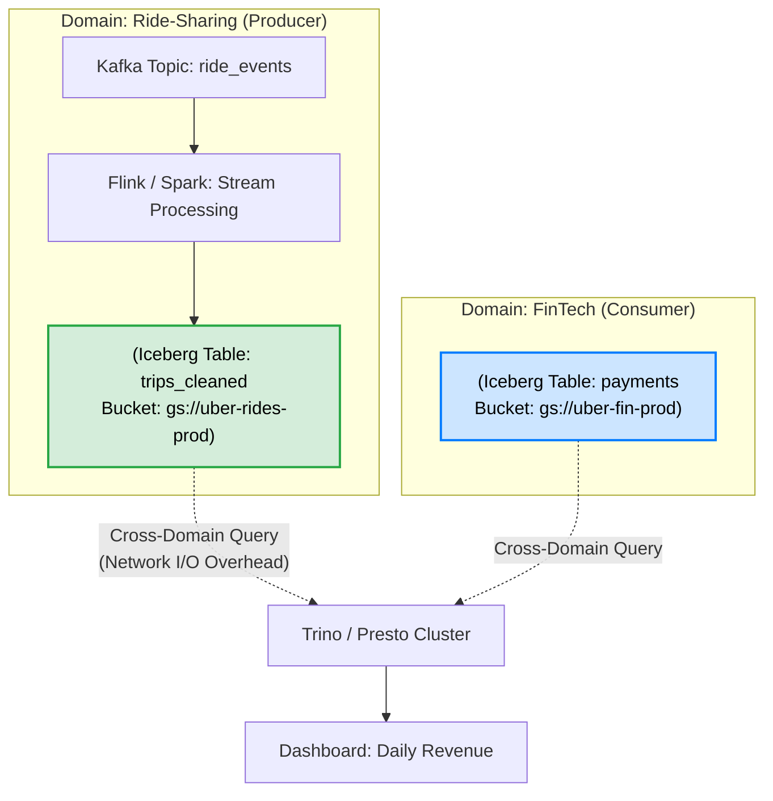

Mô hình dữ liệu nguyên khối (monolithic) thường gom phần lớn dữ liệu của tổ chức vào một Data Lake hoặc Data Warehouse trung tâm, do một đội Data Engineer vận hành. Khi công ty mở rộng lên nhiều domain và nhiều pipeline, kiến trúc này lộ rõ nút thắt cổ chai: đội Data không luôn hiểu logic nghiệp vụ của từng nguồn, pipeline dễ vỡ khi schema đổi ngầm, và chi phí đám mây tăng vì không rõ ai chịu trách nhiệm dọn dữ liệu không còn dùng.

**Data Ownership (Quyền sở hữu dữ liệu)** giải quyết vấn đề này. Dưới lăng kính kỹ thuật, nó không phải là một chức danh ghi trên file Excel, mà là bài toán thiết kế kiến trúc (System Architecture) chia cắt cơ sở hạ tầng. Nó áp dụng Domain-Driven Design (DDD) để trao quyền và trách nhiệm cho các đội nghiệp vụ (Domain Teams).

## 4 Nguyên tắc cốt lõi của Data Mesh

Sự dịch chuyển Data Ownership được đặt nền móng bởi khái niệm **Data Mesh**, do Zhamak Dehghani khởi xướng vào năm 2019. Để Data Ownership thực sự hoạt động, tổ chức phải tuân thủ 4 nguyên tắc:

1. **Sở hữu dữ liệu phân tán theo Domain (Domain-oriented decentralized data ownership):** Dữ liệu phải thuộc về team tạo ra nó (Ví dụ: Team Thanh toán sở hữu dữ liệu giao dịch). Không đẩy trách nhiệm làm sạch dữ liệu cho một đội Data trung tâm.
2. **Dữ liệu là một Sản phẩm (Data as a Product):** Dữ liệu được đóng gói với Data Contract, SLAs (Độ trễ, Tính khả dụng), và Metadata rõ ràng, sẵn sàng cho các team khác tiêu thụ dễ dàng.
3. **Nền tảng hạ tầng tự phục vụ (Self-serve data infrastructure):** Đội ngũ Platform Engineer xây dựng công cụ (CI/CD, Terraform templates) để các Domain tự động cấp phát (provision) hạ tầng dữ liệu của họ mà không cần mở ticket chờ đợi.
4. **Quản trị tính toán liên kết (Federated computational governance):** Phân quyền sở hữu không có nghĩa là vô chính phủ. Các tiêu chuẩn bảo mật toàn cầu (Ví dụ: Che giấu PII, Mã hóa) được thống nhất bởi một ủy ban và được nền tảng thực thi tự động (Computational) lên mọi Data Products.

## Kiến trúc thực thi vật lý (Physical Execution)

Ownership phải được thiết lập thông qua hàng rào vật lý và quyền truy cập cấp độ hạ tầng (IAM roles, storage buckets). 

Ví dụ, khi Uber chuyển đổi kiến trúc batch data sang GCP (Google Cloud Platform), họ áp dụng nguyên tắc Data Mesh để phân rã trách nhiệm theo domain. Thay vì một vùng lưu trữ chung khó phân quyền, dữ liệu được chia thành các Google Cloud Storage (GCS) buckets riêng, gắn với từng domain nghiệp vụ cụ thể.



Tại Netflix, Data Mesh được triển khai như một nền tảng chuyển động và xử lý dữ liệu (Data Movement and Processing Platform) với kiến trúc tách biệt Control Plane và Data Plane. Họ dùng Apache Kafka cho vận chuyển dữ liệu, Apache Flink cho xử lý luồng, và schema chuẩn như Avro để giảm lệch ngữ nghĩa giữa các ranh giới ownership.

## Triển khai Data Ownership as Code (IaC)

Việc trao quyền sở hữu phải được tự động hóa bằng **Infrastructure as Code (IaC)**. Dưới đây là cấu hình Terraform (AWS) tiêu chuẩn do đội Nền tảng (Platform) cung cấp. Khối Marketing có thể tự khởi tạo bucket của họ, nhưng các policy bảo mật cốt lõi vẫn bị ép buộc (Federated Governance).

```hcl
# Cấp phát S3 Bucket cho Data Product của Marketing
resource "aws_s3_bucket" "marketing_data_product" {
  bucket = "company-data-mesh-marketing-prod"
  
  # Tags bắt buộc để FinOps & Governance hoạt động
  tags = {
    Domain      = "Marketing"
    DataOwner   = "cmo@company.com"           
    DataSteward = "martech-lead@company.com"  
    FinOps      = "CostCenter-8091"           
    Sensitivity = "PII"                       
  }
}

# Policy bắt buộc (Computational Governance): Từ chối Public Access vĩnh viễn
resource "aws_s3_bucket_public_access_block" "block_public" {
  bucket                  = aws_s3_bucket.marketing_data_product.id
  block_public_acls       = true
  block_public_policy     = true
  ignore_public_acls      = true
  restrict_public_buckets = true
}
```

## Đánh đổi hệ thống và Failure Modes

Khi phân chia dữ liệu cho các Domain tự trị, kiến trúc hệ thống sẽ đối mặt với một vài đánh đổi (trade-offs) và rủi ro lớn.

### 1. Domain Agility vs. Cross-Domain Join Latency
Việc chia nhỏ dữ liệu vật lý giúp domain tự chủ hơn, nhưng tạo áp lực cho hệ thống tính toán khi truy vấn cần nối dữ liệu xuyên domain. Với Trino hoặc Spark, cross-domain join có thể kéo nhiều dữ liệu qua mạng (Network I/O), tạo **Network Shuffle** lớn và làm tăng độ trễ.

**Cách giải quyết:** Áp dụng kỹ thuật `Partitioning` và `Z-Ordering` chuẩn mực từ phía Producer để engine tính toán có thể đẩy các phép lọc xuống tận lớp lưu trữ (`Predicate Pushdown`), giảm thiểu lượng dữ liệu chuyển qua mạng.

### 2. Sự cố OOMKilled do Schema Drift
**Tình huống:** Đội Backend (Data Owner) đổi kiểu dữ liệu cột `user_id` từ `INT` sang `UUID` (String) mà không thông báo. Pipeline Spark (Consumer) đột ngột nhận schema khác kỳ vọng. Tùy cách code xử lý ép kiểu, job có thể sinh lỗi parse, tăng null bất thường, hoặc trong trường hợp xấu làm phình bộ nhớ khi join/cast trên dữ liệu lớn. Hệ thống hạ nguồn nhận dữ liệu sai hoặc bị trễ.

**Cách giải quyết:** Ownership đi kèm với trách nhiệm duy trì hợp đồng dữ liệu (**Data Contracts**). Mọi thay đổi schema từ Producer phải bị chặn lại ngay tại CI/CD pipeline nếu nó phá vỡ Contract đã ký kết.

```yaml
# data_contract.yaml
data_product: user_profiles
owner: backend_core_team@company.com
schema:
  - name: user_id
    type: string  # Cột UUID đã được khai báo trước
    constraints:
      not_null: true
      regex: "^[0-9a-f]{8}-[0-9a-f]{4}-[0-9a-f]{4}-[0-9a-f]{4}-[0-9a-f]{12}$"
sla:
  availability: 99.9%
```

### 3. FinOps Nightmare: Sự phân mảnh dữ liệu (Orphaned Data)
Trong môi trường phi tập trung, rủi ro về chi phí bị đẩy lên cao. Nếu một Data Product bị bỏ hoang (ví dụ Data Owner nghỉ việc), hàng triệu file siêu nhỏ (Small Files Problem) vẫn liên tục được pipeline ghi vào Data Lake. Hậu quả là hóa đơn API S3 GET Requests tăng vọt và quét Metadata gây quá tải Compute Cost.

**Cách giải quyết:** 
Mô hình Chargeback (tính phí) của FinOps giải quyết tận gốc rủi ro này bằng Bounded Ownership Design Principle: "Ai sở hữu dữ liệu, người đó trả tiền compute và storage". 
Kết hợp cùng hệ thống dọn rác tự động, nếu một table không có lượt truy vấn (`reads`) trong 30 ngày, hệ thống sẽ cảnh báo. Sau 60 ngày, dữ liệu tự động chuyển xuống lớp lưu trữ lạnh (Cold Storage).

```hcl
# AWS S3 Lifecycle Rule (Computational Governance cho FinOps)
resource "aws_s3_bucket_lifecycle_configuration" "data_mesh_lifecycle" {
  bucket = aws_s3_bucket.marketing_data_product.id
  rule {
    id     = "archive-orphaned-data"
    status = "Enabled"
    transition {
      days          = 60
      storage_class = "GLACIER"
    }
  }
}
```

## Thuật ngữ chính (Key terms)

| Term | Nghĩa ngắn |
| --- | --- |
| **Data Mesh** | Kiến trúc dữ liệu phi tập trung dựa trên nguyên lý Domain-Driven Design, chia nhỏ data ownership về các domain. |
| **Data Contract** | Khế ước kỹ thuật định nghĩa schema, SLA, semantics giữa Producer và Consumer. |
| **Federated Governance** | Cơ chế quản trị trong đó tiêu chuẩn do trung tâm đề ra nhưng phân quyền cho domain vận hành và thực thi. |
| **FinOps Chargeback** | Mô hình tính toán và quy trách nhiệm chi phí đám mây trực tiếp về cho các domain sử dụng. |

## References
* [How to Move Beyond a Monolithic Data Lake to a Distributed Data Mesh](https://martinfowler.com/articles/data-monolith-to-mesh.html) - Zhamak Dehghani
* [Data Mesh — A Data Movement and Processing Platform @ Netflix](https://netflixtechblog.com/data-mesh-a-data-movement-and-processing-platform-netflix-1288bcab2873) - Netflix TechBlog
* [Batch Data Cloud Migration Using Data Mesh Principles](https://www.uber.com/en-VN/blog/batch-data-cloud-migration-using-data-mesh-principles/) - Uber Engineering Blog
* [Designing Data-Intensive Applications](https://dataintensive.net/) - Martin Kleppmann
