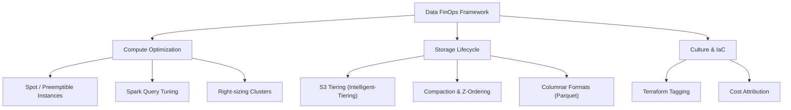

Thay vì chỉ dừng ở lời nhắc "hãy tắt máy chủ khi không dùng", FinOps đối với Data Engineer nằm ở tầng **vật lý (Physical Execution Layer)**. Mỗi byte dữ liệu được tải vào RAM, ghi xuống ổ cứng (Disk I/O), hay truyền qua mạng (Network Shuffle) đều góp phần vào hóa đơn Cloud cuối tháng. 

Các phần dưới tập trung vào quyết định kiến trúc, failure mode trên production (OOMKilled, Cartesian Explosion, Retry Storms), và cách cấu hình bằng mã (Terraform, Python) để làm chi phí dễ đo, dễ quy trách nhiệm và dễ kiểm soát hơn.

## 1. Đánh đổi kiến trúc: Compute Cost vs. Storage Cost

Trong các thiết kế Data Platform hiện đại, chúng ta luôn phải cân đối giữa chi phí lưu trữ (Storage) và tính toán (Compute).

* **Serverless (BigQuery, Athena) vs. Provisioned (Databricks, AWS EMR):**
  Serverless tính tiền theo lượng dữ liệu quét hoặc theo slot time tùy nền tảng. Mô hình này hợp với *spiky workloads* (các truy vấn không thường xuyên của Data Analyst). Tuy nhiên, nếu bạn có một streaming pipeline chạy 24/7 với khối lượng ổn định, cụm provisioned được right-size đúng cách có thể rẻ và dễ dự báo hơn.
* **Normalized (Chuẩn hóa) vs. Denormalized (Phi chuẩn hóa):**
  Lưu trữ dữ liệu dạng Normalized (Star Schema) giúp tiết kiệm Storage Cost (vốn rất rẻ trên S3), nhưng làm bùng nổ Compute Cost do CPU phải chạy các lệnh `JOIN` liên tục mỗi lần truy vấn. Ngược lại, Denormalized tốn Storage (lưu trùng lặp) nhưng giảm Compute. Với giá S3 Standard hiện tại chỉ khoảng $0.023/GB, xu hướng chung là ưu tiên **Denormalized** (One Big Table) để tiết kiệm Compute đắt đỏ.


*Caption: Các trụ cột trong FinOps dành cho Data Engineering, chuyển dịch từ việc quản lý chi phí thụ động sang tối ưu chủ động.*

## 2. Rủi ro vận hành & kiểm soát chi phí

Các Data Engineer thường đối mặt với những lỗi hệ thống không chỉ làm hỏng pipeline mà còn thổi bay ngân sách dự án chỉ trong vài giờ.

### 2.1. Cartesian Explosion & Tràn RAM (OOMKilled)

**Sự cố:** Một kỹ sư thực hiện câu lệnh `JOIN` giữa hai bảng lớn mà quên điều kiện `ON`, hoặc `ON` trên một cột chứa quá nhiều giá trị trùng lặp (Data Skew). Kết quả là một tích Đề-các (Cartesian Product). Một bảng 1 triệu dòng JOIN với bảng 1 triệu dòng khác có thể tạo ra 1 nghìn tỷ dòng rác.

**Hệ quả vật lý:** Khối lượng tính toán tăng mạnh buộc Spark phải gửi nhiều dữ liệu qua mạng (Network Shuffle). Các worker node không đủ RAM để chứa sẽ **spill-to-disk** (ghi tạm ra ổ cứng), làm pipeline chậm đáng kể, rồi có thể chết với lỗi `java.lang.OutOfMemoryError` (OOMKilled). Nếu auto-retry được cấu hình mù quáng, orchestrator sẽ chạy lại cùng một job lỗi và tiếp tục tiêu compute.

**Khắc phục:** Sử dụng **Broadcast Hash Join**. Nếu một bảng đủ nhỏ (Dimension table, < 1GB), hãy ép Spark phát sóng (Broadcast) nó đến bộ nhớ của tất cả các Worker Nodes. Điều này loại bỏ hoàn toàn Network Shuffle.

```python
from pyspark.sql.functions import broadcast

# Spark tự động phân phối dim_df vào RAM của từng Executor
fact_df = spark.read.parquet("s3://data/fact_sales/")
dim_df = spark.read.parquet("s3://data/dim_store/")

# Khắc phục Cartesian Explosion / OOMKilled cho bảng nhỏ
optimized_df = fact_df.join(broadcast(dim_df), "store_id")
```

Đối với các script Python thuần xử lý dữ liệu lớn, tránh dùng `fetchall()` để tải toàn bộ dữ liệu vào RAM. Hãy dùng generators (`yield`) hoặc `fetchmany()` để xử lý theo chunk.

### 2.2. The Small File Problem & Metadata Overhead

**Sự cố:** Các streaming jobs (từ Kafka/Kinesis) ghi liên tục các file Parquet rất nhỏ (vài KB) xuống Data Lake (S3). 

**Hệ quả vật lý:** Khi Athena hoặc Databricks quét thư mục này, hệ thống phải thực hiện hàng triệu AWS S3 `GET` requests. Chi phí trả cho API calls đôi khi đắt hơn cả tiền dung lượng lưu trữ, và quá trình quét bị thắt cổ chai do Metadata Overhead (thời gian mở/đóng file).

**Khắc phục:** Cấu hình **Compaction & Z-Ordering** trên Iceberg hoặc Delta Lake. Compaction gom các file nhỏ thành các file tiêu chuẩn (128MB - 256MB). Z-Ordering sắp xếp vật lý lại dữ liệu cục bộ theo cột thường xuyên query, giúp thuật toán Data Skipping hoạt động hiệu quả.

```sql
-- Delta Lake: Giải quyết Small File Problem và Data Skipping
OPTIMIZE sales_events 
ZORDER BY (customer_id, event_date);
```

### 2.3. Cơn bão thử lại (Retry Storms)

**Sự cố:** Một API bên thứ ba bị sập hoặc cơ sở dữ liệu nguồn bị quá tải. Pipeline được cấu hình retry liên tục mỗi giây.
**Hệ quả:** CPU của cụm orchestration tăng cao, log phình nhanh, và hệ thống tiếp tục tốn network/compute cho những request gần như chắc chắn thất bại.

**Khắc phục:** Áp dụng **Exponential Backoff & Jitter**. Độ trễ giữa các lần thử lại phải tăng theo hàm mũ để giảm tải cho hệ thống nguồn và tiết kiệm compute cục bộ.

```python
# Airflow DAG cấu hình chuẩn FinOps
from datetime import timedelta

default_args = {
    'owner': 'data_eng',
    'retries': 5,
    'retry_delay': timedelta(minutes=1),
    'retry_exponential_backoff': True, # Bắt buộc để chống Retry Storms
    'max_retry_delay': timedelta(minutes=15),
}
```

## 3. Tối ưu chi phí Compute trên Databricks

Môi trường tính toán như Databricks tính phí dựa trên DataBricks Units (DBU) cộng với phí máy chủ của Cloud Provider. Tắt cluster khi không dùng là chưa đủ.

* **Sử dụng Job Clusters thay vì All-Purpose Clusters:** All-purpose clusters được thiết kế cho quá trình dev/interactive và có giá DBU cao hơn đáng kể (thường gấp 2-3 lần). Mọi pipeline chạy production (thông qua Airflow hoặc Databricks Workflows) phải dùng **Job Clusters** tự khởi tạo và tự hủy.
* **Auto-termination & Autoscaling:** Đảm bảo tất cả các cluster tương tác có thời gian auto-termination ngắn (ví dụ: 30-60 phút). Autoscaling giúp cụm scale down ngay khi workload kết thúc, tránh trả tiền cho tài nguyên nhàn rỗi.

## 4. Tự động hóa AWS S3 Lifecycle & Tagging (IaC)

Tài nguyên đám mây vô chủ (Orphaned Resources) là một lỗ đen chi phí lớn. Mọi S3 Bucket, EC2, hay IAM Role đều phải được quản lý bằng Infrastructure as Code (IaC) như Terraform và được dán nhãn (Tagging) nghiêm ngặt để quy trách nhiệm chi phí (Cost Attribution).

Đồng thời, dữ liệu cũ (cold data) không nên nằm mãi ở lớp lưu trữ đắt tiền (S3 Standard). Áp dụng **S3 Lifecycle Rules** hoặc **S3 Intelligent-Tiering**.

```hcl
# Tạo S3 Bucket với Tagging chuẩn FinOps
resource "aws_s3_bucket" "data_lake_raw" {
  bucket = "company-datalake-raw-zone"

  tags = {
    Environment = "Production"
    CostCenter  = "DE-405-Analytics"
    FinOps      = "Strict-Enforcement"
  }
}

# Cấu hình Rule Tự động Lifecycle
resource "aws_s3_bucket_lifecycle_configuration" "raw_lifecycle" {
  bucket = aws_s3_bucket.data_lake_raw.id

  rule {
    id     = "archive-old-raw-data"
    status = "Enabled"

    # QUAN TRỌNG: Dọn rác do quá trình Upload bị lỗi
    abort_incomplete_multipart_upload {
      days_after_initiation = 7
    }

    # Chuyển data ít dùng sang Infrequent Access sau 30 ngày
    transition {
      days          = 30
      storage_class = "STANDARD_IA"
    }

    # Chuyển data vào kho lạnh Glacier sau 90 ngày
    transition {
      days          = 90
      storage_class = "GLACIER"
    }
  }
}
```
*Lưu ý:* `abort_incomplete_multipart_upload` là một thực hành nhỏ nhưng hữu ích vì các multipart upload bị bỏ dở vẫn có thể giữ lại dung lượng và sinh chi phí khó thấy trên dashboard vận hành hằng ngày.

## Khi nào nên / không nên dùng các kỹ thuật này?

* **Nên dùng S3 Intelligent-Tiering:** Khi mẫu truy cập dữ liệu (access pattern) của bạn không thể đoán trước. AWS sẽ tự động phân loại dữ liệu nóng/lạnh mà không thu phí truy xuất, bù lại mất một khoản phí giám sát nhỏ.
* **Không nên dùng Glacier:** Nếu dữ liệu đó có khả năng cần truy vấn đột xuất bởi Data Scientist. Phí lấy dữ liệu (Retrieval fee) từ Glacier có thể đắt hơn số tiền lưu trữ tiết kiệm được.
* **Nên dùng Full Refresh:** Thay vì Incremental Load (MERGE) khi kích thước bảng nhỏ (< 1GB). Việc duy trì kiến trúc CDC phức tạp cho bảng cấu hình nhỏ tốn chi phí kỹ sư hơn là tiền compute tiết kiệm được.

## Thuật ngữ chính (Key terms)

| Term | Nghĩa ngắn |
| --- | --- |
| S3 Intelligent-Tiering | Lớp lưu trữ S3 tự động chuyển đổi dữ liệu nóng/lạnh dựa trên tần suất truy cập. |
| Cartesian Explosion | Tích Đề-các không kiểm soát khi JOIN hai bảng lớn, gây tràn RAM (OOM) và ngốn CPU. |
| Job Cluster | Cụm tính toán sinh ra để chạy một task cụ thể rồi hủy, có chi phí (DBU) rẻ hơn All-purpose cluster. |
| Exponential Backoff | Kỹ thuật tăng dần độ trễ giữa các lần thử lại (retry) để tránh làm sập hệ thống nguồn. |
| Broadcast Hash Join | Thuật toán JOIN của Spark giúp copy bảng nhỏ đến mọi node, loại bỏ Network Shuffle. |

## References
- FinOps Foundation. [FinOps Framework and Principles](https://www.finops.org/framework/)
- AWS Documentation. [Amazon S3 Object Lifecycle Management](https://docs.aws.amazon.com/AmazonS3/latest/userguide/object-lifecycle-mgmt.html)
- Martin Kleppmann. *Designing Data-Intensive Applications* (Chương 3).
