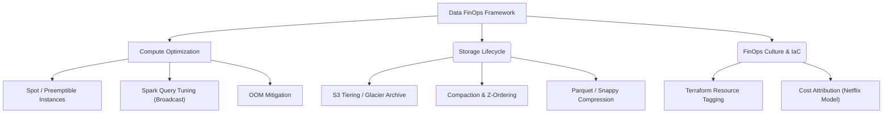

Thay vì những lời kêu gọi "Hãy tắt máy chủ khi không dùng" chung chung, FinOps đối với một Kỹ sư Dữ liệu (Data Engineer) ở cấp độ Staff/Principal là một cuộc chiến khốc liệt ở tầng **Vật lý (Physical Execution Layer)**. Mỗi một Byte dữ liệu được tải vào RAM (Memory), ghi xuống ổ cứng (Disk I/O) hay truyền tải qua mạng (Network Shuffle) đều trực tiếp cấu thành tờ hóa đơn Cloud cuối tháng. 

Bài viết này đi sâu vào các quyết định thiết kế kiến trúc, mổ xẻ các sự cố "Đốt tiền" kinh điển trên Production (OOMKilled, Cartesian Explosion, Retry Storms) và cách cấu hình kỹ thuật bằng mã (Terraform, YAML, Python) để xây dựng một Data Platform có Unit Economics tối ưu nhất theo chuẩn FinOps Foundation.

---

## 1. Đánh Đổi Kiến Trúc: Compute Cost vs. Storage Cost

Trong các thiết kế Data Platform hiện đại, chúng ta luôn phải chơi trò bập bênh giữa Storage (Lưu trữ) và Compute (Tính toán).

*   **Serverless (BigQuery, Athena) vs. Provisioned (Databricks, AWS EMR)**: 
    - Serverless tính tiền theo lượng dữ liệu quét (Data Scanned - khoảng \$5/TB) hoặc theo Slot time. Nó hoàn hảo cho *Spiky Workloads* (Lâu lâu Data Analyst mới vào query một lần). 
    - Tuy nhiên, nếu bạn có một Streaming Pipeline chạy 24/7 với khối lượng dữ liệu khổng lồ, việc duy trì một cụm Provisioned với Spot Instances sẽ rẻ hơn BigQuery gấp hàng chục lần.
*   **Normalized (Chuẩn hóa) vs. Denormalized (Phi chuẩn hóa)**: 
    - Lưu trữ dữ liệu dạng Normalized (Star Schema) giúp tiết kiệm Storage Cost (Vốn cực rẻ trên S3), nhưng làm bùng nổ Compute Cost do CPU phải chạy các lệnh `JOIN` liên tục mỗi lần Query. 
    - Ngược lại, Denormalized tốn Storage (Lưu trùng lặp) nhưng giảm Compute (Không cần `JOIN`). Với giá S3 hiện tại chỉ khoảng \$0.023/GB, xu hướng FinOps chung là ưu tiên **Denormalized** (Sử dụng Wide Column Tables / One Big Table) để tiết kiệm Compute đắt đỏ.



---

## 2. Rủi Ro Vận Hành & Khắc Phục "Sự Cố Đốt Tiền"

Các Data Engineer thường đau đầu với những lỗi hệ thống không chỉ làm hỏng Pipeline mà còn thổi bay ngân sách dự án chỉ trong một đêm.

### 2.1. Cartesian Explosion & Tràn RAM (OOMKilled)

**Sự cố:** Kỹ sư thực hiện một câu lệnh `JOIN` giữa 2 bảng lớn mà quên điều kiện `ON` hoặc `ON` trên một cột chứa quá nhiều giá trị trùng lặp (Data Skew). Nó tạo ra tích Đề-các (Cartesian Product). Một bảng 1 triệu dòng JOIN với bảng 1 triệu dòng khác tạo ra 1 nghìn tỷ dòng rác.

**Hệ quả vật lý (Đốt tiền):** Khối lượng tính toán khổng lồ buộc Spark phải gửi toàn bộ dữ liệu qua mạng (Network Shuffle). Các Worker Node không đủ RAM để chứa, dẫn đến hiện tượng **Spill-to-disk** (Ghi tạm ra ổ cứng) làm Pipeline chạy chậm đi 100 lần, và cuối cùng chết tươi với lỗi `java.lang.OutOfMemoryError: Java heap space` (OOMKilled). Cụm EMR hoặc Databricks liên tục Restart và chạy lại Job này hàng chục lần vì chế độ Auto-retry, đẩy hóa đơn Compute lên hàng nghìn USD vô ích.

**Khắc phục bằng Broadcast Hash Join:**
Thay vì Shuffle tốn kém, nếu một bảng đủ nhỏ (Dimension table, < 1GB), hãy chỉ định ép Spark phát sóng (Broadcast) nó đến bộ nhớ của tất cả các Worker Nodes.

```python
from pyspark.sql.functions import broadcast

# Spark sẽ tự động phân phối dim_df vào RAM của từng Executor, loại bỏ hoàn toàn Network Shuffle
fact_df = spark.read.parquet("s3://data/fact_sales/")
dim_df = spark.read.parquet("s3://data/dim_store/")

# Tối ưu hóa cực mạnh cho FinOps
optimized_df = fact_df.join(broadcast(dim_df), "store_id")
```

Với các Script ETL chạy bằng Python thuần trong Airflow, **tuyệt đối không tải toàn bộ dữ liệu vào RAM bằng `fetchall()`**. Sử dụng Generators (`yield`) để xử lý từng Chunk dữ liệu.

```python
# CHỐNG OOMKILLED VỚI PYTHON GENERATOR
def fetch_and_process_data(db_cursor, batch_size=10000):
    while True:
        results = db_cursor.fetchmany(batch_size)
        if not results:
            break
        for row in results:
            yield process_row(row) # Xử lý từng dòng, RAM luôn ổn định dù bảng có 1 Tỷ dòng
```

### 2.2. The Small File Problem & Tối Ưu Z-Ordering

**Sự cố:** Các Streaming Jobs (ví dụ từ Kafka) ghi liên tục các file Parquet siêu nhỏ (Vài KB) xuống S3. 
**Hệ quả vật lý:** Khi Athena hoặc Databricks quét thư mục này, nó phải mở/đóng hàng triệu File vật lý. Tiền trả cho AWS S3 `GET Request` API (Tính theo số lượng File) có khi đắt gấp 10 lần tiền dung lượng lưu trữ. Quá trình quét chậm như rùa bò do Metadata Overhead.

**Khắc phục bằng Compaction & Z-Ordering (Apache Iceberg / Delta Lake):**
Thiết lập các Job nén định kỳ (Compaction/Vacuum) để gom hàng triệu file nhỏ thành các file chuẩn kích thước từ 128MB - 256MB. Kết hợp với `Z-Ordering` để phân cụm dữ liệu cục bộ theo cột thường xuyên Query, giúp thuật toán Data Skipping (Pruning) bỏ qua các File không chứa dữ liệu cần thiết.

```sql
-- Giải quyết Small File Problem bằng Compaction (Iceberg)
OPTIMIZE iceberg_catalog.db.sales_events 
REWRITE DATA USING BIN_PACK;

-- Sắp xếp vật lý lại dữ liệu trên ổ cứng để tăng tốc độ truy vấn
OPTIMIZE iceberg_catalog.db.sales_events 
ZORDER BY (customer_id, event_date);
```

### 2.3. Cơn Bão Thử Lại (Retry Storms)

**Sự cố:** Một API bên thứ 3 bị sập hoặc Database bị quá tải. Data Pipeline ngây thơ cấu hình tự động Retry liên tục hàng nghìn lần mỗi giây (Thundering Herd problem).
**Hệ quả:** CPU của cụm Airflow tăng vọt lên 100%, Log sinh ra hàng chục GB mỗi phút làm cháy ổ cứng, và tốn kém chi phí Network Egress vô ích để đập vào một cánh cửa đã đóng.

**Khắc phục bằng Exponential Backoff & Jitter:**
Luôn sử dụng độ trễ tăng dần theo hàm mũ (Exponential Backoff) trong mọi cơ chế Retry.

```python
# Airflow DAG YAML/Python Config chuẩn FinOps
from datetime import timedelta

default_args = {
    'owner': 'data_eng',
    'retries': 5,
    'retry_delay': timedelta(minutes=1),
    'retry_exponential_backoff': True, # BẮT BUỘC để chống Retry Storms
    'max_retry_delay': timedelta(minutes=15),
}
```

---

## 3. Tối Ưu Xử Lý Tăng Dần (Incremental Load) thay vì Full Refresh

Một chiến lược Data Engineering "lười biếng" là quét toàn bộ Bảng A (100TB), tính toán lại từ đầu, và ghi đè (Overwrite) vào Bảng B mỗi đêm. Kỹ thuật Full Refresh này cực kỳ ổn định, nhưng đốt cháy hàng chục nghìn USD tiền Compute mỗi tháng.

**Giải pháp:** Xử lý tăng dần (Incremental Load) kết hợp Slowly Changing Dimensions (SCD Type 2). Sử dụng lệnh `MERGE INTO` của Delta Lake hoặc Apache Iceberg để chỉ tác động vào những dòng bị thay đổi (Change Data Capture - CDC).

```sql
-- SCD Type 2 Thực chiến với Data Lakehouse (Iceberg/Delta)
MERGE INTO prod_catalog.core.dim_customers target
USING staging.cdc_customers source
ON target.customer_id = source.customer_id 
   AND target.is_current = true
WHEN MATCHED AND target.checksum != source.checksum THEN
  -- Đánh dấu dòng cũ là 'hết hạn' (Lưu lịch sử)
  UPDATE SET 
    target.is_current = false, 
    target.valid_to = CURRENT_TIMESTAMP()
WHEN NOT MATCHED THEN
  -- Thêm dữ liệu khách hàng mới
  INSERT (customer_id, name, address, is_current, valid_from, valid_to, checksum)
  VALUES (source.customer_id, source.name, source.address, true, CURRENT_TIMESTAMP(), '9999-12-31', source.checksum);
```

---

## 4. Tự Động Hóa S3 Lifecycle & Terraform Tagging

Tài nguyên đám mây vô chủ (Orphaned / Zombie Resources) là lỗ đen FinOps lớn nhất. Mọi Cluster, S3 Bucket, hay IAM Role đều PHẢI được khởi tạo bằng IaC (Terraform) và bắt buộc dán nhãn (Tagging). Bất kỳ tài nguyên nào thiếu Tag `CostCenter` sẽ bị Cloud Custodian hoặc AWS Lambda xóa tự động sau 24 giờ.

Ngoài ra, không bao giờ để dữ liệu nằm chết ở phân vùng lưu trữ đắt tiền (S3 Standard). Áp dụng **S3 Lifecycle Management** tự động chuyển tầng lưu trữ.

**Mã Terraform Thực chiến (Tự động Tiering S3 và Tagging):**

```hcl
# 1. Tạo S3 Bucket bắt buộc Tagging chuẩn FinOps
resource "aws_s3_bucket" "data_lake_raw" {
  bucket = "company-datalake-raw-zone"

  tags = {
    Environment = "Production"
    Team        = "DataEngineering"
    CostCenter  = "DE-405-Analytics"
    FinOps      = "Strict-Enforcement"
  }
}

# 2. Cấu hình Rule Tự động di chuyển dữ liệu (Lifecycle)
resource "aws_s3_bucket_lifecycle_configuration" "raw_lifecycle" {
  bucket = aws_s3_bucket.data_lake_raw.id

  rule {
    id     = "archive-old-raw-data"
    status = "Enabled"

    # QUAN TRỌNG: Xóa các file rác sinh ra do quá trình Upload bị đứt mạng giữa chừng
    abort_incomplete_multipart_upload {
      days_after_initiation = 7
    }

    # Chuyển data ít dùng (Cold Data) sang Infrequent Access sau 30 ngày (Giảm 50% chi phí)
    transition {
      days          = 30
      storage_class = "STANDARD_IA"
    }

    # Chuyển data vào kho lạnh băng Glacier sau 90 ngày (Giảm 90% chi phí)
    transition {
      days          = 90
      storage_class = "GLACIER"
    }

    # Hủy dữ liệu tuân thủ luật GDPR [Data Retention Policy]
    expiration {
      days = 365
    }
  }
}
```

---

## Tổng Kết

FinOps trong Data Engineering không phải là nhiệm vụ của đội Kế toán, mà là kỹ năng sinh tồn của Staff Engineer. Bằng cách thiết kế kiến trúc phân giải sự đánh đổi Compute/Storage, viết mã Spark thông minh để tránh OOMKilled/Shuffle, và dùng Terraform tự động dọn rác S3, bạn không chỉ tiết kiệm hàng triệu Đô-la cho tổ chức mà còn giúp hệ thống chạy nhanh, ổn định và xanh hơn (Green Computing).

## Nguồn Tham Khảo (References)
1. **FinOps Foundation:** [FinOps Framework and Principles][https://www.finops.org/framework/]
2. **Databricks Cost Optimization:** [From Chaos to Control: Cost Maturity Journey][https://www.databricks.com/blog/2023/04/13/chaos-control-cost-maturity-journey-databricks.html]
3. **Netflix TechBlog:** [Building a Culture of Cloud Efficiency][https://netflixtechblog.com/]
4. **AWS Documentation:** [Amazon S3 Object Lifecycle Management](https://docs.aws.amazon.com/AmazonS3/latest/userguide/object-lifecycle-mgmt.html]
5. **Sách chuyên môn:** *Designing Data-Intensive Applications* - Martin Kleppmann (Chương 3 & 10).
