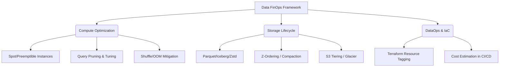

Thay vì những lời kêu gọi tiết kiệm chung chung, FinOps đối với một Kỹ sư Dữ liệu (Data Engineer) ở cấp độ Staff/Principal là cuộc chiến ở tầng **Vật lý (Physical Execution Layer)**. Mỗi một byte dữ liệu được đưa vào RAM (Memory), ghi xuống ổ cứng (Disk I/O) hay truyền tải qua mạng (Network Shuffle) đều cấu thành hóa đơn Cloud cuối tháng. 

Bài viết này đi sâu vào các quyết định thiết kế hệ thống, các sự cố "đốt tiền" kinh điển (OOMKilled, Cartesian Explosion, Retry Storms) và cách cấu hình kỹ thuật (Terraform, YAML, SQL) để xây dựng một Data Platform có Unit Economics tối ưu nhất.

## 1. Đánh đổi Hệ thống: Compute Cost vs. Storage Cost

Trong các thiết kế Data Platform hiện đại, chúng ta luôn phải cân bằng giữa Storage và Compute, cũng như Latency và Throughput.

*   **Serverless (BigQuery, Athena) vs. Provisioned (Databricks, EMR)**: Serverless tính tiền theo lượng dữ liệu quét (Data Scanned - $5/TB) hoặc theo slot time. Nó hoàn hảo cho Spiky Workloads. Tuy nhiên, nếu bạn có một Streaming Pipeline chạy 24/7 với lượng dữ liệu khổng lồ, việc duy trì một cụm Provisioned với Spot Instances sẽ rẻ hơn gấp nhiều lần.
*   **Normalized (Chuẩn hóa) vs. Denormalized (Phi chuẩn hóa)**: Lưu trữ dữ liệu dạng Normalized (Star Schema/Snowflake) tiết kiệm Storage Cost (rất rẻ trên S3), nhưng làm tăng Compute Cost do phải `JOIN` liên tục. Ngược lại, Denormalized tốn Storage Cost (lưu trùng lặp) nhưng giảm Compute Cost (không cần `JOIN`). Với giá S3 hiện tại ($0.023/GB), xu hướng chung là ưu tiên **Denormalized** (như Wide Column Tables) để tiết kiệm Compute.



## 2. Rủi ro Vận hành (Operational Risks) & Khắc phục "Sự cố Đốt tiền"

Các Data Engineer thường đau đầu với những lỗi hệ thống không chỉ làm hỏng pipeline mà còn thổi bay ngân sách.

### 2.1. Cartesian Explosion & Tràn RAM (OOMKilled)
**Sự cố:** Kỹ sư thực hiện một câu lệnh `JOIN` mà không có khóa duy nhất (unique key) rõ ràng, tạo ra Cartesian Product (Tích Đề-các). Một bảng 1 triệu dòng JOIN với bảng 1 triệu dòng khác tạo ra 1 nghìn tỷ dòng.
**Hệ quả vật lý:** Hệ thống phân tán (Spark) sẽ phải gửi toàn bộ dữ liệu qua mạng (Network Shuffle). Các Executor không đủ RAM để chứa khối lượng dữ liệu khổng lồ này, dẫn đến hiện tượng **Spill-to-disk** (ghi tạm ra ổ cứng) cực kỳ chậm, và cuối cùng chết với lỗi `java.lang.OutOfMemoryError: Java heap space` (OOMKilled). Cụm EMR liên tục restart và chạy lại job này hàng chục lần, đẩy chi phí lên hàng nghìn đô.

**Khắc phục bằng Broadcast Hash Join & Python Generators:**
Thay vì Shuffle tốn kém, nếu một bảng đủ nhỏ (Dimension table), hãy broadcast (phát sóng) nó đến bộ nhớ của tất cả các Worker Nodes.

```python
from pyspark.sql.functions import broadcast

# Spark sẽ tự động đưa dimension_df vào RAM của từng Executor, loại bỏ Network Shuffle
fact_df = spark.read.parquet("s3://data/fact_sales/")
dim_df = spark.read.parquet("s3://data/dim_store/")

optimized_df = fact_df.join(broadcast(dim_df), "store_id")
```
Với các Script xử lý dữ liệu nặng trong Airflow (Python Operator), **tuyệt đối không tải toàn bộ dữ liệu vào RAM list**. Sử dụng Generators (`yield`) để xử lý từng chunk (Chunking).

```python
# CHỐNG OOMKILLED VỚI PYTHON GENERATOR
def fetch_and_process_data(db_cursor, batch_size=10000):
    while True:
        results = db_cursor.fetchmany(batch_size)
        if not results:
            break
        for row in results:
            yield process_row(row) # Xử lý từng dòng thay vì nuốt trọn cả bảng vào RAM
```

### 2.2. The Small File Problem & Z-Ordering Fragmentation
**Sự cố:** Các Streaming Jobs (ví dụ từ Kafka vào S3) ghi liên tục các file Parquet siêu nhỏ (vài KB). 
**Hệ quả vật lý:** Khi Athena hoặc Spark đọc dữ liệu này, nó phải mở/đóng hàng triệu file (Metadata overhead & S3 GET request cost). Việc quét file cực kỳ chậm và tốn tiền API S3.

**Khắc phục bằng Compaction & Z-Ordering (Apache Iceberg / Delta Lake):**
Chạy các Job nén định kỳ (Compaction) để gom các file nhỏ thành file lớn (~128MB - 256MB). Kết hợp với `Z-Ordering` để phân cụm dữ liệu cục bộ, giúp Data Skipping (Pruning) hiệu quả.

```sql
-- Chạy trên Spark SQL / Databricks để giải quyết Small File Problem
OPTIMIZE iceberg_catalog.db.sales_events 
REWRITE DATA USING BIN_PACK;

-- Sắp xếp vật lý lại dữ liệu trên ổ cứng để tăng tốc độ truy vấn
OPTIMIZE iceberg_catalog.db.sales_events 
ZORDER BY (customer_id, event_date);
```

### 2.3. Retry Storms (Cơn bão thử lại)
**Sự cố:** Một API bị rate-limit hoặc Kafka broker bị rớt mạng. Data Pipeline tự động retry liên tục hàng nghìn lần mỗi giây (Thundering Herd problem), khiến CPU của cluster tăng vọt, log sinh ra hàng chục GB/phút, và tốn kém chi phí Compute/Network vô ích.

**Khắc phục bằng Cấu hình Exponential Backoff & Kafka Properties:**
Luôn sử dụng độ trễ tăng dần theo hàm mũ (Exponential Backoff) kèm Jitter trong các cấu hình Retry.

*Cấu hình Airflow DAG (YAML/Python):*
```python
from datetime import timedelta

default_args = {
    'owner': 'data_eng',
    'retries': 5,
    'retry_delay': timedelta(minutes=1),
    'retry_exponential_backoff': True, # BẮT BUỘC để chống Retry Storms
    'max_retry_delay': timedelta(minutes=15),
}
```

*Cấu hình Kafka Producer (Chống mất dữ liệu mà không tốn tài nguyên vô ích):*
```properties
# Kafka Producer Properties
acks=all
retries=2147483647
retry.backoff.ms=500
delivery.timeout.ms=120000
enable.idempotence=true # Ngăn chặn duplicate data khi network chập chờn
```

## 3. Quản lý Vòng đời Dữ liệu & Xử lý Tăng dần (Incremental Load)

Một chiến lược FinOps tệ hại là quét toàn bộ Bảng A, tính toán, và ghi đè vào Bảng B (Full Refresh) mỗi ngày. Kỹ thuật này đốt hàng nghìn USD.

**Giải pháp:** Xử lý tăng dần (Incremental Load) kết hợp Slowly Changing Dimensions (SCD). Sử dụng lệnh `MERGE` của Apache Iceberg để chỉ quét và cập nhật các dòng có sự thay đổi.

```sql
-- SCD Type 2 Thực chiến với Apache Iceberg
MERGE INTO prod_catalog.core.dim_customers target
USING staging.cdc_customers source
ON target.customer_id = source.customer_id 
   AND target.is_current = true
WHEN MATCHED AND target.checksum != source.checksum THEN
  -- Đánh dấu dòng cũ là 'hết hạn'
  UPDATE SET 
    target.is_current = false, 
    target.valid_to = CURRENT_TIMESTAMP()
WHEN NOT MATCHED THEN
  -- Thêm dữ liệu khách hàng mới
  INSERT (customer_id, name, address, is_current, valid_from, valid_to, checksum)
  VALUES (source.customer_id, source.name, source.address, true, CURRENT_TIMESTAMP(), '9999-12-31', source.checksum);
```

## 4. Infrastructure as Code (IaC) & Resource Tagging

Tài nguyên đám mây vô chủ (Orphaned/Zombie Resources) là lỗ đen FinOps. Mọi Cluster, Bucket, Job đều phải được tạo bằng IaC (Terraform) và dán nhãn (Tagging) bắt buộc. Bất kỳ tài nguyên nào không có Tag `CostCenter` sẽ bị xóa tự động bởi các Lambda function giám sát.

**Mã Terraform thực chiến (Tự động Tiering S3 và Tagging):**

```hcl
# S3 Bucket với Lifecycle Rules để tối ưu Storage Cost
resource "aws_s3_bucket" "data_lake_raw" {
  bucket = "company-datalake-raw-zone"

  tags = {
    Environment = "Production"
    Team        = "DataEngineering"
    CostCenter  = "DE-405"
    FinOps      = "Strict"
  }
}

resource "aws_s3_bucket_lifecycle_configuration" "raw_lifecycle" {
  bucket = aws_s3_bucket.data_lake_raw.id

  rule {
    id     = "archive-old-raw-data"
    status = "Enabled"

    # Xóa các multipart uploads bị kẹt (tránh tốn tiền vô ích)
    abort_incomplete_multipart_upload {
      days_after_initiation = 7
    }

    # Chuyển data ít dùng sang Infrequent Access sau 30 ngày
    transition {
      days          = 30
      storage_class = "STANDARD_IA"
    }

    # Chuyển data vào kho lạnh Glacier sau 90 ngày
    transition {
      days          = 90
      storage_class = "GLACIER"
    }

    # Hủy dữ liệu sau 1 năm (Data Retention Policy)
    expiration {
      days = 365
    }
  }
}
```

## Nguồn Tham Khảo (References)
*   **Databricks FinOps & Optimization:** [From Chaos to Control: A Cost Maturity Journey with Databricks](https://www.databricks.com/blog/2023/04/13/chaos-control-cost-maturity-journey-databricks.html)
*   **AWS Architecture Blog:** Lộ trình tối ưu chi phí với Amazon S3 Lifecycle Management & EMR Spot Instances.
*   **Designing Data-Intensive Applications** - Martin Kleppmann (Chương 3 & 10 về Storage Engines và Batch Processing).
*   **Apache Iceberg Documentation:** [Maintenance & Compaction](https://iceberg.apache.org/docs/latest/maintenance/)
*   **The FinOps Foundation:** [FinOps Framework for Data Platform](https://www.finops.org/)
