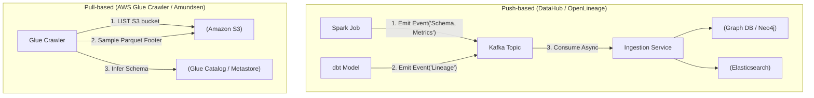

Trong các kiến trúc dữ liệu phân tán hiện đại (Data Mesh, Data Fabric, Lakehouse), định nghĩa sách giáo khoa "Metadata là dữ liệu về dữ liệu" đã trở nên quá ngây thơ. Ở quy mô Enterprise, **Metadata Management** chính là **Control Plane (Mặt phẳng điều khiển)** của toàn bộ hạ tầng. Nếu hệ thống lưu trữ như HDFS/S3 là Data Plane (nơi chứa cơ bắp và dữ liệu vật lý), thì Data Catalog và Metastore đóng vai trò là Control Plane (bộ não điều phối, phân quyền và định tuyến).

Bài viết này đi sâu vào kiến trúc vật lý của hệ thống quản lý siêu dữ liệu, phân tích sự đánh đổi giữa các mô hình thu thập (Push vs Pull), và cách các Big Tech như Uber, Netflix giải quyết điểm nghẽn khi hệ thống Metastore bị quá tải.

---

## 1. Kiến Trúc Thu Thập Metadata: Pull-based vs Push-based

Việc thu thập Technical Metadata (Schema), Operational Metadata (Lineage, Job Status), và Business Metadata từ hàng nghìn pipelines đòi hỏi một chiến lược rõ ràng. Có hai trường phái kiến trúc chính:

### 1.1. Pull-based Architecture (Kiến trúc Kéo - Thế hệ cũ)
Đại diện tiêu biểu là **Amundsen (Lyft)** thời kỳ đầu hoặc **AWS Glue Crawlers**. Một hệ thống trung tâm (Crawler/Scanner) sẽ định kỳ chạy các Batch Jobs để kết nối tới các Data Sources (S3, RDS), đọc Schema và phân tích mẫu dữ liệu.

**Đánh đổi hệ thống (Systemic Trade-offs):**
- **Ưu điểm:** Tách biệt hoàn toàn (Decoupled) với Data Pipelines. Việc quét metadata không làm sửa đổi code hay ảnh hưởng tới hiệu năng của luồng ghi dữ liệu chính.
- **Rủi ro Vận hành:** 
  - **Dữ liệu thiu (Stale Metadata):** Vì chạy theo Batch, Data Catalog luôn chậm hơn thực tế vài giờ.
  - **S3 API Throttling:** Việc quét (Crawling) trên Object Storage với hàng triệu file Parquet nhỏ sẽ gây bùng nổ chi phí gọi `LIST` / `GET` API của AWS, dẫn đến việc bị AWS bóp băng thông (Throttling) làm sập các hệ thống khác cùng chia sẻ chung AWS Account.

### 1.2. Push-based Architecture (Kiến trúc Đẩy - Thế hệ mới)
Đại diện bởi kiến trúc của **DataHub (LinkedIn)**, chuẩn **OpenLineage**, và **Marquez**. Các Data Pipelines (Airflow, Spark, dbt) sẽ chủ động phát ra các sự kiện (Metadata Events) qua một Message Broker (như Kafka) ngay tại thời điểm Runtime mỗi khi có một task hoàn thành hoặc cấu trúc bảng thay đổi.

**Đánh đổi hệ thống:**
- **Ưu điểm:** Metadata được cập nhật gần như thời gian thực (Near real-time). Bắt được chính xác **Data Lineage (Luồng chảy dữ liệu)** tại cấp độ cột (Column-level) thay vì phải dùng Regex để suy đoán (Parse) từ SQL logs.
- **Rủi ro Vận hành:** Tính phụ thuộc (Coupling) rất cao. Code của Pipeline gốc phải bị can thiệp (Instrumented) để gắn thêm thư viện đẩy sự kiện. Nếu Kafka endpoint của DataHub bị sập, hệ thống cần cơ chế Asynchronous + Dead Letter Queue để đảm bảo luồng Data Pipeline cốt lõi không bị chết lây.



---

## 2. Điểm Nghẽn Hệ Thống: Cú Sập Hive Metastore (HMS)

**Hive Metastore (HMS)** thường được dùng làm tiêu chuẩn de-facto Data Catalog cho các hệ sinh thái Hadoop/Spark. Tuy nhiên, bản chất HMS là một kiến trúc Monolith backed bởi một cơ sở dữ liệu quan hệ (RDBMS như MySQL/PostgreSQL).

### Real-world Incident: JVM OOMKilled & Cascade Timeout
Khi một Data Analyst chạy truy vấn một bảng được partitioned theo `(year, month, day, hour)` với lịch sử 5 năm, câu lệnh `SELECT * FROM table WHERE year = 2023` sẽ buộc Spark Driver gọi hàm `get_partitions_by_filter` qua giao thức Thrift tới HMS. 

Nếu bảng có hàng chục nghìn partitions, HMS sẽ phải query MySQL, load dữ liệu lên RAM, Deserialize các Object, và Serialize thành Thrift response trả về.
- **Hệ quả 1:** CPU của MySQL backing HMS tăng vọt 100%.
- **Hệ quả 2:** Payload Thrift trả về quá lớn (lên tới hàng trăm MB hoặc vài GB). JVM của Spark Driver (hoặc chính bản thân HMS) bị phình to và chết vì **OOMKilled** (Out Of Memory).
- **Hệ quả 3 (Cascade Failure):** Khi HMS bị nghẽn, toàn bộ các Data Pipelines khác trong công ty đang cố gọi tới HMS đều bị Connection Timeout và sập dây chuyền.

**Cách Khắc Phục (Architectural Solutions):**
1. **Chuyển sang Open Table Formats (Iceberg/Hudi):** Apache Iceberg loại bỏ hoàn toàn sự phụ thuộc vào RDBMS của HMS trong việc lưu Metadata ở cấp độ Partition/File. Nó lưu Metadata trực tiếp trên S3 dưới dạng Cây phân cấp (Tree of Manifest files), giúp Spark Driver có thể đọc song song phân tán.
2. **Database Federation (Cách làm của Uber):** Uber đã giải quyết HMS Monolith bằng cách phân tách (Sharding) Metastore thành các Domain-Specific Databases, sử dụng con trỏ siêu dữ liệu để giảm bán kính ảnh hưởng (Blast Radius) khi một Domain bị sập.

---

## 3. Kiến Trúc Đồ Thị Tri Thức (Knowledge-Graph) - Netflix UDA

Netflix nhận ra rằng việc quản lý Data Lineage (Truy xuất nguồn gốc dữ liệu) bằng các bảng RDBMS rời rạc là một cực hình. Khi sếp hỏi *"Nếu chúng ta sửa kiểu dữ liệu cột A, những Dashboard nào hạ nguồn bị lỗi?"*, các kỹ sư phải viết các vòng lặp đệ quy JOIN (Recursive CTEs) cực kỳ tốn kém và chậm chạp trên MySQL.

Họ đã thiết kế **Unified Data Architecture (UDA)** sử dụng kiến trúc Đồ thị (Graph Database).
- Mọi thực thể (Table, Column, Pipeline, User, Dashboard) là các **Node (Đỉnh)**. 
- Các tương tác (Creates, Consumes, Owns) là **Edges (Cạnh)**. 
Việc truy vấn Data Lineage từ thượng nguồn xuống hạ nguồn trở thành một bài toán duyệt đồ thị (Graph Traversal) được xử lý với độ trễ tính bằng mili-giây (sub-milliseconds).

---

## 4. Active Metadata & Quản Lý Tự Động Bằng ML tại Uber

Khi hệ thống chạm ngưỡng Exabytes dữ liệu với hàng chục vạn bảng, việc yêu cầu con người gán Tag (Ví dụ: PII, Financial Data) thủ công là bất khả thi.

Hệ thống Metadata chuyển từ trạng thái thụ động (Passive - chờ người tra cứu) sang **Chủ động (Active Metadata)**. Uber phát triển hệ thống **DataK9** tích hợp với **Databook**:
- Họ dùng Machine Learning và Rule-based Engines (Bloom Filters) quét qua các luồng dữ liệu mới để *tự động nhận diện* và phân loại dữ liệu nhạy cảm (PII - Personally Identifiable Information).
- Ngay khi DataK9 gắn Tag `PII=true` vào ElasticSearch của Databook, hệ thống sẽ tự động gọi API kích hoạt các chính sách Role-Based Access Control (RBAC) để chặn quyền truy cập của người dùng thường ở cấp độ Cột (Column-level Security) mà không cần Admin can thiệp.

---

## 5. Thực Chiến: Triển khai Data Catalog & LF bằng Terraform (IaC)

Thay vì click chuột thủ công (Click-ops) trên giao diện Web, các Staff Data Engineer sử dụng Infrastructure as Code (IaC) để thiết lập Data Catalog. Dưới đây là ví dụ dùng **AWS Glue Data Catalog** kết hợp **AWS Lake Formation** để thiết lập Tag-Based Access Control (TBAC).

```hcl
# 1. Thiết lập Glue Catalog Database (Logical Layer)
resource "aws_glue_catalog_database" "gold_layer_metrics" {
  name        = "gold_business_metrics"
  description = "Chứa các bảng Aggregate đã được làm sạch cho hệ thống BI"

  # Gắn Business Metadata trực tiếp vào IaC
  parameters = {
    "data_owner"     = "growth_team"
    "classification" = "confidential"
    "pii_data"       = "false"
  }
}

# 2. Áp dụng Tag-based Access Control (TBAC)
resource "aws_lakeformation_lf_tag" "sensitivity" {
  key    = "sensitivity_level"
  values = ["public", "high", "critical"]
}

# 3. Phân quyền Data Governance qua Lake Formation
resource "aws_lakeformation_permissions" "bi_analyst_access" {
  principal   = aws_iam_role.bi_analyst_role.arn
  permissions = ["SELECT", "DESCRIBE"]

  table {
    database_name = aws_glue_catalog_database.gold_layer_metrics.name
    name          = "fct_monthly_revenue"
  }
}
```

**Sự đánh đổi [Trade-off] khi dùng IaC cho Metadata:**
- **Ưu điểm:** Khả năng Audit (Kiểm toán) xuất sắc và Review PR dễ dàng. Phân quyền cấp độ Tag linh hoạt.
- **Rủi ro:** Khi có quá nhiều Policies và Tags, quá trình *Cross-evaluation* giữa AWS IAM và Lake Formation sẽ làm tăng độ trễ Query Planning của Amazon Athena. Hơn nữa, việc *Terraform Drift* xảy ra khi các Data Stewards tự ý sửa quyền trên UI sẽ gây vỡ luồng CI/CD, đòi hỏi chiến lược Reconcile chặt chẽ.

---

## 6. Tổng Kết

Data Catalog và Metadata Management hoàn toàn không phải là một công cụ (Tool) cài vào là xong. Nó là một **Hệ Sinh Thái (Ecosystem)**. 

Việc thiết kế hệ thống này đòi hỏi kỹ sư phải giải quyết các bài toán hệ thống phân tán cốt lõi: 
1. Làm thế nào để push metadata với throughput cao mà không làm nghẽn Data Pipeline gốc?
2. Làm sao để đánh index hàng tỷ data files mà không gây sập (OOM) Metastore?
3. Thiết kế kiến trúc Active Metadata để tự động hóa Governance ở quy mô Exabytes.

Làm chủ kiến trúc Metadata chính là bước đệm kỹ thuật bắt buộc trước khi doanh nghiệp có thể triển khai thành công các mô hình phi tập trung như **Data Mesh** hay **Data Fabric**.

## Nguồn Tham Khảo
* **Designing Data-Intensive Applications - Martin Kleppmann**
* [Netflix Technology Blog: Unified Data Architecture (UDA]][https://netflixtechblog.com/]
* [Uber Engineering: Databook - Uber's Unified Portal for Metadata Management][https://eng.uber.com/databook/]
* [DataHub Architecture - LinkedIn](https://datahubproject.io/docs/architecture/architecture/]
