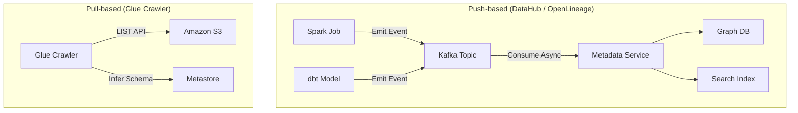

Trong các hệ thống phân tán, định nghĩa "Metadata là dữ liệu về dữ liệu" chỉ đúng bề nổi. Ở quy mô enterprise, **Metadata Management** thực chất là **Control Plane (Mặt phẳng điều khiển)**. Nếu HDFS/S3 là Data Plane chứa dữ liệu vật lý, thì Data Catalog và Metastore là bộ não định tuyến truy vấn, phân quyền, và theo dõi luồng chảy dữ liệu (data lineage).

Khi dữ liệu phình to lên mức Petabyte, hệ thống quản lý metadata chuyển từ một công cụ tra cứu tĩnh sang một hệ thống phân tán phức tạp, đòi hỏi khả năng xử lý hàng triệu sự kiện metadata mỗi ngày. Bài viết này phân tích các kiến trúc thu thập metadata (Push vs Pull), điểm nghẽn kinh điển của Hive Metastore, và sự tiến hóa lên Active Metadata.

## 1. Kiến Trúc Thu Thập: Pull-based vs Push-based

Làm sao để gom technical metadata (schema, column types) và operational metadata (run status, lineage) từ hàng nghìn luồng Airflow, Spark, dbt về một chỗ? Có hai trường phái chính:

### 1.1. Pull-based Architecture (Kiến trúc Kéo)

Đại diện bởi các hệ thống thế hệ đầu như **Amundsen (Lyft)** hoặc **AWS Glue Crawlers**. Một agent/crawler trung tâm sẽ định kỳ (batch) kết nối tới các nguồn (PostgreSQL, Snowflake, S3), quét schema và cập nhật vào Data Catalog.

- **Ưu điểm:** Tách biệt hoàn toàn (Decoupled). Không cần sửa code của Data Pipeline gốc. Dễ dàng cắm vào các hệ thống legacy không hỗ trợ bắn sự kiện.
- **Điểm yếu (Trade-off):** 
  - **Độ trễ cao (Stale data):** Metadata luôn chậm hơn thực tế từ vài giờ đến một ngày.
  - **Overhead hệ thống nguồn:** Chạy crawler trên S3 bucket chứa hàng triệu file Parquet nhỏ sẽ tạo ra bão gọi API (`LIST`, `GET`), dễ dẫn đến việc bị cloud provider bóp băng thông (throttling), ảnh hưởng đến các job khác.

### 1.2. Push-based Architecture (Kiến trúc Đẩy)

Đại diện bởi **DataHub (LinkedIn)** và chuẩn **OpenLineage**. Thay vì chờ bị quét, các Data Pipelines sẽ chủ động phát ra sự kiện metadata (ví dụ: "Job X vừa tạo bảng Y với schema Z") qua Kafka hoặc REST API ngay tại thời điểm runtime.

- **Ưu điểm:** Cập nhật gần thời gian thực (Near real-time). Bắt được chính xác lineage ở cấp độ cột (column-level) vì sự kiện được sinh ra từ chính engine thực thi (Spark, dbt) thay vì phải parse SQL log một cách chắp vá.
- **Điểm yếu (Trade-off):** Mức độ phụ thuộc (Coupling) cao. Bạn phải cài SDK/thư viện vào từng pipeline. Nếu Kafka nhận metadata bị sập, cần có cơ chế failover hoặc Dead Letter Queue để không làm chết lây luồng xử lý dữ liệu chính.

Trong thực tế, các nền tảng như DataHub hỗ trợ kiến trúc Hybrid: dùng Push cho các pipeline cốt lõi (Spark, Flink, Airflow) và Pull cho các hệ thống BI hoặc RDBMS cũ.

## 2. Điểm Nghẽn Kinh Điển: Cú Sập Hive Metastore (HMS)

**Hive Metastore (HMS)** là tiêu chuẩn de-facto của kỷ nguyên Hadoop/Spark. Tuy nhiên, nó mang kiến trúc monolith, lưu metadata trong RDBMS (thường là MySQL/PostgreSQL). 

### OOMKilled & Cascade Timeout
Hãy tưởng tượng một Data Analyst chạy: `SELECT * FROM fact_logs WHERE year = 2023`. Bảng này có dữ liệu 5 năm, partitioned theo `(year, month, day, hour)` — tương đương hàng chục nghìn partition.

Spark Driver phải gọi Thrift API tới HMS để lấy danh sách các file cần đọc:
1. HMS query MySQL, lôi toàn bộ hàng chục nghìn records partition lên RAM.
2. HMS serialize lượng dữ liệu khổng lồ (hàng trăm MB) thành Thrift message trả về.
3. JVM của Spark Driver (hoặc chính HMS) phình to và sập vì **OOM (Out of Memory)**.
4. **Cascade Failure:** Khi HMS bị treo, mọi Spark job khác trong công ty đều bị block ở bước lập kế hoạch truy vấn (Query Planning), dẫn đến sập dây chuyền.

### Cách Các Big Tech Giải Quyết

- **Uber (Federation):** Khi hệ thống phình to lên 350+ PB, Uber không thể dùng một HMS duy nhất. Họ áp dụng **Federation**, chia tách HMS thành nhiều cụm độc lập theo domain.
- **Netflix & Ngành công nghiệp (Open Table Formats):** Iceberg, Delta Lake loại bỏ hoàn toàn sự phụ thuộc vào RDBMS của HMS ở cấp độ partition. Iceberg lưu metadata (manifest files) ngay trên Object Storage, cho phép Spark tính toán metadata song song và phân tán.
- **Databricks:** Chuyển đổi khách hàng từ HMS cục bộ sang **Unity Catalog** — một Control Plane tập trung hỗ trợ đa workspace và lineage tích hợp.

## 3. Quản Trị Bằng Đồ Thị Tri Thức (Knowledge Graph)

Quản lý data lineage bằng các bảng quan hệ (RDBMS) rất tốn kém khi truy vấn đệ quy (Recursive CTE). Khi một Data Engineer cần biết: *"Nếu tôi đổi kiểu dữ liệu cột `user_id`, những Dashboard nào hạ nguồn sẽ vỡ?"*, truy vấn trên MySQL có thể mất vài phút hoặc timeout.

**Netflix** thiết kế **Unified Data Architecture (UDA)** sử dụng abstraction của Graph Database.
- **Node (Đỉnh):** Table, Column, Pipeline, Dashboard, User.
- **Edge (Cạnh):** Tương tác (`Creates`, `Consumes`, `Owns`).

Việc truy vết từ thượng nguồn xuống hạ nguồn trở thành bài toán duyệt đồ thị (Graph Traversal), giúp giảm độ trễ truy vấn lineage xuống mức mili-giây (sub-milliseconds) ngay cả với hàng triệu node.

## 4. Sự Tiến Hóa Lên Active Metadata

Data Catalog truyền thống là **Passive Metadata** (bị động) — một trang web để data engineer vào search tài liệu. Khi quy mô chạm mức hàng vạn bảng, việc kỳ vọng con người vào gán tag bằng tay là bất khả thi.

Ngành data đang dịch chuyển sang **Active Metadata** (chủ động). Tại **Uber**, hệ thống Databook kết hợp với DataK9 để tạo ra vòng lặp tự động:
1. **Phát hiện:** Khi một pipeline mới sinh ra bảng có chứa email khách hàng, engine quét mẫu sẽ nhận diện đây là dữ liệu PII (Personally Identifiable Information).
2. **Kích hoạt:** Databook tự động gắn tag `PII=true` vào metadata.
3. **Thực thi:** Hệ thống bắn webhook sang công cụ quản lý phân quyền (ví dụ: Ranger hoặc AWS Lake Formation), ngay lập tức chặn quyền `SELECT` ở cấp độ cột (Column-level Security) đối với nhân viên không có thẩm quyền.

Không có sự can thiệp thủ công của admin. Metadata điều khiển trực tiếp bảo mật và vận hành.

## 5. Khi Nào Nên Dùng Giải Pháp Nào?

| Kịch bản | Công nghệ phù hợp | Lý do |
| :--- | :--- | :--- |
| **Data Stack vừa/nhỏ, ưu tiên BI** | dbt docs, AWS Glue Catalog | Đơn giản, chi phí bảo trì thấp, không cần duy trì hạ tầng Kafka/Graph. |
| **Lakehouse quy mô lớn, nhiều team** | DataHub, Amundsen | Cần search mạnh mẽ, hỗ trợ nhiều nguồn (Snowflake, Spark, Looker). |
| **Real-time Lineage, Event-driven** | DataHub + OpenLineage | Kiến trúc Push-based giúp phát hiện lỗi vỡ schema ngay lập tức. |
| **Sập HMS liên tục vì OOM** | Apache Iceberg / Delta Lake | Đưa metadata xuống file level, giải phóng tải cho Thrift API. |

## Thuật ngữ chính (Key terms)

| Term | Nghĩa ngắn |
| :--- | :--- |
| **Hive Metastore (HMS)** | Dịch vụ lưu schema/partition mapping cho Hadoop/Spark, thường là nút thắt cổ chai (bottleneck) ở quy mô lớn. |
| **Active Metadata** | Sử dụng metadata để kích hoạt hành động tự động (phân quyền, báo động, scale resource) thay vì chỉ để đọc. |
| **Push-based Ingestion** | Mô hình pipeline chủ động bắn metadata event qua Kafka/API khi có thay đổi. |
| **Data Lineage** | Truy xuất nguồn gốc luồng chảy dữ liệu từ nguồn (source) tới đích (dashboard/model). |

## References

- [DataHub Architecture](https://datahubproject.io/docs/architecture/architecture/) - LinkedIn
- [Databook: Uber’s Unified Portal for Metadata Management](https://eng.uber.com/databook/) - Uber Engineering
- [Netflix Unified Data Architecture](https://netflixtechblog.com/) - Netflix Tech Blog
