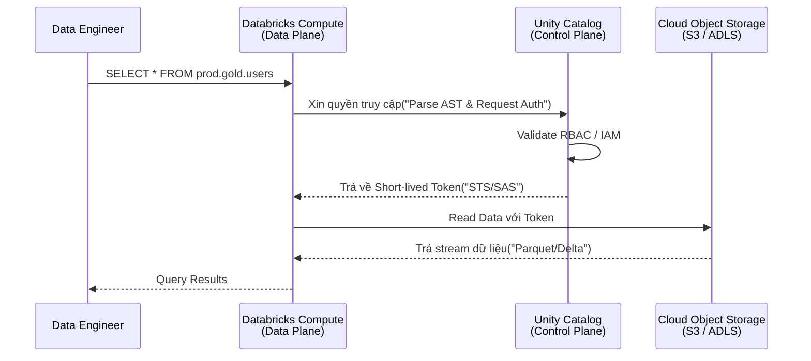

Bỏ qua các định nghĩa mang tính bề nổi, Unity Catalog (UC) dưới góc nhìn kỹ thuật là một **Decoupled Governance Layer** (Lớp quản trị tách rời). Trước UC, nền tảng Databricks bị trói buộc bởi kiến trúc **Workspace-level Isolation**, nơi mỗi Workspace cõng một Hive Metastore (HMS) cục bộ. Điều này dẫn đến sự phân mảnh siêu dữ liệu (Metadata Fragmentation) cực độ khi scale-up hệ thống.

Unity Catalog thay đổi luật chơi bằng cách đẩy Metastore lên tầng **Account-level (Control Plane)**, đóng vai trò như một chốt chặn bảo mật (Security Gateway) duy nhất trước khi bất kỳ Compute Node nào chạm được tới Data Storage. 

---

## 1. Kiến trúc Thực thi Vật lý (Physical Architecture)

Để hiểu UC hoạt động ra sao, chúng ta cần mổ xẻ luồng thực thi của một truy vấn (Query Execution Flow). Unity Catalog không trực tiếp lưu trữ dữ liệu người dùng; nó chỉ quản lý Metadata, Policies và Credentials.

### 1.1. Luồng cấp phép truy cập (Credential Vending Machine)

Khi một Spark SQL Job hoặc Python Script chạy trên Databricks Cluster:

1. **Query Interception**: Engine (Spark/Photon) parse câu query. Thay vì trực tiếp gọi xuống S3/ADLS, nó gửi yêu cầu kiểm tra quyền (Authorization Request) lên Unity Catalog Metastore ở Control Plane.
2. **Policy Evaluation**: UC kiểm tra danh tính người dùng (Identity), đánh giá các quyền `GRANT` (RBAC, RLS, CLS).
3. **Token Vending**: Nếu hợp lệ, UC tạo ra các chứng chỉ tạm thời thời gian ngắn (Short-lived Credentials) — ví dụ: *AWS STS Tokens*, *Azure SAS Tokens*, hoặc *GCP Downscoped Tokens*.
4. **Data Access**: Cluster mang token này xuống Data Plane (Object Storage) để kéo dữ liệu. Hết hạn token, quyền truy cập lập tức bị cắt.



### 1.2. Mô hình 3-Tier Namespace
UC ánh xạ thẳng hệ tư tưởng của RDBMS truyền thống sang Data Lake bằng cấu trúc 3 tầng: `catalog_name.schema_name.table_name`. 
- **Metastore**: Container cao nhất ở cấp Account (Thường là 1 Metastore / 1 Cloud Region để tránh Cross-region Egress Cost).
- **Catalog**: Cấp độ cách ly vật lý. Có thể chia theo môi trường (`dev`, `prod`) hoặc Domain (`marketing`, `finance`).
- **Schema (Database)**: Phân tầng logic bên trong Catalog (theo kiến trúc Medallion: `bronze`, `silver`, `gold`).
- **Object**: Tables, Views, Volumes, Models.

---

## 2. Đánh Đổi Hệ Thống: Managed vs External Tables

Trong thiết kế kiến trúc Dữ liệu, câu hỏi đau đầu nhất khi dùng UC là: "Lưu dữ liệu dưới dạng Managed hay External?". Đây là một Systemic Trade-off kinh điển giữa **Sự tối ưu hóa (Optimization)** và **Quyền kiểm soát (Control)**.

| Tiêu chí | Managed Tables | External Tables |
| :--- | :--- | :--- |
| **Vị trí lưu trữ** | Nằm trong Root Bucket của UC. Bạn không nên can thiệp tay. | Nằm ở bucket riêng (S3/ADLS) do bạn tự quản lý thư mục. |
| **Vòng đời dữ liệu** | Xóa bảng (`DROP TABLE`) -> File vật lý tự động bị xóa sau 30 ngày (Time Travel). | Xóa bảng -> File vật lý **vẫn còn** nguyên trên Cloud. |
| **Tối ưu hóa (Under the hood)** | Tận dụng tối đa **Liquid Clustering**, Auto-compaction, và Predictive I/O. | Phải tự chạy `OPTIMIZE`, `VACUUM` bằng các Cron Jobs. |
| **Vendor Lock-in** | Cao hơn. Data gắn chặt với vòng đời của Databricks. | Thấp. Hệ thống khác (Snowflake, Trino) dễ dàng đọc raw files. |
| **Use Case (Best Practice)** | Các lớp phân tích cuối (Silver/Gold), nơi hiệu năng là vua. | Dữ liệu thô (Bronze), dữ liệu legacy cần chia sẻ cho hệ thống khác. |

> [!WARNING]
> **Real-world Incident: Sập hệ thống vì "DROP TABLE" sai bản chất**
> Một Junior Engineer từng quen dùng External Tables (xóa bảng không mất file), khi chuyển sang Managed Tables đã chạy `DROP TABLE prod.gold.revenue_metrics` để tạo lại bảng. Kết quả: Toàn bộ file Parquet vật lý bị UC đánh dấu Garbage Collection. Rất may, tính năng Time Travel (lưu giữ 30 ngày mặc định của Delta Lake) đã cứu dự án bằng lệnh `RESTORE`.

---

## 3. Show, Don't Tell: Code Thực Chiến

### 3.1. Triển khai Unity Catalog bằng Terraform
Thiết lập UC qua UI (ClickOps) là một Anti-pattern. Dưới đây là cách định nghĩa Infrastructure as Code (IaC) chuẩn mực:

```hcl
# 1. Tạo Storage Credential (IAM Role cho phép UC gọi AWS STS)
resource "databricks_storage_credential" "uc_cred" {
  name = "aws_uc_storage_credential"
  aws_iam_role {
    role_arn = aws_iam_role.databricks_uc_role.arn
  }
}

# 2. Định nghĩa External Location (Chỉ định Bucket nào được dùng)
resource "databricks_external_location" "gold_layer" {
  name            = "s3_gold_layer"
  url             = "s3://my-company-data-lake/gold/"
  credential_name = databricks_storage_credential.uc_cred.id
  comment         = "Lớp dữ liệu Gold cho Analytics"
}

# 3. Gắn quyền truy cập cho Group
resource "databricks_grants" "external_location_grants" {
  external_location = databricks_external_location.gold_layer.id
  grant {
    principal  = "data-engineers-group"
    privileges = ["CREATE_EXTERNAL_TABLE", "READ_FILES", "WRITE_FILES"]
  }
}
```

### 3.2. Cấu hình Row-Level Security (RLS) & Column-Level Security (CLS)
Không cần cấu hình phức tạp ở tầng AWS IAM, Data Engineer giờ đây dùng SQL thuần để chặn đứng các truy vấn vượt quyền. Tính năng Native RLS & CLS trong Unity Catalog hoạt động ở cấp độ engine parsing.

```sql
-- Bước 1: Tạo Filter Function kiểm tra danh tính người chạy
CREATE OR REPLACE FUNCTION dev.security.region_filter(region_col STRING)
RETURN IF(
  is_account_group_member('admin'), true,
  region_col = current_user() -- Giả sử username chứa mã vùng
);

-- Bước 2: Áp dụng RLS Masking vào Bảng
ALTER TABLE prod.gold.sales_data 
SET ROW FILTER dev.security.region_filter ON (region_code);

-- Bước 3: CLS Masking (Che giấu số thẻ tín dụng)
CREATE OR REPLACE FUNCTION dev.security.mask_credit_card(cc_num STRING)
RETURN IF(
  is_account_group_member('finance'), cc_num,
  concat('****-****-****-', right(cc_num, 4))
);

ALTER TABLE prod.gold.sales_data 
ALTER COLUMN credit_card_number SET MASK dev.security.mask_credit_card;
```
*Trade-off*: Khi áp dụng Native RLS/CLS, Engine phải tiêm thêm các `WHERE` clause hoặc `CASE WHEN` ẩn vào Execution Plan (Physical Plan). Điều này tăng độ trễ (Latency) thêm vài mili-giây và có thể phá vỡ một số cơ chế Query Pushdown xuống Parquet files.

---

## 4. Tự Động Hóa Lineage & Sự Cố Vận Hành

Unity Catalog sở hữu một cỗ máy phân tích AST (Abstract Syntax Tree) siêu việt. Bất cứ khi nào bạn chạy một lệnh `CREATE TABLE ... AS SELECT` hoặc Job ETL, engine sẽ bóc tách các DataFrames, SQL AST để tự động vẽ Data Lineage xuống đến mức độ Cột (Column-level).

Tuy nhiên, trong vận hành thực tế (Operational Risks), hệ thống này không phải viên đạn bạc:

1. **Giới hạn External Systems**: Nếu bạn ghi dữ liệu trực tiếp vào S3 thông qua một job AWS Glue hoặc EMR (chạy ngoài Databricks), Unity Catalog bị **mù (blind)**. Lineage sẽ bị đứt gãy. Giải pháp: Sử dụng [Delta Sharing](https://delta.io/sharing/) hoặc gọi UC REST API.
2. **API Rate Limiting (Throttling)**: Như đã đề cập ở kiến trúc vật lý, UC dùng Short-lived Tokens. Trong một Data Pipeline khổng lồ bắn hàng chục nghìn truy vấn song song, quá trình gọi API cấp Token liên tục có thể đụng trần Rate Limit của Cloud Provider (vd: AWS STS `RateExceeded`).
   - *Cách khắc phục*: Tăng kích thước cluster để gom nhóm tác vụ thay vì chạy vô số jobs nhỏ lắt nhắt; Tinh chỉnh lại kiến trúc Micro-batching để giảm tần suất Hit API.

---

## Tổng Kết

Unity Catalog đánh dấu sự kết thúc của kỷ nguyên "Spaghetti Security" (Nơi IAM, RBAC, và Database ACLs xoắn vào nhau). Bằng cách trừu tượng hóa Governance lên tầng Control Plane và sử dụng mã thông báo STS/SAS, Databricks cung cấp một mô hình bảo mật Zero-trust thực sự cho Dữ liệu lớn. Mặc dù đòi hỏi sự khắt khe trong việc thiết kế Catalog/Schema ngay từ ban đầu và sự đánh đổi về Lock-in ở Managed Tables, lợi ích về bảo mật tập trung (Centralized Security) là không thể phủ nhận đối với các hệ thống Enterprise.

## Nguồn Tham Khảo
* [What is Unity Catalog? - Databricks Official Docs](https://docs.databricks.com/en/data-governance/unity-catalog/index.html)
* [Databricks Security and Trust Center](https://www.databricks.com/trust/security)
* [Delta Sharing Open Standard](https://delta.io/sharing/)
* *Designing Data-Intensive Applications* - Martin Kleppmann (Chương thảo luận về Metadata và System Isolation).
* AWS Architecture Blog: [Data Mesh Architecture on AWS](https://aws.amazon.com/blogs/architecture/lets-architect-architecting-a-data-mesh/)
