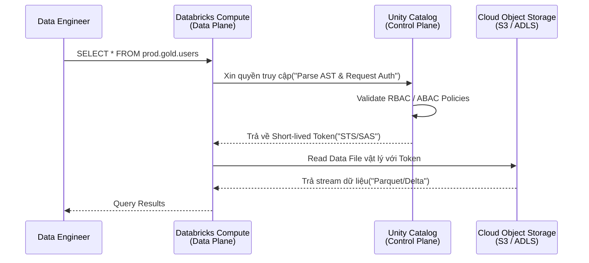

Bỏ qua các định nghĩa mang tính Marketing bề nổi, Unity Catalog (UC) dưới góc nhìn kỹ thuật của một Staff Data Engineer là một **Decoupled Governance Layer** (Lớp quản trị tách rời). Trước khi có UC, nền tảng Databricks bị trói buộc bởi kiến trúc **Workspace-level Isolation** lỗi thời, nơi mỗi Workspace (Môi trường làm việc) phải cõng một Hive Metastore (HMS) cục bộ. Điều này dẫn đến sự phân mảnh siêu dữ liệu (Metadata Fragmentation) cực độ: Workspace của team Marketing không thể nhìn thấy bảng dữ liệu của team Tài chính, và các kỹ sư phải rải các IAM Roles của AWS một cách vô tội vạ.

Unity Catalog thay đổi hoàn toàn luật chơi bằng cách đẩy Metastore lên tầng **Account-level (Control Plane)**, đóng vai trò như một chốt chặn bảo mật (Security Gateway) duy nhất trước khi bất kỳ Compute Node (Máy ảo tính toán) nào chạm được tới Data Storage (S3/ADLS/GCS). 

---

## 1. Kiến trúc Thực thi Vật lý (Physical Architecture)

Để hiểu UC hoạt động ra sao ở mức Low-level, chúng ta cần mổ xẻ luồng thực thi của một truy vấn (Query Execution Flow). Bạn cần nhớ nguyên tắc cốt lõi: **Unity Catalog không trực tiếp lưu trữ dữ liệu Data của bạn; nó chỉ quản lý Metadata, Policies và Credentials (Chứng chỉ).**

### 1.1. Luồng cấp phép truy cập (Credential Vending Machine)

Khi một Spark SQL Job hoặc một script Python chạy trên Databricks Cluster:

1. **Query Interception (Đánh chặn truy vấn)**: Spark/Photon Engine parse (phân tích) câu lệnh SQL. Thay vì trực tiếp gọi API xuống S3/ADLS để đọc File, nó bắt buộc phải gửi yêu cầu kiểm tra quyền (Authorization Request) lên Unity Catalog Metastore nằm ở Control Plane của Databricks.
2. **Policy Evaluation (Đánh giá chính sách)**: UC kiểm tra danh tính người dùng (Identity), đánh giá các quyền truy cập được cấp qua RBAC (Role-based) hoặc ABAC (Attribute-based) và các chính sách bảo mật dòng/cột (RLS/CLS).
3. **Token Vending (Cấp phát Token)**: Nếu truy vấn hợp lệ, UC tạo ra các chứng chỉ tạm thời thời gian ngắn (Short-lived Credentials) — ví dụ: *AWS STS Tokens*, *Azure SAS Tokens*, hoặc *GCP Downscoped Tokens* — chỉ có quyền đọc đúng File Parquet đó trong vòng vài phút.
4. **Data Access (Truy cập dữ liệu)**: Cluster Compute ở Data Plane mang Token này xuống Object Storage để kéo dữ liệu. Khi hết hạn, Token lập tức vô dụng, chặn đứng nguy cơ rò rỉ (Data Leakage).



### 1.2. Mô hình 3-Tier Namespace cho Data Mesh
UC ánh xạ thẳng hệ tư tưởng của RDBMS truyền thống sang Data Lake bằng cấu trúc 3 tầng: `catalog_name.schema_name.table_name`. Kiến trúc này cực kỳ phù hợp cho mô hình **Data Mesh**.

- **Metastore**: Container cao nhất ở cấp Account. (Lưu ý: Chỉ nên tạo 1 Metastore trên 1 Cloud Region để tránh phí Data Transfer liên vùng đắt đỏ).
- **Catalog**: Cấp độ cách ly vật lý. Tại đây bạn chia ranh giới cho Data Mesh: `catalog_marketing`, `catalog_finance`. Mỗi Data Product thuộc về 1 Catalog riêng do Domain Team tự quản lý.
- **Schema (Database)**: Phân tầng logic bên trong Catalog. Thường được chia theo kiến trúc Medallion: `bronze`, `silver`, `gold`.
- **Object**: Tables, Views, Volumes (Chứa file phi cấu trúc như ảnh, video), AI Models.

---

## 2. Đánh Đổi Hệ Thống: Managed Tables vs External Tables

Trong thiết kế kiến trúc Dữ liệu, câu hỏi gây tranh cãi lớn nhất khi dùng UC là: *"Lưu dữ liệu dưới dạng Managed hay External?"*. Đây là một Systemic Trade-off kinh điển giữa **Sự tối ưu hóa [Optimization]** và **Quyền kiểm soát (Control)**.

| Tiêu chí | Managed Tables (Bảng được quản lý) |" External Tables (Bảng ngoại vi) "|
| :--- | :--- | :--- |
| **Vị trí lưu trữ** | Nằm trong Root Bucket của UC. Kỹ sư không nên tự ý vào Bucket này sửa file. |" Nằm ở Bucket riêng (S3/ADLS) do tổ chức bạn tự quản lý thư mục. "|
| **Vòng đời dữ liệu** | Khi chạy lệnh `DROP TABLE`, File vật lý tự động bị UC xóa vĩnh viễn sau 30 ngày (Time Travel retention). | Khi chạy lệnh `DROP TABLE`, UC chỉ xóa siêu dữ liệu. File vật lý **vẫn còn** nguyên vẹn trên Cloud. |
|" **Tối ưu hóa (Under the hood)** "| Tận dụng tối đa công nghệ lõi của Databricks: **Liquid Clustering**, Auto-compaction, và Predictive I/O. | Phải tự chạy thủ công các lệnh `OPTIMIZE`, `VACUUM` bằng các Cron Jobs. |
| **Vendor Lock-in** | Cao hơn. Dữ liệu gắn chặt với vòng đời và hệ sinh thái của Databricks. |" Thấp. Hệ thống khác (Snowflake, Trino, Athena) có thể dễ dàng đọc trực tiếp Raw files. "|
|" **Use Case (Best Practice)** "| Các lớp phân tích cuối (Silver/Gold), nơi hiệu năng truy vấn là ưu tiên số 1. |" Dữ liệu thô (Bronze), dữ liệu Legacy cần chia sẻ cho hệ thống ngoài Databricks. "|

> [!WARNING]
> **Real-world Incident: Sập hệ thống vì lệnh "DROP TABLE" sai bản chất**
> Một Junior Data Engineer từng quen dùng External Tables (Xóa bảng trên UI nhưng không mất file ổ cứng), khi chuyển sang dự án mới dùng Managed Tables, cậu ta đã vô tư chạy `DROP TABLE prod.gold.revenue_metrics` với ý định tạo lại cấu trúc bảng. Kết quả: Toàn bộ file Parquet vật lý bị UC đánh dấu Garbage Collection. Rất may mắn, tính năng Time Travel (Lưu giữ lịch sử 30 ngày mặc định của Delta Lake) đã cứu dự án khỏi thảm họa bằng lệnh `RESTORE`.

---

## 3. Show, Don't Tell: Code Thực Chiến

### 3.1. Triển khai Unity Catalog bằng Terraform
Việc thiết lập UC qua giao diện Web (ClickOps) là một Anti-pattern nghiêm trọng. Dưới đây là cách định nghĩa Infrastructure as Code (IaC) chuẩn mực cho một Staff Engineer, tách biệt rõ ràng quyền truy cập Cloud và Cấu trúc dữ liệu:

```hcl
# 1. Tạo Storage Credential (Tạo IAM Role cho phép UC gọi AWS STS)
resource "databricks_storage_credential" "uc_cred" {
  name = "aws_uc_storage_credential"
  aws_iam_role {
    role_arn = aws_iam_role.databricks_uc_role.arn
  }
}

# 2. Định nghĩa External Location (Chỉ định rõ Bucket S3 nào được phép dùng làm External Table)
resource "databricks_external_location" "gold_layer" {
  name            = "s3_gold_layer"
  url             = "s3://my-company-data-lake/gold/"
  credential_name = databricks_storage_credential.uc_cred.id
  comment         = "Lớp dữ liệu Gold cho hệ thống Analytics"
}

# 3. Gắn quyền truy cập cho Group (Data Engineers)
resource "databricks_grants" "external_location_grants" {
  external_location = databricks_external_location.gold_layer.id
  grant {
    principal  = "data-engineers-group"
    privileges = ["CREATE_EXTERNAL_TABLE", "READ_FILES", "WRITE_FILES"]
  }
}
```

### 3.2. Cấu hình Row-Level Security [RLS] & Column-Level Security (CLS)
Giờ đây, Data Engineer không cần cấu hình vòng vèo ở tầng AWS IAM Policies nữa. Bạn dùng SQL thuần để chặn đứng các truy vấn vượt quyền. Tính năng Native RLS & CLS trong Unity Catalog hỗ trợ **ABAC (Attribute-based access control)** bằng cách kiểm tra linh động (dynamic) nhóm của User hiện tại.

```sql
-- Bước 1: Tạo Filter Function kiểm tra danh tính người chạy truy vấn
CREATE OR REPLACE FUNCTION dev.security.region_filter(region_col STRING)
RETURN IF(
  is_account_group_member('admin'), true,
  region_col = current_user() -- Giả sử username chứa mã vùng, ví dụ 'APAC_User'
);

-- Bước 2: Áp dụng RLS (Row-level) Masking vào Bảng
ALTER TABLE prod.gold.sales_data 
SET ROW FILTER dev.security.region_filter ON (region_code);

-- Bước 3: Áp dụng CLS (Column-level) Masking (Che giấu chuỗi số thẻ tín dụng)
CREATE OR REPLACE FUNCTION dev.security.mask_credit_card(cc_num STRING)
RETURN IF(
  is_account_group_member('finance_team'), cc_num,
  concat('****-****-****-', right(cc_num, 4)) -- Che 12 số đầu nếu không phải team Finance
);

ALTER TABLE prod.gold.sales_data 
ALTER COLUMN credit_card_number SET MASK dev.security.mask_credit_card;
```

*Trade-off (Sự đánh đổi)*: Khi áp dụng Native RLS/CLS, Engine Spark bắt buộc phải tiêm (Inject) thêm các cụm `WHERE` clause hoặc `CASE WHEN` ẩn vào Execution Plan (Physical Plan) lúc Runtime. Điều này làm tăng độ trễ (Latency) thêm vài mili-giây và đôi khi phá vỡ một số cơ chế Query Pushdown xuống tận tầng file Parquet.

---

## 4. Tự Động Hóa Lineage & Nỗi Đau Vận Hành (Operational Risks)

Unity Catalog sở hữu một cỗ máy phân tích AST (Abstract Syntax Tree) cực kỳ thông minh. Bất cứ khi nào bạn chạy một lệnh `CREATE TABLE ... AS SELECT` hoặc một Job PySpark ETL phức tạp, Engine sẽ bóc tách các DataFrames, SQL AST để tự động vẽ ra bản đồ dữ liệu (Data Lineage) xuống tận mức độ Cột (Column-level).

Tuy nhiên, trong vận hành thực tế tại Production, hệ thống này không phải viên đạn bạc (Silver bullet):

1. **Giới hạn External Systems (Hệ thống ngoại lai)**: Nếu bạn ghi dữ liệu trực tiếp vào Bucket S3 thông qua một Job AWS Glue hoặc EMR (Chạy bên ngoài Databricks), Unity Catalog sẽ hoàn toàn **bị mù (Blind)**. Lineage sẽ bị đứt gãy. 
   - *Giải pháp*: Sử dụng giao thức mở [Delta Sharing](https://delta.io/sharing/] để chia sẻ an toàn ra ngoài, hoặc gọi trực tiếp UC REST API để cập nhật Metadata bằng tay.
2. **API Rate Limiting (Throttling)**: Như đã đề cập ở kiến trúc vật lý, UC dùng Short-lived Tokens (STS). Trong một Data Pipeline khổng lồ, khi bạn bắn hàng chục nghìn truy vấn song song (Massive concurrency), quá trình gọi API cấp Token liên tục có thể đụng trần Rate Limit cực nghiêm ngặt của Cloud Provider (Ví dụ lỗi AWS STS `RateExceeded`).
   - *Cách khắc phục*: Thay vì chạy vô số Jobs siêu nhỏ lắt nhắt, hãy tăng kích thước Cluster để gom nhóm tác vụ (Micro-batching) làm giảm tần suất Hit API xin Token.

---

## Tổng Kết

Unity Catalog đánh dấu sự kết thúc của kỷ nguyên "Spaghetti Security" - Nơi các chính sách IAM Role, RBAC, và Database ACLs bị xoắn rối vào nhau không thể Gỡ lỗi [Debug]. Bằng cách trừu tượng hóa Governance lên tầng Control Plane và sử dụng kiến trúc Token, Databricks cung cấp một mô hình bảo mật Zero-trust thực sự cho Dữ liệu lớn, tạo nền móng vững chắc để triển khai kiến trúc Data Mesh. Mặc dù đòi hỏi sự thiết kế chuẩn mực ngay từ ngày 1 và đối mặt với rủi ro Rate Limit, lợi ích về Quản trị tập trung là vô giá đối với Enterprise.

## Nguồn Tham Khảo
1. **Databricks Official Docs**: [What is Unity Catalog?][https://docs.databricks.com/en/data-governance/unity-catalog/index.html]
2. **Open Source Standard**: [Delta Sharing Protocol][https://delta.io/sharing/]
3. **Sách chuyên ngành**: *Designing Data-Intensive Applications* - Martin Kleppmann (Chương thảo luận về Metadata và System Isolation).
4. **AWS Architecture Blog**: [Architecting a Data Mesh on AWS](https://aws.amazon.com/blogs/architecture/lets-architect-architecting-a-data-mesh/]
