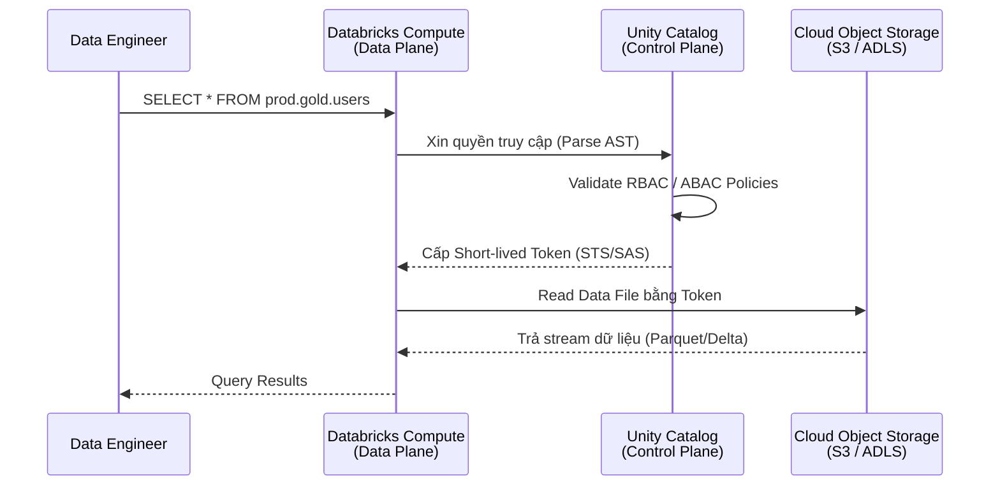

Trước khi có Unity Catalog (UC), Databricks và hệ sinh thái Hadoop thường quản trị siêu dữ liệu (metadata) bằng Hive Metastore (HMS) ở cấp độ từng cụm (cluster) hoặc từng không gian làm việc (workspace). Điều này dẫn đến sự phân mảnh nghiêm trọng: workspace của đội Marketing không thể thấy bảng dữ liệu của đội Tài chính mà không có sự can thiệp thủ công vào IAM (Identity and Access Management) của Cloud.

Unity Catalog thay đổi kiến trúc này bằng cách đẩy Metastore lên tầng **Account-level (Control Plane)**, đặt một lớp quản trị tách rời (Decoupled Governance Layer) trước khi bất kỳ Compute Node nào chạm tới Data Storage. 

## 1. Cơ chế hoạt động: Token Vending Machine

Để hiểu Unity Catalog hoạt động ra sao ở mức low-level, nguyên tắc cốt lõi cần nhớ là: **Unity Catalog không trực tiếp lưu trữ dữ liệu của bạn; nó chỉ quản lý Metadata, Access Policies và Credentials.**

Khi một Spark SQL Job chạy trên Databricks Cluster:

1. **Query Interception**: Spark engine parse câu lệnh SQL (ví dụ: `SELECT * FROM prod.gold.users`). Thay vì gọi trực tiếp API của S3/ADLS, nó gửi yêu cầu cấp quyền (Authorization Request) lên Unity Catalog Metastore nằm ở Control Plane.
2. **Policy Evaluation**: UC kiểm tra danh tính người dùng, đánh giá các quyền (RBAC/ABAC) và các chính sách bảo mật dòng/cột (RLS/CLS).
3. **Token Vending**: Nếu hợp lệ, UC tạo ra chứng chỉ tạm thời thời gian ngắn (Short-lived Credentials) — ví dụ: AWS STS Tokens, Azure SAS Tokens, hoặc GCP Downscoped Tokens — chỉ có quyền đọc chính xác những file Parquet/Delta cần thiết.
4. **Data Access**: Cluster ở Data Plane mang token này xuống Object Storage để kéo dữ liệu. Khi token hết hạn, nó không còn dùng được cho lần đọc mới, giúp giới hạn rủi ro so với credential dài hạn.


*Caption: Luồng thực thi cấp phát chứng chỉ (Token Vending Machine) của Unity Catalog [1].*

## 2. Mô hình 3-Tier Namespace cho Data Mesh

Unity Catalog ánh xạ cấu trúc của RDBMS truyền thống sang Data Lake bằng không gian tên 3 tầng: `catalog_name.schema_name.table_name`. Cấu trúc này hỗ trợ tự nhiên cho kiến trúc [Data Mesh](/concepts/1-distributed-systems-architecture/data-mesh/).

- **Metastore**: Container cao nhất ở cấp Account. (Lưu ý: Thường chỉ tạo 1 Metastore trên 1 Cloud Region để tránh phí Data Transfer liên vùng).
- **Catalog**: Cấp độ cách ly vật lý. Tại đây, ranh giới cho Data Mesh được thiết lập: `sales_catalog`, `marketing_catalog`. Mỗi Data Product thuộc về 1 Catalog riêng do Domain Team tự quản lý.
- **Schema (Database)**: Phân tầng logic bên trong Catalog, thường dùng kiến trúc Medallion: `bronze`, `silver`, `gold`.
- **Object**: Tables, Views, Volumes (quản lý file phi cấu trúc, raw files), và ML Models.

## 3. Đánh đổi hệ thống: Managed vs External Tables

Trong thiết kế nền tảng dữ liệu, quyết định *"Lưu dữ liệu dưới dạng Managed hay External?"* là một trade-off kinh điển giữa **Tối ưu hóa (Optimization)** và **Quyền kiểm soát độc lập (Interoperability)**.

| Tiêu chí | Managed Tables | External Tables |
| :--- | :--- | :--- |
| **Vị trí lưu trữ** | Nằm trong Root Storage của UC. Người dùng không tự ý vào thư mục này sửa file. | Nằm ở Bucket/Container riêng (S3/ADLS/GCS) do tổ chức tự cấu hình đường dẫn. |
| **Vòng đời (Lifecycle)** | Khi chạy `DROP TABLE`, File vật lý tự động bị UC dọn dẹp (Garbage Collection) sau khi Time Travel hết hạn. | Khi chạy `DROP TABLE`, UC chỉ xóa metadata. File vật lý **vẫn còn** nguyên vẹn trên Cloud. |
| **Tối ưu hóa** | Tự động áp dụng Liquid Clustering, Auto-compaction, và Predictive I/O. | Phải tự chạy thủ công hoặc lập lịch các lệnh `OPTIMIZE`, `VACUUM`. |
| **Vendor Lock-in** | Cao hơn. Dữ liệu gắn chặt với vòng đời của Databricks, khó đọc từ engine ngoài nếu không qua Delta Sharing. | Thấp. Các engine khác (Snowflake, Trino, Athena) dễ dàng đọc thẳng Raw files. |
| **Use Case phù hợp** | Lớp phân tích cuối (Silver/Gold), nơi hiệu năng và quản trị là ưu tiên số 1. | Dữ liệu thô (Bronze), dữ liệu legacy hoặc dữ liệu cần engine khác dùng chung trực tiếp. |

> [!WARNING]
> Khi chuyển từ External Tables sang Managed Tables, Data Engineer cần cẩn trọng với lệnh `DROP TABLE`. Một sai lầm phổ biến là dùng `DROP TABLE` để tạo lại cấu trúc thay vì `CREATE OR REPLACE`. Với Managed Tables, hành động này sẽ xóa dữ liệu vật lý và kích hoạt Garbage Collection, đòi hỏi phải dùng tính năng `RESTORE` của Delta Lake nếu lỡ tay.

## 4. RLS, CLS và Nỗi đau Vận hành (Operational Risks)

### RLS và CLS bằng SQL thuần
Thay vì cấu hình phức tạp qua IAM Policies, Data Engineer dùng SQL thuần để chặn đứng các truy vấn vượt quyền. Unity Catalog hỗ trợ Row-Level Security (RLS) và Column-Level Security (CLS) thông qua Dynamic Functions.

```sql
-- Hàm RLS kiểm tra danh tính người chạy truy vấn
CREATE OR REPLACE FUNCTION dev.security.region_filter(region_col STRING)
RETURN IF(
  is_account_group_member('admin'), true,
  region_col = current_user()
);

-- Áp dụng RLS vào Bảng
ALTER TABLE prod.gold.sales_data 
SET ROW FILTER dev.security.region_filter ON (region_code);
```

**Trade-off:** Khi áp dụng RLS/CLS, Spark Engine bắt buộc tiêm thêm các mệnh đề `WHERE` hoặc `CASE WHEN` ẩn vào Execution Plan (Physical Plan) lúc Runtime. Điều này làm tăng độ trễ (latency) khi lập kế hoạch (planning time) và đôi khi phá vỡ các cơ chế tối ưu Query Pushdown xuống tầng file Parquet.

### Rủi ro Rate Limiting (Throttling)
Vì Unity Catalog dùng Short-lived Tokens (ví dụ: AWS STS) cho từng tác vụ đọc dữ liệu, trong một kiến trúc có số lượng job đồng thời quá lớn (Massive Concurrency), quá trình gọi API xin cấp Token liên tục có thể đụng trần Rate Limit của Cloud Provider.
**Cách xử lý:** Thay vì chạy quá nhiều job siêu nhỏ liên tục, hãy nhóm chúng lại (micro-batching), cache token ở driver khi nền tảng cho phép, hoặc thiết kế job có kích thước đủ lớn để giảm tần suất gọi API phân mảnh.

### Giới hạn Data Lineage
Unity Catalog tự động theo dõi Data Lineage đến từng cột bằng cách parse AST của các lệnh SQL/PySpark chạy trong nền tảng. Tuy nhiên, nếu một job ngoại lai (ví dụ: AWS Glue, Airflow KubernetesPodOperator) ghi dữ liệu trực tiếp vào Bucket S3 bỏ qua Databricks, Unity Catalog sẽ **bị mù (blind)** và lineage bị đứt gãy [1].

## Khi nào nên dùng Unity Catalog?
- Khi vận hành kiến trúc Data Mesh cần trung tâm kiểm soát phân quyền (Federated Governance).
- Khi có nhiều workspaces phân tán và cần chia sẻ dữ liệu nội bộ không qua copy (Zero-copy data sharing).
- Khi bảo mật ở mức độ cột (Column) và dòng (Row) là bắt buộc về mặt luật pháp (GDPR, HIPAA).

## Thuật ngữ chính (Key terms)

| Term | Nghĩa ngắn |
| --- | --- |
| Unity Catalog (UC) | Lớp quản trị metadata và access control cấp account của Databricks. |
| External Location | Thông tin định tuyến từ UC xuống một bucket/path lưu trữ vật lý trên Cloud, dùng để tạo External Tables. |
| Managed Table | Bảng mà Databricks toàn quyền quản lý cả metadata lẫn vòng đời (lifecycle) của dữ liệu vật lý. |
| Short-lived Token | Token tạm thời có vòng đời ngắn do UC cấp phát để compute node kéo dữ liệu vật lý, tránh rò rỉ credential gốc. |

## Tài liệu tham khảo
1. Databricks, "What is Unity Catalog?". [Databricks Docs](https://docs.databricks.com/en/data-governance/unity-catalog/index.html).
2. Databricks Engineering Blog, "Data Mesh on Databricks". [Databricks Blog](https://www.databricks.com/blog/2022/10/24/data-mesh-databricks.html).
