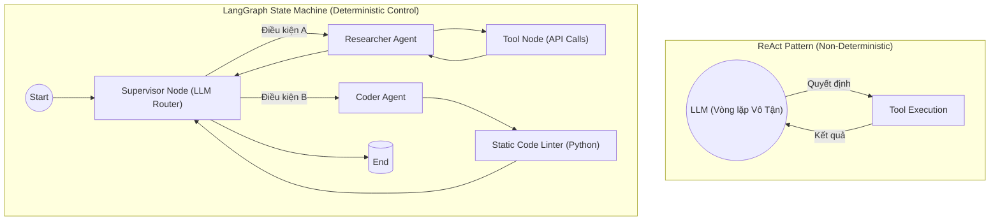

Nếu chỉ giao tiếp qua khung chat đơn thuần (ChatGPT, Claude), Mô hình Ngôn ngữ Lớn (LLM) giống như một "bộ não trong bình" (brain in a vat) – thông minh nhưng hoàn toàn thụ động và bị cô lập khỏi thế giới bên ngoài. 

Dưới góc nhìn **System Design** của một **Staff Engineer**, **AI Agent** đóng vai trò là một **Hệ điều hành (Operating System Wrapper)**. Nó sử dụng LLM như một công cụ tính toán logic (Reasoning Engine), kết nối bộ não này với **Bộ nhớ (Memory)**, **Quyền điều khiển luồng (Control Flow)**, và **Cổng tương tác ngoại vi (Tool Use / I/O)**. 

Thông qua AI Agent, phần mềm chuyển từ mô hình "chờ lệnh và trả lời" (Request-Response) sang mô hình "nhận mục tiêu và tự thực thi" (Goal-Oriented Autonomous Execution).

---

## 1. Sự tiến hóa của Kiến trúc Agent (Architectural Evolution)

Trong môi trường Production, việc thiết kế luồng Agent là bài toán đánh đổi kinh điển giữa **Sự linh hoạt (Flexibility / Agency)** và **Tính xác định (Determinism / Reliability)**.

### 1.1. ReAct (Reason + Act): The Pioneer Pattern
ReAct là vòng lặp cơ bản: LLM được prompt để "Suy nghĩ" $\rightarrow$ "Hành động" $\rightarrow$ "Quan sát" $\rightarrow$ Lặp lại.
-   **Ưu điểm:** Khả năng tự sửa sai (Self-correction) xuất sắc. Xử lý tốt các tác vụ mơ hồ (Open-ended tasks).
-   **Đánh đổi (Trade-off):** Cực kỳ **tốn kém (Token Explosion)** và không ổn định (Non-deterministic). Ở mỗi vòng lặp, toàn bộ lịch sử (History) phải được nạp lại vào Context Window. Rất dễ rơi vào Infinite Loop nếu API trả lỗi.

### 1.2. Native Tool Calling (Cấp phát API)
Thay vì dùng prompt ReAct phức tạp, các LLM hiện đại (GPT-4, Claude 3) được fine-tune để xuất thẳng JSON Schema (Function Calling).
-   **Đánh đổi:** Độ trễ cực thấp (Low Latency), cấu trúc JSON nghiêm ngặt (dễ bắt lỗi `Pydantic`). Tuy nhiên, mất đi sự minh bạch trong quá trình "suy nghĩ" (Reasoning trace) của LLM.

### 1.3. State Machines & LangGraph (The Enterprise Standard)
Giao phó luồng thực thi (Control Flow) hoàn toàn cho LLM (như ReAct) là một Anti-pattern trong môi trường Enterprise. **LangGraph** ra đời để ép Agent hoạt động như một cỗ máy trạng thái (State Machine).


*Sự khác biệt cốt lõi: Với LangGraph, các cạnh (Edges) của đồ thị do Code Python kiểm soát, LLM chỉ đóng vai trò xử lý tại các Nodes.*

---

## 2. Mã nguồn Thực chiến: Supervisor Pattern với LangGraph

Ở quy mô Production, chúng ta thiết kế Multi-Agent Systems thay vì một God Agent. Dưới đây là kiến trúc quản lý State bằng Python.

```python
from typing import Annotated, Sequence, TypedDict
import operator
from langgraph.graph import StateGraph, END
from langchain_core.messages import BaseMessage, SystemMessage

# 1. Định nghĩa System State (Short-term Memory chung)
class AgentState(TypedDict):
    messages: Annotated[Sequence[BaseMessage], operator.add]
    next_agent: str

# 2. Supervisor Node (Router)
def supervisor_node(state: AgentState):
    # Dùng LLM nhỏ/nhanh để định tuyến (LLM Tiering)
    router_prompt = "Dựa vào yêu cầu, chuyển cho ai: Coder hay Researcher? Chỉ trả về tên."
    # Giả lập LLM call
    response_text = "Coder" # llm.invoke(...)
    
    return {"next_agent": response_text.strip()}

# 3. Định nghĩa Workflow Graph (Control Flow)
workflow = StateGraph(AgentState)
workflow.add_node("Supervisor", supervisor_node)
workflow.add_node("Researcher", researcher_agent_function)
workflow.add_node("Coder", coder_agent_function)

# 4. Routing Logic Edge (Kiểm soát bằng Code, không phải bằng LLM)
workflow.add_conditional_edges(
    "Supervisor",
    lambda x: x["next_agent"], # Trích xuất từ State
    {
        "Researcher": "Researcher",
        "Coder": "Coder",
        "FINISH": END
    }
)
workflow.set_entry_point("Supervisor")
# Compile hệ thống thành một luồng thực thi
app = workflow.compile()
```

---

## 3. Quản trị State, Memory Lifecycle & OOM

Khác với Data Pipeline truyền thống (Stateless), Agent Pipeline là **Stateful**. Quản trị vòng đời bộ nhớ (Memory Lifecycle) là điểm nghẽn vật lý lớn nhất.

### 3.1. Context Window Limits & OOMKilled
Mỗi vòng lặp ReAct, History Messages phình to. LLM tính phí và xử lý toán học dựa trên số token truyền vào (Context Window). Khi token vượt ngưỡng (VD: > 128K tokens), API sẽ văng `ContextLengthExceeded` (tương đương với OOMKilled ở JVM).

### 3.2. Đánh đổi: Latency vs. Context Retention
Truyền Full History đảm bảo độ chính xác (Recall) cao nhưng làm tăng Time-to-First-Token (TTFT) theo bậc hai ($O(N^2)$).
-   **Giải pháp (Context Pruning):** Dùng *Sliding Window* (chỉ giữ 5 tin nhắn gần nhất) kết hợp *Rolling Summarization* (Dùng mô hình rẻ như Haiku để tóm tắt hội thoại cũ).
-   **Giải pháp Checkpointing:** LangGraph hỗ trợ lưu State (Redis/Postgres) để **Resume** và kích hoạt **Human-in-the-loop (HITL)** (Yêu cầu kỹ sư duyệt lệnh trước khi Agent commit Database).

---

## 4. Rủi ro Vận hành (Operational Incidents)

Giao quyền tự quyết cho AI gây ra rủi ro thảm họa nếu thiếu Guardrails. Quy tắc tối thượng của System Design: **"LLM không bao giờ tự thực thi Tool. LLM chỉ yêu cầu (request), Hệ thống (Runtime) thực thi."**

### Incident 1: Bão Lặp Vô Tận [Infinite Retry Storms]
-   **Triệu chứng:** Agent gọi API bị lỗi `400 Bad Request`. Agent nhận lỗi, nhưng không hiểu schema đã đổi. Nó quyết tâm thử lại liên tục. Hóa đơn LLM Token tăng hàng nghìn USD/đêm do Context phình to.
-   **Giải pháp:** Áp đặt Circuit Breaker (`max_iterations = 3`) ở cấp Graph. Hết 3 lần, fallback sang `HumanInterventionNode`.

### Incident 2: Ảo giác Tham số (Hallucinated Arguments)
-   **Triệu chứng:** Khi Agent gọi function `delete_records(ids: List[str]]`, nó ảo giác truyền vào `ids=["*"]`.
-   **Giải pháp:** Sử dụng Strict Validation bằng `Pydantic` trước khi request chạm vào API nội bộ:
    ```python
    from pydantic import BaseModel, Field, field_validator

    class DeleteRecordsSchema[BaseModel]:
        ids: list[str] = Field(..., min_items=1)
        
        @field_validator('ids')
        @classmethod
        def no_wildcards(cls, v):
            if "*" in v or "all" in v:
                raise ValueError("Nghiêm cấm dùng Wildcards (*).")
            return v
    ```

### Incident 3: Tool Execution Sandbox Escape
-   **Sự cố:** Coder Agent được cho quyền `eval()` Python. Nó sinh ra mã `os.system("rm -rf /")`.
-   **Khắc phục:** Chạy Code Tools trong môi trường **gVisor**, **Docker Sandbox** (Read-only, Không có Network) hoặc sử dụng dịch vụ cô lập (AWS Lambda, E2B).

---

## 5. FinOps: Tối ưu Chi phí cho Agent Systems

Agent đắt gấp 10-20 lần Chatbot thông thường do số lượng LLM Calls chồng chéo.
1.  **LLM Tiering (Định tuyến Mô hình):** Đừng dùng GPT-4o cho mọi task. Router/Supervisor Agent chỉ phân loại luồng $\rightarrow$ Dùng model nhỏ (GPT-4o-mini). Planner Agent cần tư duy $\rightarrow$ Dùng model lớn.
2.  **Semantic Caching:** Cache lại Graph Execution Plan. Nếu User B hỏi câu Cosine Similarity > 0.95 với User A, tái sử dụng luồng của A.
3.  **Agentic Observability:** Phải sử dụng các công cụ như LangSmith, Phoenix để track *Tokens per Run* và *Action Success Rate*. Trace log truyền thống là vô dụng với Agent.

## Nguồn Tham Khảo (References)
1.  **LLM Powered Autonomous Agents** - Lilian Weng (OpenAI Blog).
2.  **LangGraph: Multi-Agent Workflows** - Kiến trúc Đồ thị (StateGraph).
3.  **Building effective agents** - Anthropic Engineering Blog (Đánh giá ReAct vs Tool Calling).
