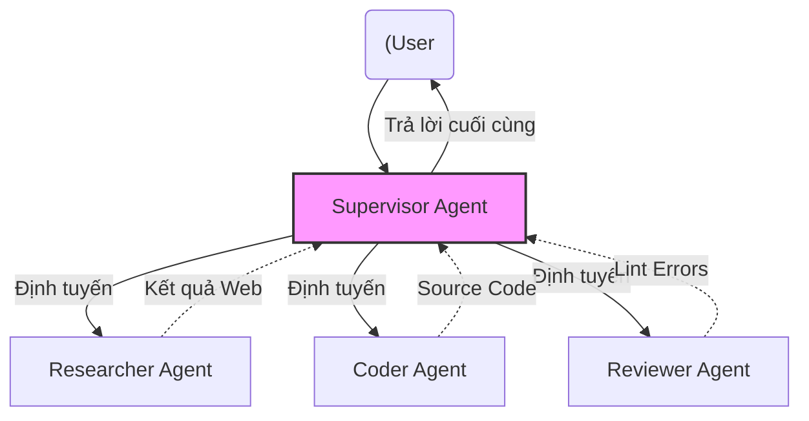

Nếu chỉ giao tiếp qua khung chat đơn thuần (ChatGPT, Claude), Mô hình Ngôn ngữ Lớn (LLM) giống như một "bộ não trong bình" (brain in a vat) – thông minh nhưng hoàn toàn thụ động và bị cô lập khỏi thế giới bên ngoài. 

Dưới góc nhìn System Design, **AI Agent** đóng vai trò là một **vỏ bọc hệ điều hành (Operating System Wrapper)**. Nó sử dụng LLM như một công cụ tính toán logic (Reasoning Engine) trung tâm, kết nối bộ não này với **Bộ nhớ (Memory)**, **Quyền điều khiển luồng (Control Flow/Planning)**, và **Cổng tương tác ngoại vi (Tool Use / I/O)**. Thông qua AI Agent, phần mềm chuyển từ mô hình "chờ lệnh và trả lời" (Request-Response) sang mô hình "nhận mục tiêu và tự thực thi" (Goal-Oriented Autonomous Execution).

---

## 1. Kiến trúc Cốt lõi của một Agent (The Core Architecture)

Kiến trúc Agent kinh điển được định hình rõ nét nhất qua bài viết nền tảng của Lilian Weng (OpenAI). Một Agent độc lập hoạt động dựa trên 4 phân hệ vật lý/logic:


*Nguồn: Lilian Weng (2023) - Các thành phần cốt lõi của LLM-powered Autonomous Agent.*

1. **Reasoning Engine (LLM):** Xử lý ngữ nghĩa, phân tích ý định (intent parsing) và quyết định luồng đi.
2. **Planning & Orchestration:** 
   - **Task Decomposition:** Phân rã mục tiêu lớn thành chuỗi đồ thị phụ thuộc (DAG) các task nhỏ.
   - **ReAct (Reasoning and Acting):** Vòng lặp `Thought -> Action -> Observation` liên tục để tự sửa sai (Self-correction).
3. **Memory System:**
   - **Short-term Memory (In-context learning):** Trạng thái luồng thực thi (State) hiện tại, lưu trong Context Window giới hạn của LLM.
   - **Long-term Memory:** Hạ tầng lưu trữ bền vững bên ngoài (Vector Databases như Qdrant, Milvus hoặc Graph Database) để gọi RAG khi cần nhớ lại thông tin quá khứ.
4. **Tool Use / Actions:** Các API, Python REPL Sandboxes, Web Crawlers. Dưới góc độ hệ thống, đây là các HTTP/gRPC client được LLM gọi thông qua cơ chế *Function Calling* (trả về JSON payload có cấu trúc).

---

## 2. Multi-Agent Systems & Orchestration Patterns

Đưa một Agent khổng lồ vào Production (God Agent) là một thảm họa System Design. Nó giống như Monolithic Architecture: Agent dễ bị "ảo giác" (Hallucinations), tràn Context Window, và cực kỳ khó debug. Thay vào đó, ngành Data/Software Engineering chuyển sang **Multi-Agent Systems (Micro-agents)**.

Các Pattern định tuyến đa tác nhân phổ biến:

### 2.1. Sequential Pipeline (DAG Pattern)
Luồng đi 1 chiều: Agent A thu thập dữ liệu -> Agent B viết code -> Agent C kiểm thử. Dễ scale, dễ track state, nhưng thiếu tính linh hoạt (không có vòng lặp).

### 2.2. Hierarchical / Supervisor Routing
Sử dụng một LLM mạnh làm Router (Supervisor) để phân phối task xuống cho các "Worker Agents" chuyên biệt.



### 2.3. Mã nguồn Thực chiến: Supervisor Pattern với LangGraph

Dưới đây là kiến trúc Graph State quản lý trạng thái của các Agent bằng Python và LangGraph. Ở quy mô Production, chúng ta **không** truyền toàn bộ hội thoại cho mọi Agent, mà chỉ truyền các `State` (trạng thái hệ thống) cần thiết.

```python
from typing import Annotated, Sequence, TypedDict
import operator
from langgraph.graph import StateGraph, END
from langchain_core.messages import BaseMessage

# 1. Định nghĩa System State (Nơi lưu trữ Short-term Memory chung)
class AgentState(TypedDict):
    messages: Annotated[Sequence[BaseMessage], operator.add]
    next_agent: str
    intermediate_data: dict

# 2. Định nghĩa Supervisor Node (Router)
def supervisor_node(state: AgentState):
    # LLM quyết định ai sẽ làm tiếp theo dựa trên messages gần nhất
    router_prompt = f"Ai nên xử lý tiếp theo: Coder hay Researcher? (Trả về Tên)"
    response = llm.invoke([SystemMessage(content=router_prompt)] + state["messages"])
    
    return {"next_agent": response.content.strip()}

# 3. Định nghĩa Workflow Graph (Control Flow)
workflow = StateGraph(AgentState)
workflow.add_node("Supervisor", supervisor_node)
workflow.add_node("Researcher", researcher_agent)
workflow.add_node("Coder", coder_agent)

# Routing Logic Edge
workflow.add_conditional_edges(
    "Supervisor",
    lambda x: x["next_agent"], # Trích xuất tên Agent từ State
    {
        "Researcher": "Researcher",
        "Coder": "Coder",
        "FINISH": END
    }
)
workflow.set_entry_point("Supervisor")
app = workflow.compile()
```

---

## 3. Quản trị State, Memory Lifecycle & Trade-offs

Khác với Data Pipeline truyền thống (Stateless), Agentic Pipeline là **Stateful**. Quản trị vòng đời bộ nhớ (Memory Lifecycle) là điểm nghẽn vật lý lớn nhất.

### 3.1. Vấn đề: Context Window Limits & OOMKilled
Mỗi khi Agent chạy vòng lặp ReAct, History Messages to dần lên. LLM tính phí và xử lý toán học dựa trên số token truyền vào (Context Window). Khi token vượt ngưỡng (VD: > 128K tokens cho GPT-4o), API sẽ văng lỗi `RateLimitError` hoặc `ContextLengthExceeded` (tương đương với Out of Memory - OOMKilled ở JVM).

### 3.2. Đánh đổi Hệ thống (Systemic Trade-offs)
*   **Latency vs. Context Retention:** Truyền toàn bộ lịch sử (Full History) đảm bảo độ chính xác cao nhưng làm tăng Time-to-First-Token (TTFT) theo cấp số nhân và chi phí cắt cổ.
*   **Giải pháp (Context Pruning & Checkpointing):**
    Sử dụng kỹ thuật *Sliding Window* (chỉ giữ $N$ tin nhắn gần nhất) kết hợp *Rolling Summarization* (Dùng mô hình nhỏ gọn như Claude 3.5 Haiku để tóm tắt các hội thoại cũ và lưu dưới dạng chuỗi cô đọng).
    Trong LangGraph, ta sử dụng cơ chế `checkpointer` (ví dụ lưu State vào Redis hoặc Postgres) để cho phép **Human-in-the-loop (HITL)** và khôi phục (Resume) thay vì chạy lại từ đầu khi crash.

---

## 4. Rủi ro Vận hành và Sự cố Thực tế (Operational Incidents)

Giao quyền tự quyết cho AI gây ra những rủi ro thảm họa nếu không có Guardrails (Rào chắn) vật lý ở mức hạ tầng.

### Incident 1: Infinite Retry Storms (Bão Lặp Vô Tận)
*   **Triệu chứng:** Agent gọi một API truy vấn Database bị lỗi `400 Bad Request`. Agent nhận được lỗi, nhưng không đủ thông minh để biết API schema đã đổi. Nó quyết tâm gọi đi gọi lại hàng trăm lần bằng đủ các tham số bịa đặt.
*   **Hậu quả:** API Provider khóa IP, hóa đơn LLM Token tăng vọt lên hàng nghìn USD chỉ trong 1 đêm do Context ngày càng phình to ở mỗi vòng lặp.
*   **Giải pháp Hệ thống:** 
    1. Áp đặt `max_iterations = 5` tại cấp độ Graph Orchestrator.
    2. Cấu hình **Circuit Breaker**: Sau 3 lần lỗi API liên tiếp, buộc luồng chuyển sang `HumanFallbackNode` để con người can thiệp.

### Incident 2: Hallucinated Arguments (Ảo giác Tham số Chết người)
*   **Triệu chứng:** Khi Agent gọi function `delete_records(ids: List[str])`, nó tự ảo giác truyền vào `ids=["*"]` vì nghĩ rằng thao tác này hợp lệ theo thói quen Bash shell.
*   **Giải pháp Hệ thống:** 
    Bắt buộc sử dụng Strict Typed Validation. Ví dụ cấu hình `Pydantic` schema khắt khe trước khi request thực sự rời khỏi Agent tới System API:
    ```python
    from pydantic import BaseModel, Field, field_validator

    class DeleteRecordsSchema(BaseModel):
        ids: list[str] = Field(..., min_items=1)
        
        @field_validator('ids')
        @classmethod
        def no_wildcards(cls, v):
            if "*" in v or "all" in v:
                raise ValueError("Wildcards are strictly prohibited in IDs.")
            return v
    ```

### Incident 3: Tool Execution Sandbox Escape
*   **Triệu chứng:** Coder Agent được cung cấp quyền thực thi Python code bằng hàm `eval()` hoặc subprocess để test tính năng. Agent sinh ra mã có chứa `os.system("rm -rf /")`.
*   **Giải pháp Hệ thống:** Chạy Code Execution Tools trong các môi trường **gVisor**, **Docker Sandbox** (không có network access, read-only file systems) hoặc sử dụng các dịch vụ cô lập như AWS Lambda, E2B (e2b.dev).

---

## 5. FinOps: Tối ưu Chi phí cho Agentic Systems

Kiến trúc AI Agent cực kỳ tốn kém vì số lượng lệnh gọi inference (API calls) có thể gấp 10-20 lần so với mô hình Chatbot 1-turn.

1. **LLM Tiering (Định tuyến Mô hình):**
   - Đừng dùng GPT-4o / Claude 3.5 Sonnet cho mọi tác vụ. 
   - **Router/Supervisor Agent:** Dùng mô hình cực nhanh, rẻ (VD: GPT-4o-mini, Claude 3.5 Haiku, Llama-3-8B) vì tác vụ phân loại (classification) rất đơn giản.
   - **Reasoning/Planning Agent:** Dùng mô hình đắt tiền.
2. **Semantic Caching:**
   - Sử dụng Redis, Momento hoặc các Vector DB kết hợp để cache. Nếu Input Intent tương tự (khoảng cách Cosine Similarity > 0.95), trả về cấu trúc Graph execution plan đã lưu từ trước thay vì yêu cầu LLM lập kế hoạch lại từ đầu.
3. **Tracking Metrics:**
   - Trong DataOps, chúng ta theo dõi Bytes Processed. Trong AgentOps, phải giám sát các metrics cốt lõi: *Tokens per Run*, *Action Success Rate*, *Graph Depth* (Số lần chuyển Node). Sử dụng các công cụ Observability như LangSmith, Phoenix (Arize), hoặc Datadog LLM Observability.

---

## 6. Nguồn Tham Khảo (References)

*   **LLM Powered Autonomous Agents** - Lilian Weng, OpenAI Blog. [Link](https://lilianweng.github.io/posts/2023-06-23-agent/)
*   **LangGraph: Multi-Agent Workflows** - LangChain Docs. [Link](https://python.langchain.com/docs/langgraph/)
*   **Building effective agents** - Anthropic Engineering Blog. [Link](https://www.anthropic.com/research/building-effective-agents)
*   **Multi-Agent Orchestration Patterns** - AWS Architecture Blog. [Link](https://aws.amazon.com/blogs/architecture/)
*   **Designing Data-Intensive Applications** - Martin Kleppmann (Phần liên quan đến State Management & Fault Tolerance trong Hệ thống phân tán).
