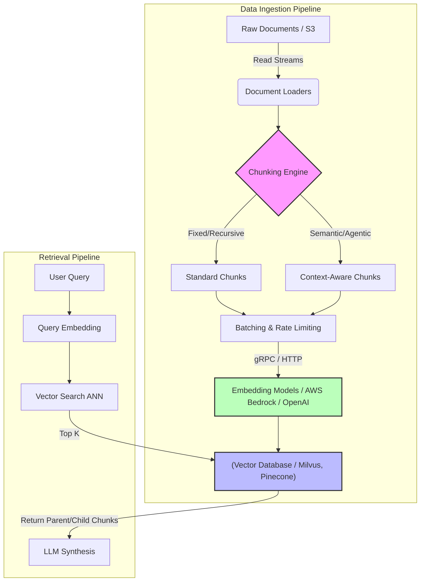

Trong các hệ thống Retrieval-Augmented Generation (RAG) quy mô doanh nghiệp, **Chunking (Phân tách văn bản)** không chỉ là bước tiền xử lý NLP đơn thuần. Dưới góc độ System Design, Chunking là bài toán đánh đổi trực tiếp giữa **Độ trễ (Latency)**, **Thông lượng (Throughput)**, **Chi phí (FinOps)** và **Độ chính xác (Accuracy)** của toàn bộ pipeline Ingestion và Retrieval.

Việc thiết kế sai chiến lược Chunking có thể dẫn đến các sự cố nghiêm trọng như cạn kiệt bộ nhớ (OOM) trong Vector DB, API Throttling từ các nhà cung cấp LLM, hoặc chi phí phình to do Context Window quá tải.

---

## 1. Kiến trúc Thực thi Vật lý (Physical Execution Architecture)

Quá trình Chunking xảy ra ở giai đoạn **Data Ingestion** của RAG pipeline. Dữ liệu thô từ Data Lake/Warehouse sẽ đi qua Text Splitter, Embedding Model trước khi được ghi (Write) vào Vector Database.


Để minh họa sâu hơn luồng xử lý vật lý và các nút thắt cổ chai (bottlenecks), hãy xem xét sơ đồ dưới đây:



### Đánh đổi Cốt lõi (Systemic Trade-offs)
* **Chunk Size Lớn:** Tối ưu hóa **Throughput** khi ghi vào Vector DB, giữ context tốt hơn. Đánh đổi: **Latency** tăng khi generate embedding, tăng rủi ro tràn Context Window của LLM lúc retrieve, chi phí inference cao.
* **Chunk Size Nhỏ:** Giảm chi phí token cho mỗi query, độ nhạy (Recall) cao cho các truy vấn Factoid. Đánh đổi: Mất ngữ nghĩa tổng thể (Orphaned context), gây ra hiện tượng *Cartesian Explosion* (số lượng vector quá lớn) làm tăng chi phí RAM/Storage trên Vector DB.

---

## 2. Các Chiến lược Chunking Thực chiến

Lựa chọn thuật toán cắt chunk phụ thuộc trực tiếp vào loại dữ liệu và ràng buộc về Compute/Storage.

### 2.1. Heuristic-Based Chunking (Fixed-size & Recursive)
* **Cơ chế:** Dựa trên số lượng Token/Ký tự và các dấu phân cách tĩnh (`\n\n`, `.`).
* **Ưu điểm:** Độ phức tạp tính toán $O(N)$. Cực kỳ nhanh, không tốn chi phí gọi LLM hoặc embedding ở bước cắt. Stream-processing thân thiện.
* **Nhược điểm:** Phá vỡ ranh giới ngữ nghĩa.
* **Được dùng ở:** Baseline systems, log parsing, tabular data serialization.

### 2.2. Structural / Syntax-Aware Chunking
* **Cơ chế:** AST (Abstract Syntax Tree) Parsing cho Source Code, DOM Parsing cho HTML, hoặc Markdown Header splitting.
* **Ví dụ:** Cắt một file Python, đảm bảo toàn bộ block `def...` hoặc `class...` nằm gọn trong 1 chunk.
* **Ưu điểm:** Giữ nguyên tính toàn vẹn (Integrity) của Code và Document schema.
* **Nhược điểm:** Cần CPU-intensive parsers. Mất cân bằng kích thước chunk nặng nề (Data Skew).

### 2.3. Semantic Chunking (Phân tách Ngữ nghĩa)
* **Cơ chế:** So sánh Cosine Similarity của vector nhúng giữa các câu liên tiếp. Nếu độ tương đồng tụt xuống dưới ngưỡng (Threshold), hệ thống sẽ tách chunk.
* **System Design Trade-off:** Rất nặng về I/O và Compute. Thay vì gọi API Embedding 1 lần cho cả cụm lớn, bạn phải nhúng TỪNG câu để tìm điểm cắt. 
* **Tối ưu:** Cần chạy các mô hình nhúng siêu nhẹ (vd: `all-MiniLM-L6-v2`) cục bộ (Local Compute) trên CPU hoặc GPU nhỏ trước khi nhúng chunk cuối cùng bằng các mô hình xịn (vd: `text-embedding-3-large`).

### 2.4. Agentic / Hierarchical Chunking (Parent-Child)
* **Cơ chế:** Lưu trữ metadata theo cấu trúc cây. Cắt văn bản thành các Node nhỏ (Child) để tìm kiếm (tối ưu Precision), nhưng khi context được nạp vào LLM, hệ thống truy xuất Node cha (Parent) bao bọc Node con đó (tối ưu Context).
* **Kiến trúc dữ liệu:** Yêu cầu một **Document Store** (như DynamoDB hoặc MongoDB) chạy song song với **Vector DB**. Vector DB chỉ chứa UUID của Parent Node.

---

## 3. Rủi ro Vận hành và Tối ưu Chi phí (FinOps)

Là Data Engineer, bạn không chỉ code thuật toán mà phải đối phó với hệ thống khi tải nặng.

### 3.1. API Throttling & Retry Storms
Khi chạy Ingestion pipeline hàng triệu tài liệu, việc tạo chunk và nạp vào Embedding API (OpenAI/AWS Bedrock) rất dễ dính lỗi `HTTP 429 Too Many Requests`.
* **Sự cố thực tế:** Nếu pipeline không thiết kế cơ chế Exponential Backoff có jitter, hàng nghìn worker sẽ đồng loạt gửi lại request (Retry Storm), làm treo luôn gateway hoặc bị khóa API Key.
* **Giải pháp:** Sử dụng Queue (Kafka/SQS) cho Ingestion, cấu hình rate limit ở worker, và dùng thư viện như `tenacity`.

### 3.2. OOMKilled & Vector Database Fragmentation
* **Sự cố:** Cấu hình Chunk Size quá nhỏ (ví dụ 50 tokens) cho một dataset 1TB sẽ đẻ ra hàng tỷ vectors. Các Vector DB in-memory (như Redis, Qdrant, Milvus) sẽ tiêu thụ RAM đột biến cho hệ thống Indexing (như HNSW), dẫn đến tiến trình bị kernel kill (`OOMKilled`).
* **Khắc phục:** 
  1. Nâng Chunk Size lên điểm "Sweet spot" (thường ~500-1000 tokens).
  2. Bật tính năng Scalar Quantization hoặc Product Quantization (PQ) trên Vector DB để nén vector.
  3. Dùng kiến trúc tràn đĩa cứng (Spill-to-disk / DiskANN).

### 3.3. Tối ưu FinOps
Việc sử dụng *Semantic Chunking* có thể đẩy chi phí Ingestion lên 10x so với *Recursive Chunking*.
* Đưa các model Embedding nhỏ vào cụm Kubernetes nội bộ để cắt ngữ nghĩa (Local Inference).
* Áp dụng thuật toán CDC (Change Data Capture) để chỉ nhúng (embed) lại các chunk có sự thay đổi, thay vì nhúng lại toàn bộ database khi sync.

---

## 4. Code Thực chiến (Executable Code)

Dưới đây là một Python pipeline chuẩn mực production để xử lý Ingestion. Pipeline sử dụng `RecursiveCharacterTextSplitter`, kết hợp với cơ chế Rate Limiting, Exponential Backoff (chống Retry Storms) qua `tenacity`, và gộp Batch để tối ưu I/O.

```python
import os
from typing import List
from tenacity import retry, wait_random_exponential, stop_after_attempt
from langchain_text_splitters import RecursiveCharacterTextSplitter
from langchain_openai import OpenAIEmbeddings

# Thiết lập Splitting Strategy phù hợp với Data Engineering
# Chunk size 1000 đảm bảo độ nén tốt, giảm Cartesian Explosion cho Vector DB
text_splitter = RecursiveCharacterTextSplitter(
    chunk_size=1000,
    chunk_overlap=150,
    length_function=len,
    is_separator_regex=False,
)

# Khởi tạo mô hình Embedding
# Cần cấu hình max_retries bên trong nhưng ta bọc thêm tenacity ở ngoài cho chắc chắn
embeddings_model = OpenAIEmbeddings(
    model="text-embedding-3-small", 
    max_retries=3
)

@retry(
    wait=wait_random_exponential(multiplier=1, max=60), 
    stop=stop_after_attempt(5),
    reraise=True
)
def embed_batch_with_retry(texts: List[str]) -> List[List[float]]:
    """
    Hàm gọi API Embedding có trang bị Exponential Backoff + Jitter 
    để chống Retry Storms và API Throttling (HTTP 429).
    """
    return embeddings_model.embed_documents(texts)

def production_ingestion_pipeline(raw_documents: List[str], batch_size: int = 100):
    """
    Batch processing pipeline tối ưu I/O memory footprint (chống OOM).
    """
    # 1. Cắt Chunk
    all_chunks = []
    for doc in raw_documents:
        all_chunks.extend(text_splitter.split_text(doc))
        
    print(f"Total chunks created: {len(all_chunks)}")
    
    # 2. Batching & Embedding để tránh gửi payload quá lớn làm rớt HTTP request
    vectors = []
    for i in range(0, len(all_chunks), batch_size):
        batch = all_chunks[i : i + batch_size]
        try:
            batch_embeddings = embed_batch_with_retry(batch)
            vectors.extend(batch_embeddings)
            print(f"Successfully embedded batch {i//batch_size + 1}")
        except Exception as e:
            print(f"Failed to embed batch {i//batch_size + 1}: {str(e)}")
            # Log vào Dead Letter Queue (DLQ) trong thực tế
            
    return all_chunks, vectors

# ----- TEST THE PIPELINE -----
if __name__ == "__main__":
    # Đọc dữ liệu lớn (Mô phỏng 1 Document dài)
    sample_doc = "Sự cố OOMKilled thường xảy ra khi Vector DB... " * 500
    
    # Xử lý Ingestion an toàn
    chunks, vectors = production_ingestion_pipeline([sample_doc], batch_size=50)
    print(f"Generated {len(vectors)} vectors ready for Milvus/Pinecone.")
```

---

## 5. Nguồn Tham Khảo (References)
* **Pinecone Engineering Blog**: [Chunking Strategies for LLM Applications](https://www.pinecone.io/learn/chunking-strategies/) - Nền tảng lý thuyết về Fixed-size và Semantic chunking.
* **Databricks Engineering**: Khảo sát chiến lược đánh giá RAG Ingestion Pipeline cho doanh nghiệp.
* **AWS Architecture Blog**: [Build accurate and scalable RAG applications with Amazon Bedrock Knowledge Bases](https://aws.amazon.com/blogs/machine-learning/build-accurate-and-scalable-rag-applications-with-amazon-bedrock-knowledge-bases/) - Giải pháp Hierarchical Chunking.
* **Designing Data-Intensive Applications (Martin Kleppmann)** - Cấu trúc dữ liệu và xử lý I/O Batches.
