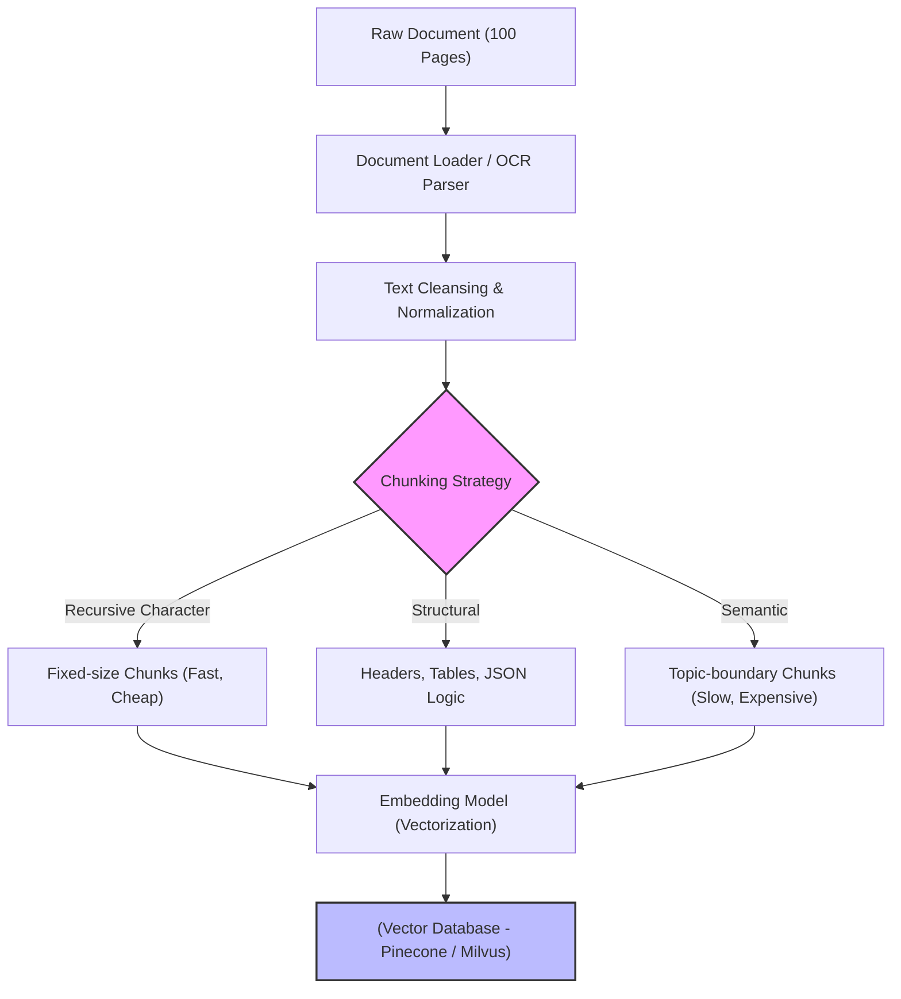

Trong các hệ thống Retrieval-Augmented Generation (RAG) cấp độ Enterprise, **Chunking** không chỉ đơn thuần là việc gọi một hàm `text.split()` ngây ngô. Nó là một bài toán **Kiến trúc Hệ thống (System Architecture)** quyết định trực tiếp đến sự sống còn của toàn bộ RAG Pipeline.

Nếu bạn cắt văn bản quá to, LLM sẽ bị hội chứng *"Lost in the middle"* (Quên thông tin ở giữa). Nếu bạn cắt quá nhỏ, LLM sẽ bị "Ảo giác" (Hallucinate) do mất ngữ cảnh (Context Fragmentation). Hơn nữa, nếu áp dụng các thuật toán cắt thông minh (Semantic Chunking) một cách mù quáng, Data Ingestion Pipeline của bạn sẽ bị sập vì Rate Limit và hóa đơn API (FinOps) sẽ tăng vọt hàng ngàn đô la.

Bài viết này phân tích Chunking dưới góc độ System Design: Cơ chế vật lý, các trường phái chia tách, và cách các kỹ sư giải quyết sự cố trên Production.

---

## 1. Bản chất Vật lý của Chunking

Khi một tài liệu khổng lồ (PDF tài chính 1000 trang, hoặc HTML Document) đi vào hệ thống, nó không thể được nhồi thẳng vào Vector Database. 
Lý do nằm ở giới hạn vật lý của **Embedding Models** (như `text-embedding-3-small` của OpenAI hay họ `BGE`). Các mô hình này thường chỉ biểu diễn tốt nhất (có độ tụ nghĩa cao) với các đoạn văn bản dài từ 256 đến 8191 tokens. Nếu nhồi quá nhiều chữ, Vector 1536-chiều sẽ bị "Pha loãng" (Diluted), dẫn đến độ chính xác khi Search (Cosine Similarity) giảm thê thảm.

Dưới nền tảng vật lý, Chunking là quá trình trượt một Cửa sổ (Window) qua cấu trúc dữ liệu thô, băm văn bản thành các Node (Mảnh) sao cho:
1. Độ dài mỗi Chunk nằm gọn trong "Sweet spot" của Embedding Model.
2. Giữ được Vùng gối đầu (Overlap) để không làm đứt gãy đại từ nhân xưng (Ví dụ: Cắt trúng từ *"Ông ấy..."* làm mất thông tin *"Ông"* là ai).



---

## 2. Các Chiến lược Phân tách (Chunking Strategies) & System Trade-offs

Việc lựa chọn chiến lược Chunking luôn là một bàn cân khốc liệt giữa **Retrieval Precision** (Độ chính xác khi lấy dữ liệu), **Compute Cost** (Chi phí API), và **Ingestion Latency** (Độ trễ của luồng đẩy dữ liệu).

### 2.1. Recursive Character Chunking (Cắt Đệ Quy)
Đây là tiêu chuẩn vàng về tốc độ trong thế giới Open-Source (như LangChain). Thuật toán chia nhỏ văn bản đệ quy dựa trên một mảng các ký tự phân cách (Mặc định: `["\n\n", "\n", " ", ""]`). Nó ưu tiên cắt ở các đoạn văn (Paragraphs) trước, nếu đoạn văn vẫn quá to, nó mới cắt tới cấp độ Câu (Sentences).

*   **System Trade-offs:**
    *   **Pro:** Tốc độ bàn thờ ($O(N)$ Time Complexity). Tiêu tốn cực ít RAM và CPU. Dễ dàng Stream hàng Terabyte dữ liệu vào Vector DB.
    *   **Con:** Rủi ro **"Context Fragmentation"**. Hai câu có liên kết logic cực mạnh nhưng xui xẻo nằm ngay điểm ngắt ngưỡng (Ví dụ Token thứ 1024) sẽ bị chặt làm đôi không thương tiếc.
*   **Best for:** Các Pipeline RAG dữ liệu thô khổng lồ, văn bản ít cấu trúc phức tạp.

### 2.2. Structural / Document-based Chunking (Cắt theo Cấu trúc)
Thay vì đếm ký tự một cách mù quáng, chiến lược này dựa vào cấu trúc logic của tài liệu (HTML DOM `<h1>`, `<h2>`, Markdown Headers, JSON schema).

*   **System Trade-offs:**
    *   **Pro:** Bảo toàn ngữ nghĩa tuyệt đối. Mọi thông tin trong cùng một Mục (Section) sẽ nằm chung một Chunk.
    *   **Con:** Cực kỳ đau đầu khi xử lý dữ liệu phi cấu trúc (Unstructured Data) như PDF bị Scan lệch, OCR làm mất format bảng biểu. Kích thước các Chunk sẽ không đồng đều (Có chunk 10 tokens, có chunk 5000 tokens).

### 2.3. Semantic Chunking (Cắt theo Ngữ nghĩa)
Đây là chiến lược "Con nhà giàu". Thuật toán sẽ cắt văn bản ra thành từng câu đơn, tính toán Vector Embedding cho *từng câu một*, sau đó đo khoảng cách (Cosine Distance) giữa các câu liên tiếp. Nếu khoảng cách vượt qua ngưỡng phân vị (Percentile Threshold), hệ thống nhận diện đó là sự chuyển đổi chủ đề (Topic Shift) và "Cắt" ngay tại đó.

*   **System Trade-offs:**
    *   **Pro:** Chunks được chia tự nhiên như luồng tư duy con người. Độ chính xác Recall@K tăng vọt.
    *   **Con (Thảm họa FinOps):** Chi phí API Embedding tăng gấp hàng chục lần do phải Embed từng câu lẻ tẻ, rồi lại Embed lại đoạn Chunk đã gộp. Ingestion Pipeline chậm như rùa bò.

---

## 3. Kiến trúc Cứu Cánh: Parent-Child Document Retrieval (Small-to-Big)

Một nghịch lý lớn trong RAG: **Chunk càng nhỏ thì Embed càng chính xác (Dễ tìm trúng), nhưng Chunk càng nhỏ thì LLM càng dễ Ảo giác (Vì thiếu bức tranh toàn cảnh).**

Để hóa giải nghịch lý này, kiến trúc **Parent-Child Document (Small-to-Big)** ra đời:
1. Bạn cắt tài liệu thành các Chunk Lớn (Parent Chunks - ví dụ 1000 tokens).
2. Bạn cắt tiếp Parent Chunks thành các Chunk Nhỏ (Child Chunks - ví dụ 128 tokens).
3. **Lưu trữ:** Đẩy các Child Chunks vào Vector DB để Embed. Giữ các Parent Chunks trong Document Store (Redis / MongoDB).
4. **Truy vấn:** Khi User hỏi, Vector DB sẽ tìm ra Child Chunk chính xác nhất. Nhưng **thay vì nhồi Child Chunk đó cho LLM**, hệ thống dùng ID của nó để mò sang MongoDB, lấy trọn vẹn **Parent Chunk** khổng lồ và nhồi cho LLM.

=> **Kết quả:** Vừa có độ chính xác tia laser của Chunk nhỏ, vừa có ngữ cảnh mênh mông của Chunk lớn.

---

## 4. Rủi ro Vận hành & Các Sự Cố (Real-world Incidents)

### 4.1. Sự cố "Lost in the Middle" (Mất trí nhớ ở giữa)
**Vấn đề:** Khi bạn nhồi quá nhiều Chunks vào Prompt (Ví dụ nhồi 20 chunks để LLM tổng hợp), LLM mắc phải hội chứng "Lost in the middle". Nó chỉ chú ý đến thông tin nằm ở ĐẦU và CUỐI Prompt, hoàn toàn lờ đi các thông tin quan trọng nằm ở giữa.
**Giải pháp Kiến trúc:**
Bắt buộc áp dụng **Reranking (Xếp hạng lại)**. Sử dụng một mô hình Cross-Encoder (Như Cohere Rerank hoặc BGE-Reranker) kẹp giữa Vector DB và LLM. Reranker sẽ chấm điểm lại toàn bộ Chunks và ép những Chunks quan trọng nhất lên vị trí Top 1 và Top 2 của Prompt.

### 4.2. Thảm họa Rate Limit & OOM với Semantic Chunking
**Incident:** Đội Data Engineer quyết định đổi từ Recursive Chunking sang Semantic Chunking cho Data Lake 50GB.
**Hậu quả:** Semantic Chunker gửi hàng triệu câu văn lên API OpenAI để lấy Embedding liên tục. Quét sạch Token/Minute Limit. Pipeline treo cứng (Hanging), và hóa đơn cuối tháng tăng 500%.
**Giải pháp:** 
Tuyệt đối không gọi API ngoài cho Semantic Chunking. Hãy tự Host một mô hình Embedding mã nguồn mở siêu nhẹ (Như `all-MiniLM-L6-v2`) trên cụm Kubernetes nội bộ chỉ để làm hàm tính Cosine Distance.

---

## 5. Hiện thực hóa bằng Python (LangChain Code)

### 5.1. Tối ưu Recursive Chunking (Cho dữ liệu khổng lồ)
```python
from langchain_text_splitters import RecursiveCharacterTextSplitter

raw_text = "..." # Dữ liệu thô

text_splitter = RecursiveCharacterTextSplitter(
    chunk_size=1024,       # Phù hợp với Sweet Spot của Vector DB
    chunk_overlap=150,     # Overlap 15% để chống đứt gãy đại từ nhân xưng
    length_function=len,
    separators=["\n\n", "\n", " ", ""],
    is_separator_regex=False
)

chunks = text_splitter.create_documents[[raw_text]]
print(f"Thành công: {len(chunks)} chunks.")
```

### 5.2. Semantic Chunking (Chi phí cao, Độ chính xác cao)
*Lưu ý: Khuyến cáo dùng Local HuggingFace Embeddings để chống bùng hóa đơn.*

```python
from langchain_experimental.text_splitter import SemanticChunker
from langchain_openai import OpenAIEmbeddings

# Khởi tạo mô hình Embedding (Nên dùng Local thay vì OpenAI để tiết kiệm)
embeddings = OpenAIEmbeddings(model="text-embedding-3-small")

# Cắt Chunk khi Cosine Similarity vượt qua ngưỡng phân vị 80%
semantic_chunker = SemanticChunker(
    embeddings, 
    breakpoint_threshold_type="percentile",
    breakpoint_threshold_amount=80.0
)

semantic_chunks = semantic_chunker.create_documents[[raw_text]]
print(f"Thành công: {len(semantic_chunks)} semantic chunks.")
```

---

## 6. Nguồn Tham Khảo [References]

1. **Pinecone Learning:** [Chunking Strategies for LLM Applications][https://www.pinecone.io/learn/chunking-strategies/]
2. **Anthropic Research:** [Contextual Retrieval (Giải quyết bài toán mất ngữ cảnh đại từ]][https://www.anthropic.com/news/contextual-retrieval]
3. **LangChain Docs:** [Document Transformers & Text Splitters][https://python.langchain.com/docs/modules/data_connection/document_transformers/]
4. **LlamaIndex:** [Parent-Child Document Retriever (Small-to-Big Retrieval]][https://docs.llamaindex.ai/]
5. **Stanford Research:** [Lost in the Middle: How Language Models Use Long Contexts](https://arxiv.org/abs/2307.03172]
