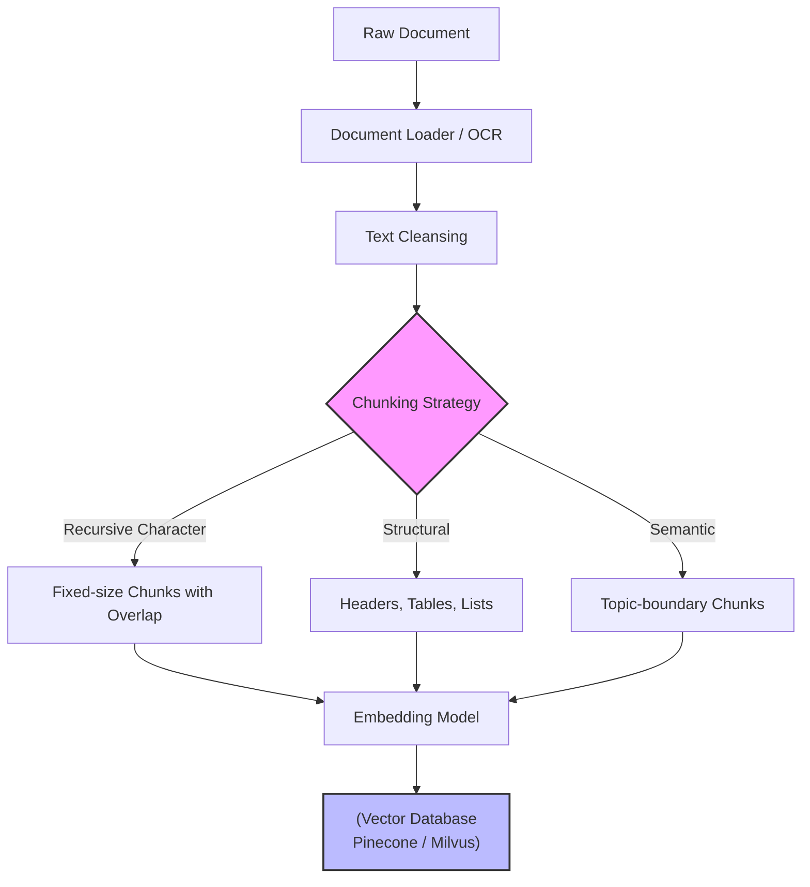

Trong các hệ thống Retrieval-Augmented Generation (RAG) cấp độ Enterprise, **Chunking** không chỉ là một bước `text.split()` đơn giản. Nó là một bài toán kiến trúc quyết định trực tiếp đến sự sống còn của pipeline RAG: nếu cắt sai, LLM sẽ bị "ảo giác" (hallucinate) do thiếu context; nếu cắt quá nhỏ, Vector Database sẽ bị phình to (index bloat) dẫn đến chi phí hạ tầng tăng vọt (FinOps blowout); nếu dùng Semantic Chunking mù quáng, Data Ingestion pipeline có thể bị "nghẽn cổ chai" (bottleneck) và sập do Rate Limit.

Bài viết này phân tích Chunking dưới góc độ System Design: Cơ chế hoạt động vật lý, sự đánh đổi hệ thống (Trade-offs) và các sự cố vận hành thực tế.

## 1. Bản chất Kỹ thuật của Chunking (Physical Execution)

Khi một tài liệu (PDF, Word, HTML) đi vào hệ thống, nó không thể được nhồi thẳng vào Vector Database. Do giới hạn kích thước ngữ cảnh (Context Window) của các mô hình LLM và đặc tính của Embedding Models (thường chỉ biểu diễn tốt các vector có độ dài khoảng 256-8191 tokens), tài liệu phải được chia nhỏ. 

Dưới nền tảng vật lý, Chunking là quá trình duyệt qua cấu trúc dữ liệu, cắt một mảng (array) chuỗi lớn thành các mảng con (sub-arrays) sao cho:
1. Độ dài mỗi chunk nằm trong giới hạn Token Limit.
2. Vùng gối đầu (Overlap) được duy trì để không làm đứt gãy ngữ nghĩa (Coreference).


*(Nguồn: Pinecone)*



## 2. Chiến lược Phân tách (Chunking Strategies) & System Trade-offs

Việc lựa chọn chiến lược Chunking luôn là một bài toán đánh đổi giữa **Retrieval Quality** (Chất lượng truy xuất), **Compute Cost** (Chi phí tính toán/API), và **Ingestion Latency** (Độ trễ khi nạp dữ liệu).

### 2.1. Recursive Character Chunking
Đây là phương pháp chia nhỏ văn bản đệ quy dựa trên một mảng các ký tự phân cách (thường là `["\n\n", "\n", " ", ""]`). Thuật toán sẽ ưu tiên cắt ở các đoạn văn, sau đó mới đến câu, rồi đến từ.

*   **System Trade-offs:**
    *   **Pro:** Cực kỳ nhanh (O(N) time complexity). Tốn rất ít RAM và CPU. Dễ dàng stream data vào Vector DB.
    *   **Con:** Rủi ro "Context Fragmentation". Hai câu có liên kết logic cực mạnh nhưng xui xẻo nằm ngay điểm cắt sẽ bị tách ra, làm Retriever không tìm thấy ngữ cảnh gốc.
*   **Best for:** Các pipeline RAG tiêu chuẩn, dữ liệu thô lớn, tài liệu có cấu trúc câu đơn giản.

### 2.2. Structural / Document-based Chunking
Chia cắt dựa trên cấu trúc logic của tài liệu (HTML DOM, Markdown Headers, JSON). 

*   **System Trade-offs:**
    *   **Pro:** Bảo toàn ngữ nghĩa cực tốt. Các chunk giữ được trọn vẹn một mục (Section).
    *   **Con:** Khó triển khai đối với dữ liệu phi cấu trúc (ví dụ: PDF bị scan lệch, OCR mất format). Khó đảm bảo giới hạn độ dài chunk một cách nghiêm ngặt.
*   **Kỹ thuật nâng cao:** Sử dụng Header Metadata. Khi cắt một đoạn văn thuộc mục `## 2. Kiến trúc`, hệ thống sẽ gắn thêm string `"Chương: Kiến trúc"` vào đầu chunk trước khi mang đi embed.

### 2.3. Semantic Chunking (Phân tách theo ngữ nghĩa)
Đây là chiến lược tốn kém nhưng chính xác nhất. Thuật toán cắt văn bản ra thành từng câu, tính toán Vector Embedding cho *từng câu một*, sau đó đo khoảng cách (Cosine Distance) giữa các câu liên tiếp. Nếu khoảng cách vượt qua một ngưỡng (Threshold / Percentile) định sẵn, hệ thống xác định đó là sự chuyển đổi chủ đề (Topic Shift) và thực hiện cắt chunk.

*   **System Trade-offs:**
    *   **Pro:** Chunks được chia cực kỳ tự nhiên theo luồng ý tưởng của con người. Độ chính xác khi Retrieval (Recall@K) tăng vọt.
    *   **Con (FinOps & Latency blowout):** Chi phí API Embedding tăng gấp hàng chục lần do phải embed từng câu riêng lẻ để phân tích, sau đó lại embed lại chunk gộp. Ingestion pipeline trở nên rất chậm.

## 3. Rủi ro Vận hành & Real-world Incidents

### Incident 1: Context Fragmentation & Coreference Loss (Mất ngữ cảnh đại từ)
**Sự cố:** Một hệ thống RAG pháp lý trả lời sai thông tin về "Công ty X".
**Root Cause:**
- Chunk 1 kết thúc bằng: *"Năm 2023, Công ty X đã mua lại toàn bộ cổ phần của Tập đoàn Y."*
- Chunk 2 bắt đầu bằng: *"Thương vụ này đã tiêu tốn của họ 5 tỷ USD."*
Khi người dùng hỏi "Công ty X đã chi bao nhiêu tiền?", Vector DB trả về Chunk 2 nhờ từ khóa "chi tiền", nhưng LLM không biết "họ" là ai do Chunk 1 không được lấy lên.
**Giải pháp:** 
1. Tăng `chunk_overlap` (Độ gối đầu). Thường đặt từ 10% - 20% kích thước chunk.
2. Dùng kỹ thuật **Contextual Retrieval** (của Anthropic) hoặc **Entity Resolution** để ép LLM tóm tắt và nối tên thực thể vào mỗi chunk trước khi index.

### Incident 2: Rate Limit OOM và FinOps Blowout với Semantic Chunking
**Sự cố:** Pipeline Ingestion bị sập cứng (Hanging) và nhận mã lỗi `HTTP 429 Too Many Requests` từ OpenAI liên tục; hóa đơn API tăng 400% trong một tháng.
**Root Cause:** Data Engineer thay đổi từ `RecursiveTextSplitter` sang `SemanticChunker` cho kho dữ liệu 10GB. Semantic Chunker gửi từng câu (hàng triệu câu) lên API của OpenAI để lấy embedding liên tục, dẫn đến cạn kiệt Token/Minute rate limit và ngốn sạch ngân sách.
**Giải pháp:** 
- **Chỉ áp dụng Semantic Chunking cho dữ liệu V.I.P** (tài liệu quan trọng, ít thay đổi). Với các dữ liệu bề mặt, quay về Recursive Chunking.
- Tự host các mô hình Embedding nhỏ (như `all-MiniLM-L6-v2`) trên Kubernetes (EKS/GKE) để làm hàm tính toán Semantic Distance, tránh gọi API ngoài với tần suất quá cao.

## 4. Hiện thực hóa bằng Code (Executable Implementation)

Dưới đây là Code Python thực chiến sử dụng LangChain. Chú ý cách chúng ta xử lý Overlap và chuẩn bị Metadata để tránh *Context Fragmentation*.

### 4.1. Cấu hình Recursive Chunking (Tối ưu Hiệu năng)

```python
from langchain_text_splitters import RecursiveCharacterTextSplitter

# Giả lập một raw text lớn
raw_text = "..." # Nội dung tài liệu 100 trang

# Khởi tạo Splitter với các thông số an toàn cho System
text_splitter = RecursiveCharacterTextSplitter(
    chunk_size=1024,       # Phù hợp với max token của hầu hết Embedding Model
    chunk_overlap=150,     # Khoảng 15% để giữ ngữ cảnh đại từ gối đầu
    length_function=len,
    separators=["\n\n", "\n", " ", ""],
    is_separator_regex=False
)

chunks = text_splitter.create_documents([raw_text])
print(f"Tạo thành công {len(chunks)} chunks.")
# Chunks này sau đó được đẩy vào hệ thống Message Queue (Kafka) hoặc trực tiếp vào Pinecone/Milvus
```

### 4.2. Cấu hình Semantic Chunking (Chi phí cao, Độ chính xác cao)

*Lưu ý: Chỉ chạy code này trên tập dữ liệu nhỏ hoặc sử dụng mô hình Local để tránh bị Rate Limit.*

```python
from langchain_experimental.text_splitter import SemanticChunker
from langchain_openai import OpenAIEmbeddings

# Khởi tạo Embedding model. Khuyến cáo dùng Local model (HuggingFace) để tiết kiệm
embeddings = OpenAIEmbeddings(model="text-embedding-3-small")

# Khởi tạo Semantic Chunker
# breakpoint_threshold_amount=80: Cắt chunk khi sự khác biệt cosine similarity giữa 2 câu 
# vượt qua ngưỡng phân vị 80% (nghĩa là nằm trong top 20% những khoảng ngắt lớn nhất)
semantic_chunker = SemanticChunker(
    embeddings, 
    breakpoint_threshold_type="percentile",
    breakpoint_threshold_amount=80.0
)

# Chạy Ingestion (Cảnh báo: Tốc độ sẽ chậm hơn Recursive rất nhiều do phải gọi API)
semantic_chunks = semantic_chunker.create_documents([raw_text])
print(f"Tạo thành công {len(semantic_chunks)} semantic chunks.")
```

## 5. Tài liệu Tham khảo

*   [Pinecone: Chunking Strategies for LLM Applications](https://www.pinecone.io/learn/chunking-strategies/) - Nền tảng về các chiến lược chia tách và lưu trữ Vector.
*   [LangChain Text Splitters Documentation](https://python.langchain.com/docs/modules/data_connection/document_transformers/) - Thư viện chuẩn cho Data Preprocessing trong RAG.
*   [LlamaIndex: Node Parsers and Chunking Strategies](https://docs.llamaindex.ai/en/stable/module_guides/loading/node_parsers/) - Tư duy về Parsing và Chunking phân cấp.
*   **Designing Data-Intensive Applications - Martin Kleppmann** - Tư duy cốt lõi về sự đánh đổi trong lưu trữ và luồng dữ liệu (Trade-offs).
*   [Anthropic: Contextual Retrieval](https://www.anthropic.com/news/contextual-retrieval) - Phương pháp giải quyết bài toán mất ngữ cảnh (Context Fragmentation) trong Chunking.
