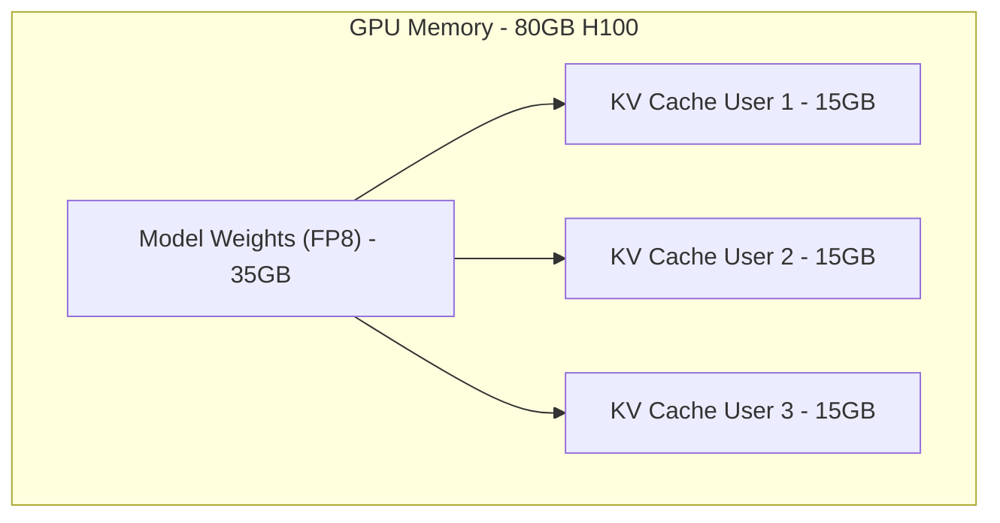

Khi phát triển các hệ thống AI tạo sinh (Generative AI), hầu hết các lập trình viên bắt đầu bằng việc ném một đoạn văn bản dài vào API của OpenAI hoặc Anthropic và hy vọng mô hình xử lý trơn tru. Tuy nhiên, khi hệ thống cần mở rộng (Scale) để xử lý hàng ngàn request đồng thời (Concurrency) với các tài liệu nội bộ khổng lồ, mọi thứ bắt đầu đổ vỡ.

Độ trễ (Latency) tăng vọt, chi phí hạ tầng (FinOps) phình to, và các kịch bản sập nguồn GPU (OOMKilled) xảy ra liên tục. Chìa khóa gốc rễ của mọi vấn đề này nằm ở **Context Window (Cửa sổ Ngữ cảnh)** và cách hệ thống quản lý **KV Cache** ở tầng thực thi vật lý.

---

## 1. Cơ sở Kiến trúc: RoPE và KV Cache Bottleneck

Context Window, bề ngoài là "bộ nhớ làm việc" của LLM, nhưng thực chất ở tầng hệ thống, nó bị giới hạn bởi hai yếu tố kiến trúc cốt lõi của **Transformer**:

### 1.1. Rotary Positional Embedding (RoPE)
Các LLM hiện đại (như Llama 3, Mistral) sử dụng **RoPE** để giúp mô hình hiểu được vị trí tương đối (Relative position) của các từ (tokens) trong một câu dài. Thay vì gán một mã vị trí cố định tuyệt đối, RoPE xoay (rotate) các vector Query và Key trong không gian dựa trên khoảng cách giữa chúng. Nhờ thiết kế toán học thanh lịch này, các kỹ sư có thể "kéo dãn" (Extrapolate) Context Window từ 4K tokens lúc huấn luyện ban đầu lên tới 128K tokens hoặc hơn khi phục vụ thực tế (Inference) mà không làm suy giảm quá nhiều độ chính xác.

### 1.2. Sự đánh đổi của KV Cache (The Memory Bottleneck)
Trong giai đoạn sinh văn bản (Auto-regressive decoding), để dự đoán token tiếp theo, LLM cần "nhìn lại" (Attention) toàn bộ các token trước đó. Để không phải tính toán lại (recompute) các ma trận Key và Value đắt đỏ cho các token cũ, hệ thống sẽ lưu trữ trạng thái của chúng vào VRAM. Không gian này gọi là **KV Cache**.

Kích thước của KV Cache tăng **tuyến tính** theo kích thước Context Window và số lượng user request cùng lúc (Batch Size), nhưng sự tương tác giữa các token trong Self-Attention lại có độ phức tạp **bậc 2 ($\mathcal{"O"}(N^2)$)** đối với mỗi request. 

Công thức ước lượng VRAM cho KV Cache đối với 1 request:
`VRAM (bytes) = 2 (Key, Value) × Độ dài Context (N) × Số Layers × Số Heads × Kích thước Head × 2 (FP16 bytes)`

Ví dụ: Với LLaMA-3 70B, một request có context window 100K tokens có thể "ngốn" tới hơn 30GB VRAM chỉ riêng cho KV Cache (chưa tính dung lượng load Model Weights). Nếu bạn có 10 concurrent users, hệ thống sẽ cạn kiệt bộ nhớ của một chiếc GPU NVIDIA H100 (80GB) ngay lập tức.


*(Sơ đồ: VRAM GPU dễ dàng bị quá tải (OOM) do KV Cache phình to khi context window dài và concurrent users tăng).*

---

## 2. Tối ưu Bộ nhớ với PagedAttention (vLLM)

Để giải quyết tình trạng phân mảnh bộ nhớ (Memory Fragmentation) của KV Cache, kiến trúc **PagedAttention** (áp dụng trong framework vLLM) ra đời. Lấy cảm hứng từ Virtual Memory của Hệ điều hành, PagedAttention chia KV Cache thành các "khối" (blocks) không liền kề nhau trong VRAM, giúp triệt tiêu hiện tượng phân mảnh (từ 30% xuống dưới 4%) và tăng lượng concurrent users lên gấp 3-4 lần.

Ví dụ cấu hình vLLM Engine bằng Python:

```python
from vllm import LLM, SamplingParams

# Phân bổ đúng 80% VRAM cho mô hình + KV Cache, tránh OOMKilled do Spike Traffic
llm = LLM(
    model="meta-llama/Meta-Llama-3-8B-Instruct",
    gpu_memory_utilization=0.80, # Dành 20% cho OS và các tiến trình khác
    max_model_len=8192,          # Giới hạn Context Window (Capping)
    block_size=16,               # Kích thước PagedAttention Block
    tensor_parallel_size=2       # Chia tải KV cache trên 2 GPUs (Model Parallelism)
)

sampling_params = SamplingParams(temperature=0.7, max_tokens=512)
outputs = llm.generate(["Phân tích rủi ro của OOMKilled trên Kubernetes"], sampling_params)
```

---

## 3. Rủi ro Vận hành (Operational Risks)

### 3.1. Needle in a Haystack và "Lost in the Middle"
Các bài kiểm tra áp lực (Stress test) được gọi là **Needle in a Haystack** (Mò kim đáy bể) thường được dùng để đo lường năng lực của LLM. Người ta giấu một dữ kiện ngẫu nhiên (Cây kim) vào giữa hàng trăm trang tài liệu (Đống cỏ khô) và yêu cầu mô hình tìm nó.

Kết quả thường vẽ ra một đường cong hình chữ U (U-shaped performance curve): Các LLM "nhớ" rất tốt đoạn văn bản ở phần ĐẦU (Primacy effect) và phần CUỐI (Recency effect) của Context Window, nhưng lại tịt ngòi, sinh ra Ảo giác (Hallucination) hoặc phớt lờ thông tin nằm ở phần **GIỮA (Lost in the Middle)**.

**Xử lý trong RAG:** Các Data Engineer áp dụng kỹ thuật **Information Re-ranking (Sắp xếp lại thông tin)**. Trước khi đưa các text chunks lấy từ VectorDB vào Context Window, các đoạn văn bản chứa thông tin quan trọng nhất sẽ được "ép" lên đầu hoặc dồn xuống cuối prompt, đẩy rác (noise) vào giữa.

### 3.2. OOMKilled do Spike Traffic (Bão Traffic)
Khi số lượng users tăng vọt, hệ thống Inference Server phải phục vụ quá nhiều tiến trình KV Caches cùng lúc.
**Giải pháp:** Sử dụng Continuous Batching. Khi VRAM chạm ngưỡng nguy hiểm, hệ thống vLLM sẽ **Swap (đẩy)** các KV Cache chưa dùng đến ra bộ nhớ RAM của CPU (băng thông PCIe), và kéo lại khi cần (giống Swap Space trên Linux). Tuy nhiên, điều này đánh đổi bằng Latency cực lớn (đứt gãy throughput).

---

## 4. Systemic Trade-offs: RAG vs Long-Context Models

Một cuộc tranh luận nổ ra khi các mô hình có Context Window siêu dài (lên đến 1-2 triệu tokens như Gemini 1.5 Pro) ra đời: **Có còn cần RAG (Retrieval) khi có thể nhồi mọi thứ vào prompt (Context Stuffing)?**

| Tiêu chí Đánh đổi | Hệ thống RAG (Short-Context) |" Long-Context Models (Context Stuffing) "|
| :--- | :--- | :--- |
|" **Độ trễ (TTFT)** "| **Thấp.** Mô hình chỉ đọc các chunks nhỏ (~2000 tokens), nên bước Pre-fill diễn ra tức thì. | **Cực Cao.** Phải đọc hàng triệu tokens trước khi sinh ra từ đầu tiên. TTFT có thể mất từ 10s đến hàng phút. |
|" **Chi phí (FinOps)** "| **Rất Thấp.** Chỉ trả tiền API cho vài ngàn tokens được trích xuất (Trừ khi VectorDB quá đắt). | **Rất Cao.** Chi phí nội suy Attention $\mathcal{"O"}(N^2)$ khiến giá mỗi API call khổng lồ. VRAM yêu cầu vô cùng lớn. |
| **Cross-reasoning** | **Yếu.** Vector Search dễ bỏ sót ngữ cảnh rải rác ở 20 tài liệu khác nhau. Rủi ro Lost in the Middle nhẹ hơn. | **Xuất sắc.** Do có toàn cảnh dữ liệu (Global context), mô hình dễ dàng móc nối dữ kiện phức tạp, nhưng rủi ro "Lost in the Middle" cao nếu không có RoPE xịn. |

---

## 5. Tối ưu Chi phí Hạ tầng (FinOps)

Để chạy hệ thống GenAI quy mô Enterprise mà không làm phá sản công ty, bạn cần:

1. **Prompt Caching:** Các nền tảng API hiện đại (Anthropic Claude, OpenAI) cho phép lưu bộ nhớ Cache đối với System Prompt tĩnh. Lần gọi đầu tiên (Cache Miss) tốn phí bình thường, nhưng các lần sau (Cache Hit) chi phí giảm 50-80% và TTFT giảm mạnh.
2. **Provisioned Throughput (AWS Bedrock):** Thay vì trả theo Token, mua đứt năng lực tính toán thông qua Terraform để tối ưu dòng tiền (Predictable cost).

```hcl
# Thiết lập Provisioned Throughput trên AWS Bedrock cho các tác vụ Long-context
resource "aws_bedrock_provisioned_model_throughput" "anthropic_claude_long_context" {
  provisioned_model_name = "claude-long-context-prod"
  model_id               = "arn:aws:bedrock:us-east-1::foundation-model/anthropic.claude-3-sonnet-20240229-v1:0"
  
  # model_units xác định năng lực phục vụ. Càng lớn thì dung lượng KV Cache càng nhiều
  model_units = 2
  commitment_duration = "SixMonths" # Reserved Instances concept
}
```

---

## Nguồn Tham Khảo [References]
*   [vLLM: Easy, Fast, and Cheap LLM Serving with PagedAttention](https://vllm.ai/)
*   [Lost in the Middle: How Language Models Use Long Contexts (Liu et al., 2023)](https://arxiv.org/abs/2307.03172)
*   [Needle In A Haystack: Pressure Testing LLMs](https://github.com/gkamradt/LLMTest_NeedleInAHaystack)
*   [RoPE: RoFormer: Enhanced Transformer with Rotary Position Embedding](https://arxiv.org/abs/2104.09864)
*   [Mastering LLM Memory: The Key-Value Cache (Databricks Engineering Blog)](https://www.databricks.com/blog/mastering-llm-memory-key-value-cache)
