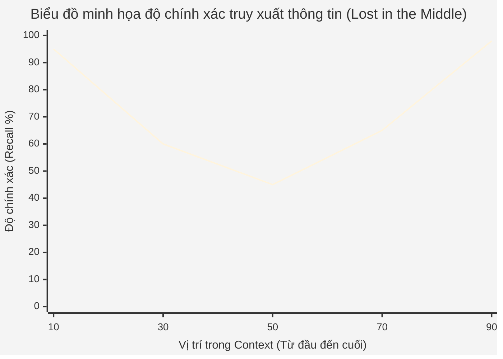

Khi tương tác với các mô hình ngôn ngữ lớn ([LLM](/concepts/9-genai-machine-learning/llm)) như GPT-4, Gemini hay Claude, bạn có bao giờ thắc mắc làm thế nào AI có thể theo dõi một cuộc hội thoại dài? Tại sao khi đoạn chat quá dài, con bot bắt đầu "quên" mất những gì bạn đã nói từ trước? Hoặc tại sao bạn không thể copy toàn bộ bộ luật dài hàng ngàn trang vào một khung chat thông thường? Chìa khóa cho mọi giới hạn đó nằm ở khái niệm **Context Window** (Cửa sổ ngữ cảnh).

## Context Window là gì?


Context Window là giới hạn "bộ nhớ ngắn hạn" hay không gian làm việc của một LLM trong một lần tương tác. Cụ thể, nó bao gồm toàn bộ văn bản đầu vào (prompt của người dùng, system prompt, ngữ cảnh lịch sử các câu hỏi trước) và văn bản đầu ra (phản hồi mà mô hình đang tạo ra). Nó xác định lượng thông tin tối đa mà mô hình có thể xem xét đồng thời khi đưa ra dự đoán cho từ tiếp theo (next-token prediction).

Hãy tưởng tượng Context Window giống như giới hạn dung lượng của một khung tranh. Bạn chỉ có thể chèn một lượng chữ nhất định vào trong khung đó. Nếu bạn tiếp tục viết thêm văn bản vào và vượt quá sức chứa của khung tranh, những dòng đầu tiên sẽ bị đẩy ra ngoài. 

Ví dụ, một mô hình có Context Window là 8,000 tokens có nghĩa là nó chỉ có thể "đọc" và "nhớ" một lượng văn bản tương đương với 8,000 tokens cùng lúc. Mọi thông tin nằm ngoài cửa sổ này (ở đầu đoạn hội thoại quá dài) sẽ bị cắt xén (truncate) hoặc bị đẩy ra ngoài theo cơ chế FIFO (First In, First Out - Vào trước ra trước) khiến mô hình hoàn toàn "lãng quên" chúng. Các mô hình không có khả năng tự động "lưu" thông tin quá khứ vào cơ sở dữ liệu vĩnh viễn trừ khi hệ thống ứng dụng bên ngoài thực hiện lưu trữ.

### Token và Word: Sự khác biệt cốt lõi
Một sự nhầm lẫn phổ biến là người dùng thường đồng nhất Context Window với số lượng từ (word). Tuy nhiên, Context Window được đo lường bằng **Token** chứ không phải bằng từ. Máy tính không tự nhiên hiểu ngôn ngữ giống con người, chúng cần phân tách văn bản thành các đơn vị thông tin nhỏ hơn (token) thông qua quá trình **Tokenization**.

* **Trong tiếng Anh:** 1 token thường tương đương với khoảng 0.75 từ. Vậy 100 tokens sẽ tương đương với xấp xỉ 75 từ tiếng Anh chuẩn.
* **Trong tiếng Việt:** và các ngôn ngữ không sử dụng bảng chữ cái Latin hoặc có cấu trúc dấu câu phức tạp, một từ có thể bị phân mảnh thành nhiều tokens hơn. Ví dụ chữ "thương" hay "chuyện" có thể bị chia làm 2-3 tokens tùy theo tokenizer của mô hình. Các dấu câu liền kề cũng có thể bị tách rời. Do đó, Context Window khi dùng prompt tiếng Việt sẽ bị "hao" nhanh hơn đáng kể so với tiếng Anh.

> [!TIP]
> **Code Example: Kiểm tra số lượng Token bằng Tiktoken**
> Dưới đây là cách bạn có thể đếm số lượng token trong một văn bản bằng thư viện `tiktoken` (tokenizer do OpenAI phát triển) trong Python. Hiểu được cách tính token giúp bạn ước lượng độ dài phù hợp của dữ liệu truyền vào LLM.

```python
import tiktoken

def count_tokens(text: str, model: str = "gpt-4") -> int:
    """
    Đếm số token cho một chuỗi văn bản dựa trên mô hình LLM.
    """
    # Lấy định dạng encoding tương ứng với mô hình được chọn
    # gpt-4 sử dụng chuẩn encoding cl100k_base
    encoding = tiktoken.encoding_for_model(model)
    
    # Mã hóa (tokenize) chuỗi văn bản
    tokens = encoding.encode(text)
    
    # Trả về số lượng token
    return len(tokens)

# Ví dụ so sánh tiếng Anh và tiếng Việt
en_text = "Machine learning is fascinating."
print(f"English tokens: {count_tokens(en_text)}") 
# Output: Thường là khoảng 4-5 tokens

vn_text = "Học máy học rất thú vị."
print(f"Vietnamese tokens: {count_tokens(vn_text)}") 
# Output: Thường sẽ gấp 1.5 - 2 lần số token của tiếng Anh, dao động từ 8-12 tokens
```

## Tại sao Context Window lại có giới hạn?

Giới hạn vật lý của Context Window bắt nguồn từ kiến trúc cốt lõi của hầu hết các LLM hiện đại: kiến trúc **Transformer**, cụ thể là cơ chế **Self-Attention** (Tự chú ý).

Cơ chế Self-Attention tính toán mức độ quan trọng (attention score) và sự tương quan giữa *mỗi token* trong đầu vào với *tất cả các token khác* có mặt trong ngữ cảnh. Do đó, chi phí tính toán và yêu cầu bộ nhớ (RAM/VRAM) của nó tăng lên theo **cấp số nhân (quadratic)** so với độ dài của chuỗi đầu vào. Hay nói trong khoa học máy tính, độ phức tạp thuật toán là $\mathcal{O}(N^2)$.

> [!NOTE]
> **Giải thích toán học về $\mathcal{O}(N^2)$ trong Attention:**
> Giả sử độ dài chuỗi (số lượng token đầu vào) là $N$. Mỗi token trong số $N$ tokens này cần thực hiện phép nhân ma trận với tất cả $N$ tokens còn lại để mô hình có thể "hiểu" ngữ cảnh sâu sắc nhất (việc này tạo ra một ma trận attention có kích thước $N \times N$).
> 
> * Nếu bạn tăng gấp đôi Context Window (ví dụ từ 4,000 lên 8,000 tokens), lượng tính toán và bộ nhớ VRAM yêu cầu để lưu trữ các tham số trạng thái trung gian (KV Cache) không tăng gấp đôi mà tăng gấp **bốn** lần ($2^2 = 4$).
> * Nếu bạn tăng ngữ cảnh từ 4,000 lên 128,000 (tức là tăng gấp 32 lần), chi phí tính toán lý thuyết và không gian bộ nhớ sẽ tăng **1024 lần**.

Điều này dẫn đến rào cản lớn về giới hạn phần cứng. Bộ nhớ VRAM siêu đắt đỏ của các GPU chuyên dụng (như Nvidia H100 hay A100) sẽ nhanh chóng cạn kiệt (Out of Memory - OOM) và rào cản chi phí trở nên cực lớn khi các tổ chức AI muốn huấn luyện hoặc chạy nội suy (inference) cho các chuỗi văn bản dài.

## Ảnh hưởng của Context Window tới thực tế ứng dụng

### 1. Hiện tượng "Lost in the Middle" (Lạc lõng ở giữa)

Các nghiên cứu thực nghiệm, nổi bật là bài báo *Lost in the Middle*, chỉ ra rằng khi người dùng cung cấp một lượng thông tin lớn (như một tài liệu văn bản dài) lấp đầy giới hạn tối đa của Context Window, các LLM thường gặp phải hiện tượng giảm sút năng lực truy xuất dữ liệu nằm ở giữa đoạn hội thoại. 

Mô hình có khả năng ghi nhớ và truy xuất thông tin xuất sắc đối với các văn bản nằm ở **phần đầu** và **phần cuối** của Context Window. Đây là sự phản ánh trực tiếp từ hiệu ứng tâm lý học primacy (ưu tiên cái đầu tiên) và recency (ưu tiên cái gần nhất). Tuy nhiên, LLM lại tỏ ra kém hiệu quả, dễ dàng "bỏ sót" hoặc "ảo giác" (hallucinate) đối với các thông tin bị vùi lấp ở đoạn giữa của prompt, cứ như thể phần giữa trở thành một vùng điểm mù.



> [!IMPORTANT]
> **Cách khắc phục hiện tượng Lost in the Middle:**
> * Luôn đặt các chỉ dẫn (instruction) cốt lõi nhất ở **đầu hoặc cuối prompt** thay vì giấu chúng vào giữa các đoạn văn bản tài liệu dài.
> * Trong kỹ thuật nhồi ngữ cảnh (Context Stuffing), hãy cấu trúc prompt sao cho các tài liệu có độ liên quan (relevance) cao nhất được đẩy lên đầu và cuối context, các tài liệu ít liên quan hơn nhét vào giữa.
> * Tránh việc nhồi nhét thông tin rác (noise).

### 2. Sự lựa chọn giữa RAG và Long-Context Models

[RAG (Retrieval-Augmented Generation)](/concepts/9-genai-machine-learning/rag) là một hệ thống thiết kế phần mềm được sinh ra phần lớn để giải quyết bài toán Context Window bị giới hạn. Thay vì cố gắng nhồi nhét toàn bộ cơ sở dữ liệu khổng lồ (ví dụ hàng nghìn tài liệu nội bộ công ty) vào prompt (điều bất khả thi với context ngắn), hệ thống RAG sử dụng cơ sở dữ liệu Vector để tìm kiếm và chỉ trích xuất các đoạn văn bản (chunks) liên quan nhất đến câu hỏi. Sau đó hệ thống mới đưa những chunks ngắn gọn đó vào Context Window để mô hình LLM có thông tin tổng hợp câu trả lời.

Tuy nhiên, ngày nay khi các mô hình Long-context (hỗ trợ hàng triệu tokens) bắt đầu phổ biến, một cuộc tranh luận nổ ra: **Liệu RAG có còn cần thiết hay chúng ta cứ thế nhét tất cả vào Long Context?** Dưới đây là bảng phân tích so sánh chuyên sâu giúp bạn định hình kiến trúc cho ứng dụng của mình:

| Tiêu chí | Hệ thống RAG | Sử dụng Long-Context Models (vd: Gemini 1.5 Pro) |
| :--- | :--- | :--- |
| **Chi phí API / Vận hành** | **Rất Thấp.** Chỉ tốn token cho những đoạn văn bản ngắn gọn có liên quan được trích xuất. | **Rất Cao.** Bạn phải trả phí API cho toàn bộ hàng trăm ngàn hoặc hàng triệu token đầu vào mỗi lần user đặt câu hỏi. |
| **Độ trễ (Latency)** | **Thấp.** LLM xử lý context rất ngắn (có thể dưới 2000 tokens), độ trễ đọc hiểu gần như ngay lập tức mặc dù tốn thêm vài mili-giây cho bước truy xuất (Retrieval). | **Cao.** Việc đọc hiểu (quá trình pre-fill của LLM) đối với hàng triệu tokens có thể tốn hàng chục giây đến vài phút trước khi in ra từ đầu tiên. |
| **Độ chính xác (Truy xuất điểm)** | Có thể gặp rủi ro "trượt" thông tin quan trọng nếu embedding model tìm kiếm sai lệch ý nghĩa hoặc nếu câu trả lời cần tính bắc cầu phức tạp từ nhiều đoạn tài liệu xa nhau. | **Rất Cao.** Do mô hình "nhìn thấy" bức tranh toàn cảnh của thông tin gốc, nó có thể suy luận các mối liên kết chéo (reasoning) mà các hệ thống tìm kiếm vector thường gặp thất bại. |
| **Khả năng tóm tắt vĩ mô** | **Kém.** RAG rất khó để thực hiện các yêu cầu mang tính vĩ mô kiểu "Hãy phân tích xu hướng chung của toàn bộ kho dữ liệu công ty năm 2023" vì không thể load hết dữ liệu vào cửa sổ tìm kiếm. | **Xuất sắc.** Do chứa toàn bộ dữ liệu trong Context Window, nó có khả năng giải quyết xuất sắc lệnh "Hãy đọc và phân tích chủ đề chính của cuốn tiểu thuyết 1000 trang này". |

### 3. Chi phí Quản lý Token và Bộ Nhớ Cache

Khi sử dụng API của các LLM thương mại như OpenAI GPT, Anthropic Claude, hay Google Gemini, chi phí thường được tính trên đơn vị là 1,000 hoặc 1 triệu tokens cho cả hai chiều: đầu vào (input tokens) và đầu ra (output tokens).
* Việc gửi một đoạn văn bản khổng lồ để cố gắng tận dụng tối đa không gian Context Window sẽ làm tăng chi phí theo cấp số nhân mỗi tháng đối với dự án của bạn.
* Cùng với đó, lượng input càng lớn (tức Context Window sử dụng càng nhiều), thời gian phản hồi ở token đầu tiên (Time-To-First-Token - TTFT) sẽ càng tăng cao. Điều này tạo trải nghiệm người dùng không tốt đối với các ứng dụng yêu cầu phản hồi theo thời gian thực (như Real-time voice chatbots).

## Sự phát triển của các mô hình Long-Context và Tương Lai

Các giới hạn trước đây về Context Window đang dần bị phá vỡ nhờ những bước tiến lớn về kỹ thuật và thuật toán. Nếu như GPT-3 vào năm 2020 bị giới hạn ở con số khiêm tốn 2,048 tokens, thì nay các mô hình hiện đại đã có thể xử lý từ 128,000 cho đến 2 triệu tokens, thậm chí lớn hơn. Các cuộc cách mạng này đạt được là nhờ vào:

* **Tối ưu hóa I/O phần cứng với FlashAttention:** Một thuật toán tối ưu hóa nhận thức I/O, quản lý thông minh cách truyền tải dữ liệu giữa bộ nhớ đệm cực nhanh (SRAM) và bộ nhớ chính (HBM) trên GPU. FlashAttention giúp quá trình tính toán Self-Attention nhanh hơn và tiết kiệm bộ nhớ đột phá, giảm thiểu tình trạng ngẽn cổ chai bộ nhớ mà không làm suy giảm đi bất kỳ độ chính xác toán học gốc nào.
* **Cải tiến Positional Encoding (RoPE & YaRN):** Các thuật toán như **RoPE** (Rotary Position Embedding) kết hợp với kỹ thuật mở rộng ngữ cảnh (Context Extension/Scaling) như YaRN cho phép "kéo dãn" sức chứa Context Window từ các mô hình đã được pre-train sẵn. Nhờ đó, người ta có thể mở rộng khả năng tiếp nhận context dài hơn mà không bắt buộc phải tốn hàng triệu đô la để huấn luyện lại hệ thống từ con số không.
* **Kiến trúc RingAttention:** Một bước tiến quan trọng cho phép phân tán sự tính toán self-attention của một chuỗi văn bản siêu dài lên một mạng lưới nhiều thiết bị GPU khác nhau, vượt qua giới hạn VRAM cực nhỏ của một GPU đơn lẻ cục bộ.
* **Cơ chế Prompt Caching (Lưu trữ bộ nhớ cache cho Prompt):** Các nền tảng API từ Anthropic và Google hiện nay cho phép lưu vào bộ nhớ cache dữ liệu của các prompt có tính tĩnh (như tài liệu công ty, sách tham khảo, hoặc system prompt rất dài). Cụ thể, bạn chỉ phải trả chi phí tính toán cao cho lần đưa ngữ cảnh đầu tiên, các câu hỏi theo sau đối với cùng một ngữ cảnh (trong cùng một phiên hoặc cùng khoảng thời gian) sẽ tái sử dụng bộ nhớ cache. Tính năng này giúp giảm độ trễ (latency) đáng kể và tiết kiệm đến 50-80% chi phí.

> **Ví dụ ứng dụng thực tế của Long-Context:**
> Các mô hình đỉnh cao như **Gemini 1.5 Pro** có khả năng hỗ trợ Context Window lên đến 1-2 triệu tokens. Điều này mở ra các Use Case mà trước đây hoàn toàn bất khả thi:
> 1. **Repo-level Code Review (Phân tích mã nguồn toàn bộ dự án):** Bạn có thể thả toàn bộ mã nguồn của một thư mục repository gồm hàng trăm file mã nguồn khác nhau vào LLM và hỏi "Sự thay đổi ở class DatabaseConnection này sẽ ảnh hưởng hoặc gây ra lỗi tiềm ẩn cho những file nào khác trong hệ thống của tôi?".
> 2. **Video & Audio Understanding:** Đưa một video thô dài 1-2 tiếng đồng hồ trực tiếp vào LLM và yêu cầu "Hãy tìm đoạn timestamp và trích xuất đoạn hội thoại ở cảnh xảy ra cuộc tranh luận về ngân sách của dự án trong đoạn phim này."
> 3. **Phân tích Pháp Lý & Tài Chính:** Tải lên hàng chục bản hợp đồng hoặc báo cáo tài chính thường niên (Annual Reports) dài hàng nghìn trang, và yêu cầu AI rà soát để tìm ra những điều khoản bất thường hoặc mâu thuẫn giữa các tài liệu.

### Kết luận: Tư duy thiết kế cho tương lai

Mặc dù các mô hình có Context Window cực lớn đang xuất hiện dày đặc với giá thành ngày càng trở nên phải chăng, các kỹ sư hệ thống AI (AI Engineers) vẫn luôn phải cân nhắc bài toán tối ưu về Hiệu suất - Chi phí (Cost-Performance tradeoff). 

Việc ném mọi thứ vào một khung cửa sổ khổng lồ không bao giờ là phương án tối ưu tuyệt đối. Kỹ năng thiết kế hệ thống và tối ưu hóa ngữ cảnh (như loại bỏ các thông tin rác, sử dụng RAG hợp lý để giảm thiểu chi phí truy xuất hằng ngày, cấu trúc prompt một cách khoa học, và phân chia các agents xử lý những nhiệm vụ con) vẫn sẽ luôn đóng vai trò vô cùng thiết yếu. Những kiến thức cơ bản về Context Window này là hành trang cốt lõi để đảm bảo tính chính xác cho các giải pháp Generative AI, giảm độ trễ trải nghiệm cho người dùng, và bảo vệ ngân sách hạ tầng (infrastructure budget) của dự án trong dài hạn.

## Tài Liệu Tham Khảo
* [Attention Is All You Need - Vaswani et al., 2017](https://arxiv.org/abs/1706.03762) - Cội nguồn của kiến trúc Transformer.
* [Lost in the Middle: How Language Models Use Long Contexts - Liu et al., 2023](https://arxiv.org/abs/2307.03172) - Nghiên cứu về giới hạn suy giảm sự chú ý ở giữa ngữ cảnh.
* [FlashAttention: Fast and Memory-Efficient Exact Attention with IO-Awareness - Dao et al., 2022](https://arxiv.org/abs/2205.14135) - Bước đột phá về tối ưu tốc độ và bộ nhớ cho Self-attention.
* [RoFormer: Enhanced Transformer with Rotary Position Embedding (RoPE) - Su et al., 2021](https://arxiv.org/abs/2104.09864) - Kỹ thuật mở rộng cửa sổ ngữ cảnh hiện đại.
* [Gemini 1.5: Unlocking multimodal understanding across millions of tokens of context - Google DeepMind](https://storage.googleapis.com/deepmind-media/gemini/gemini_v1_5_report.pdf) - Báo cáo kỹ thuật về mô hình Long-context tiêu biểu.
