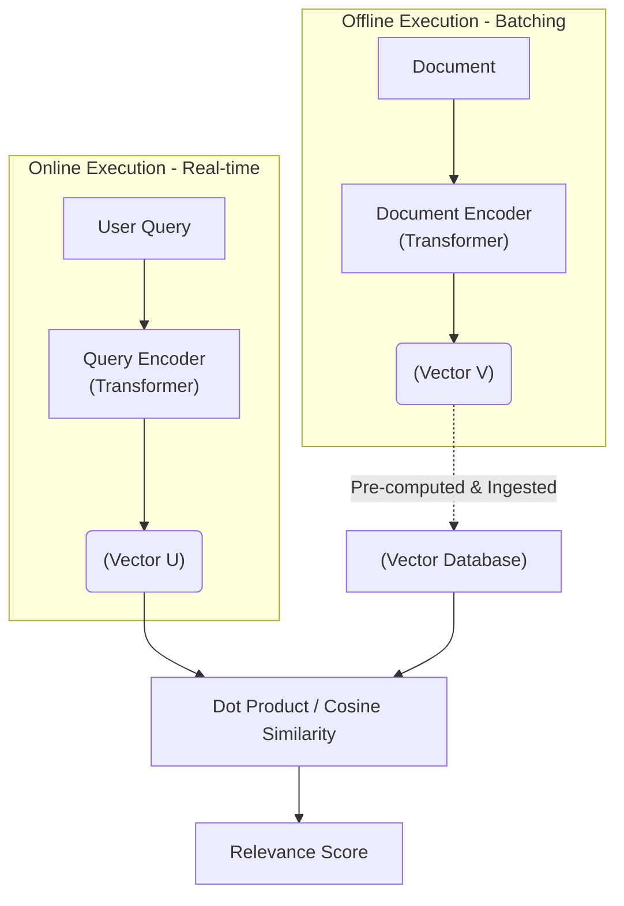

Embedding Model đã tiến hóa từ những thuật toán gán vector tĩnh (Word2Vec) sang các mô hình **Transformer** linh động, hiểu được ngữ cảnh chéo (Context-aware). Tuy nhiên, trong các hệ thống RAG và Semantic Search quy mô lớn, Embedding không chỉ là một "hộp đen" gọi API. Nó là một thành tố cốt lõi ảnh hưởng trực tiếp đến Compute Cost, Storage (Vector Database RAM) và Latency của toàn hệ thống.

Bài viết này sẽ mổ xẻ Embedding Model dưới góc nhìn Kỹ thuật hệ thống (System Engineering) thay vì chỉ lý thuyết Machine Learning thông thường.

---

## 1. Kiến Trúc Mạng: Bi-Encoder vs Cross-Encoder

Trong các bài toán Truy xuất (Retrieval) quy mô hàng triệu tài liệu, chúng ta luôn phải đối mặt với bài toán đánh đổi giữa **Độ trễ (Latency)** và **Độ chính xác (Accuracy)**.

### 1.1. Bi-Encoder (Two-Tower Architecture)
Kiến trúc Two-Tower chia tách việc xử lý Query và Document thành hai luồng độc lập. Đây là tiêu chuẩn công nghiệp (được dùng tại Uber, Netflix).



- **Phân tích:** Các tài liệu (Document) được nhúng (Embedded) sẵn offline thông qua Spark Job và nạp vào Vector DB. Khi User tìm kiếm, hệ thống chỉ mất vài mili-giây để nhúng câu Query và chạy thuật toán ANN tìm kiếm.
- **Trade-off:** Latency cực thấp, nhưng Accuracy không cao nhất vì Query và Document không được tương tác ngữ cảnh chéo với nhau.

### 1.2. Cross-Encoder
Kiến trúc này nối (concatenate) thẳng Query và Document lại thành một chuỗi duy nhất, đi qua toàn bộ các lớp Transformer Self-Attention.

- **Phân tích:** Không thể Pre-compute (tính toán trước) vì kết quả phụ thuộc vào Query của User.
- **Trade-off:** Accuracy cao nhất tuyệt đối, nhưng Latency cực tệ và ngốn GPU ($\mathcal{"O"}(N)$ compute).

### 1.3. Pipeline Chuẩn: Retrieval & Reranking
Trong thực tế, Architect sẽ ghép nối 2 mô hình này:
1. **Lớp Lọc thô (Retrieval - Bi-Encoder):** Quét 1 tỷ tài liệu trong Vector DB lấy ra Top 1,000 (Trễ ~50ms).
2. **Lớp Tinh chỉnh (Reranker - Cross-Encoder):** Chạy Top 1,000 đó qua GPU Cross-Encoder để chấm điểm chi tiết, lấy ra Top 10 trả về User (Trễ ~100-200ms).

---

## 2. Huấn Luyện Contrastive Learning & Hard Negatives

Làm sao để Bi-Encoder sinh ra Vector xịn? Quá trình huấn luyện sử dụng **Contrastive Learning (Học đối chiếu)**: Kéo gần các cặp đúng (Positive) và đẩy xa các cặp sai (Negative) trong không gian nhiều chiều.

Tử huyệt của các mô hình kém là bị "Ảo giác từ khóa". Để khắc phục, Kỹ sư ML phải dùng **Hard Negatives**:
- **Positive:** (Query: "Lỗi kết nối database", Doc: "Hướng dẫn cấu hình connection pool HikariCP")
- **Hard Negative:** "Cách cài đặt database trên Ubuntu" (Chứa chung từ khóa 'database' nhưng sai ngữ cảnh).

Bằng cách ép mô hình phạt điểm nặng các Hard Negatives, Vector Space sẽ hiểu được ngữ nghĩa (Semantic) thay vì đếm từ khóa (BoW).

---

## 3. Rủi Ro Vận Hành (Operational Risks)

### 3.1. Sự Cố OOM (Out-of-Memory) Khi Ingest Dữ Liệu
Trong hệ thống RAG, khi bạn cần re-embed (nhúng lại) 10 triệu records, nếu load tất cả data vào RAM và đẩy qua API OpenAI, hệ thống sẽ chết vì **JVM/Python OOMKilled**.
**Giải pháp:** Bắt buộc dùng Python Generators, chunking dữ liệu, và cài đặt cơ chế Exponential Backoff để chống Rate Limits (TPM) từ Cloud Provider.

### 3.2. Vector Stale (Dữ Liệu "Ôi Thiu" Khi Đổi Model)
Khi bạn nâng cấp từ model 768 chiều sang model 3072 chiều, **toàn bộ không gian toán học (Latent space) thay đổi**.
Nếu Frontend gọi Model mới, nhưng Vector DB vẫn chứa dữ liệu của Model cũ, kết quả tìm kiếm sẽ ra rác (Garbage).
**Giải pháp:** Phải áp dụng Blue/Green Deployment cho Database. Ingest toàn bộ dữ liệu vào Table mới, sau đó mới Switch Traffic.

---

## 4. Tối Ưu FinOps: Matryoshka Representation Learning (MRL)

### Lời Nguyền Đa Chiều (Curse of Dimensionality)
Số chiều của Vector tỷ lệ thuận với chi phí RAM của Vector DB.
Giả sử có 1 tỷ Document, vector `text-embedding-3-large` (3072 dimensions, float32):
- Kích thước 1 Tỷ Vector = $\sim 12 \text{" TB RAM"}$.
Tiền thuê EC2 Memory-optimized để chạy lượng RAM này là một con số khổng lồ.

### Giải Pháp MRL (Búp Bê Nga)
**Matryoshka Representation Learning (MRL)** là công nghệ cho phép "chặt cụt" độ dài của Vector (Dimensionality Reduction) ngay từ lúc huấn luyện. MRL ép các thông tin quan trọng nhất hội tụ ở những chiều đầu tiên.
Nhờ đó, bạn có thể cắt Vector từ 3072 chiều xuống còn **512 chiều** mà vẫn giữ được 95% độ chính xác ngữ nghĩa (Semantic accuracy), tiết kiệm tới 80% chi phí RAM và Compute.

```terraform
# Ví dụ Terraform cấu hình Qdrant Vector DB 
# Tối ưu FinOps bằng MRL 
resource "kubernetes_manifest" "qdrant_collection" {
  manifest = {
    apiVersion = "qdrant.io/v1alpha1"
    kind       = "QdrantCollection"
    spec = {
      vectors = {
        size     = 512      # Cắt cụt Vector nhờ MRL để giảm RAM Cost
        distance = "Cosine"     
      }
    }
  }
}
```

---

## Nguồn Tham Khảo [References]
* [Uber Engineering: Two-Tower Model Architecture][https://www.uber.com/en-VN/blog/two-tower-model-in-uber-eats/]
* [Matryoshka Representation Learning (MRL] - Research Paper (arXiv:2205.13147)][https://arxiv.org/abs/2205.13147]
* [Massive Text Embedding Benchmark (MTEB] Leaderboard](https://huggingface.co/spaces/mteb/leaderboard)
