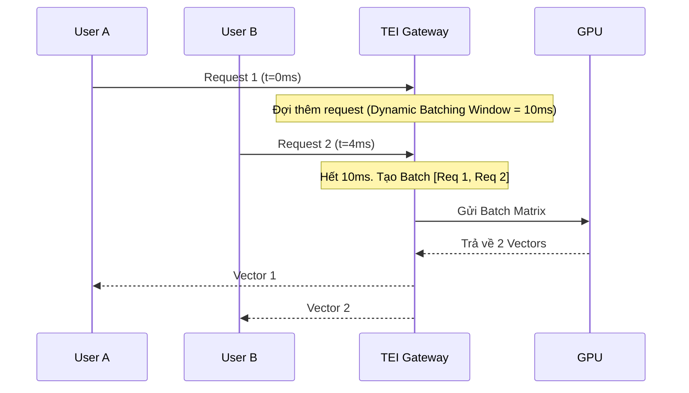

Máy tính chỉ hiểu con số, vì vậy để xử lý ngôn ngữ tự nhiên (NLP) hay dữ liệu đa phương thức, ta cần chuyển đổi chúng thành các vector số thực (Latent Space) thông qua **Embedding Models** (Mô hình nhúng). 

Tuy nhiên, dưới góc độ của một **Staff Data/AI Engineer**, việc hiểu "Embedding là gì" chỉ là bề nổi. Thách thức thực sự nằm ở **Kiến trúc hệ thống (System Design)**: Cách xử lý hàng nghìn request mỗi giây (Throughput) mà không bị sập GPU (OOMKilled), cách tối ưu chi phí (FinOps) cho Vector Database, và làm sao để giải quyết bài toán "Lời nguyền của số chiều" [Curse of Dimensionality].

Bài viết này bỏ qua các định nghĩa sách giáo khoa để tập trung hoàn toàn vào việc triển khai Embedding Models trên Production.

---

## 1. Systemic Trade-offs: Latency vs. Throughput

Khi tự triển khai các mô hình mã nguồn mở (như `BAAI/bge-large` hay `Nomic-Embed`), bạn phải đối mặt với bài toán đánh đổi kinh điển của Hệ thống Phân tán: **Độ trễ (Latency)** của một request đơn lẻ so với **Lưu lượng (Throughput)** tổng thể.

### Dynamic Batching (Gộp lô động)
GPU chỉ đạt hiệu suất tính toán tối đa (100% Compute/VRAM Utilization) khi xử lý các ma trận lớn. Nếu API của bạn gửi từng request riêng lẻ (Batch size = 1) vào GPU, hệ thống sẽ bị thắt cổ chai ở khâu truyền tải bộ nhớ (Memory Bandwidth) thay vì tính toán (Compute-bound). 

Để tối ưu, các hệ thống như **TEI (Text Embeddings Inference)** của HuggingFace sử dụng **Dynamic Batching**: Gom các request nhỏ trong một khoảng thời gian cực ngắn (VD: `5ms - 50ms`) thành một Batch lớn rồi mới đẩy vào GPU.



**Đánh đổi (Trade-off]:**
-   **Tăng Throughput:** Phục vụ được hàng nghìn RPS với cùng 1 GPU.
-   **Hy sinh Latency:** Request của User A thay vì được xử lý ngay, phải nằm đợi ở hàng đợi thêm 10ms.

---

## 2. Kiến trúc Matryoshka (MRL) & Lời nguyền số chiều

Theo truyền thống, một model sinh ra một Vector với số chiều (Dimensions) cố định (VD: 1536 chiều của OpenAI, 1024 chiều của BGE-large). 
- **Đánh đổi cũ:** Vector càng dài $\rightarrow$ Semantic càng chính xác (Recall cao) $\rightarrow$ Nhưng tốn RAM, tốn chi phí Storage của Vector DB, và thuật toán HNSW chạy cực chậm.

Để giải quyết, kiến trúc **Matryoshka Representation Learning (MRL)** ra đời (lấy cảm hứng từ búp bê Nga). MRL huấn luyện model sao cho **phần lớn thông tin ngữ nghĩa được nén ở những chiều (dimensions) đầu tiên**. 

Bạn có thể "cắt cụt" (Truncate) một vector 1536 chiều xuống còn 256 chiều mà chỉ mất khoảng 2-3% độ chính xác, trong khi tiết kiệm 600% chi phí lưu trữ và tăng tốc độ query lên gấp nhiều lần.

**Thực chiến với OpenAI Python SDK (text-embedding-3 hỗ trợ MRL):**
```python
from openai import OpenAI

client = OpenAI()

# Model text-embedding-3-large mặc định trả về 3072 chiều.
# Nhưng nhờ kiến trúc MRL, ta có thể chủ động cắt gọt (Truncate)
# xuống 256 chiều trực tiếp qua API parameter mà không cần chạy PCA.
response = client.embeddings.create(
    input="Tối ưu hóa FinOps cho Vector Database",
    model="text-embedding-3-large",
    dimensions=256 # Tính năng Truncation của MRL
)

embedding_vector = response.data[0].embedding
print(f"Kích thước vector thực tế: {len(embedding_vector)}") # Output: 256
```

> [!TIP]
> **Best Practice cho MRL:** 
> Sử dụng chiến lược **Multi-stage Retrieval**. Bạn lưu vector 256 chiều vào RAM (Vector DB] để tìm kiếm nhanh (Shortlisting Top 100). Sau đó, bạn lấy 100 ID đó truy xuất vector gốc (3072 chiều) từ Disk/S3 để Rerank lại Top 10. Cách này đạt tốc độ của 256D và độ chính xác của 3072D.

---

## 3. Rủi ro Vận hành (Operational Risks)

### Incident: VRAM Fragmentation & OOMKilled (Out of Memory)
**Triệu chứng:** Container chạy Embedding service thỉnh thoảng sập với mã lỗi `137` (OOMKilled) mặc dù RPS không đột biến.
**Nguyên nhân gốc (Root Cause):** Khác với CPU RAM, bộ nhớ GPU (VRAM) rất nhạy cảm với việc cấp phát. Khi các request có độ dài tokens quá chênh lệch (VD: Request A dài 100 tokens, Request B dài 8192 tokens) đẩy vào cùng một Batch, hệ thống phải thực hiện Padding (độn thêm token rỗng) để ma trận vuông vức. Điều này gây bùng nổ cấp phát VRAM và phân mảnh (Fragmentation).
**Khắc phục (Mitigation):**
-   Phân loại (Sort) các request theo độ dài trước khi Batching.
-   Sử dụng Engine hỗ trợ **PagedAttention** (như vLLM) để cấp phát bộ nhớ động theo từng block nhỏ thay vì vùng nhớ liền kề (contiguous).

---

## 4. Thiết kế Hạ tầng Vector Database (Terraform)

Dữ liệu nhúng không thể lưu trong MySQL hay Postgres tiêu chuẩn (dù `pgvector` đang phổ biến nhưng gặp giới hạn lớn về Scale-out khi index HNSW phình to).

Cấu hình `Terraform` triển khai môi trường Index trên **Pinecone** Serverless (Tối ưu cho MRL 256D):

```hcl
# main.tf
terraform {
  required_providers {
    pinecone = {
      source  = "pinecone-io/pinecone"
      version = "~> 0.7.0"
    }
  }
}

provider "pinecone" {
  api_key = var.pinecone_api_key
}

resource "pinecone_index" "rag_document_index" {
  name      = "enterprise-rag-index"
  
  # Khai thác MRL: Cố tình set 256 thay vì 1536/3072 để tiết kiệm 600% bill
  dimension = 256 
  
  # Metric Cosine Similarity là chuẩn mực trong NLP 
  metric    = "cosine" 
  
  spec {
    serverless {
      cloud  = "aws"
      region = "us-east-1"
    }
  }
}
```

---

## 5. FinOps: Đánh đổi Chi phí (Managed API vs Self-Host)

Bài toán tài chính (FinOps) của Embedding Models thường rơi vào cái bẫy **"API Cost Trap"**. Ở giai đoạn PoC, dùng OpenAI `text-embedding-3-small` cực kỳ rẻ [\$0.02 / 1 triệu tokens]. Nhưng khi scale hệ thống RAG lên hàng triệu documents cập nhật liên tục (Streaming Ingestion), chi phí sẽ bùng nổ.

**Chiến lược Routing (The Hybrid Approach):**
1.  **Bulk Ingestion (Lưu lượng lớn, Batch Jobs):** Dùng các cụm tự host GPU chạy mô hình Open-source (như `BGE` hoặc `Nomic-Embed`) để nhúng lại hàng chục triệu tài liệu nội bộ mỗi đêm, kiểm soát 100% Data Privacy và cố định Capex.
2.  **Ad-hoc Complex Queries (Truy vấn theo thời gian thực):** Định tuyến thông qua OpenAI/Cohere API đối với các truy vấn siêu phức tạp của VIP user, nhờ vào chất lượng truy xuất nhỉnh hơn của các mô hình thương mại.

---

## Nguồn Tham Khảo (References)

1.  **Matryoshka Representation Learning (MRL):** [NeurIPS Paper][https://arxiv.org/abs/2205.13147]. Khái niệm cốt lõi về việc nén Semantic vào các chiều đầu tiên của Vector.
2.  **Hugging Face Text Embeddings Inference (TEI):** [GitHub Repo](https://github.com/huggingface/text-embeddings-inference]. Công cụ chuẩn công nghiệp để host model.
3.  **Pinecone Architecture:** *Understanding HNSW and Vector Database Scale*.
4.  **OpenAI Blog:** *New Embedding Models and API Updates (text-embedding-3)*.
