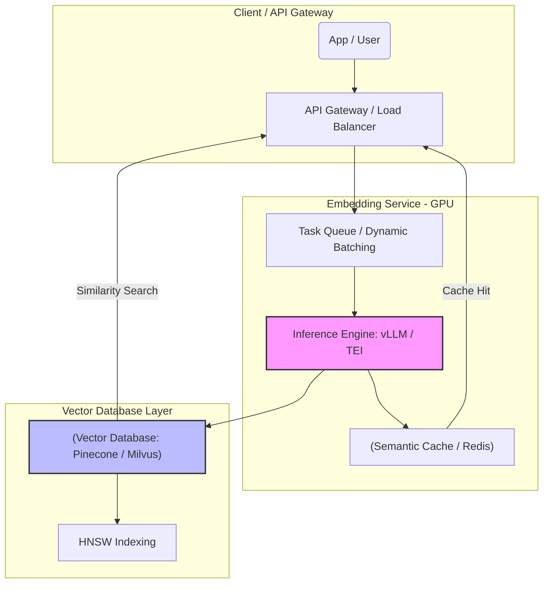

Máy tính chỉ hiểu con số, vì vậy để xử lý ngôn ngữ tự nhiên (NLP) hay dữ liệu đa phương thức (hình ảnh, âm thanh), ta cần chuyển đổi chúng thành các vector số thực thông qua **Embedding Models** (Mô hình nhúng). Tuy nhiên, dưới góc độ của một Data/ML Engineer, việc hiểu "Embedding là gì" chỉ là bề nổi. Thách thức thực sự nằm ở **Kiến trúc hệ thống (System Design)**, cách xử lý hàng nghìn request mỗi giây (Throughput) mà không bị sập GPU (OOMKilled) và cách thiết kế hạ tầng **Vector Database** sao cho hiệu quả.

Bài viết này bỏ qua các định nghĩa sách giáo khoa để tập trung hoàn toàn vào việc triển khai Embedding Models trên Production.

---

## 1. Kiến trúc luồng dữ liệu (Data Pipeline Architecture)

Một hệ thống Embedding System hoàn chỉnh ở môi trường Production (như phục vụ Semantic Search hay RAG - Retrieval-Augmented Generation) thường phải chia thành nhiều lớp (layers) để xử lý lượng tải lớn (High Load).



### Kiến trúc nhúng mô hình cơ sở
Trong quá khứ, các mô hình nhúng cơ bản như Word2Vec (hình dưới) tập trung vào dự đoán từ xung quanh để xây dựng vector (Skip-gram hoặc CBOW).


Ngày nay, với các mô hình ngữ cảnh (Transformer-based như BERT, BGE, OpenAI Embeddings), chi phí tính toán tăng theo cấp số nhân với độ dài chuỗi (`O(N^2)`). Do đó, Compute Layer phải được thiết kế cực kỳ tối ưu.

---

## 2. Systemic Trade-offs: Latency vs. Throughput

Khi triển khai các mô hình mã nguồn mở (như `BAAI/bge-large-en-v1.5` hay `Cohere`), bạn sẽ phải đối mặt với bài toán đánh đổi kinh điển: **Độ trễ (Latency)** của một request đơn lẻ so với **Lưu lượng (Throughput)** tổng thể.

### Dynamic Batching (Gộp lô động)
GPU chỉ đạt hiệu suất tính toán tối đa (100% Compute/VRAM Utilization) khi nó xử lý các ma trận lớn. Nếu API của bạn gửi từng request riêng lẻ (Batch size = 1) vào GPU, hệ thống sẽ bị thắt cổ chai ở khâu truyền tải bộ nhớ (Memory Bandwidth) thay vì tính toán (Compute-bound). 

Để tối ưu, hệ thống sử dụng **Dynamic Batching** (hoặc Micro-batching): Gom các request nhỏ trong một khoảng thời gian cực ngắn (VD: `5ms - 50ms`) thành một Batch lớn rồi mới đẩy vào GPU.

**Trade-off:**
- Bạn tăng Throughput (phục vụ được hàng nghìn RPS).
- Nhưng bạn hy sinh Latency (mỗi request phải chờ thêm `5ms-50ms` ở hàng đợi).

### Show, Don't Tell: Triển khai Text Embeddings Inference (TEI)
Thay vì tự code API bằng Flask/FastAPI (vốn dễ dẫn đến thảm họa VRAM), các kỹ sư sử dụng **TEI (Text Embeddings Inference)** của HuggingFace, chuyên biệt để tự động hóa batching và tối ưu GPU.

```yaml
# docker-compose.yml triển khai TEI với GPU
version: '3.8'
services:
  tei-embedding:
    image: ghcr.io/huggingface/text-embeddings-inference:cpu-1.2
    # image: ghcr.io/huggingface/text-embeddings-inference:86-1.2 (Cho GPU NVIDIA)
    ports:
      - "8080:80"
    volumes:
      - ./data:/data
    environment:
      # Kích hoạt Dynamic Batching
      - MAX_CONCURRENT_REQUESTS=512 
      - MAX_BATCH_TOKENS=16384
    command: >
      --model-id BAAI/bge-large-en-v1.5 
      --revision refs/pr/5 
      --max-client-batch-size 32
    deploy:
      resources:
        reservations:
          devices:
            - driver: nvidia
              count: 1
              capabilities: [gpu]
```

---

## 3. Rủi ro Vận hành (Operational Risks)

### Incident 1: VRAM Fragmentation & OOMKilled (Out of Memory)
**Triệu chứng:** Container chạy Embedding service thỉnh thoảng sập và khởi động lại với mã lỗi `137` (OOMKilled) mặc dù lượng request không đột biến.
**Nguyên nhân gốc (Root Cause):** Khác với CPU RAM, bộ nhớ GPU (VRAM) không có cơ chế phân trang (paging) tốt. Khi các request có độ dài tokens quá chênh lệch (ví dụ: request A dài 100 tokens, request B dài 8192 tokens) đẩy vào cùng một Batch, hệ thống phải thực hiện Padding (độn thêm token rỗng) để ma trận vuông vức. Điều này gây bùng nổ cấp phát VRAM và phân mảnh (Fragmentation), dẫn đến cạn kiệt bộ nhớ.
**Khắc phục (Mitigation):**
- Giới hạn `MAX_CLIENT_BATCH_SIZE` và `MAX_BATCH_TOKENS` nghiêm ngặt tại Load Balancer.
- Sử dụng các Inference Engine hỗ trợ **PagedAttention** (như vLLM) để cấp phát bộ nhớ động theo từng block nhỏ thay vì yêu cầu bộ nhớ liền kề (contiguous memory).

### Incident 2: Cartesian Explosion trong Vector DB
**Triệu chứng:** Việc query vào Vector Database (Milvus/Pinecone) trở nên cực kỳ chậm (từ vài ms lên vài giây) khi bộ lọc Metadata (Metadata Filtering) được sử dụng cùng lúc với Vector Search.
**Nguyên nhân gốc:** Hệ thống phải quét qua hàng triệu Vectors (Vector Search) và sau đó join/lọc với cấu trúc dữ liệu kiểu B-Tree (Metadata). Nếu độ chọn lọc (selectivity) của metadata filter thấp, Vector DB phải đối mặt với hiện tượng nổ tổ hợp (Cartesian Explosion).
**Khắc phục:** 
- Thiết kế Index bằng **HNSW (Hierarchical Navigable Small World)** thay vì Flat/IVF.
- Sử dụng cơ chế Pre-filtering (lọc metadata trước, sau đó dùng thuật toán HNSW tìm kiếm vector lân cận trên tập đã lọc).

---

## 4. Thiết kế Hạ tầng Vector Database bằng Terraform

Dữ liệu nhúng không thể lưu trong MySQL hay Postgres tiêu chuẩn (dù `pgvector` đang phổ biến nhưng gặp giới hạn lớn về Scale-out). Bạn cần một Vector Database chuyên dụng.

Dưới đây là một cấu hình `Terraform` triển khai môi trường Index trên **Pinecone** Serverless:

```hcl
# main.tf
terraform {
  required_providers {
    pinecone = {
      source  = "pinecone-io/pinecone"
      version = "~> 0.7.0"
    }
  }
}

provider "pinecone" {
  api_key = var.pinecone_api_key
}

resource "pinecone_index" "rag_document_index" {
  name      = "enterprise-rag-index"
  
  # Dimension phụ thuộc vào Model (VD: text-embedding-3-small là 1536, BGE-large là 1024)
  dimension = 1536 
  
  # Metric Cosine Similarity là chuẩn mực trong NLP vì nó bỏ qua độ dài vector
  metric    = "cosine" 
  
  spec {
    serverless {
      cloud  = "aws"
      region = "us-east-1"
    }
  }
}
```

---

## 5. FinOps: Đánh đổi Chi phí (Open Source vs Managed API)

Bài toán tài chính (FinOps) của Embedding Models thường rơi vào cái bẫy **"API Cost Trap"**. Ở giai đoạn PoC, dùng OpenAI `text-embedding-3-small` cực kỳ rẻ ($0.02 / 1 triệu tokens). Nhưng khi scale hệ thống RAG lên hàng triệu documents cập nhật liên tục (Real-time Streaming Ingestion), chi phí sẽ bùng nổ (Non-linear scale).

| Tiêu chí | Managed API (OpenAI/Cohere) | Tự Host Open-Source (TEI/vLLM) |
| :--- | :--- | :--- |
| **Mô hình Chi phí** | Opex (Biến phí). Trả theo số Tokens. | Capex/Opex Cố định. Trả tiền thuê GPU (Ví dụ: AWS g5.xlarge). |
| **Điểm Hòa vốn (Break-even)** | < Vài trăm triệu Tokens / tháng | > Hàng tỷ Tokens / tháng (High Throughput) |
| **Bảo mật & Tuân thủ** | Rủi ro Data Privacy (Data rời khỏi VPC) | Cao (Data locality 100% trong VPC nội bộ) |
| **Chi phí Vận hành (Ops)** | Gần như bằng 0 (Fully Managed) | Rất cao (Đòi hỏi kỹ sư MLOps/Data Engineer cứng tay để scale GPU, patching, monitor) |

**Chiến lược tối ưu (The Hybrid Approach):**
Nhiều Enterprise áp dụng thiết kế định tuyến (Routing):
1. **Bulk Ingestion (Lưu lượng lớn, Batch Jobs):** Dùng các cụm tự host GPU chạy mô hình Open-source (như `BGE` hoặc `Nomic-Embed`) để nhúng lại hàng triệu tài liệu mỗi đêm, kiểm soát hoàn toàn chi phí cơ sở hạ tầng.
2. **Ad-hoc Complex Queries (Đòi hỏi độ chính xác tuyệt đối):** Định tuyến thông qua OpenAI API/Cohere API đối với các truy vấn thời gian thực của VIP user, nhờ vào chất lượng truy xuất nhỉnh hơn của các mô hình thương mại.

---

## Nguồn Tham Khảo (References)

*   [Hugging Face Text Embeddings Inference (TEI)](https://github.com/huggingface/text-embeddings-inference)
*   [vLLM: PagedAttention cho tối ưu LLM và Embeddings](https://vllm.readthedocs.io/en/latest/)
*   [Pinecone: Vector Database Architecture & HNSW](https://www.pinecone.io/learn/vector-database/)
*   [AWS Architecture Blog: Optimizing Generative AI and Vector Databases](https://aws.amazon.com/blogs/architecture/)
*   [MTEB (Massive Text Embedding Benchmark) Leaderboard](https://huggingface.co/spaces/mteb/leaderboard)
