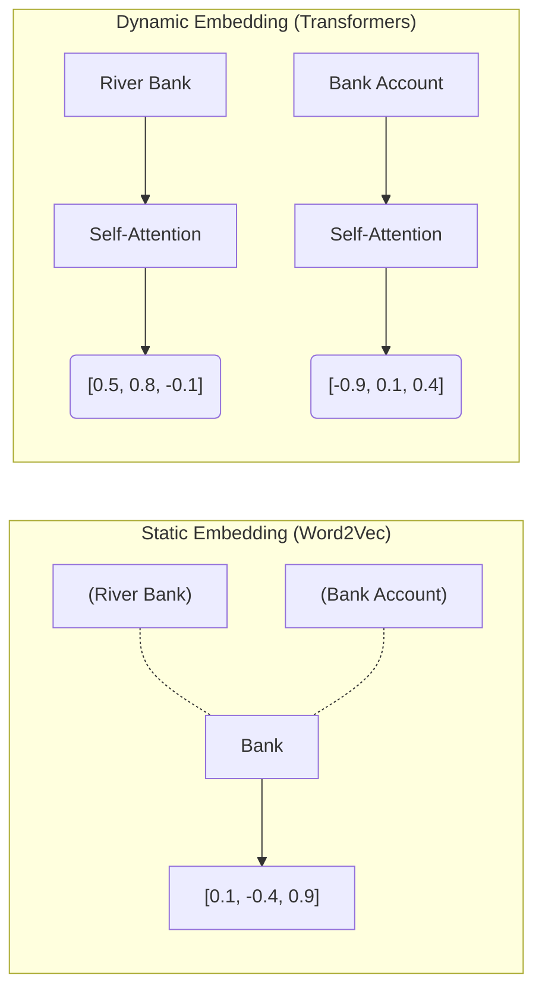

Thay vì lặp lại những khái niệm sách giáo khoa về việc Vector Embeddings giúp máy tính "Hiểu ngữ nghĩa" như thế nào, chương này sẽ nhắm thẳng vào bài toán Thiết kế Hệ thống (System Design) và Toán học Ứng dụng (Applied Mathematics). 

Khi bạn phải xử lý 100 triệu Document Embeddings cho một hệ thống RAG (Retrieval-Augmented Generation) cấp Enterprise, câu hỏi không còn là "Embedding là gì?", mà là: **Làm sao để tính toán Khoảng cách (Distance) giữa hàng tỷ Vector dưới 50ms, làm sao vượt qua "Lời nguyền số chiều" (Curse of Dimensionality), và làm sao để giảm chi phí RAM (FinOps) mà không làm mất thông tin ngữ nghĩa?**

---

## 1. Không gian Vector (Vector Space) và Sự tiến hóa

Vector Embeddings là kỹ thuật ánh xạ (Map) dữ liệu phi cấu trúc (Văn bản, Hình ảnh, Âm thanh) thành các mảng số thực (Vectors) trong một không gian liên tục nhiều chiều (Continuous High-dimensional Space). Trong không gian này, khoảng cách hình học giữa các Vector phản ánh trực tiếp sự tương đồng về mặt ngữ nghĩa (Semantic Similarity).

### 1.1. Static Embeddings (Word2Vec / GloVe)
Ra đời vào khoảng 2013, Word2Vec là thế hệ Embeddings đầu tiên tối ưu hóa tốt về hiệu năng tính toán. 
- **Cơ chế:** Nó tạo ra các Vector tĩnh (Static Embeddings). Mỗi từ trong từ điển được gán cố định một Vector duy nhất, bất kể nó nằm trong ngữ cảnh nào.
- **Điểm nghẽn (Trade-off):** Thất bại hoàn toàn trước hiện tượng Từ đồng âm khác nghĩa (Polysemy). Ví dụ: Chữ "Bank" trong "River bank" (Bờ sông) và "Bank account" [Tài khoản ngân hàng] đều ra chung một Vector. Điều này khiến chất lượng tìm kiếm RAG tụt dốc ở các Domain phức tạp.

### 1.2. Dynamic / Contextual Embeddings (Transformers / BERT)
Sự ra đời của cơ chế [Self-Attention (Vaswani et al., 2017)](https://arxiv.org/abs/1706.03762) trong Transformers đã thay đổi hoàn toàn kiến trúc.
- **Cơ chế:** Embeddings giờ đây là Động (Context-aware). Ma trận Self-Attention tính toán trọng số của mọi từ xung quanh để nhào nặn ra Vector cuối cùng cho một từ. Từ "Bank" ở 2 câu khác nhau sẽ sinh ra 2 Vector hoàn toàn nằm ở 2 góc khác nhau của Không gian.



---

## 2. Toán học Tính toán: Cosine Similarity vs Dot Product

Để tìm ra 2 văn bản giống nhau, Hệ thống (Vector Database) phải tính khoảng cách giữa 2 Vector $A$ và $B$.

### Công thức Cosine Similarity
Đo lường góc (Angle) giữa 2 Vector, bỏ qua độ lớn (Magnitude) của chúng. Đây là tiêu chuẩn vàng cho Semantic Search vì một câu dài và một câu ngắn (khác nhau về Magnitude) vẫn có thể có cùng ý nghĩa (cùng hướng).

$$ \text{"Cosine Similarity"}(A, B) = \frac{"A \cdot B"}{\|A\| \|B\|} = \frac{"\sum_{i=1"}^{n} A_i B_i}{\sqrt{"\sum_{i=1"}^{n} A_i^2} \sqrt{"\sum_{i=1"}^{n} B_i^2}} $$

**Nút thắt Hệ thống (Compute Bottleneck):**
Công thức trên đòi hỏi phải tính Căn bậc hai (Square Root) và Phép chia (Division). Trong kiến trúc phần cứng (CPU/GPU), phép chia và căn bậc hai tốn số chu kỳ xung nhịp (Clock Cycles) cực lớn, làm chậm toàn bộ hệ thống khi phải tính toán hàng tỷ lần.

### Giải pháp Kỹ thuật: L2 Normalization & Dot Product
Để tối ưu tốc độ, Data Engineers dùng một Trick toán học. Trong pha **Data Ingestion (ETL)**, họ ép chuẩn hóa (Normalize) mọi Vector về độ dài bằng 1 (L2 Normalization $\rightarrow \|A\| = 1, \|B\| = 1$).

Khi đó, mẫu số trong công thức Cosine biến mất bằng 1. **Cosine Similarity chính thức bằng Tích vô hướng (Dot Product).**

$$ \text{"Dot Product"}(A, B) = \sum_{"i=1"}^{n} A_i B_i $$

Dot Product chỉ bao gồm Phép nhân [Multiplication] và Phép cộng (Addition). Tập lệnh AVX-512 trên CPU hoặc Tensor Cores trên GPU có thể thực thi hàng triệu phép Dot Product trong một Clock Cycle (Thông qua kỹ thuật SIMD - Single Instruction Multiple Data). Tốc độ truy vấn tăng vọt hàng trăm lần.

**Code Thực chiến (Batch Ingestion Pipeline chống OOM):**

```python
from sentence_transformers import SentenceTransformer
from typing import Iterator, List
import numpy as np

# Load mô hình vào GPU VRAM
model = SentenceTransformer('all-MiniLM-L6-v2')

def batch_generator(data: List[str], batch_size: int] -> Iterator[List[str]]:
    """Generator chia nhỏ dữ liệu thành các Batch để tránh OOMKilled trên GPU."""
    for i in range[0, len(data), batch_size):
        yield data[i:i + batch_size]

def ingest_embeddings[large_corpus: List[str]]:
    # Tối ưu FinOps: Batch size phụ thuộc vào VRAM. Quá lớn -> OOM; quá nhỏ -> Low Throughput.
    BATCH_SIZE = 128 
    
    for batch in batch_generator(large_corpus, BATCH_SIZE):
        # normalize_embeddings=True là TỐI QUAN TRỌNG để dùng Dot Product ở bước Search sau này
        embeddings = model.encode(batch, normalize_embeddings=True) # Type: np.ndarray, float32
        
        # Ghi embeddings vào Vector DB (Ví dụ: Milvus / Qdrant)
        # qdrant_client.upsert(points=embeddings)
```

---

## 3. Dimensionality Trade-offs (Đánh đổi Số chiều) và FinOps

Số chiều của Vector (Dimensionality) quyết định dung lượng RAM phải trả (FinOps) và tốc độ của hệ thống. 
- Mô hình nhỏ (MiniLM): 384 chiều.
- OpenAI `text-embedding-3-small`: 1536 chiều.
- OpenAI `text-embedding-3-large`: 3072 chiều.

### Sự Đánh Đổi (The Architectural Trade-off)
1. **Tăng Số chiều (High Dimensionality):**
   - *Ưu điểm:* Lưu trữ được nhiều thông tin phức tạp, ngữ cảnh sâu xa, và các mối quan hệ ngôn ngữ vi tế (Nuance). Tăng tỷ lệ Recall (Độ chính xác).
   - *Nhược điểm:* Ngốn RAM lũy tiến. Tăng Compute Latency. 
   - *Đặc biệt - Lời nguyền Số chiều (Curse of Dimensionality):* Khi số chiều vọt lên quá cao (>4000), khoảng cách toán học giữa *mọi cặp điểm* trong không gian tiến về một hằng số bằng nhau. Hệ thống mất hoàn toàn khả năng phân biệt đâu là điểm gần, đâu là điểm xa.
2. **Giảm Số chiều (Low Dimensionality):**
   - *Ưu điểm:* Tiết kiệm hàng chục ngàn USD tiền thuê Server RAM lớn. Tốc độ tìm kiếm chớp nhoáng.
   - *Nhược điểm:* Xảy ra hiện tượng "Information Collapse" [Sụp đổ Thông tin], các từ vựng tinh tế bị gộp chung vào một góc, làm giảm độ chính xác của RAG.

### Giải pháp FinOps: Matryoshka Representation Learning (MRL)
Các mô hình thế hệ mới của OpenAI (`text-embedding-3`) sử dụng kỹ thuật huấn luyện **MRL (Búp bê Nga Matryoshka)**. 
- Cơ chế: Mô hình được ép phải nhét những thông tin ngữ nghĩa quan trọng nhất vào những chiều (Dimensions) đầu tiên của Vector. Những chiều phía sau chỉ chứa thông tin bổ trợ.
- Ứng dụng FinOps: Bạn có thể sử dụng API sinh ra Vector 1536 chiều, sau đó Kỹ sư Dữ liệu dùng Code Python **chặt bỏ thẳng tay** (Truncate) phần đuôi, chỉ giữ lại 256 chiều đầu tiên để lưu vào Vector DB. 
- Kết quả: Giảm 6x lần chi phí RAM/Storage, nhưng tỷ lệ chính xác (Recall) chỉ sụt giảm chưa tới 3%. Đây là kỹ thuật cắt giảm chi phí (Cost Cutting) kinh điển trong MLOps.

---

## 4. Tóm lược Quy trình Engineering

Khi thiết kế một hệ thống Semantic Search Dựa trên Embeddings, hãy luôn nhớ bộ nguyên tắc sau:
1. Luôn dùng **Batch Processing** khi sinh Embeddings để không làm sập GPU (OOMKilled).
2. Luôn **L2 Normalize** Vectors ngay từ lúc Ingestion để có thể xài **Dot Product** thay vì Cosine Similarity ở tầng Vector DB.
3. Không phải lúc nào Model to (3072D) cũng tốt. Cân nhắc dùng kỹ thuật Cắt số chiều (Dimensionality Truncation / MRL) kết hợp **Scalar Quantization** để ép chi phí RAM xuống mức chấp nhận được.

---

## Nguồn Tham Khảo (References)

* [Attention Is All You Need (Vaswani et al., 2017)](https://arxiv.org/abs/1706.03762) - Khởi nguồn của cơ chế Dynamic Contextual Embeddings.
* [Matryoshka Representation Learning (Kusupati et al., 2022)](https://arxiv.org/abs/2205.13147) - Kỹ thuật ép thông tin vào các chiều đầu tiên của Vector.
* [OpenAI Blog: New Embedding Models and API Updates](https://openai.com/index/new-embedding-models-and-api-updates/) - Hướng dẫn ứng dụng Dimensionality Reduction cho FinOps.
* [Qdrant: Cosine Similarity vs Dot Product](https://qdrant.tech/documentation/concepts/search/) - Giải thích toán học về tối ưu hóa SIMD trên Hardware.
* [Curse of Dimensionality in Nearest Neighbor Search](https://en.wikipedia.org/wiki/Curse_of_dimensionality) - Các giới hạn toán học trong không gian Vector nhiều chiều.
