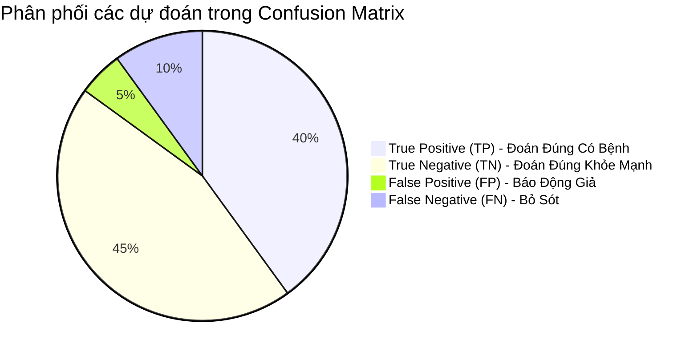
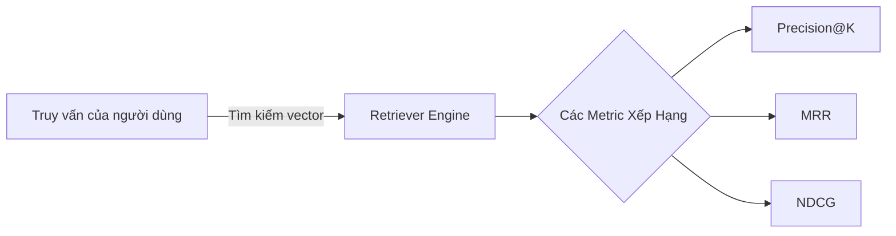
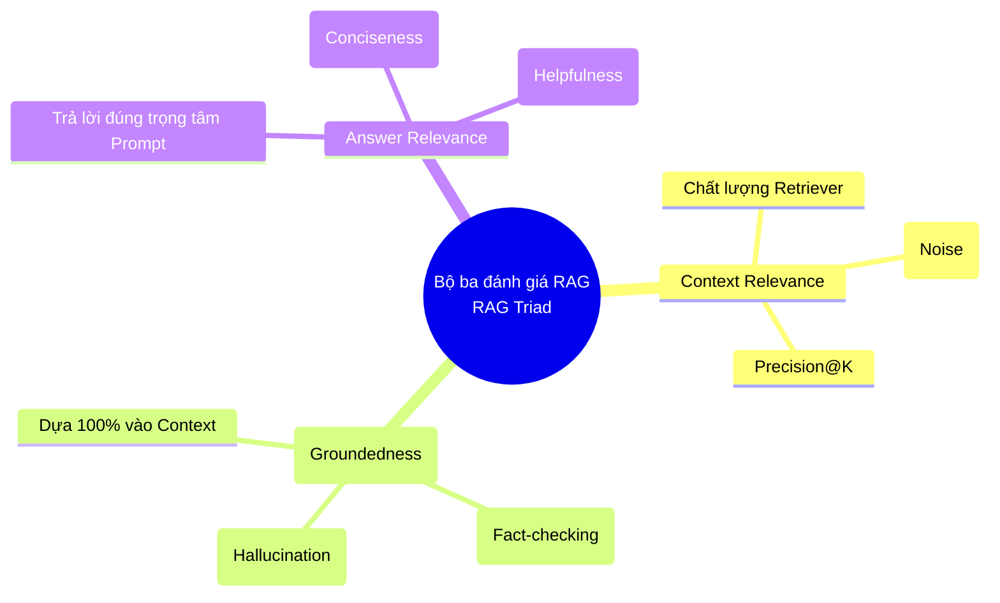

Có một câu nói nổi tiếng trong giới quản trị và kỹ thuật được gán cho Peter Drucker: *"Bạn không thể cải thiện những thứ bạn không thể đo lường"* (You can't improve what you don't measure). Trong lĩnh vực Trí tuệ nhân tạo (AI) và Học máy (Machine Learning), **Evaluation Metric (Chỉ số đánh giá)** chính là kim chỉ nam. Chúng đóng vai trò là thước đo để đánh giá mức độ hiệu quả, chính xác và đáng tin cậy của các mô hình từ Machine Learning cổ điển, Deep Learning cho đến các hệ thống RAG (Retrieval-Augmented Generation) tiên tiến nhất.

---

## 1. Tại sao việc chọn đúng Chỉ số đánh giá lại mang tính sống còn?


Việc huấn luyện (training) một mô hình chỉ là bước đầu tiên và thường là bước dễ nhất nhờ các thư viện sẵn có. Để biết mô hình có thực sự giải quyết được bài toán kinh doanh hay không, chúng ta cần so sánh dự đoán của mô hình với thực tế (ground truth) thông qua các góc nhìn đa chiều. Các chỉ số đánh giá giúp chúng ta:

- **So sánh khách quan (Benchmarking):** Quyết định xem mô hình A hay mô hình B hoạt động tốt hơn trên cùng một tập dữ liệu, hoặc kiến trúc nào phù hợp hơn để triển khai (deploy) lên production.
- **Tối ưu hóa (Optimization):** Làm hàm mục tiêu (objective function / loss function) hoặc hướng dẫn quá trình tinh chỉnh tham số (hyperparameter tuning).
- **Phát hiện các vấn đề tiềm ẩn:** Nhận biết sớm các hiện tượng như overfitting (học vẹt), underfitting (chưa học đủ) hoặc các cạm bẫy do mất cân bằng dữ liệu (data imbalance).
- **Gắn kết với mục tiêu kinh doanh:** Đảm bảo rằng việc cải thiện mô hình thực sự mang lại lợi ích cho người dùng cuối (ví dụ: giảm tỷ lệ rời bỏ, tăng doanh thu, tối ưu hóa chi phí vận hành).

> [!WARNING]
> **Cạm bẫy "Mù quáng vì Accuracy":** Giả sử tập dữ liệu của bạn có 99% email bình thường và 1% email rác (spam). Một mô hình ngây ngô luôn dự đoán "tất cả đều là email bình thường" sẽ đạt **Accuracy = 99%**. Nếu chỉ nhìn vào con số này, sếp bạn sẽ rất vui. Tuy nhiên, mô hình này hoàn toàn vô dụng vì nó không phát hiện được bất kỳ email rác nào. Đó là lý do tại sao ta cần phân tích sâu hơn bằng các chỉ số khác.

---

## 2. Các chỉ số cho bài toán Phân loại (Classification)

Bài toán phân loại nhằm mục đích dự đoán nhãn (label) của một quan sát vào một trong các danh mục có sẵn. Nền tảng của các chỉ số đánh giá phân loại là **Confusion Matrix** (Ma trận nhầm lẫn).

### 2.1 Confusion Matrix

Giả sử chúng ta đang dự đoán một bệnh nhân có ung thư (Positive - Lớp 1) hay không (Negative - Lớp 0):

- **True Positive (TP):** Bệnh nhân có bệnh, mô hình dự đoán đúng là CÓ.
- **True Negative (TN):** Bệnh nhân khỏe mạnh, mô hình dự đoán đúng là KHÔNG.
- **False Positive (FP - Lỗi loại I):** Bệnh nhân khỏe mạnh, nhưng mô hình dự đoán nhầm là CÓ (Báo động giả / False Alarm).
- **False Negative (FN - Lỗi loại II):** Bệnh nhân có bệnh, nhưng mô hình dự đoán nhầm là KHÔNG (Bỏ sót).



### 2.2 Các chỉ số dẫn xuất cốt lõi

Từ 4 thành phần trên, chúng ta tính toán được các chỉ số quan trọng:

*   **Accuracy (Độ chính xác tổng thể):** Tỷ lệ phần trăm các dự đoán đúng trên tổng số dự đoán.
    *   *Công thức:* $\frac{TP + TN}{TP + TN + FP + FN}$
    *   *Sử dụng khi:* Dữ liệu cân bằng (các lớp có số lượng mẫu xấp xỉ nhau) và lỗi FP, FN có mức độ nghiêm trọng tương đương nhau.

*   **Precision (Độ chuẩn xác - Positive Predictive Value):** Trong số các mẫu được hệ thống đánh dấu là Positive, có bao nhiêu phần trăm là đúng?
    *   *Công thức:* $\frac{TP}{TP + FP}$
    *   *Ứng dụng:* Khi chi phí hoặc hậu quả của **False Positive rất cao**. Ví dụ: Hệ thống gợi ý video trên YouTube (nếu gợi ý sai quá nhiều, người dùng sẽ bỏ đi), thuật toán đánh dấu spam email (nếu đưa nhầm email công việc quan trọng vào mục spam thì hậu quả rất lớn).

*   **Recall / Sensitivity (Độ bao phủ - True Positive Rate):** Trong toàn bộ các mẫu thực sự là Positive trong thực tế, hệ thống đã "tóm" được bao nhiêu phần trăm?
    *   *Công thức:* $\frac{TP}{TP + FN}$
    *   *Ứng dụng:* Khi chi phí hoặc hậu quả của **False Negative rất cao**. Ví dụ: Tầm soát bệnh lý (thà báo động giả để bác sĩ kiểm tra lại còn hơn bỏ sót bệnh nhân ung thư), phát hiện gian lận giao dịch ngân hàng.

*   **F1-Score:** Là trung bình điều hòa (harmonic mean) của Precision và Recall. Chỉ số này phạt rất nặng khi Precision hoặc Recall quá thấp (tiệm cận 0).
    *   *Công thức:* $2 \times \frac{Precision \times Recall}{Precision + Recall}$
    *   *Sử dụng khi:* Cần một con số duy nhất để cân bằng giữa Precision và Recall, đặc biệt trên các tập dữ liệu mất cân bằng.

### 2.3 Ví dụ Code Python với Scikit-learn

Dưới đây là cách tính toán nhanh bằng thư viện `scikit-learn` phổ biến:

```python
from sklearn.metrics import accuracy_score, precision_score, recall_score, f1_score, confusion_matrix

# Ground truth: 1 là có bệnh, 0 là bình thường
y_true = [0, 1, 1, 0, 1, 1, 0, 0, 0, 0] 
# Mô hình dự đoán
y_pred = [0, 1, 0, 0, 1, 1, 1, 0, 0, 0] 

print("--- Phân tích kết quả ---")
print(f"Confusion Matrix:\n{confusion_matrix(y_true, y_pred)}")
# Diễn giải ma trận: [[TN, FP], [FN, TP]] -> [[5, 1], [1, 3]]
print(f"Accuracy:  {accuracy_score(y_true, y_pred):.2f}")  # 0.80
print(f"Precision: {precision_score(y_true, y_pred):.2f}") # 0.75
print(f"Recall:    {recall_score(y_true, y_pred):.2f}")    # 0.75
print(f"F1 Score:  {f1_score(y_true, y_pred):.2f}")        # 0.75
```

### 2.4 Đánh giá toàn diện với ROC-AUC và PR-AUC

Các mô hình học máy (như Logistic Regression, Random Forest) không chỉ trả về nhãn cứng (0 hoặc 1) mà trả về **xác suất (probability)** từ 0.0 đến 1.0. Tùy thuộc vào việc chúng ta chọn **ngưỡng (threshold)** ở đâu (mặc định là 0.5), các chỉ số Precision/Recall sẽ thay đổi. 

*   **ROC-AUC (Area Under the Receiver Operating Characteristic Curve):** 
    *   Đồ thị vẽ True Positive Rate (Recall) trên trục Y và False Positive Rate trên trục X ở mọi ngưỡng có thể. 
    *   **AUC (Area Under Curve)** là diện tích dưới đường cong ROC. AUC = 0.5 tương đương một con khỉ đoán mò (tung đồng xu), AUC = 1.0 là mô hình tiên tri hoàn hảo.
*   **PR-AUC (Precision-Recall Area Under Curve):** 
    *   Vẽ Precision trên trục Y và Recall trên trục X. 
    *   **Lưu ý quan trọng:** PR-AUC thường được giới chuyên gia ưu tiên **hơn rất nhiều so với ROC-AUC** khi xử lý dữ liệu bị mất cân bằng trầm trọng (highly imbalanced data) vì ROC-AUC có xu hướng đưa ra bức tranh quá lạc quan.

---

## 3. Các chỉ số cho bài toán Hồi quy (Regression)

Với bài toán hồi quy (dự đoán một giá trị liên tục như giá nhà, nhiệt độ, doanh thu, tuổi thọ), chúng ta không dùng khái niệm "đúng/sai" tuyệt đối. Thay vào đó, chúng ta đo **khoảng cách (sai số)** giữa giá trị dự đoán ($\hat{y}$) và giá trị thực tế ($y$).

### 3.1 Các chỉ số đo lường sai số (Error Metrics)

*   **MAE (Mean Absolute Error):** Trung bình của trị tuyệt đối các sai số.
    *   *Đặc điểm:* Trọng số của mọi lỗi đều bằng nhau. Cực kỳ dễ hiểu với người không làm kỹ thuật và **ít bị ảnh hưởng bởi các giá trị ngoại lai (outliers)**.
    *   *Công thức:* $\text{MAE} = \frac{1}{n} \sum_{i=1}^{n} |y_i - \hat{y}_i|$

*   **MSE (Mean Squared Error):** Trung bình của bình phương các sai số.
    *   *Đặc điểm:* Do việc bình phương, MSE **phạt rất nặng các sai số lớn**. Nó khiến mô hình trở nên rất nhạy cảm với dữ liệu nhiễu (outliers).
    *   *Công thức:* $\text{MSE} = \frac{1}{n} \sum_{i=1}^{n} (y_i - \hat{y}_i)^2$

*   **RMSE (Root Mean Squared Error):** Căn bậc hai của MSE.
    *   *Đặc điểm:* Việc lấy căn bậc hai giúp đưa sai số về **cùng đơn vị** với biến mục tiêu ban đầu. Ví dụ: Nếu bạn dự đoán giá nhà bằng USD, MSE sẽ ra đơn vị $USD^2$ (rất khó hiểu), nhưng RMSE sẽ trả về kết quả bằng USD, giúp bạn kết luận "mô hình dự đoán lệch trung bình khoảng 50,000 USD".

*   **MAPE (Mean Absolute Percentage Error):** Đo lường phần trăm sai số.
    *   *Công thức:* $\text{MAPE} = \frac{1}{n} \sum_{i=1}^{n} \left| \frac{y_i - \hat{y}_i}{y_i} \right| \times 100\%$
    *   *Đặc điểm:* Tuyệt vời để giải thích cho ban lãnh đạo (VD: "Mô hình dự báo doanh thu của chúng ta có sai số trung bình 5%"). Khuyết điểm lớn nhất là sẽ gặp lỗi chia cho 0 (Divide by Zero) nếu thực tế $y_i = 0$.

### 3.2 Chỉ số tương quan và giải thích (Correlation Metrics)

*   **R² (R-squared / Coefficient of Determination):** Thể hiện tỷ lệ phương sai của biến phụ thuộc có thể được giải thích (dự đoán) từ biến độc lập bởi mô hình.
    *   *Giá trị:* Trải dài từ $-\infty$ đến 1. Giá trị gần 1 tức là mô hình giải thích được phần lớn sự biến thiên của dữ liệu. R² = 0 nghĩa là mô hình dự đoán trung bình. Nếu R² < 0, mô hình của bạn còn tệ hơn việc không học gì và chỉ đoán luôn bằng giá trị trung bình của tập dữ liệu.

---

## 4. Các chỉ số cho Hệ thống Tìm kiếm (Information Retrieval) & RAG

Hệ thống Retrieval-Augmented Generation (RAG), hệ thống gợi ý (Recommendation Systems - ví dụ như thuật toán của Netflix, Shopee) hoặc các công cụ tìm kiếm cần đo lường mức độ liên quan của thông tin được truy xuất, đặc biệt là **thứ tự xếp hạng (ranking)** của các kết quả.



### 4.1 Đánh giá Ranking & Retrieval

*   **Precision@k & Recall@k:** Đo lường Precision và Recall nhưng chỉ tính trên **top $k$ kết quả trả về đầu tiên**. Trong thực tế, sự kiên nhẫn của người dùng rất thấp. Họ thường chỉ nhìn vào trang 1 (k=10). Nếu tài liệu đúng nằm ở vị trí thứ 100, về lý thuyết Recall là hoàn hảo, nhưng về trải nghiệm người dùng thì hệ thống đã thất bại. Do đó, ta quan tâm đến độ chính xác trong top 5 hoặc top 10 kết quả.

*   **MRR (Mean Reciprocal Rank):** Tập trung trả lời câu hỏi: **"Kết quả đúng ĐẦU TIÊN nằm ở đâu?"**.
    *   *Cách tính:* Lấy nghịch đảo vị trí (rank) của kết quả đúng đầu tiên. Nếu kết quả đúng ở vị trí số 1 $\rightarrow$ điểm là 1/1 = 1.0. Ở vị trí số 2 $\rightarrow$ điểm là 1/2 = 0.5. Vị trí số 3 $\rightarrow$ điểm là 1/3 = 0.33. Trung bình cộng các điểm này cho toàn bộ truy vấn ta được MRR.
    *   *Ứng dụng:* Cực kỳ phù hợp cho hệ thống Hỏi đáp (QA), nơi người dùng chỉ cần một câu trả lời đúng duy nhất (ví dụ: Google search "Thủ đô của Úc là gì?", người dùng chỉ cần thấy chữ Canberra ở ngay kết quả đầu).

*   **NDCG (Normalized Discounted Cumulative Gain):** Đây là "vua" của các chỉ số xếp hạng tổng thể, nó phức tạp nhưng mạnh mẽ vì có 2 ưu điểm:
    1.  Chấp nhận điểm "mức độ liên quan" phân cấp theo thang điểm thay vì chỉ đúng/sai nhị phân (ví dụ: Rất liên quan = 3, Hơi liên quan = 1, Hoàn toàn không liên quan = 0).
    2.  Có cơ chế **Phạt nặng (Discount)** thông qua hàm logarit. Nó cho rằng một kết quả Rất liên quan (điểm 3) nhưng lại bị đẩy xuống vị trí thứ 10 thì giá trị mang lại cho người dùng kém hơn nhiều so với việc nó xuất hiện ở vị trí số 1.

---

## 5. Đánh giá Mô hình Ngôn ngữ Lớn (LLMs & Generative AI)

Đánh giá văn bản do Generative AI và LLM sinh ra là một thách thức vô cùng lớn do tính chất mở của ngôn ngữ tự nhiên. Cùng một câu trả lời có thể được diễn đạt theo hàng trăm cách khác nhau (paraphrasing). Việc so khớp từng từ cứng nhắc (exact match) như truyền thống đã trở nên lỗi thời.

### 5.1 Các chỉ số truyền thống đếm từ (N-gram based)

Mặc dù ngày càng ít được sử dụng để đánh giá LLM tổng quát (như ChatGPT), nhưng chúng vẫn hữu ích trong các tác vụ hẹp có câu trả lời tham chiếu rõ ràng:

*   **BLEU (Bilingual Evaluation Understudy):** Đo lường sự trùng lặp cụm từ (n-grams) giữa văn bản AI sinh ra và (các) văn bản tham chiếu do con người viết. Ra đời và phổ biến trong Dịch máy (Machine Translation). BLEU bản chất là một phiên bản cải tiến của **Precision**.
*   **ROUGE (Recall-Oriented Understudy for Gisting Evaluation):** Ngược lại với BLEU, ROUGE thường dùng trong bài toán Tóm tắt văn bản (Text Summarization). Nó tập trung vào **Recall** (Liệu bản tóm tắt do AI tạo ra có chứa đủ các ý chính của bản gốc dài hay không?).

### 5.2 Chỉ số dựa trên Ngữ nghĩa (Semantic based)

Để khắc phục nhược điểm của việc đếm từ, các kỹ thuật hiện đại sử dụng Embedding:

*   **BERTScore:** Sử dụng các mạng nơ-ron ngôn ngữ được huấn luyện trước (như BERT, RoBERTa) để chuyển từng từ thành vector ngữ cảnh hóa. Sau đó tính độ tương đồng cosine (cosine similarity) giữa các vector của văn bản sinh ra và văn bản tham chiếu. 
    *   *Ưu điểm tuyệt đối:* Nhận biết được từ đồng nghĩa cực tốt. Ví dụ: AI sinh ra từ "tuyệt vời" và con người dùng từ "hoàn hảo", BERTScore sẽ nhận ra chúng giống nhau và cho điểm cao, trong khi BLEU score sẽ chấm là 0 vì hai từ khác nhau hoàn toàn về mặt chữ.

### 5.3 Đánh giá hệ thống RAG chuyên sâu với Framework (RAGAS / TruLens)

Hệ thống RAG là sự kết hợp của Tìm kiếm (Retrieval) và Sinh văn bản (Generation). Do đó, nó thường được đánh giá qua 3 khía cạnh cốt lõi được gọi là **RAG Triad**:

1.  **Context Relevance / Precision (Độ liên quan của ngữ cảnh):** Bước Retriever lấy ra tài liệu có liên quan đến câu hỏi của người dùng không? Hệ thống tìm kiếm giỏi là hệ thống chỉ trả về đúng các đoạn văn (chunks) chứa câu trả lời và không chứa các đoạn rác gây nhiễu (noise) cho LLM.
2.  **Groundedness / Faithfulness (Tính trung thực / Không ảo giác):** Câu trả lời của LLM có được suy luận hoàn toàn từ những ngữ cảnh được cung cấp không? Hay LLM đang tự ý "bịa" ra thông tin sai lệch (Hallucination) từ lượng kiến thức bị nhầm lẫn bên trong nó?
3.  **Answer Relevance (Độ liên quan của câu trả lời):** Đôi khi AI trả lời rất đúng sự thật, không bịa đặt, nhưng... trả lời sai trọng tâm. Tiêu chí này đánh giá xem câu trả lời cuối cùng có giải quyết chính xác mục tiêu của câu hỏi (User Prompt) hay không.



### 5.4 LLM-as-a-Judge (Dùng siêu AI để chấm điểm AI)

Vì chi phí thuê chuyên gia con người (Human Evaluation) đọc và chấm điểm từng dòng text là quá đắt đỏ và chậm chạp, xu hướng hiện nay là sử dụng khái niệm **LLM-as-a-Judge**. Chúng ta sẽ dùng các mô hình LLM mạnh nhất, thông minh nhất (như GPT-4o, Claude 3.5 Sonnet) để tự động hóa việc làm "giám khảo" chấm điểm các mô hình nhỏ hơn (như Llama 3 8B) hoặc chấm điểm pipeline RAG của bạn.

> [!TIP]
> **Mẫu Prompt cơ bản cho LLM-as-a-Judge:**
> "Bạn là một giám khảo kỹ thuật công bằng và khắt khe. Hãy chấm điểm câu trả lời do AI sinh ra dưới đây từ 1 đến 5 sao dựa trên các tiêu chí sau: Tính hữu ích, Độ chính xác thực tế, và Không vòng vo. 
> 
> [Câu hỏi của người dùng]: {user_question}
> [Câu trả lời của hệ thống]: {system_answer}
> 
> Yêu cầu: Hãy cung cấp phân tích lý do từng bước (chain-of-thought) trước khi đưa ra điểm số cuối cùng."

Phương pháp LLM-as-a-Judge đã được chứng minh qua nhiều nghiên cứu là có độ tương quan (Human Correlation) cực kỳ sát với đánh giá của chuyên gia con người, cho phép các kỹ sư MLOps scale up việc thử nghiệm và tối ưu hóa hệ thống liên tục trên quy mô lớn.

---

## 6. Những sai lầm chết người trong thực tiễn (Best Practices)

1.  **Tối ưu hóa sai Metric cho bài toán:** Áp dụng mù quáng Accuracy cho bài toán phát hiện giao dịch gian lận (nơi chỉ có 0.01% là gian lận). Hậu quả: Mô hình dự đoán "tất cả giao dịch đều an toàn" để đạt Accuracy 99.99%. Sếp khen ngợi, deploy lên production, và công ty phá sản vì hacker lộng hành. *Mẹo:* Luôn dùng PR-AUC hoặc F1-Score cho bài toán mất cân bằng.
2.  **Rò rỉ dữ liệu (Data Leakage):** Đây là lỗi phổ biến nhất của Data Scientist mới vào nghề. Vô tình để lọt một phần tập đánh giá (Test set) trộn lẫn vào tập huấn luyện (Train set). Khi test, Evaluation Metrics cao chót vót, nhưng đem ra thực tế thì "thảm họa" vì mô hình chỉ đơn giản là đang "học vẹt" đáp án.
3.  **Tách rời Metric kỹ thuật khỏi Metric kinh doanh (Business KPI):** Đôi khi bạn cày cuốc cả tháng trời để nâng F1-Score từ 0.85 lên 0.87 bằng một mô hình Deep Learning siêu khổng lồ. Nhưng đổi lại, độ trễ hệ thống (latency) tăng gấp 10 lần và chi phí thuê GPU AWS đội lên quá cao, khiến dự án bị đóng cửa. Hãy nhớ: Mọi cải tiến Evaluation Metric cuối cùng phải đem lại giá trị ROI dương cho doanh nghiệp.

---

## Tài Liệu Tham Khảo Mở Rộng
* [Scikit-learn: Model evaluation - Quantifying the quality of predictions](https://scikit-learn.org/stable/modules/model_evaluation.html)
* [Ragas Framework: Automated Evaluation of Retrieval Augmented Generation](https://docs.ragas.io/)
* [TruLens: Evaluation and Tracking for LLM Apps](https://www.trulens.org/)
* [Evaluating LLMs - Hugging Face Guide](https://huggingface.co/docs/evaluate/index)
* [Khóa học Machine Learning Yearning - Andrew Ng](https://www.deeplearning.ai/machine-learning-yearning/)
* [BLEU: a Method for Automatic Evaluation of Machine Translation](https://aclanthology.org/P02-1040.pdf)
