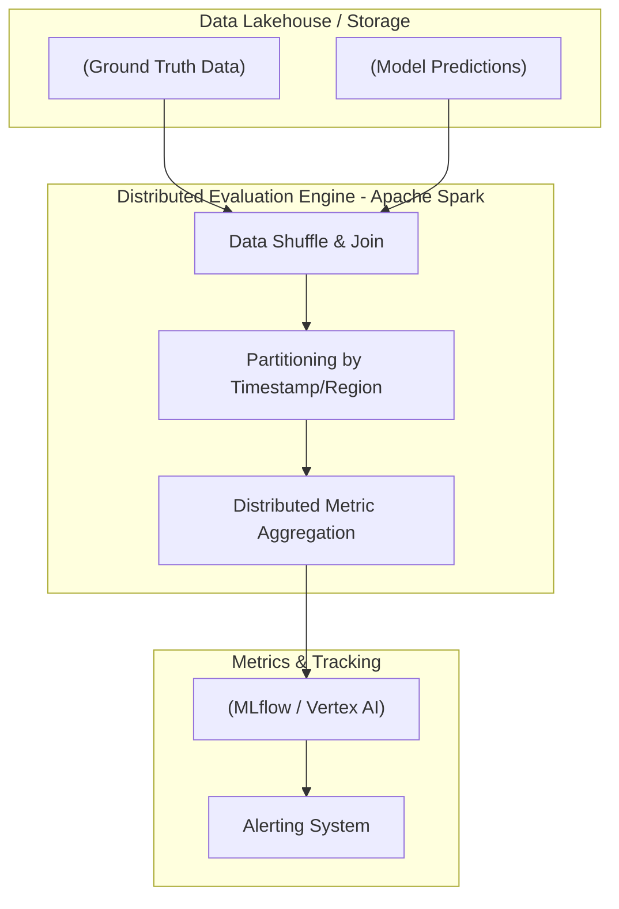
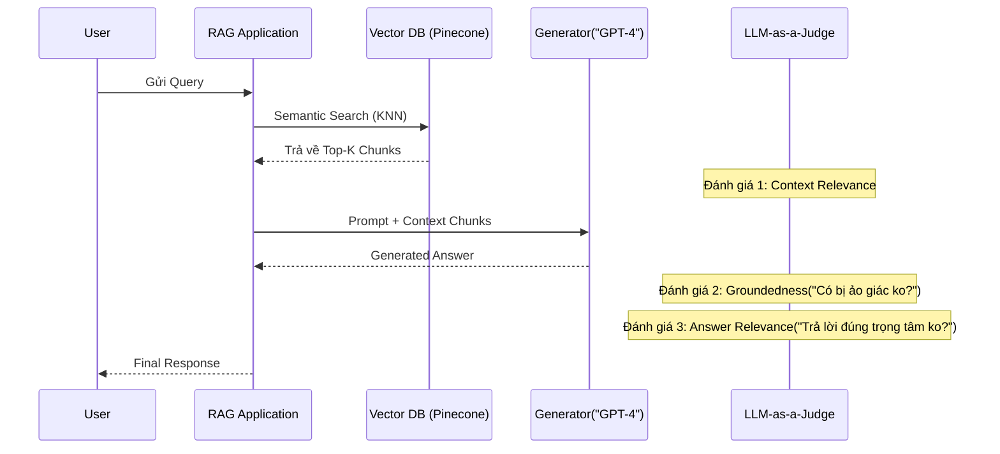

Khác với môi trường lab hay các cuộc thi Kaggle, việc đánh giá một mô hình Machine Learning hay hệ thống RAG (Retrieval-Augmented Generation) trên production không chỉ dừng lại ở độ chính xác (Accuracy, F1-Score). Đối với một Data Engineer / MLOps Engineer, Evaluation là bài toán về **Kiến trúc Hệ thống (System Architecture)**, sự đánh đổi giữa **Độ trễ (Latency)** và **Chi phí (FinOps)**, cũng như khả năng chống chịu lỗi (Resilience) khi dữ liệu bùng nổ (Data Explosion).

Bài viết này đi sâu vào việc triển khai tính toán Evaluation Metrics ở quy mô Enterprise, phân tích các điểm nghẽn (Bottlenecks) và các rủi ro vận hành (Operational Risks).

---

## 1. Kiến trúc Pipeline Đánh giá (Evaluation Pipeline Architecture)

Việc tính toán metric trên tập dữ liệu hàng tỷ dòng đòi hỏi một hệ thống phân tán (Distributed System). Chúng ta không thể tải toàn bộ kết quả dự đoán (Predictions) và nhãn gốc (Ground Truth) vào RAM của một máy đơn lẻ (Single Node) để chạy hàm `scikit-learn`.



### 1.1. Rủi ro Vận hành (Operational Risks)

*   **JVM OOMKilled (Out of Memory):** Khi tính toán **PR-AUC** hoặc **ROC-AUC**, hệ thống cần phải sắp xếp (sort) lại toàn bộ dữ liệu dự đoán theo xác suất (probabilities). Trên Apache Spark, nếu dữ liệu bị chênh lệch (Data Skewness) đẩy hết vào một phân vùng (partition), tác vụ `orderBy` hoặc biến đổi ma trận nhầm lẫn (Confusion Matrix) khổng lồ sẽ gây ra tràn bộ nhớ heap (JVM OOMKilled) khiến toàn bộ Job thất bại.
*   **Giải pháp (Workaround):** Sử dụng phép tính gần đúng (Approximate Metrics) như rỗ chứa (Bucketing / Quantiles) thay vì tính chính xác từng điểm dữ liệu trên toàn bộ mảng.

### 1.2. Code Thực chiến (PySpark Distributed Evaluation)

Dưới đây là đoạn code mẫu tính toán Multi-class Classification Evaluator trên Apache Spark, tối ưu hóa để tránh Data Skew:

```python
from pyspark.ml.evaluation import MulticlassClassificationEvaluator
from pyspark.sql import DataFrame
import pyspark.sql.functions as F

def distributed_evaluation(df: DataFrame, label_col: str, pred_col: str) -> dict:
    # Repartition dữ liệu để tránh Data Skew trước khi tính toán Aggregation
    df_balanced = df.repartition(200, label_col)
    
    evaluator = MulticlassClassificationEvaluator(
        labelCol=label_col, 
        predictionCol=pred_col, 
        metricName="f1"
    )
    
    # Tính toán phân tán trên cụm
    f1_score = evaluator.evaluate(df_balanced)
    
    # Tính Accuracy thủ công tối ưu (tránh Shuffle lớn)
    correct_preds = df_balanced.filter(F.col(label_col) == F.col(pred_col)).count()
    total_preds = df_balanced.count()
    accuracy = correct_preds / total_preds if total_preds > 0 else 0.0
    
    return {"f1_score": f1_score, "accuracy": accuracy}
```

---

## 2. RAG Triad và Hệ thống Truy xuất (Retrieval-Augmented Generation Metrics)

Đánh giá một hệ thống RAG phức tạp hơn nhiều so với phân loại nhị phân. Hệ thống RAG bao gồm 2 pha: **Retrieval (Truy xuất)** và **Generation (Sinh văn bản)**. Framework tiêu chuẩn trong ngành hiện nay là bộ ba **RAG Triad** (Context Relevance, Groundedness, Answer Relevance).



### 2.1. Đánh đổi Hệ thống (Systemic Trade-offs)

*   **Top-K (Retrieval Precision vs. FinOps Cost):** 
    *   Tăng hệ số $K$ (số lượng đoạn văn bản lấy ra từ Vector DB) sẽ tăng **Recall**, giảm thiểu việc bỏ sót thông tin. 
    *   **Nhưng (Trade-off):** Tăng $K$ đồng nghĩa với việc đẩy một khối lượng lớn Tokens vào Context Window của LLM. Điều này trực tiếp làm **tăng chi phí API (FinOps)**, và gây ra **độ trễ (Latency)** cực cao (Time-to-First-Token bị kéo dài). Hơn nữa, LLM dễ mắc hội chứng "Lost in the middle" (quên thông tin ở giữa).

*   **BM25 vs. Vector Embeddings (Latency vs. Semantic Accuracy):**
    *   Tìm kiếm từ khóa (Keyword Search - BM25) có Latency rất thấp và tính chính xác cao với các mã ID, số hiệu.
    *   Vector Embeddings tốn chi phí compute để chuyển Query thành Vector (embedding latency) nhưng đo lường được Semantic Relevance (Độ liên quan ngữ nghĩa). Hầu hết các hệ thống hiện tại dùng **Hybrid Search** và Re-ranking (Cross-encoder) để cân bằng cả hai.

---

## 3. Khắc phục Thảm họa LLM-as-a-Judge (Operational Risks in LLM Evaluators)

**LLM-as-a-Judge** (Sử dụng các mô hình siêu lớn như GPT-4o hoặc Claude 3.5 Sonnet để tự động chấm điểm output của RAG) đang là xu hướng. Tuy nhiên, nó đi kèm với những rủi ro vận hành khổng lồ.

### 3.1. Retry Storms và Rate Limits (Bão Thử Lại)

Khi đánh giá 100,000 bản ghi trên Production, hệ thống pipeline của bạn sẽ bắn 100,000 requests đến OpenAI/Anthropic. Bạn sẽ lập tức chạm ngưỡng **Rate Limit (429 Too Many Requests)**. Nếu không thiết kế tốt, cơ chế tự động thử lại (Retries) đồng loạt của các worker sẽ tạo ra hiện tượng **Retry Storms** (bão thử lại), làm sập hàng đợi (Queue) hoặc cạn kiệt kết nối mạng (Socket Exhaustion).

### 3.2. Cấu hình Chống Bão Thử Lại (Exponential Backoff + Jitter)

Sử dụng thư viện `tenacity` trong Python kết hợp luồng xử lý bất đồng bộ (Asynchronous Execution) với độ trễ ngẫu nhiên (Jitter) để dàn trải lưu lượng:

```python
import asyncio
from tenacity import retry, stop_after_attempt, wait_exponential_jitter

# Cấu hình: Thử lại tối đa 5 lần, chờ theo cấp số nhân (2s, 4s, 8s) cộng thêm độ trễ ngẫu nhiên (Jitter)
@retry(stop=stop_after_attempt(5), wait=wait_exponential_jitter(initial=2, max=60))
async def evaluate_with_llm_as_a_judge(prompt: str) -> int:
    try:
        # Gọi API đến OpenAI hoặc Vertex AI
        response = await llm_client.agenerate(prompt)
        score = extract_score(response)
        return score
    except Exception as e:
        print(f"Lỗi kết nối API: {e}. Đang tiến hành retry với Jitter...")
        raise e

async def batch_evaluation(prompts: list):
    # Khống chế số lượng luồng đồng thời (Concurrency Limit) bằng Semaphore
    # để tránh bắn quá nhiều Request cùng lúc làm ngập Rate Limit
    sem = asyncio.Semaphore(50) 
    
    async def bounded_eval(p):
        async with sem:
            return await evaluate_with_llm_as_a_judge(p)
            
    tasks = [bounded_eval(p) for p in prompts]
    results = await asyncio.gather(*tasks)
    return results
```

### 3.3. Tối ưu Chi phí FinOps cho Evaluation

Đánh giá 1 triệu bản ghi bằng GPT-4o có thể ngốn hàng ngàn đô la mỗi tuần. Giải pháp:
*   **Routing theo độ phức tạp:** Dùng các LLM nhỏ gọn (Mô hình Local như Llama-3-8B hoặc Haiku) làm Giám khảo cấp 1. Chỉ những câu hỏi nào Giám khảo cấp 1 trả về "độ tin cậy thấp" (Low Confidence) mới định tuyến (Route) lên GPT-4o để đánh giá.
*   **Sampling:** Trên Production (Monitoring), không nhất thiết phải đánh giá 100% lượng request. Lấy mẫu ngẫu nhiên (Random Sampling) 5% hoặc Stratified Sampling dựa trên phân khúc người dùng là đủ để vẽ được biểu đồ theo dõi hiệu năng mà vẫn tiết kiệm 95% chi phí.

---

## 4. Quản lý Môi trường Đánh giá bằng Infrastructure as Code (IaC)

Triển khai một Tracking Server (như MLflow) để lưu trữ lại toàn bộ các thông số Metric, Parameters và Models là yêu cầu bắt buộc của MLOps. Việc này nên được quản lý qua Terraform.

```hcl
# Thiết lập MLflow Tracking Server trên AWS (ECS + RDS + S3)
resource "aws_s3_bucket" "mlflow_artifacts" {
  bucket = "company-mlflow-artifacts-${var.environment}"
}

resource "aws_db_instance" "mlflow_backend_store" {
  identifier        = "mlflow-backend-store"
  engine            = "postgres"
  instance_class    = "db.t4g.micro" # FinOps: Tiết kiệm chi phí với chip ARM (Graviton)
  allocated_storage = 20
  username          = var.db_user
  password          = var.db_password
}

# Triển khai MLflow Container lên Elastic Container Service
resource "aws_ecs_service" "mlflow_server" {
  name            = "mlflow-tracking-server"
  cluster         = aws_ecs_cluster.mlops_cluster.id
  task_definition = aws_ecs_task_definition.mlflow.arn
  desired_count   = 2 # High Availability

  load_balancer {
    target_group_arn = aws_lb_target_group.mlflow_tg.arn
    container_name   = "mlflow"
    container_port   = 5000
  }
}
```

---

## Nguồn Tham Khảo (References)

1. [Databricks: MLflow Model Evaluation - Metrics and LLM as a Judge](https://mlflow.org/docs/latest/llms/llm-evaluate/index.html)
2. [Ragas Framework: Automated Evaluation of Retrieval Augmented Generation](https://docs.ragas.io/en/latest/concepts/metrics/index.html)
3. [AWS Architecture Blog: Deploying MLflow with Amazon ECS](https://aws.amazon.com/blogs/machine-learning/deploying-mlflow-with-amazon-ecs/)
4. [TruLens: Evaluation and Tracking for LLM Apps (RAG Triad)](https://www.trulens.org/trulens_eval/getting_started/core_concepts/rag_triad/)
5. *Designing Data-Intensive Applications* - Martin Kleppmann (Chương thảo luận về Retry, Backoff và Distributed Systems).
