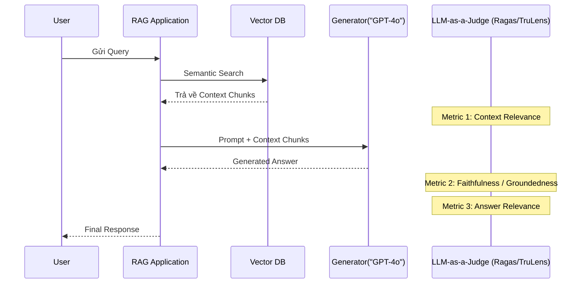

Khác với môi trường lab hay các bài toán Machine Learning truyền thống dựa vào nhãn có sẵn (Ground Truth) để đo lường Accuracy hay F1-Score, việc đánh giá một hệ thống Generative AI hay RAG (Retrieval-Augmented Generation) trên Production phức tạp hơn rất nhiều. Hầu hết các câu trả lời của LLM mang tính mở và không có một "đáp án hoàn hảo" duy nhất.

Đối với một Data Engineer / MLOps Engineer, Evaluation là bài toán về **Kiến trúc Hệ thống (System Architecture)**, vận dụng **LLM-as-a-Judge**, sự phối hợp với **Human-in-the-loop (HITL)**, và sự đánh đổi khốc liệt giữa **Độ trễ (Latency)** và **Chi phí (FinOps)**.

Bài viết này đi sâu vào việc triển khai pipeline đánh giá GenAI ở quy mô Enterprise.

---

## 1. RAG Triad và Các Framework Đánh giá (Ragas & TruLens)

Hệ thống RAG bao gồm 2 pha độc lập nhưng liên kết chặt chẽ: **Retrieval (Truy xuất)** và **Generation (Sinh văn bản)**. Đánh giá RAG tức là đánh giá xem dữ liệu kéo ra có chuẩn không, và LLM có đọc đúng dữ liệu đó không.

Framework tiêu chuẩn trong ngành hiện nay là bộ ba **RAG Triad**. Hai công cụ nổi bật nhất là **Ragas** (tối ưu cho Batch evaluation/Benchmarking) và **TruLens** (tối ưu cho Production Monitoring).



### Bộ ba Metric Cốt lõi (The RAG Triad)

1.  **Context Relevance (Độ liên quan ngữ cảnh):** Đo lường xem VectorDB có truy xuất đúng tài liệu mà câu hỏi cần hay không. Trừng phạt nặng nề (penalize) các tài liệu "rác" (Noise) gây loãng ngữ cảnh.
2.  **Faithfulness / Groundedness (Tính trung thực / Tính bám sát):** Metric sống còn để chống Ảo giác (Hallucination). Nó kiểm tra xem câu trả lời của LLM có hoàn toàn suy ra được (inferred) từ Context Chunks hay không. Nếu LLM tự "chế" ra một thông tin ngoài lề, điểm Groundedness sẽ tụt thảm hại.
3.  **Answer Relevance (Độ liên quan câu trả lời):** Đánh giá xem câu trả lời cuối cùng có giải quyết được câu hỏi ban đầu của User không, hay lại trả lời lan man.

---

## 2. LLM-as-a-Judge: Dùng AI chấm điểm AI

Việc sử dụng con người để đọc và chấm điểm hàng triệu log RAG mỗi ngày là bất khả thi (không scale được). Giải pháp của ngành là **LLM-as-a-Judge**. Chúng ta sử dụng một mô hình cực mạnh (như GPT-4o hoặc Claude 3.5 Sonnet) đóng vai trò Giám khảo. Giám khảo được cung cấp một Prompt chứa Rubric (thang điểm) và yêu cầu xuất ra điểm số hoặc phản hồi có cấu trúc.

### 2.1. Rủi ro Vận hành: Retry Storms và Rate Limits (Bão Thử Lại)
Khi chạy Batch Evaluation 100,000 bản ghi trên Production, hệ thống pipeline của bạn sẽ bắn 100,000 requests đến API của OpenAI/Anthropic. Bạn sẽ lập tức chạm ngưỡng **Rate Limit (429 Too Many Requests)**. Nếu không thiết kế tốt, cơ chế tự động thử lại (Retries) đồng loạt của các worker sẽ tạo ra hiện tượng **Retry Storms** (bão thử lại), làm sập hàng đợi (Queue) hoặc cạn kiệt kết nối mạng.

### 2.2. Code Thực chiến: Chống Bão Thử Lại (Exponential Backoff + Jitter)
Sử dụng thư viện `tenacity` trong Python kết hợp luồng xử lý bất đồng bộ (Asynchronous Execution) với độ trễ ngẫu nhiên (Jitter) để dàn trải lưu lượng một cách mượt mà:

```python
import asyncio
from tenacity import retry, stop_after_attempt, wait_exponential_jitter

# Cấu hình: Thử lại tối đa 5 lần, chờ theo cấp số nhân (2s, 4s, 8s) cộng thêm độ trễ ngẫu nhiên (Jitter)
@retry(stop=stop_after_attempt(5), wait=wait_exponential_jitter(initial=2, max=60))
async def evaluate_with_llm_as_a_judge(prompt: str) -> int:
    try:
        # Gọi API Giám khảo (GPT-4o)
        response = await llm_client.agenerate(prompt)
        score = extract_score(response) # Ví dụ: Faithfulness = 0.95
        return score
    except Exception as e:
        print(f"Lỗi Rate Limit: {e}. Đang tiến hành retry với Jitter...")
        raise e

async def batch_evaluation[prompts: list]:
    # Khống chế số lượng luồng đồng thời (Concurrency Limit) bằng Semaphore
    # để tránh bắn quá nhiều Request cùng lúc làm ngập Rate Limit của LLM Provider
    sem = asyncio.Semaphore(50) 
    
    async def bounded_eval(p):
        async with sem:
            return await evaluate_with_llm_as_a_judge(p)
            
    tasks = [bounded_eval(p] for p in prompts]
    results = await asyncio.gather(*tasks)
    return results
```

---

## 3. Human-in-the-loop (HITL) và Calibration (Hiệu chỉnh)

Dù LLM-as-a-Judge xuất sắc đến đâu, nó vẫn là máy và có những điểm mù (Bias, ảo giác). Các quy trình Enterprise BẮT BUỘC phải có kiến trúc **Human-in-the-loop (HITL)**.

1.  **Calibration (Hiệu chỉnh Giám khảo):** Hàng tuần, các chuyên gia con người (Subject Matter Experts) sẽ lấy ngẫu nhiên 50-100 mẫu đã được LLM-as-a-Judge chấm điểm và tự chấm tay (Manual Annotation). So sánh độ lệch (Correlation) giữa điểm máy và điểm người để điều chỉnh Prompt của Giám khảo.
2.  **Edge Case Routing:** Bất kỳ câu trả lời nào có điểm Groundedness thấp (< 0.5) hoặc bị hệ thống nghi ngờ, sẽ tự động được đưa vào hàng đợi UI (như Label Studio) để con người phê duyệt trước khi gửi phản hồi, hoặc để phân tích lại sau (Post-hoc analysis).

---

## 4. Tối ưu Chi phí FinOps cho Evaluation

Đánh giá 1 triệu bản ghi bằng GPT-4o có thể ngốn hàng ngàn đô la mỗi tuần. FinOps là kỹ năng sống còn:
*   **Routing theo độ phức tạp:** Dùng các LLM nhỏ gọn (Mô hình Local như Llama-3-8B hoặc Haiku) làm Giám khảo cấp 1. Chỉ những câu hỏi nào Giám khảo cấp 1 trả về "độ tin cậy thấp" (Low Confidence) hoặc điểm ở ranh giới (Marginal) mới định tuyến (Route) lên GPT-4o để đánh giá lại (Escalation).
*   **Stratified Sampling:** Trên Production (Monitoring), không nhất thiết phải đánh giá 100% lượng request. Lấy mẫu phân tầng (Stratified Sampling) 5% lưu lượng, tập trung vào các User VIP hoặc các Topic nhạy cảm, là đủ để vẽ được biểu đồ theo dõi hiệu năng (Observability) mà tiết kiệm 95% chi phí.

---

## 5. Quản lý Môi trường Đánh giá bằng Infrastructure as Code (IaC)

Triển khai một Tracking Server (như MLflow) để lưu trữ lại toàn bộ các thông số Metric, Groundedness Scores, Parameters và Prompts là yêu cầu bắt buộc của MLOps.

```hcl
# Thiết lập MLflow Tracking Server trên AWS (ECS + RDS + S3)
resource "aws_s3_bucket" "mlflow_artifacts" {
  bucket = "company-mlflow-artifacts-${var.environment}"
}

resource "aws_db_instance" "mlflow_backend_store" {
  identifier        = "mlflow-backend-store"
  engine            = "postgres"
  instance_class    = "db.t4g.micro" # FinOps: Tiết kiệm chi phí với chip ARM (Graviton)
  allocated_storage = 20
  username          = var.db_user
  password          = var.db_password
}

# Triển khai MLflow Container lên Elastic Container Service (ECS)
resource "aws_ecs_service" "mlflow_server" {
  name            = "mlflow-tracking-server"
  cluster         = aws_ecs_cluster.mlops_cluster.id
  task_definition = aws_ecs_task_definition.mlflow.arn
  desired_count   = 2 # High Availability cho Metric Logging

  load_balancer {
    target_group_arn = aws_lb_target_group.mlflow_tg.arn
    container_name   = "mlflow"
    container_port   = 5000
  }
}
```

---

## Nguồn Tham Khảo [References]

1. [Ragas Framework: Automated Evaluation of Retrieval Augmented Generation][https://docs.ragas.io/en/latest/concepts/metrics/index.html]
2. [TruLens: Evaluation and Tracking for LLM Apps (RAG Triad & Groundedness]][https://www.trulens.org/trulens_eval/getting_started/core_concepts/rag_triad/]
3. [Databricks: MLflow Model Evaluation - Metrics and LLM as a Judge][https://mlflow.org/docs/latest/llms/llm-evaluate/index.html]
4. [AWS Architecture Blog: Deploying MLflow with Amazon ECS](https://aws.amazon.com/blogs/machine-learning/deploying-mlflow-with-amazon-ecs/]
5. *Designing Data-Intensive Applications* - Martin Kleppmann (Chương thảo luận về Retry, Backoff và Distributed Systems).
