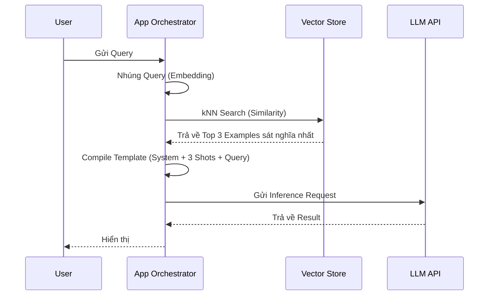
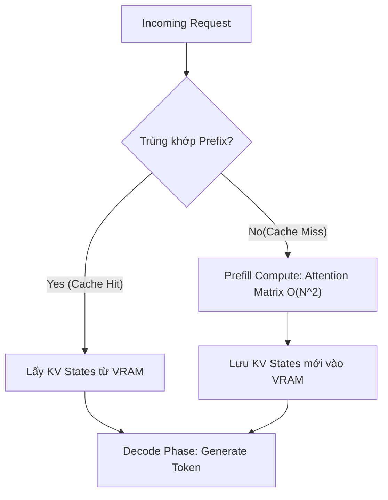

Vượt xa khỏi việc chỉ là một thủ thuật gõ "vài ví dụ" trên giao diện ChatGPT, **Few-shot Prompting (In-Context Learning)** trong môi trường Production là một bài toán System Design đầy thách thức. 

Việc nhồi nhét hàng chục examples (ví dụ mẫu) vào Context Window của LLM sinh ra một loạt các vấn đề hạ tầng: **Token Tax** (Chi phí token rác), **TTFT Latency** (Độ trễ Time To First Token) và cạn kiệt tài nguyên bộ nhớ GPU (**KV Cache Exhaustion**).

Dưới góc nhìn của một Kỹ sư Hệ thống, nếu bạn hardcode (đóng cứng) few-shot vào source code, hệ thống của bạn đã gánh Technical Debt (Nợ kỹ thuật) ngay từ ngày đầu tiên.

---

## 1. Kiến Trúc Dynamic Few-Shot Routing

Thay vì nhét một file text dài chứa 50 ví dụ cố định vào mọi API request, các hệ thống quy mô lớn sử dụng kiến trúc **Retrieval-Augmented Few-Shot (Dynamic Few-Shot)**.

### Cơ chế hoạt động (Physical Execution)
Ý tưởng cốt lõi là biến tập Examples (Golden Dataset) thành một cơ sở dữ liệu Vector. Khi User gửi query, hệ thống sẽ tính toán Embedding của query đó và dùng thuật toán kNN để tìm ra `K` ví dụ tương đồng nhất, sau đó mới lắp ráp thành một Mega-prompt đẩy vào LLM.



### Show, Don't Tell: Pipeline LangChain
Dưới đây là mã Python mô phỏng Dynamic Few-Shot, chỉ chọn ra `k=2` ví dụ để tiết kiệm Token:

```python
from langchain_chroma import Chroma
from langchain_core.prompts import SemanticSimilarityExampleSelector, FewShotPromptTemplate, PromptTemplate
from langchain_openai import OpenAIEmbeddings

# 1. Golden Dataset - Thường load từ Data Warehouse
examples = [
    {"input": "Drop database orders;", "output": "SQL Injection (High)"},
    {"input": "Select * from users where id = 1;", "output": "Safe"},
    {"input": "1; DROP TABLE users", "output": "SQL Injection (High)"},
    {"input": "UNION SELECT username FROM admins", "output": "SQL Injection (High)"}
]

example_prompt = PromptTemplate(
    input_variables=["input", "output"],
    template="Input: {input}\nClassification: {output}"
)

# 2. Xây dựng Index Vector cho Examples
example_selector = SemanticSimilarityExampleSelector.from_examples(
    examples,
    OpenAIEmbeddings(),
    Chroma,
    k=2 # Chỉ lấy 2 examples sát nghĩa nhất để nhét vào prompt
)

# 3. Tạo Dynamic Prompt
dynamic_prompt = FewShotPromptTemplate(
    example_selector=example_selector,
    example_prompt=example_prompt,
    prefix="Bạn là một firewall AI. Hãy phân loại câu SQL sau:\n",
    suffix="Input: {query}\nClassification:",
    input_variables=["query"]
)

# Khi chạy thực tế, model chỉ nhận được đúng 2 ví dụ sát sườn nhất
print(dynamic_prompt.format(query="SELECT * FROM products;"))
```

---

## 2. Rủi Ro Vận Hành (Nút thắt Context Window)

Nếu không kiểm soát tốt số lượng "shots", bạn sẽ dính các sự cố kinh điển sau ở tầng hạ tầng GPU:

### 2.1. Đỉnh Trễ TTFT (Time To First Token Spike)
Quá trình xử lý LLM (Inference) có hai pha: **Prefill Phase** (Đọc hiểu prompt đầu vào) và **Decode Phase** (Sinh ra từng token output).
Pha Prefill xử lý toàn bộ prompt song song, nhưng chi phí tính toán ma trận Attention tăng theo **bậc 2 ($O(N^2)$)** của số token.
Nhồi 10,000 tokens tiền ví dụ (Few-shots) vào prompt tương đương với việc ép GPU thực hiện một khối lượng tính toán khổng lồ. Kết quả là API của bạn sẽ bị "treo" nhiều giây trước khi token đầu tiên được nhả ra.

### 2.2. KV Cache Exhaustion (Cạn kiệt GPU VRAM)
Khi model đi qua các tokens của Few-shot prompt, nó lưu trạng thái trung gian (Key/Value) vào **KV Cache** trên bộ nhớ VRAM của GPU.
Tại quy mô 1,000 Requests/giây (RPS), nếu mỗi request đều mang theo 4,000 tokens rác từ Few-shots, dung lượng KV Cache sẽ phình to vượt quá VRAM (Ví dụ: GPU A100 80GB cũng sẽ sập). Dẫn đến hiện tượng **OOMKilled** trên các engine như vLLM.

---

## 3. Tối Ưu FinOps: Prompt Caching (LLM Prefix Caching)

**"Token Tax"** là một thực tế tàn khốc: Nếu System prompt và Few-shots của bạn tốn 2,000 tokens, và bạn phục vụ 1 triệu requests/ngày, bạn đang trả tiền oan cho 2 Tỷ tokens "rác" lặp đi lặp lại mỗi ngày.

### Giải pháp: Prefix Caching
Các nhà cung cấp (Anthropic Claude, OpenAI) và framework mã nguồn mở (vLLM, SGLang) đã giới thiệu khái niệm **Prefix Caching**.
Thay vì tính toán lại ma trận Attention cho phần Few-shots tĩnh trên mỗi request, hệ thống GPU **chỉ tính toán 1 lần** và lưu KV Cache của đoạn đó cố định trên VRAM. Các request sau nếu có chung phần "đầu" (Prefix) sẽ được ánh xạ thẳng vào Cache.



Việc áp dụng cơ chế này (như dùng `cache_control` trên API của Anthropic) có thể cắt giảm tới **90% chi phí Input Token** và giảm TTFT từ vài giây xuống dưới 50ms cho các prompt siêu dài.

---

## 4. Systemic Trade-offs: Few-shot vs. Fine-Tuning

Khi nào nên dừng Few-shot và chuyển sang Supervised Fine-Tuning (SFT)? Kỹ sư hệ thống cần cân nhắc sự đánh đổi (Trade-offs):

| Tiêu chí | Few-shot Prompting |" Fine-Tuning (SFT / LoRA) "|
| :--- | :--- | :--- |
|" **Compute Cost (Lúc huấn luyện)** "| Rẻ (\$0) |" Đắt (Tốn GPU Hours để train) "|
|" **Compute Cost (Lúc Inference)** "| **Rất Đắt** (Phải trả tiền mang theo context dài) |" **Rất Rẻ** (Prompt cực ngắn) "|
|" **Độ trễ Latency (TTFT)** "| Cao (Prefill chậm do $O(N^2)$) | Thấp |
|" **Tính linh hoạt (Agility)** "| Real-time (Sửa text là thay đổi ngay) |" Chậm (Cần chạy lại pipeline MLOps) "|
|" **Rủi ro sai lệch (Bias)** "| Nhạy cảm với thứ tự ví dụ (Recency Bias) | Ổn định hơn, hành vi được "khóa" vào trọng số |

**Quy tắc ngón tay cái [Rule of Thumb]:**
1. Bắt đầu bằng Few-shot (Dynamic) để kiểm chứng tính khả thi và cho phép Business thay đổi logic nhanh chóng.
2. Khi số lượng ví dụ Few-shot vượt quá **2,000 tokens**, hoặc mô hình đòi hỏi tới **>10 ví dụ** mới chịu hiểu đúng (đạt Accuracy >95%), đây là nút thắt cổ chai về Inference Cost. Đó là lúc bạn phải đập bỏ Few-shot và chuyển sang Fine-tuning.

---

## Nguồn Tham Khảo (References)
* [Prompt Caching with Anthropic Claude][https://docs.anthropic.com/en/docs/build-with-claude/prompt-caching]
* [LangChain: Dynamic Few-Shot using Example Selectors][https://python.langchain.com/v0.2/docs/how_to/few_shot_examples/]
* [vLLM KV Cache Architecture and PagedAttention][https://blog.vllm.ai/2023/06/20/vllm.html]
* [Language Models are Few-Shot Learners (GPT-3 Whitepaper]](https://arxiv.org/abs/2005.14165)
