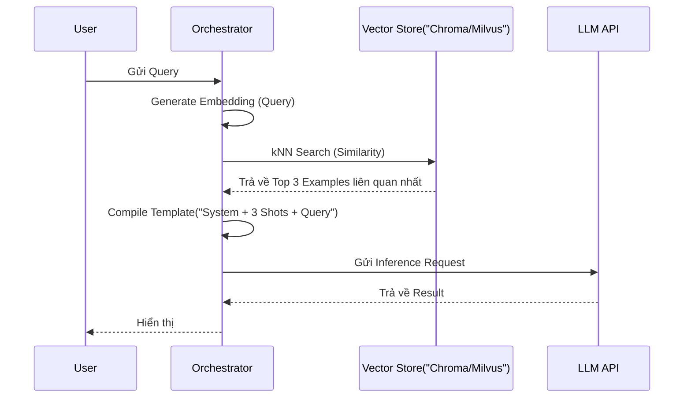

Vượt xa khỏi việc chỉ là một kỹ thuật gõ "vài ví dụ" trên giao diện ChatGPT, **Few-shot Prompting** trong môi trường Production là một bài toán System Design đầy thách thức. Việc nhồi nhét hàng chục examples vào context window của LLM sinh ra một loạt các vấn đề về **Token Tax** (Chi phí rác), **TTFT Latency** (Time To First Token) và cạn kiệt tài nguyên bộ nhớ GPU (**KV Cache Bloat**).

Dưới góc nhìn của một Data/ML Engineer, Few-shot Prompting không phải là text, nó là **Data Assets**. Nếu bạn hardcode few-shot vào source code, hệ thống của bạn đã nợ Technical Debt ngay từ ngày đầu tiên.

## 1. Kiến trúc Dynamic Few-Shot Routing

Thay vì ném một file text dài chứa 50 ví dụ vào mọi API request, hệ thống hiện đại sử dụng kiến trúc **Retrieval-Augmented Few-Shot (Dynamic Few-Shot)**. 

### Cơ chế hoạt động (Physical Execution)
Ý tưởng cốt lõi là coi bộ các ví dụ (shots) như một cơ sở dữ liệu. Khi user gửi query, hệ thống sẽ nhúng (embed) query đó và dùng Vector Search (kNN) để tìm ra top `k` ví dụ tương đồng nhất từ Vector Database, sau đó mới lắp ráp thành một Mega-prompt đẩy vào LLM.




### Show, Don't Tell: LangChain Dynamic Few-Shot Pipeline

Dưới đây là pipeline thực thi bằng Python, giới hạn `k=3` để tối ưu context window:

```python
from langchain_chroma import Chroma
from langchain_core.prompts import SemanticSimilarityExampleSelector, FewShotPromptTemplate, PromptTemplate
from langchain_openai import OpenAIEmbeddings

# 1. Tập dữ liệu vàng (Golden Dataset) - Thường load từ Data Warehouse
examples = [
    {"input": "Drop database orders;", "output": "SQL Injection (High Risk)"},
    {"input": "Select * from users where id = 1;", "output": "Safe"},
    {"input": "1; DROP TABLE users", "output": "SQL Injection (High Risk)"},
    {"input": "UNION SELECT username, password FROM admins", "output": "SQL Injection (High Risk)"}
]

example_prompt = PromptTemplate(
    input_variables=["input", "output"],
    template="Input: {input}\nClassification: {output}"
)

# 2. Xây dựng Index Cache trên bộ nhớ
example_selector = SemanticSimilarityExampleSelector.from_examples(
    examples,
    OpenAIEmbeddings(),
    Chroma,
    k=2 # Chỉ lấy 2 examples sát nghĩa nhất để nhét vào prompt
)

# 3. Tạo Dynamic Prompt
dynamic_prompt = FewShotPromptTemplate(
    example_selector=example_selector,
    example_prompt=example_prompt,
    prefix="Bạn là một firewall AI. Hãy phân loại câu SQL sau:\n",
    suffix="Input: {query}\nClassification:",
    input_variables=["query"]
)

# Execution thực tế:
print(dynamic_prompt.format(query="SELECT * FROM products;"))
# Model sẽ chỉ nhận được 2 ví dụ gần nhất thay vì load cả DB.
```

---

## 2. Rủi ro Vận hành (Operational Risks)

Nếu không kiểm soát tốt số lượng "shots", bạn sẽ dính các sự cố kinh điển sau ở tầng hạ tầng (Infrastructure):

### 2.1. Nút thắt TTFT (Time To First Token) Latency
LLM inference có hai pha: **Prefill Phase** (đọc hiểu prompt) và **Decode Phase** (sinh ra token mới). 
- **Prefill phase** xử lý toàn bộ prompt đầu vào song song, nhưng chi phí tính toán tăng theo bậc 2 ($O(N^2)$) của số token. 
- Nhồi 20 examples vào prompt tương đương với việc ép GPU phải thực hiện một ma trận Attention khổng lồ. Kết quả? API của bạn sẽ bị "treo" vài giây trước khi token đầu tiên được sinh ra (TTFT Spike).

### 2.2. KV Cache Exhaustion (Cạn kiệt GPU VRAM)
Khi model đọc Few-shot prompt, nó lưu trạng thái trung gian của các token vào **KV Cache** (Key-Value Cache) trên GPU VRAM. 
- Tại scale hàng nghìn RPS (Requests Per Second), nếu mỗi request mang theo 4000 tokens tiền xử lý từ các ví dụ Few-shot, dung lượng KV Cache sẽ phình to khủng khiếp, gây ra hiện tượng **OOMKilled** trên các container vLLM hoặc buộc hệ thống phải Evict (đẩy ra) các session khác.

---

## 3. Tối ưu Chi phí (FinOps) với Prompt Caching

**"Token Tax"** là một thực tế tàn khốc: Nếu System prompt và 5 examples của bạn tốn 2,000 tokens, và bạn phục vụ 1 triệu requests/ngày, bạn đang trả tiền cho 2 tỷ tokens "rác" lặp đi lặp lại mỗi ngày.

### Giải pháp: LLM Prefix Caching (Prompt Caching)
Các nhà cung cấp như Anthropic (Claude) hay framework mã nguồn mở (vLLM, SGLang) giới thiệu khái niệm **Prefix Caching**. 

Thay vì tính toán lại ma trận Attention cho 2,000 tokens tĩnh (System prompt + Few-shots) trên mỗi request, hệ thống **chỉ tính toán 1 lần** và lưu KV Cache của đoạn đó trên VRAM. Các request sau có cùng phần "đầu" (Prefix) sẽ được ánh xạ thẳng vào Cache.

```mermaid
flowchart TD
    A["Incoming Request"] --> B{Trùng khớp Prefix?}
    B -- Yes("Cache Hit") --> C["Lấy KV States từ VRAM"]
    B -- No("Cache Miss") --> D["Prefill Compute: Attention Matrix O_N^2"]
    D --> E["Lưu KV States mới vào VRAM"]
    C --> F["Decode Phase: Generate Token"]
    E --> F
    F --> G[Output]
```

### Show, Don't Tell: Anthropic Prompt Caching API
Khi triển khai với Anthropic Claude 3.5, việc khai báo `cache_control` giúp cắt giảm tới **90% chi phí input token** và giảm TTFT xuống dưới 50ms cho đoạn Few-shot dài:

```python
import anthropic

client = anthropic.Anthropic()

response = client.messages.create(
    model="claude-3-5-sonnet-20240620",
    max_tokens=1024,
    system=[
        {
            "type": "text",
            "text": "Bạn là chuyên gia Data Engineer. Dưới đây là 100 ví dụ về cấu trúc Log hệ thống..."
        },
        {
            "type": "text",
            "text": "<logs_examples>...[10,000 tokens of few-shot examples]...</logs_examples>",
            # Đánh dấu breakpoint để Cache lại toàn bộ khối này trên server Anthropic
            "cache_control": {"type": "ephemeral"} 
        }
    ],
    messages=[
        {"role": "user", "content": "Phân tích đoạn log: ERR 0x992 Database Deadlock"}
    ]
)

# Kiểm tra FinOps:
print(response.usage.cache_creation_input_tokens) # Lần 1: 10,000 tokens
print(response.usage.cache_read_input_tokens)     # Lần sau: 10,000 tokens (Giảm 90% giá!)
```

---

## 4. Systemic Trade-offs: Few-shot vs. Fine-tuning

Khi nào nên dừng Few-shot và chuyển sang Supervised Fine-Tuning (SFT)? Hãy cân nhắc sự đánh đổi:

| Tiêu chí | Few-shot Prompting | Fine-Tuning (SFT / LoRA) |
| :--- | :--- | :--- |
| **Compute Cost (Lúc huấn luyện)** | Rẻ (\$0) | Đắt (GPU Hours cho Training) |
| **Compute Cost (Lúc Inference)** | **Rất Đắt** (Phải trả tiền mang theo context dài) | **Rất Rẻ** (Chỉ tốn token cho query gốc) |
| **Latency (TTFT)** | Cao (Prefill chậm do token dài) | Thấp (Ít token đầu vào) |
| **Agility (Khả năng cập nhật)** | Real-time (Đổi ví dụ là có tác dụng ngay) | Chậm (Cần pipeline MLOps retrain) |
| **Data Quality Tolerance** | Dễ bị "ảo giác" nếu 1 ví dụ sai lệch | Chống chịu nhiễu tốt hơn do hàm loss hội tụ |

**Quy tắc ngón tay cái của Staff Engineer:**
1. Dùng Few-shot (Dynamic) cho việc định dạng output JSON, XML hoặc các logic business thay đổi liên tục hàng ngày.
2. Khi bộ Few-shot vượt quá **2,000 tokens**, hoặc cần nhồi hơn **10 ví dụ** để model đạt độ chính xác >95%, đó là lúc phải đập bỏ và chuyển sang Fine-tuning.

---

## Nguồn Tham Khảo
- [Prompt Caching with Anthropic Claude](https://docs.anthropic.com/en/docs/build-with-claude/prompt-caching)
- [LangChain: Dynamic Few-Shot using Example Selectors](https://python.langchain.com/v0.2/docs/how_to/few_shot_examples/)
- [vLLM KV Cache Architecture and PagedAttention](https://blog.vllm.ai/2023/06/20/vllm.html)
- [Language Models are Few-Shot Learners (GPT-3 Whitepaper)](https://arxiv.org/abs/2005.14165)
