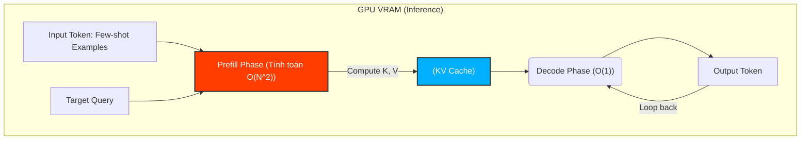
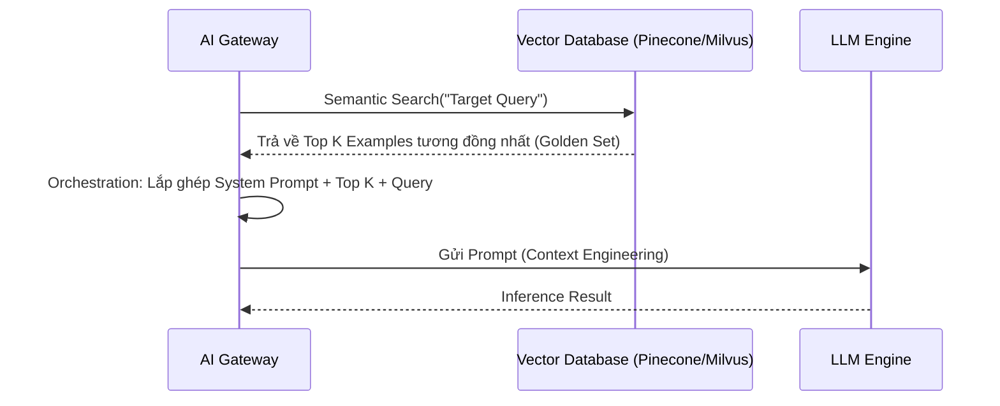

Khái niệm **Few-shot Prompting** thường được giới thiệu như một "mẹo" (trick) để giao tiếp với các Mô hình Ngôn ngữ Lớn (LLM). Tuy nhiên, dưới lăng kính của một **Staff Data/AI Engineer**, Few-shot Prompting hay **In-Context Learning (ICL)** là một sự chuyển dịch mô hình tính toán: thay vì biên dịch logic vào các tham số mạng nơ-ron (Weights) như Fine-tuning, chúng ta đẩy logic đó vào bộ nhớ đệm tại thời điểm chạy (Runtime Memory) thông qua Context Window.

Bài viết này mổ xẻ cơ chế vật lý của ICL, cách thiết kế hệ thống Few-shot động (Dynamic Few-shot), các rủi ro vận hành (Operational Risks), và kỹ thuật tối ưu chi phí (FinOps) trong môi trường Production.

---

## 1. Kiến trúc Thực thi Vật lý (Physical Execution)

Khi bạn truyền 5 ví dụ Few-shot vào một LLM, chuyện gì thực sự xảy ra dưới tầng vật lý của GPU?

Không có bất kỳ trọng số nào được cập nhật. Thay vào đó, ICL hoạt động dựa trên cơ chế **Attention-based Copying** và sự phình to của **KV Cache (Key-Value Cache)** trong VRAM.



Mỗi token trong các ví dụ Few-shot phải trải qua pha tính toán ban đầu gọi là **Prefill Phase**. LLM tính toán các ma trận Key và Value cho từng token và lưu chúng vào VRAM (KV Cache) để tránh việc phải tính toán lại trong pha **Decode Phase** (sinh từ tiếp theo).

**Systemic Trade-offs cốt lõi so với Fine-Tuning:**
-   **In-Context Learning (Few-shot):** Chuyển hóa bài toán tối ưu hóa thuật toán thành bài toán **Băng thông Bộ nhớ (Memory Bandwidth)**. Càng nhiều ví dụ, KV Cache càng lớn, VRAM bị tiêu thụ càng nhiều. Dễ triển khai, nhưng đắt đỏ khi Scale.
-   **Fine-Tuning (PEFT/LoRA):** Nhúng logic vào trọng số (Weights). Tiết kiệm VRAM cho KV Cache ở thời điểm chạy, giảm Latency đáng kể, nhưng tốn chi phí huấn luyện trước (Upfront Compute Cost) và phức tạp hóa pipeline CI/CD (Model Registry).
-   *Quy tắc ngón tay cái (Rule of Thumb):* Dưới 10,000 requests/ngày $\rightarrow$ Dùng Few-shot. Trên 100,000 requests/ngày có khuôn mẫu cố định $\rightarrow$ Cắt sang Fine-tuning.

---

## 2. Thiết kế Hệ thống: Dynamic Few-Shot Architecture

Trong môi trường Production, việc mã hóa cứng (hardcoding) 5 ví dụ tĩnh vào prompt là một Anti-pattern. Nó tạo ra một hệ thống giòn (brittle) và dẫn đến hiện tượng **Out-of-Distribution** (truy vấn mới khác hoàn toàn với các ví dụ được hardcode, khiến LLM ảo giác).

Kiến trúc chuẩn Enterprise là **Dynamic Few-Shot (RAG-based Few-Shot)**.



Thay vì nhét ngẫu nhiên, hệ thống dùng Vector Database để tính khoảng cách vector giữa Target Query và kho **Historical Examples**. LLM sẽ nhận được các ví dụ "sát sườn" nhất, tối đa hóa Accuracy.

**Thực chiến với LangChain (Python):**
```python
from langchain_chroma import Chroma
from langchain_core.example_selectors import SemanticSimilarityExampleSelector
from langchain_core.prompts import FewShotPromptTemplate, PromptTemplate
from langchain_openai import OpenAIEmbeddings

# 1. Tập dữ liệu Golden Set
examples = [
    {"input": "happy", "output": "sad"},
    {"input": "tall", "output": "short"},
    {"input": "energetic", "output": "lethargic"},
    {"input": "sunny", "output": "gloomy"},
]

example_prompt = PromptTemplate(
    input_variables=["input", "output"],
    template="Input: {input}\nOutput: {output}",
)

# 2. Khởi tạo Semantic Selector đẩy vào Vector DB
example_selector = SemanticSimilarityExampleSelector.from_examples(
    examples,
    OpenAIEmbeddings(),
    Chroma,
    k=1 # Chỉ chọn 1 ví dụ sát nghĩa nhất để tiết kiệm token
)

# 3. Dynamic Prompt
dynamic_prompt = FewShotPromptTemplate(
    example_selector=example_selector,
    example_prompt=example_prompt,
    prefix="Cho từ trái nghĩa của input.",
    suffix="Input: {adjective}\nOutput:",
    input_variables=["adjective"],
)

# Khi user nhập "joyful", hệ thống sẽ chỉ fetch {"input": "happy", "output": "sad"}
print(dynamic_prompt.format(adjective="joyful"))
```

---

## 3. Tối ưu Chi phí (FinOps): Kỹ thuật Prompt Caching

**"Context Tax"** (Thuế Ngữ Cảnh) là vấn đề nhức nhối nhất của Few-shot Prompting. Nếu bạn gửi một prompt 5,000 tokens kèm 10 ví dụ cho 1 triệu lượt truy vấn/ngày, bạn đang đốt hàng chục ngàn USD cho việc GPU phải Prefill lại 5,000 tokens đó hàng triệu lần một cách lãng phí.

Anthropic (Claude) và OpenAI gần đây đã giới thiệu tính năng **Prompt Caching**. Kỹ thuật này lưu trực tiếp KV Cache của các ví dụ tĩnh trên server của họ.

**Mã nguồn thực chiến (Python với Anthropic API):**
```python
import anthropic

client = anthropic.Anthropic()

# Hệ thống xử lý Prefill Phase cho đoạn text này 1 LẦN DUY NHẤT.
# Giảm 90% chi phí input token và giảm độ trễ TTFT (Time to First Token).
few_shot_examples = """
<example>Input: Thanh toan Grab Car \nOutput: Di lai</example>
# ... 100 ví dụ khác ...
"""

response = client.beta.messages.create(
    model="claude-3-5-sonnet-20240620",
    max_tokens=100,
    system=[
        {
            "type": "text",
            "text": "Bạn là chuyên gia phân loại giao dịch tài chính. " + few_shot_examples,
            # Kích hoạt Prompt Caching
            "cache_control": {"type": "ephemeral"} 
        }
    ],
    messages=[{"role": "user", "content": "Thanh toan Starbuck"}]
)
```

---

## 4. Rủi ro Vận hành & Troubleshooting (Real-world Incidents)

Với tư cách là người vận hành hệ thống AI, bạn cần đối phó với các kịch bản sập hệ thống sau:

### 4.1. Sự cố "KV Cache OOM" (Out of Memory)
Trong các kiến trúc tự host LLM (vLLM, TGI), việc người dùng liên tục gửi hàng ngàn ví dụ Few-shot làm cạn kiệt PagedAttention memory block.
- **Triệu chứng:** Container bị `OOMKilled`, API trả về HTTP 500, Batch size giảm đột ngột dẫn đến Throughput sập.
- **Cách khắc phục:** Cấu hình giới hạn `max_input_tokens` ở API Gateway.

### 4.2. Hiện tượng "Lost in the Middle" và "Recency Bias"
LLM có xu hướng quá tập trung vào những token ở đầu và cuối prompt.
- **Triệu chứng:** Nếu ví dụ cuối cùng trong dải Few-shot mang nhãn `Tiêu cực`, LLM sẽ có xác suất cực cao (bias) dự đoán query mục tiêu cũng là `Tiêu cực`.
- **Cách khắc phục:** Lập trình xáo trộn ngẫu nhiên (Random Shuffle) thứ tự các ví dụ trước khi gửi API, hoặc dùng Dynamic Few-shot để cân bằng nhãn.

### 4.3. Đánh đổi Latency: The Attention Bottleneck
- **Vấn đề:** Thời gian sinh token đầu tiên (**TTFT**) tăng bậc hai ($O(N^2)$) theo độ dài của Few-shot context do bản chất của cơ chế Attention.
- **Khắc phục:** Không dùng quá 5-7 ví dụ. Nếu task quá phức tạp cần 50 ví dụ, bắt buộc phải đổi chiến thuật sang **Fine-Tuning**.

---

## Nguồn Tham Khảo (References)
1.  **Language Models are Few-Shot Learners (Brown et al., 2020):** Nền tảng học thuật về In-Context Learning.
2.  **Rethinking the Role of Demonstrations (Min et al., 2022):** Phân tích việc LLM học format thay vì học nhãn từ ví dụ.
3.  **Anthropic Prompt Caching Documentation:** Tối ưu FinOps cho các hệ thống RAG/Few-shot.
4.  **vLLM PagedAttention Architecture:** Nền tảng quản lý bộ nhớ KV Cache hiệu quả để tránh OOM trong Production.
