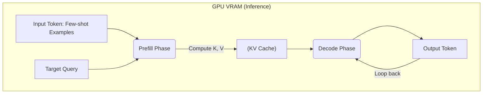
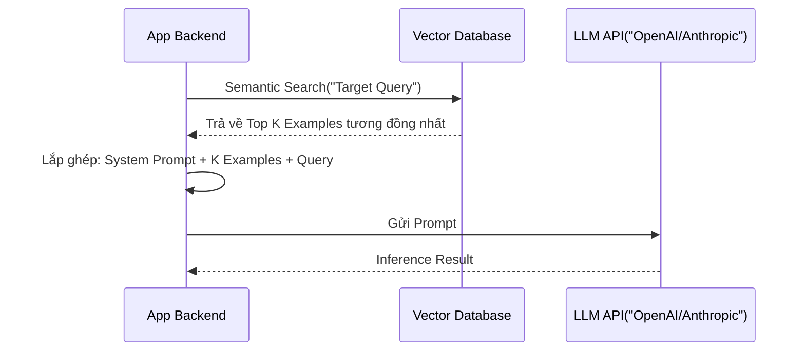

Khái niệm **Few-shot Prompting** thường được giới thiệu như một kỹ thuật "mẹo" (trick) để giao tiếp với các Mô hình Ngôn ngữ Lớn (LLM). Tuy nhiên, dưới góc nhìn của một Kỹ sư Dữ liệu và Thiết kế Hệ thống (System Design), Few-shot Prompting hay **In-Context Learning (ICL)** là một sự chuyển dịch mô hình tính toán: thay vì biên dịch logic vào các tham số mạng nơ-ron (như Fine-tuning), chúng ta đẩy logic đó vào bộ nhớ đệm tại thời điểm chạy (Runtime Memory) thông qua Context Window.

Bài viết này sẽ mổ xẻ cơ chế vật lý của ICL, cách thiết kế hệ thống Few-shot động (Dynamic Few-shot), các rủi ro vận hành (Operational Risks), và kỹ thuật tối ưu chi phí (FinOps) trong môi trường Production.

---

## Kiến trúc Thực thi Vật lý (Physical Execution)

Khi bạn truyền 5 ví dụ Few-shot vào một LLM, chuyện gì thực sự xảy ra dưới tầng vật lý của GPU?

Không có bất kỳ trọng số (weights) nào của mô hình được cập nhật. Thay vào đó, ICL hoạt động dựa trên cơ chế **Attention-based Copying** và sự phình to của **KV Cache (Key-Value Cache)** trong VRAM.


*(Cơ chế In-Context Learning)*

Mỗi token trong các ví dụ Few-shot đều phải trải qua pha tính toán ban đầu gọi là **Prefill Phase**. Trong pha này, LLM tính toán các ma trận Key và Value cho từng token và lưu chúng vào VRAM (KV Cache) để tránh việc phải tính toán lại trong pha **Decode Phase** (sinh từ tiếp theo).



**Sự khác biệt cốt lõi so với Fine-Tuning:**
- **In-Context Learning:** Chuyển hóa bài toán tối ưu hóa thuật toán thành bài toán **Băng thông Bộ nhớ (Memory Bandwidth)**. Càng nhiều ví dụ, KV Cache càng lớn, VRAM bị tiêu thụ càng nhiều.
- **Fine-Tuning (PEFT/LoRA):** Nhúng logic vào trọng số (Weights). Tiết kiệm VRAM cho KV Cache ở thời điểm chạy, nhưng tốn chi phí huấn luyện trước (Upfront Compute Cost) và phức tạp hóa 파ipeline CI/CD.

---

## Thiết kế Hệ thống: Dynamic Few-Shot Architecture

Trong môi trường Production, việc mã hóa cứng (hardcoding) 5 ví dụ vào prompt là một Anti-pattern. Dữ liệu thay đổi liên tục, và việc cố định ví dụ sẽ dẫn đến hiện tượng **Out-of-Distribution** (truy vấn mới khác hoàn toàn so với các ví dụ được hardcode).

Kiến trúc chuẩn (Enterprise-grade) là sử dụng **Dynamic Few-Shot (RAG-based Few-Shot)**.



Thay vì nhét ngẫu nhiên, hệ thống dùng Vector Database để tính khoảng cách vector (Cosine Similarity) giữa **Target Query** và kho **Historical Examples**. LLM sẽ nhận được các ví dụ *sát sườn nhất* với truy vấn hiện tại.

---

## Tối ưu Chi phí (FinOps): Kỹ thuật Prompt Caching

**"Context Tax"** (Thuế Ngữ Cảnh) là vấn đề nhức nhối nhất của Few-shot Prompting. Nếu bạn gửi một system prompt kèm 10 ví dụ nặng 5,000 tokens cho mỗi truy vấn người dùng, và bạn có 1 triệu lượt truy vấn/ngày, bạn đang đốt tiền cho việc GPU phải Prefill lại 5,000 tokens đó hàng triệu lần.

Các nhà cung cấp như Anthropic (Claude) và OpenAI gần đây đã giới thiệu tính năng **Prompt Caching**. Kỹ thuật này lưu trực tiếp KV Cache của các ví dụ Few-shot trên server của họ.

**Mã nguồn thực chiến (Python với Anthropic API):**

```python
import anthropic

client = anthropic.Anthropic()

# Hệ thống chỉ phải xử lý Prefill Phase cho đoạn text này 1 LẦN DUY NHẤT.
# Các API call tiếp theo sẽ dùng lại KV Cache, giảm 90% chi phí input token và giảm độ trễ TTFT.
system_prompt = "Bạn là chuyên gia phân loại giao dịch tài chính. Hãy học theo các ví dụ sau."
few_shot_examples = """
<example>
Input: Thanh toan Grab Car
Output: Di lai
</example>
# ... 100 ví dụ khác ...
"""

response = client.beta.messages.create(
    model="claude-3-5-sonnet-20240620",
    max_tokens=100,
    system=[
        {
            "type": "text",
            "text": system_prompt + few_shot_examples,
            # Cờ 'ephemeral' kích hoạt Prompt Caching cho đoạn text này
            "cache_control": {"type": "ephemeral"}
        }
    ],
    messages=[
        {"role": "user", "content": "Thanh toan Starbuck Q1"}
    ]
)

print(response.content)
```

---

## Sự đánh đổi Hệ thống (Systemic Trade-offs)

Lựa chọn Few-shot Prompting đồng nghĩa với việc bạn chấp nhận các sự đánh đổi sau:

1. **Latency vs. Model Capability (Độ trễ vs Sức mạnh):**
   - *Vấn đề:* Thời gian sinh ra token đầu tiên (**Time to First Token - TTFT**) tăng tuyến tính hoặc bậc hai (quadratic) so với độ dài của Few-shot context do độ phức tạp của cơ chế Attention ($O(N^2)$).
   - *Đánh đổi:* Dùng nhiều ví dụ (tăng độ chính xác) đồng nghĩa với TTFT cao, gây trải nghiệm người dùng kém (đặc biệt trong các ứng dụng Real-time streaming).
   
2. **Compute Cost vs. Storage Cost:**
   - Few-shot (ICL) tiêu tốn **Compute Cost** (phải tính toán lại ma trận Attention liên tục).
   - Fine-Tuning tiêu tốn **Storage/Memory Cost** (lưu trữ LoRA adapters, maintain model registry).
   - *Rule of thumb:* Dưới 10,000 requests/ngày -> Dùng Few-shot. Trên 100,000 requests/ngày -> Dùng Fine-tuning.

---

## Rủi ro Vận hành & Troubleshooting (Real-world Incidents)

Với tư cách là người vận hành hệ thống AI, bạn cần đối phó với các kịch bản sập hệ thống (Incidents) sau:

### 1. Sự cố "KV Cache OOM" (Out of Memory)
Trong các kiến trúc tự host LLM (vLLM, TGI), việc người dùng gửi hàng ngàn ví dụ Few-shot vào một request có thể làm cạn kiệt PagedAttention memory block.
- **Triệu chứng:** Container bị `OOMKilled`, API trả về HTTP 500, Batch size giảm đột ngột dẫn đến Throughput toàn hệ thống giảm.
- **Cách khắc phục:** Cấu hình giới hạn (hard limit) `max_input_tokens` ở tầng API Gateway; Áp dụng thuật toán nén ngữ cảnh (Context Compression) như LLMLingua trước khi đưa vào mô hình.

### 2. Hiện tượng "Lost in the Middle" và "Recency Bias"
LLM có xu hướng quá tập trung vào những token ở đầu và cuối prompt.
- **Triệu chứng:** Nếu ví dụ cuối cùng trong dải Few-shot mang nhãn `Tiêu cực`, LLM sẽ có xác suất cực cao (bias) dự đoán query mục tiêu cũng là `Tiêu cực`.
- **Cách khắc phục:** Tại tầng Orchestration (như LangChain/LlamaIndex), lập trình xáo trộn ngẫu nhiên (random shuffle) thứ tự các ví dụ trước khi gửi API, hoặc cân bằng nhãn (Label Balancing) nghiêm ngặt trong Vector DB.

### 3. Cartesian Explosion trong Few-shot CoT
Khi áp dụng Few-shot với Chain-of-Thought (CoT), số lượng token đầu ra (output tokens) tăng vọt.
- **Triệu chứng:** Bị Rate limit API liên tục, chi phí hóa đơn cuối tháng tăng x10 lần.
- **Cách khắc phục:** Thiết kế Fallback routing: Dùng mô hình lớn (GPT-4) + Few-Shot CoT để sinh ra dataset chuẩn -> Dùng dataset đó Fine-tune một mô hình nhỏ (Llama 3 8B) -> Cho mô hình nhỏ chạy Zero-shot ở Production.

---

## Nguồn Tham Khảo (References)

1. **[Language Models are Few-Shot Learners (Brown et al., 2020)](https://arxiv.org/abs/2005.14165):** Nền tảng học thuật về In-Context Learning.
2. **[Rethinking the Role of Demonstrations (Min et al., 2022)](https://arxiv.org/abs/2202.12837):** Phân tích về việc LLM học định dạng (format) hơn là học nhãn từ các ví dụ.
3. **[Anthropic Prompt Caching Documentation](https://docs.anthropic.com/en/docs/build-with-claude/prompt-caching):** Tài liệu kiến trúc thực tế về cách cache KV Cache để tối ưu FinOps.
4. **[vLLM PagedAttention Architecture](https://vllm.ai/):** Nền tảng về quản lý bộ nhớ KV Cache hiệu quả để tránh OOM trong Production.
