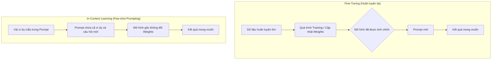
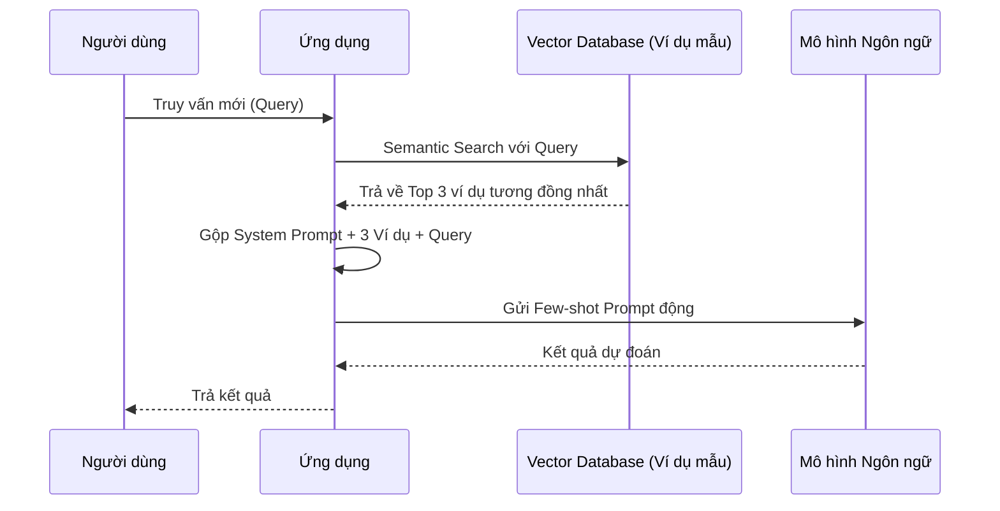

Hãy tưởng tượng bạn vừa nhận một cậu thực tập sinh mới và giao cho cậu ấy nhiệm vụ phân loại phản hồi của khách hàng. Nếu bạn chỉ nói chung chung: *"Hãy phân loại các phản hồi này"*, cậu ấy có thể sẽ bối rối và làm sai lệch tiêu chí của bạn. Nhưng nếu bạn đưa ra 3-5 ví dụ mẫu về cách bạn phân loại, cậu ấy sẽ học được quy luật rất nhanh. Các Mô hình Ngôn ngữ Lớn (LLM) cũng hoạt động tương tự thông qua kỹ thuật **Few-Shot Prompting**.

Few-Shot Prompting là kỹ thuật đưa một vài ví dụ (thường từ 2 đến 5 ví dụ) bao gồm cả đầu vào (Input) và đầu ra (Output) mẫu trực tiếp vào trong câu lệnh (Prompt) của LLM. Kỹ thuật này giúp định hướng mô hình trả về kết quả theo đúng định dạng, văn phong, và logic mong muốn mà không cần phải huấn luyện lại (Fine-tuning) mô hình. Việc áp dụng Few-shot Prompting đã đánh dấu một bước ngoặt lớn trong cách con người tương tác với AI, chuyển từ việc phải viết mã (coding) và tinh chỉnh mô hình (fine-tuning) sang việc chỉ cần cung cấp ngữ cảnh (context) qua ngôn ngữ tự nhiên.

> [!NOTE]
> **Few-shot Prompting** không thay đổi mô hình cốt lõi. Nó chỉ tạm thời cung cấp "chỉ dẫn" trong thời gian chạy (runtime). Khi kết thúc phiên chat hoặc khi bạn bắt đầu một prompt mới, LLM sẽ "quên" các ví dụ này.

---

## 1. Deep Dive: In-Context Learning (ICL) là gì?


Few-shot Prompting là biểu hiện rõ rệt nhất của một hiện tượng đặc biệt trong các LLM được gọi là **In-Context Learning (Học trong ngữ cảnh)**. 

Thay vì cập nhật các trọng số (weights) bên trong mô hình thông qua quá trình tối ưu hóa gradient descent (như khi huấn luyện hoặc fine-tune), mô hình học cách thực hiện tác vụ ngay tại thời điểm suy luận (inference time) bằng cách phân tích các pattern (mẫu) có trong đoạn văn bản prompt. LLM có khả năng nhận diện quy luật từ các ví dụ bạn cung cấp và áp dụng quy luật đó cho truy vấn (query) cuối cùng.

Sự khác biệt giữa **In-Context Learning (Few-shot)** và **Fine-tuning** được thể hiện rõ nhất qua biểu đồ dưới đây:



### Cơ chế hoạt động (Dành cho người thích kỹ thuật)
Các nghiên cứu (như từ bài báo "Induction Heads") chỉ ra rằng các mô hình Transformer phát triển một cơ chế gọi là *attention-based copying*. Khi mô hình nhìn thấy các ví dụ `Input A -> Output B` lặp lại, các lớp attention (attention heads) của nó học cách chú ý tới mối quan hệ giữa Input và Output. Đến truy vấn cuối cùng, nó sẽ "bắt chước" quy luật đó để sinh ra từ (token) tiếp theo một cách tự nhiên.

---

## 2. So sánh Zero-shot, One-shot và Few-shot

Dựa trên số lượng ví dụ được cung cấp trong ngữ cảnh, chúng ta có thể chia thành các mức độ sau. Việc lựa chọn phương pháp nào phụ thuộc vào độ phức tạp của bài toán và khả năng vốn có của LLM.

| Tiêu chí | Zero-shot Prompting | One-shot Prompting | Few-shot Prompting |
| :--- | :--- | :--- | :--- |
| **Định nghĩa** | Không cung cấp ví dụ nào. | Cung cấp duy nhất 1 ví dụ. | Cung cấp từ 2 đến nhiều ví dụ. |
| **Khi nào sử dụng?** | Các tác vụ đơn giản, phổ biến (dịch thuật, tóm tắt). | Khi cần mô hình nắm bắt định dạng đầu ra nhanh chóng. | Tác vụ phức tạp, yêu cầu logic riêng, định dạng đặc biệt (JSON, cấu trúc lồng nhau). |
| **Chi phí Token** | Rất thấp. | Thấp. | Cao (tăng tuyến tính theo số lượng ví dụ). |
| **Ví dụ** | "Dịch từ 'Hello' sang tiếng Pháp." | "Dịch sang tiếng Pháp: \nApple -> Pomme \nHello -> ?" | "Dịch sang tiếng Pháp: \nApple -> Pomme \nCat -> Chat \nDog -> Chien \nHello -> ?" |

> [!TIP]
> **Quy tắc kinh nghiệm:** Luôn bắt đầu thử nghiệm với Zero-shot. Nếu kết quả không đạt yêu cầu về độ chính xác hoặc định dạng, hãy nâng cấp lên One-shot, và cuối cùng là Few-shot. Đừng sử dụng Few-shot ngay lập tức nếu tác vụ quá cơ bản để tiết kiệm chi phí token.

---

## 3. Cấu trúc của một Few-shot Prompt tiêu chuẩn

Một prompt Few-shot hiệu quả không chỉ đơn thuần là ném các ví dụ vào, mà nó cần một cấu trúc rõ ràng, logic để LLM dễ dàng "parse" (phân tích) ngữ cảnh. Cấu trúc 3 phần chuẩn bao gồm:

1. **Task Description (Mô tả tác vụ hoặc System Prompt):** Hướng dẫn rõ ràng cho LLM biết nó đóng vai trò gì và cần phải làm gì.
2. **Examples (Các ví dụ mẫu):** Các cặp Input-Output đại diện cho tác vụ. Đây là phần cốt lõi của Few-shot.
3. **Target Query (Truy vấn mục tiêu):** Dữ liệu mới chưa có nhãn mà bạn muốn LLM xử lý.

### Ví dụ về Phân loại Cảm xúc (Sentiment Analysis)

```text
# 1. TASK DESCRIPTION
Phân loại cảm xúc của các nhận xét từ khách hàng sau thành các nhãn: [Tích cực, Tiêu cực, Trung tính]. Hãy trả về ĐÚNG MỘT TỪ đại diện cho nhãn.

# 2. EXAMPLES
Nhận xét: Sản phẩm này đóng gói rất cẩn thận, giao hàng siêu nhanh.
Cảm xúc: Tích cực

Nhận xét: Thái độ phục vụ của nhân viên cực kỳ tệ, gọi hotline không ai nghe máy.
Cảm xúc: Tiêu cực

Nhận xét: Pin dùng được tầm 1 ngày giống như các dòng máy trước, không có gì nổi bật.
Cảm xúc: Trung tính

Nhận xét: Màn hình bị trầy xước ngay khi vừa mở hộp, nhưng shop đã hỗ trợ đổi trả nhanh chóng.
Cảm xúc: Tích cực

# 3. TARGET QUERY
Nhận xét: Chất lượng âm thanh bình thường, nhưng thiết kế khá bắt mắt và giá rẻ.
Cảm xúc: 
```

### 🧑‍💻 Tích hợp Few-shot Prompt vào mã Python (OpenAI API)

Khi lập trình ứng dụng GenAI thực tế, bạn thường truyền các ví dụ Few-shot dưới dạng một chuỗi hội thoại (Chat History) xen kẽ giữa `user` và `assistant`. Điều này đặc biệt hiệu quả với các mô hình Chat (như GPT-4, Claude 3, Gemini).

```python
from openai import OpenAI

client = OpenAI(api_key="YOUR_API_KEY")

response = client.chat.completions.create(
  model="gpt-4o-mini",
  messages=[
    # 1. System Prompt (Task Description)
    {"role": "system", "content": "Bạn là trợ lý ảo phân loại cảm xúc. Chỉ trả về một trong ba nhãn: Tích cực, Tiêu cực, Trung tính."},
    
    # 2. Examples (Few-shot)
    {"role": "user", "content": "Sản phẩm này đóng gói rất cẩn thận, giao hàng nhanh."},
    {"role": "assistant", "content": "Tích cực"},
    {"role": "user", "content": "Thái độ phục vụ của nhân viên cực kỳ tệ."},
    {"role": "assistant", "content": "Tiêu cực"},
    {"role": "user", "content": "Pin dùng được tầm 1 ngày."},
    {"role": "assistant", "content": "Trung tính"},
    
    # 3. Target Query
    {"role": "user", "content": "Giao hàng hơi chậm nhưng hàng đẹp, đúng như mô tả."}
  ],
  temperature=0.0 # Đặt temperature = 0 để có kết quả phân loại nhất quán
)

print(response.choices[0].message.content)
# Output mong đợi: Tích cực
```

---

## 4. Ứng dụng thực tế (Real-world Scenarios)

Few-shot Prompting có thể giải quyết được rất nhiều bài toán hóc búa mà Zero-shot thường thất bại, đặc biệt khi yêu cầu định dạng đầu ra cực kỳ nghiêm ngặt.

### A. Information Extraction (Trích xuất thông tin NER)
Khi bạn cần LLM đọc một văn bản lộn xộn và trích xuất dữ liệu thành cấu trúc JSON.

```text
Trích xuất tên món ăn và giá tiền từ văn bản sau, trả về dưới dạng JSON list.

Văn bản: "Tôi ăn một phở bò giá 50k và uống một ly trà đá 5000 đồng."
JSON: [{"mon_an": "phở bò", "gia": 50000}, {"mon_an": "trà đá", "gia": 5000}]

Văn bản: "Hôm qua đi ăn nhà hàng, gọi 2 suất bít tết hết 500 ngàn, thêm chai rượu vang 1 triệu."
JSON: [{"mon_an": "bít tết", "gia": 500000}, {"mon_an": "rượu vang", "gia": 1000000}]

Văn bản: "Sáng nay làm vội ổ bánh mì thịt 25k với ly cafe sữa 15 ngàn."
JSON:
```

### B. Text to SQL (Chuyển đổi ngôn ngữ tự nhiên sang SQL)
Đây là một ứng dụng rất phổ biến trong xây dựng các AI Agent truy vấn cơ sở dữ liệu. Cung cấp ví dụ về Schema và SQL Query giúp LLM tránh việc bịa ra các tên cột không tồn tại (hallucination).

```text
Bảng: employees(id, name, department_id, salary)
Bảng: departments(id, name)

Câu hỏi: Tìm những nhân viên có lương cao hơn 50000.
SQL: SELECT name FROM employees WHERE salary > 50000;

Câu hỏi: Có bao nhiêu nhân viên trong phòng ban 'IT'?
SQL: SELECT COUNT(*) FROM employees e JOIN departments d ON e.department_id = d.id WHERE d.name = 'IT';

Câu hỏi: Liệt kê tên nhân viên và tên phòng ban của những người có lương cao nhất.
SQL:
```

---

## 5. Các "Mẹo" Nâng Cao (Advanced Best Practices)

Để khai thác tối đa hiệu quả của Few-shot và tránh các lỗi ngớ ngẩn của LLM, bạn cần áp dụng các thực hành tốt nhất sau:

> [!WARNING]
> **LLM rất dễ bị thiên kiến (Bias):** Nếu bạn cung cấp 5 ví dụ mẫu và cả 5 đều có kết quả là "Tích cực", LLM sẽ có xu hướng đoán câu trả lời tiếp theo cũng là "Tích cực" bất kể đầu vào là gì.

1. **Tính đa dạng (Diversity) và Cân bằng nhãn (Label Balancing):** 
   - Đảm bảo các ví dụ bao quát nhiều trường hợp khác nhau (ví dụ: văn bản dài ngắn khác nhau, các từ vựng khác nhau).
   - Nếu bài toán là phân loại A/B/C, hãy đảm bảo số lượng ví dụ cho mỗi lớp A, B, C tương đối bằng nhau.

2. **Thứ tự của các ví dụ (Ordering Effect & Recency Bias):** 
   - LLM thường chú ý nhiều hơn đến những thông tin nằm gần cuối prompt. Do đó, việc thay đổi thứ tự các ví dụ có thể làm thay đổi kết quả đầu ra. Mẹo là hãy xáo trộn ngẫu nhiên thứ tự các ví dụ (randomize order) hoặc đặt các ví dụ quan trọng nhất, khó nhất ở gần cuối.

3. **Chất lượng hơn Format (The Role of Demonstrations):** 
   - Mặc dù nghiên cứu của Min et al. (2022) chỉ ra rằng việc cung cấp nhãn *sai* trong ví dụ đôi khi không làm giảm hiệu suất quá nhiều miễn là *định dạng (format)* đúng, nhưng các nghiên cứu sau này (và thực tiễn) đều khẳng định: Nhãn đúng 100% kết hợp với định dạng chuẩn xác sẽ mang lại hiệu năng cao nhất.

4. **Dynamic Few-shot Prompting (Few-shot Động):**
   - Thay vì cố định (hardcode) 5 ví dụ vào prompt, hãy xây dựng một hệ thống lưu trữ hàng trăm ví dụ mẫu trong Vector Database.
   - Khi có truy vấn mới, sử dụng kĩ thuật **Retrieval-Augmented Generation (RAG)** để tìm kiếm top 3-5 ví dụ tương đồng nhất (semantic similarity) với truy vấn hiện tại và nhét chúng vào prompt.
   - *Lợi ích:* Tiết kiệm token, luôn đưa ra ví dụ liên quan nhất giúp tăng độ chính xác vượt trội.



---

## 6. Kết hợp Few-Shot với Chain-of-Thought (Few-Shot CoT)

Một trong những hạn chế lớn nhất của Few-shot truyền thống là nó dạy LLM *kết quả cuối cùng* nhưng không dạy *cách suy nghĩ*. Khi đối mặt với các bài toán logic hay toán học, LLM dễ dàng đưa ra câu trả lời sai.

Kỹ thuật **Few-Shot Chain-of-Thought (CoT)** khắc phục điều này bằng cách đưa vào các ví dụ mẫu có chứa toàn bộ quá trình suy luận từng bước một.

**Ví dụ Few-shot thông thường (Dễ sai):**
```text
Hỏi: Roger có 5 quả bóng tennis. Anh ấy mua thêm 2 hộp bóng, mỗi hộp có 3 quả. Roger có bao nhiêu quả bóng?
Đáp: 11.

Hỏi: Nhà hàng có 23 quả táo. Nếu họ dùng 20 quả để làm bánh và mua thêm 6 quả nữa. Họ có bao nhiêu quả táo?
Đáp:
```

**Ví dụ Few-shot CoT (Hiệu quả cao):**
```text
Hỏi: Roger có 5 quả bóng tennis. Anh ấy mua thêm 2 hộp bóng, mỗi hộp có 3 quả. Roger có bao nhiêu quả bóng?
Đáp: Roger bắt đầu với 5 quả bóng. 2 hộp, mỗi hộp 3 quả là 6 quả bóng. 5 + 6 = 11. Kết quả là 11.

Hỏi: Nhà hàng có 23 quả táo. Nếu họ dùng 20 quả để làm bánh và mua thêm 6 quả nữa. Họ có bao nhiêu quả táo?
Đáp: Nhà hàng bắt đầu với 23 quả táo. Dùng 20 quả thì còn lại 23 - 20 = 3 quả. Mua thêm 6 quả, vậy tổng cộng là 3 + 6 = 9 quả. Kết quả là 9.
```

Nhờ được hướng dẫn qua các bước suy luận trong Few-shot CoT, LLM sẽ tự động "nói ra" quá trình tư duy của mình cho câu hỏi mới, làm giảm hẳn tỷ lệ ảo giác (hallucination) và lỗi logic.

---

## 7. Hạn chế của Few-shot Prompting & Cách khắc phục

Mặc dù vô cùng mạnh mẽ, Few-shot Prompting không phải là "viên đạn bạc" cho mọi vấn đề. Bạn cần nhận thức được những rào cản sau:

1. **Tiêu tốn Token (Chi phí & Độ trễ):** 
   - Mỗi ví dụ được thêm vào đều làm tăng số lượng token đầu vào (input tokens). Với những mô hình thu phí theo token như OpenAI hay Anthropic, chi phí sẽ đội lên gấp nhiều lần so với Zero-shot.
   - *Cách khắc phục:* Sử dụng Dynamic Few-shot để giới hạn chỉ dùng 2-3 ví dụ sát nhất. Rút gọn các văn bản rườm rà trong ví dụ.

2. **Giới hạn Context Window:** 
   - Với những tác vụ có văn bản đầu vào rất dài (ví dụ: tóm tắt một bản án pháp lý dài 50 trang), việc cung cấp thêm 3 ví dụ (tương đương 150 trang) sẽ vượt quá giới hạn cửa sổ ngữ cảnh (Context Window) của hầu hết các mô hình (ngay cả với các mô hình hỗ trợ 128k hoặc 200k tokens thì việc xử lý đoạn text dài như vậy cũng sẽ làm giảm sự tập trung - hiện tượng Lost in the Middle).

3. **Khi nào nên chuyển sang Fine-tuning?**
   - Nếu bạn thấy mình cần phải đưa vào 10, 20 hay 50 ví dụ vào prompt thì mô hình mới làm tốt, đó là dấu hiệu rõ ràng cho thấy Few-shot đã chạm ngưỡng.
   - Lúc này, **Fine-tuning** sẽ là lựa chọn kinh tế và hiệu quả hơn. Bạn huấn luyện mô hình với hàng trăm ví dụ mẫu. Sau khi Fine-tuning, bạn có thể quay lại dùng Zero-shot mà vẫn đạt hiệu năng cao hơn cả Few-shot, đồng thời tiết kiệm đáng kể token đầu vào.

---

## Tài Liệu Tham Khảo Nâng Cao

Để tìm hiểu sâu hơn về lý thuyết toán học đằng sau và các khám phá mới nhất về Few-shot Prompting, bạn có thể đọc thêm các bài báo khoa học sau:

1. **[Language Models are Few-Shot Learners (GPT-3 Paper) - Brown et al., 2020](https://arxiv.org/abs/2005.14165):** Bài báo huyền thoại từ OpenAI giới thiệu GPT-3 và khái niệm In-Context Learning ra thế giới.
2. **[Rethinking the Role of Demonstrations: What Makes In-Context Learning Work? - Min et al., 2022](https://arxiv.org/abs/2202.12837):** Khám phá thú vị về việc mô hình có thực sự học nhãn từ Few-shot hay chỉ đơn giản là học định dạng.
3. **[Chain-of-Thought Prompting Elicits Reasoning in Large Language Models - Wei et al., 2022](https://arxiv.org/abs/2201.11903):** Nền tảng của phương pháp Few-shot CoT giúp tăng cường khả năng suy luận logic.
4. **[Prompt Engineering Guide - Few-Shot Prompting](https://www.promptingguide.ai/techniques/fewshot):** Cẩm nang thực hành chi tiết nhất.
5. **[OpenAI API Documentation: Prompt engineering](https://platform.openai.com/docs/guides/prompt-engineering):** Hướng dẫn chính thức từ nhà phát hành mô hình.
