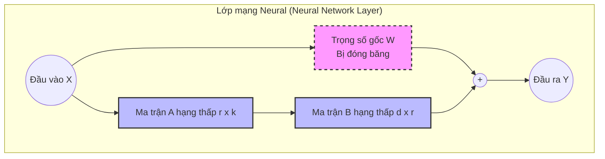

Khi bắt đầu làm việc với các Mô hình Ngôn ngữ Lớn (LLMs), bạn sẽ nhanh chóng nhận ra rằng dù chúng rất thông minh và có kiến thức nền tảng rộng, nhưng đôi khi chúng không nắm bắt được văn phong đặc thù, các khái niệm chuyên ngành sâu, hoặc cách trả lời theo đúng định dạng mà doanh nghiệp yêu cầu. Đây là lúc **Fine-tuning** (tinh chỉnh mô hình) trở nên cực kỳ cần thiết.

Fine-tuning là quá trình tinh chỉnh lại trọng số (weights) của một mô hình AI đã được huấn luyện sẵn (Pre-trained) bằng một tập dữ liệu chuyên ngành (domain-specific data). Quá trình này dựa trên nền tảng của **Transfer Learning** (Học chuyển giao), nơi mô hình tận dụng lại những hiểu biết tổng quát về ngôn ngữ đã học trước đó và chỉ điều chỉnh một phần nhỏ để thích nghi với tác vụ mới.

> [!NOTE]
> Fine-tuning không tạo ra một mô hình hoàn toàn mới từ con số 0. Nó tối ưu hóa và định hướng một Foundation Model (Mô hình nền tảng) để hoạt động hiệu quả nhất đối với các yêu cầu cụ thể, chẳng hạn như làm trợ lý y tế, sinh mã lập trình, hoặc tóm tắt văn bản pháp lý.

---

## 1. Fine-tuning khác gì so với RAG và Prompt Engineering?


Nhiều kỹ sư mới làm quen với AI thường nhầm lẫn giữa Fine-tuning và RAG (Retrieval-Augmented Generation), hoặc tự hỏi khi nào nên dùng Prompt Engineering. Việc lựa chọn sai kỹ thuật có thể gây lãng phí chi phí huấn luyện hoặc giảm hiệu năng của ứng dụng.

### Bảng So Sánh Các Kỹ Thuật Tùy Chỉnh LLM

| Tiêu chí | Prompt Engineering | RAG (Retrieval-Augmented Gen) | Fine-tuning |
| :--- | :--- | :--- | :--- |
| **Bản chất** | Đưa hướng dẫn trực tiếp qua câu lệnh vào prompt | Cung cấp ngữ cảnh từ hệ thống tìm kiếm (Vector DB) vào prompt | Thay đổi trực tiếp trọng số (weights) của mô hình AI |
| **Cập nhật kiến thức** | Tĩnh (Trừ khi đổi prompt) | Cực kỳ linh hoạt, thời gian thực (Real-time) | Tĩnh (Cần huấn luyện lại để cập nhật) |
| **Học "kỹ năng/phong cách"** | Hạn chế (Thông qua Few-shot prompting) | Không hỗ trợ trực tiếp (Phụ thuộc vào prompt) | **Rất mạnh mẽ** (Mô hình ngấm phong cách và định dạng) |
| **Giải quyết Ảo giác (Hallucination)** | Thấp | **Cao nhất** (Rất hiệu quả nhờ tra cứu dữ liệu gốc) | Trung bình (Vẫn có rủi ro nếu kiến thức không ở trong tập dữ liệu) |
| **Chi phí / Tài nguyên** | Rất thấp (Chỉ tốn phí API / Inference) | Thấp đến Trung bình (Cần Vector DB, embedding models) | **Cao** (Yêu cầu tính toán trên GPU, quản lý dữ liệu lớn) |
| **Khi nào nên dùng?** | Tác vụ đơn giản, dùng thử nghiệm, làm prototype nhanh. | Truy vấn kho dữ liệu doanh nghiệp, tài liệu thay đổi liên tục. | Đào tạo mô hình phân tích pháp lý, lập trình, hoặc có văn phong riêng. |

> [!TIP]
> **Nguyên tắc chung**: Hãy dùng **RAG** để cung cấp kiến thức thực tế (factual knowledge), dùng **Fine-tuning** để dạy định dạng, văn phong, quy tắc và suy luận đặc thù. Việc kết hợp cả hai — một mô hình được fine-tune để đọc hiểu tài liệu RAG tốt hơn — được gọi là **Fine-tuned RAG** (hay RAG-specific Fine-tuning) và đang là xu hướng hàng đầu cho các hệ thống Enterprise AI phức tạp.

---

## 2. Các phương pháp và kỹ thuật Fine-tuning

Việc tinh chỉnh mô hình có thể được thực hiện qua nhiều cấp độ, tùy thuộc vào ngân sách, tài nguyên phần cứng (GPU) và mục tiêu dự án.

### 2.1. Full Fine-Tuning

Full Fine-tuning là việc cập nhật lại *tất cả* các tham số của mô hình trong quá trình huấn luyện. Nếu mô hình có 7 tỷ tham số (như Llama 3 8B), bạn sẽ phải tính toán đạo hàm và cập nhật cả 7 tỷ tham số đó.

*   **Ưu điểm**: Mang lại hiệu năng tốt nhất nếu có bộ dữ liệu cực lớn và đủ đa dạng.
*   **Nhược điểm**: Yêu cầu tài nguyên máy tính khổng lồ. Để full fine-tune mô hình Llama-3 70B, bạn cần hệ thống cluster với hàng chục GPU A100/H100.
*   **Rủi ro - Catastrophic Forgetting**: Dễ gặp hiện tượng *Quên thảm họa*, khi mô hình học được kiến thức mới nhưng lại "quên" đi khả năng hiểu ngôn ngữ tổng quát hoặc kiến thức đã học ở giai đoạn Pre-training.

> [!CAUTION]
> Tránh dùng Full Fine-Tuning trừ khi bạn đang xây dựng một mô hình Foundation mới hoàn toàn cho một ngôn ngữ đặc thù (ví dụ đào tạo từ đầu một mô hình tiếng Việt) hoặc có kinh phí từ các tập đoàn lớn.

### 2.2. Parameter-Efficient Fine-Tuning (PEFT)

PEFT là tập hợp các kỹ thuật hiện đại cho phép chỉ huấn luyện một số lượng nhỏ các tham số (thường < 1% tổng số tham số của mô hình) trong khi vẫn đóng băng (freeze) phần lớn các trọng số gốc. Điều này giúp giảm bộ nhớ VRAM, thời gian huấn luyện và chi phí đáng kể mà hiệu năng gần bằng Full Fine-tuning.

#### LoRA (Low-Rank Adaptation)
LoRA là kỹ thuật PEFT mang tính cách mạng nhất hiện nay. Thay vì cập nhật trực tiếp ma trận trọng số $W \in \mathbb{R}^{d \times k}$ khổng lồ, LoRA "đóng băng" $W$ và thêm một "bản vá" bằng cách sử dụng hai ma trận hạng thấp (low-rank matrices) $A \in \mathbb{R}^{r \times k}$ và $B \in \mathbb{R}^{d \times r}$ với $r \ll d, k$.

*   **Công thức**: Trọng số ở thời điểm suy luận là $W' = W + \Delta W = W + B \times A$
*   **Không thêm độ trễ**: Khi inference (suy luận), $\Delta W$ có thể được gộp (merge) thẳng vào $W$, do đó không gây ra độ trễ nào.
*   **Tính đa dụng**: Bạn có thể lưu các adapter LoRA chỉ nặng vài chục MB thay vì lưu lại cả mô hình hàng chục GB. Có thể swap (thay thế) các LoRA này theo thời gian thực (Multi-LoRA) phục vụ nhiều user khác nhau.



#### QLoRA (Quantized LoRA)
QLoRA tiến thêm một bước tối ưu so với LoRA bằng cách lượng tử hóa (quantization) các trọng số gốc của mô hình từ chuẩn 16-bit (FP16/BF16) xuống định dạng **4-bit NormalFloat (NF4)** để giảm thiểu tối đa VRAM yêu cầu.

*   **Hiệu suất phi thường**: Nhờ QLoRA, một cá nhân có thể fine-tune mô hình 7B-8B tham số chỉ với một GPU tiêu dùng duy nhất (như NVIDIA RTX 3090 / 4090 24GB VRAM).
*   **Độ chính xác**: QLoRA sử dụng kỹ thuật *Double Quantization* và *Paged Optimizers* (chia trang bộ nhớ cho optimizer) để giữ nguyên độ chính xác khi train, không thua kém gì LoRA tiêu chuẩn trên mô hình 16-bit.

---

## 3. Các Giai Đoạn Alignment (Căn Chỉnh Mô Hình)

Một mô hình Pre-trained chỉ đơn giản là mô hình dự đoán từ tiếp theo. Để nó trở thành một trợ lý (Assistant) hữu ích và an toàn, chúng ta cần căn chỉnh (Alignment).

1.  **SFT (Supervised Fine-Tuning)**
    *   Mô hình học cách trả lời người dùng qua các cặp câu hỏi - câu trả lời chất lượng cao do con người tạo ra (Demonstration data).
    *   SFT thiết lập định dạng (như ChatML, Alpaca format) để mô hình hiểu rằng nó đang tham gia vào một cuộc hội thoại thay vì viết tiếp văn bản một cách ngẫu nhiên.
2.  **RLHF (Reinforcement Learning from Human Feedback)**
    *   Kỹ thuật đã tạo nên thành công của ChatGPT.
    *   Sử dụng phản hồi của con người (thích/không thích) để huấn luyện một "Mô hình phần thưởng" (Reward Model).
    *   Dùng thuật toán Reinforcement Learning (RL - Học tăng cường), cụ thể là PPO (Proximal Policy Optimization), để tối ưu hóa LLM sao cho đầu ra nhận được phần thưởng cao nhất, đồng thời tránh các nội dung độc hại.
3.  **DPO (Direct Preference Optimization)**
    *   Phương pháp hiện đại nhất đang thay thế dần RLHF trên nhiều bảng xếp hạng mở (Open LLM Leaderboard).
    *   DPO bỏ qua bước tạo Reward Model phức tạp. Thay vào đó, nó định nghĩa trực tiếp quá trình tinh chỉnh mô hình ngôn ngữ dựa trên các cặp phản hồi được ưa chuộng (chosen) và bị loại bỏ (rejected).
    *   Làm cho quá trình alignment diễn ra cực kỳ ổn định, ít siêu tham số (hyperparameters) hơn và tốn ít tài nguyên hơn hẳn RLHF.

> [!IMPORTANT]
> Hầu hết các nhà phát triển ứng dụng (Application Developers) chỉ cần dừng lại ở **SFT (Supervised Fine-Tuning)** bằng dữ liệu domain riêng của họ. Quá trình RLHF và DPO đòi hỏi kỹ năng cực cao, lượng dữ liệu phản hồi khổng lồ, và thường chỉ được thực hiện bởi các công ty phát triển Foundation Model như OpenAI, Anthropic, hay Meta.

---

## 4. Code Thực Hành: SFT với thư viện Hugging Face

Dưới đây là một minh họa thực tế ngắn gọn về cách bạn có thể thiết lập huấn luyện QLoRA cho một mô hình sử dụng bộ thư viện phổ biến từ Hugging Face: `transformers`, `peft`, `trl`, và `bitsandbytes`.

```python
import torch
from datasets import load_dataset
from transformers import AutoModelForCausalLM, AutoTokenizer, BitsAndBytesConfig, TrainingArguments
from peft import LoraConfig, get_peft_model
from trl import SFTTrainer

# 1. Cấu hình Quantization (QLoRA 4-bit)
bnb_config = BitsAndBytesConfig(
    load_in_4bit=True,
    bnb_4bit_use_double_quant=True,
    bnb_4bit_quant_type="nf4",
    bnb_4bit_compute_dtype=torch.bfloat16
)

# 2. Tải Mô Hình và Tokenizer
model_id = "meta-llama/Meta-Llama-3-8B-Instruct"
tokenizer = AutoTokenizer.from_pretrained(model_id)
model = AutoModelForCausalLM.from_pretrained(
    model_id, 
    quantization_config=bnb_config, 
    device_map="auto"
)

# 3. Cấu hình LoRA Adapter
peft_config = LoraConfig(
    r=16, # Rank
    lora_alpha=32, 
    target_modules=["q_proj", "k_proj", "v_proj", "o_proj"], # Các lớp Attention
    lora_dropout=0.05,
    bias="none",
    task_type="CAUSAL_LM"
)
model = get_peft_model(model, peft_config)

# 4. Tải dữ liệu huấn luyện (Đã chuẩn bị trước)
dataset = load_dataset("json", data_files="my_custom_domain_dataset.jsonl", split="train")

# 5. Cấu hình Training
training_args = TrainingArguments(
    output_dir="./results",
    per_device_train_batch_size=4,
    gradient_accumulation_steps=4,
    learning_rate=2e-4,
    logging_steps=10,
    max_steps=1000,
    optim="paged_adamw_8bit", # Tối ưu hóa bộ nhớ
    fp16=True,
)

# 6. Sử dụng SFTTrainer để huấn luyện
trainer = SFTTrainer(
    model=model,
    train_dataset=dataset,
    peft_config=peft_config,
    dataset_text_field="text",
    max_seq_length=1024,
    tokenizer=tokenizer,
    args=training_args,
)

# 7. Bắt đầu huấn luyện
trainer.train()

# 8. Lưu LoRA Adapter
trainer.model.save_pretrained("my-custom-lora-adapter")
```

> [!WARNING]
> Khi thực hành thực tế, hãy đảm bảo rằng `pad_token_id` của tokenizer đã được cấu hình chính xác (vì Llama-3 không có pad_token mặc định). Đồng thời, hãy chuẩn bị định dạng `text` trong dataset tuân thủ nghiêm ngặt **Chat Template** của mô hình gốc để quá trình Fine-tuning đạt hiệu suất cao.

---

## 5. Quy trình Fine-tuning Chuẩn trong Doanh Nghiệp

Để xây dựng một dự án AI sử dụng Fine-tuning thành công, bạn nên áp dụng quy trình chuẩn sau:

1.  **Chuẩn bị Dữ liệu (Data Preparation)**
    *   *Data is all you need.* Chất lượng dữ liệu quan trọng hơn số lượng (Khoảng 1,000 mẫu chất lượng cao tốt hơn 100,000 mẫu tạp nham - theo nghiên cứu *LIMA*). 
    *   Làm sạch, định dạng đúng Chat Template (như ChatML) và luôn có tập validation riêng để đánh giá.
2.  **Chọn mô hình Base**
    *   Lựa chọn mô hình open-weight phù hợp (như Llama-3, Mistral, Qwen, Gemma) dựa trên tiêu chí: giấy phép thương mại (Commercial License), kích thước tham số (phù hợp với ngân sách hosting), và khả năng hỗ trợ đa ngôn ngữ.
3.  **Thiết lập Môi trường & Framework**
    *   Dùng các framework như `Unsloth`, `Axolotl`, hoặc `LLaMA-Factory` để đẩy nhanh quá trình. `Unsloth` hiện nay có khả năng tối ưu GPU kernels giúp tăng tốc độ train QLoRA lên gấp 2 lần.
4.  **Huấn luyện (Training)**
    *   Theo dõi Loss curve (đồ thị hàm mất mát) qua Weights & Biases (WandB) hoặc Tensorboard. 
    *   Chú ý dừng huấn luyện (Early Stopping) nếu Validation Loss bắt đầu tăng trở lại, điều này là dấu hiệu của **Overfitting**.
5.  **Đánh giá (Evaluation)**
    *   Đánh giá không chỉ qua số liệu (Perplexity) mà còn qua **LLM-as-a-Judge** (Sử dụng GPT-4 để chấm điểm mô hình) và đánh giá con người mù (Blind Human Evaluation).
6.  **Triển khai (Deployment)**
    *   Merge LoRA weights ngược lại vào mô hình gốc.
    *   Có thể Lượng tử hóa sau huấn luyện (Post-Training Quantization - PTQ) sang định dạng GGUF/AWQ để tối ưu tốc độ sinh token.
    *   Phục vụ (Serving) thông qua các giải pháp như `vLLM`, `TGI` (Text Generation Inference) hoặc các framework cục bộ như `Ollama`.

---

## 6. Real-world Scenario: Xây dựng Trợ lý Y tế

Hãy tưởng tượng một bệnh viện muốn xây dựng chatbot phân loại triệu chứng ban đầu cho bệnh nhân trên nền tảng Llama 3 8B.

*   **Vấn đề**: Llama 3 gốc trả lời quá chung chung, dài dòng, đôi khi đưa ra lời khuyên sai lệch nguy hiểm. Hơn nữa nó không thể trả lời theo chuẩn format JSON mà hệ thống backend bệnh viện yêu cầu.
*   **Giải pháp với Fine-tuning**:
    *   Bệnh viện thu thập 5,000 ca bệnh cũ do bác sĩ thật đánh giá (ẩn danh thông tin bệnh nhân).
    *   Tạo dataset với định dạng: `System`: "Bạn là trợ lý y tế. Luôn trả lời JSON gồm 'muc_do_khan_cap' (Cao/Thấp) và 'chuyen_khoa'". `User`: "Tôi đau ngực trái lan xuống cánh tay". `Assistant`: `{"muc_do_khan_cap": "Cao", "chuyen_khoa": "Tim mạch"}`.
    *   Áp dụng kỹ thuật QLoRA và sử dụng `Axolotl` để tinh chỉnh.
    *   **Kết quả**: Chỉ với 1 ngày huấn luyện trên máy có GPU 24GB VRAM, mô hình đã học được cách trả lời *chính xác bằng JSON 100%* và bắt chước lối suy luận y khoa ngắn gọn, chuẩn xác của các bác sĩ viện đó. Ảo giác (Hallucination) giảm đáng kể do mô hình bị gò ép vào khung cấu trúc JSON chặt chẽ.

---

## Tài Liệu Tham Khảo

1.  [LoRA: Low-Rank Adaptation of Large Language Models (Hu et al., 2021)](https://arxiv.org/abs/2106.09685)
2.  [QLoRA: Efficient Finetuning of Quantized LLMs (Dettmers et al., 2023)](https://arxiv.org/abs/2305.14314)
3.  [Direct Preference Optimization: Your Language Model is Secretly a Reward Model (Rafailov et al., 2023)](https://arxiv.org/abs/2305.18290)
4.  [LIMA: Less Is More for Alignment (Zhou et al., 2023)](https://arxiv.org/abs/2305.11206) - Nghiên cứu chứng minh chỉ cần dữ liệu nhỏ nhưng chất lượng cao là đủ để fine-tune.
5.  [Hugging Face PEFT Documentation](https://huggingface.co/docs/peft/index)
6.  [Unsloth Documentation - Tăng tốc QLoRA Training](https://github.com/unslothai/unsloth)
