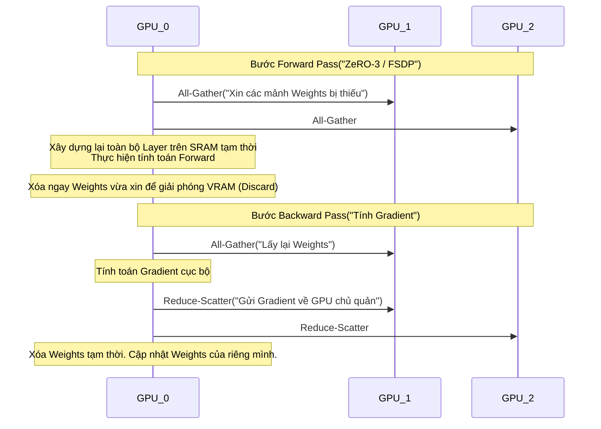
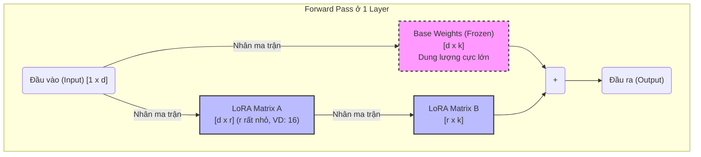

Đối với một Staff Data Engineer hoặc ML Engineer, việc tinh chỉnh (Fine-tuning) Mô hình Ngôn ngữ Lớn (LLM) không dừng lại ở việc gọi API từ Hugging Face. Đó là một bài toán **Distributed Systems (Hệ thống phân tán)**, nơi bạn phải đối phó với giới hạn vật lý của băng thông mạng (Network Bandwidth), PCIe, NVLink, và bộ nhớ GPU VRAM. 

Fine-tuning yêu cầu luân chuyển hàng terabyte dữ liệu qua các cluster GPU, đồng bộ hóa gradients theo thời gian thực, và đối phó với những tình huống sập hệ thống (OOM, Node failure) thường trực.

---

## 1. Kiến trúc Vật lý & Toán học Bộ nhớ (Memory Architecture)

### 1.1. Ảo tưởng về Kích thước Mô hình
Nhiều kỹ sư nhầm tưởng rằng: *"Mô hình 7B (7 tỷ tham số) dùng chuẩn FP16 (2 bytes/tham số) nặng khoảng 14GB, nên một card GPU 24GB là đủ để Full Fine-tuning"*. Đây là một sai lầm chết người dẫn đến **CUDA Out of Memory (OOM)**.

Trong quá trình huấn luyện (Train), VRAM phải chứa 4 thành phần (Model States):
1. **Model Weights (Trọng số gốc):** 2 bytes/tham số.
2. **Gradients (Đạo hàm):** 2 bytes/tham số (hoặc 4 bytes ở FP32).
3. **Optimizer States (Trạng thái tối ưu hóa):** Ví dụ với AdamW, bạn cần lưu trữ `Momentum` và `Variance` ở chuẩn FP32. Tổng cộng tốn thêm 8 bytes/tham số (4 bytes x 2).
4. **Activations (Giá trị kích hoạt):** Dùng cho quá trình backward pass, kích thước phụ thuộc tuyến tính vào Batch Size và Sequence Length.

**Tổng cộng:** Để huấn luyện một mô hình 7B bằng AdamW (Mixed Precision), bạn cần khoảng **16-20 bytes cho mỗi tham số**. Mô hình 7B sẽ "ngốn" hơn **120GB VRAM** — vượt xa khả năng của một card A100 80GB đơn lẻ.

### 1.2. Phân mảnh Trạng thái (State Sharding) với DeepSpeed ZeRO & FSDP

Để giải quyết bài toán VRAM, các hệ thống Distributed Training sử dụng kỹ thuật Sharding (Chia cắt dữ liệu) thay vì nhân bản (Data Parallelism truyền thống). Hai kiến trúc thống trị hiện nay là **DeepSpeed ZeRO (Zero Redundancy Optimizer)** của Microsoft và **FSDP (Fully Sharded Data Parallel)** của Meta.


*Kiến trúc tối ưu bộ nhớ DeepSpeed ZeRO (Nguồn: Microsoft Research)*

**Cơ chế hoạt động (The Mechanics):**
Thay vì mỗi GPU (Worker) giữ toàn bộ bản sao của Model States, hệ thống sẽ cắt chúng thành $N$ phần (với $N$ là số lượng GPU). 
- **ZeRO Stage 1:** Chỉ phân mảnh Optimizer States.
- **ZeRO Stage 2:** Phân mảnh Optimizer States + Gradients.
- **ZeRO Stage 3 (hoặc FSDP):** Phân mảnh toàn bộ (Optimizer, Gradients, Weights).



> [!CAUTION]
> **Trade-off cốt lõi: Compute vs. Communication Bandwidth**
> ZeRO-3 giúp huấn luyện mô hình 70B tham số mà không bị OOM, nhưng cái giá phải trả là **Network Shuffle** khổng lồ. Bước `All-Gather` và `Reduce-Scatter` liên tục vắt kiệt băng thông. Nếu cluster của bạn không có **InfiniBand** hoặc **NVLink** (ví dụ: dùng AWS EC2 thường không có EFA - Elastic Fabric Adapter), mô hình sẽ rơi vào trạng thái *Communication Bottleneck* (GPU nhàn rỗi chờ mạng truyền dữ liệu).

---

## 2. Kỹ thuật PEFT: Toán học của LoRA & QLoRA

Nếu không đủ tiền thuê một Cluster H100 để chạy FSDP, bạn phải dùng **PEFT (Parameter-Efficient Fine-Tuning)**. Trong đó, **LoRA (Low-Rank Adaptation)** là giải pháp tiêu chuẩn công nghiệp.

### 2.1. Kiến trúc LoRA
Thay vì tính toán Gradient để cập nhật trực tiếp ma trận trọng số $W \in \mathbb{R}^{d \times k}$ khổng lồ (bị đóng băng - Frozen), LoRA bơm thêm một Bypass-Network gồm hai ma trận hạng thấp (Low-rank matrices) $A$ và $B$.

$$ W' = W + B \times A $$
Trong đó: $A \in \mathbb{R}^{r \times k}$ và $B \in \mathbb{R}^{d \times r}$, với Rank $r \ll d, k$.



**Sự Đánh đổi (Trade-off) của Rank ($r$):**
- **$r$ nhỏ (4 - 8):** VRAM siêu thấp, hội tụ nhanh. Nhưng mô hình không học được các suy luận phức tạp, chỉ hợp để học định dạng JSON/YAML.
- **$r$ lớn (64 - 256):** Khả năng học sâu, gần bằng Full Fine-tuning, nhưng kích thước Checkpoint phình to, VRAM tăng cao và dễ Overfitting.

### 2.2. QLoRA: Vượt rào cản I/O bằng Quantization
QLoRA tối ưu xa hơn bằng cách tải Base Weights ở định dạng **4-bit NormalFloat (NF4)** thay vì 16-bit. Kỹ thuật `Paged Optimizers` được sử dụng để tràn (Spill-to-disk) Optimizer States từ GPU VRAM sang CPU RAM khi có đột biến bộ nhớ.

---

## 3. Rủi ro Vận hành & Incidents Thực chiến (Operational Risks)

Hệ thống Fine-tuning rất dễ vỡ. Dưới đây là các sự cố (Incidents) phổ biến mà Data Engineers/MLOps thường gặp và cách Troubleshooting.

### Incident 1: JVM/CUDA OOMKilled & Spill-to-Disk Thrashing
- **Triệu chứng:** Khi chu kỳ huấn luyện dài, Memory phân mảnh (Fragmentation). Nếu dùng `Paged Optimizers`, CPU RAM và PCIe bus bị quá tải do dữ liệu liên tục swap giữa GPU và RAM chủ, dẫn đến tốc độ huấn luyện giảm 100x (Thrashing) và tiến trình bị Kernel chém (OOMKilled).
- **Khắc phục:** 
  1. Giảm `per_device_train_batch_size` và tăng `gradient_accumulation_steps`. Điều này giữ nguyên Global Batch Size nhưng giảm kích thước Activation cần lưu ở mỗi bước Forward pass.
  2. Bật **Gradient Checkpointing**: Thay vì lưu toàn bộ Activations để tính đạo hàm ngược, chỉ lưu một phần và tính lại (recompute) phần còn lại khi cần. Đánh đổi: Tiết kiệm VRAM nhưng tốn thêm Compute (chậm hơn khoảng 20-30%).

### Incident 2: Loss Spikes (Gradient Explosion) & Checkpoint Corruption
- **Triệu chứng:** Đồ thị Training Loss trên `WandB` đang giảm đều đặn thì đột ngột vọt thẳng đứng lên (Loss Spike) hoặc biến thành `NaN` (Not a Number). Toàn bộ cluster hỏng chu trình, checkpoint gần nhất ghi ra S3 bị hỏng.
- **Nguyên nhân:** Dữ liệu bị nhiễu (outliers), Learning Rate quá cao khởi tạo sai, hoặc số chấm động 16-bit (`fp16`) bị tràn ngưỡng tính toán (Overflow).
- **Khắc phục:** 
  1. Bắt buộc chuyển từ `fp16` sang `bf16` (BFloat16) trên các card NVIDIA Ampere trở lên (A100, H100). BFloat16 có dải số nguyên (exponent) tương đương FP32, hoàn toàn triệt tiêu lỗi tràn biến của FP16.
  2. Cấu hình `Gradient Clipping` (ví dụ `max_grad_norm=1.0`) để cắt gọt các đạo hàm quá lớn trước khi cập nhật.

### Incident 3: Catastrophic Forgetting (Quên Thảm Họa)
- **Triệu chứng:** Sau khi Fine-tune để dạy LLM trả lời tiếng Việt xuất sắc cho Y tế, bạn phát hiện ra nó quên mất cách viết Code Python hoặc quên mất các kiến thức cơ bản.
- **Khắc phục:** Data Mix. Trộn thêm 10-20% dữ liệu Pre-training (General Knowledge) vào tập dữ liệu Domain-specific trong lúc huấn luyện.

---

## 4. Tối ưu Chi phí Hệ thống (FinOps)

Chạy Cluster huấn luyện ngốn hàng chục ngàn USD mỗi tháng. Một Staff Engineer cần quan tâm tới FinOps:

1. **Spot Instances & Fault Tolerance:** 
   Huấn luyện GPU trên AWS EC2 Spot instances rẻ hơn 70%. Tuy nhiên, Spot instance có thể bị thu hồi (preempt) bất cứ lúc nào. Hệ thống cần được thiết kế **Fault Tolerant** bằng cách lưu Checkpoint siêu nhanh.
2. **Checkpoint I/O Bottleneck:**
   Lưu checkpoint của 70B model tốn tới 140GB. Nếu ghi trực tiếp lên Amazon S3 qua đường mạng truyền thống, Cluster GPU sẽ "đóng băng" (Idling) trong 10-15 phút chỉ để đợi Disk I/O hoàn tất, gây lãng phí hàng trăm đô la.
   *Giải pháp:* Lưu checkpoint tạm xuống local NVMe SSD, sau đó dùng một luồng bất đồng bộ (Background Daemon) đồng bộ hóa nó lên S3, hoặc sử dụng hệ thống filesystem chuyên dụng như FSx for Lustre.

---

## 5. Code Thực Chiến (Executable Configurations)

### 5.1. Cấu hình DeepSpeed ZeRO-3
Thay vì chạy Python script trần, trong môi trường Enterprise, bạn dùng file cấu hình `deepspeed_config.json` truyền vào Hugging Face Trainer hoặc PyTorch Lightning.

```json
{
  "fp16": {
    "enabled": false
  },
  "bf16": {
    "enabled": true
  },
  "zero_optimization": {
    "stage": 3,
    "offload_optimizer": {
      "device": "cpu",
      "pin_memory": true
    },
    "offload_param": {
      "device": "cpu",
      "pin_memory": true
    },
    "overlap_comm": true,
    "contiguous_gradients": true,
    "sub_group_size": 1e9,
    "reduce_bucket_size": "auto",
    "stage3_prefetch_bucket_size": "auto",
    "stage3_param_persistence_threshold": "auto"
  },
  "gradient_accumulation_steps": "auto",
  "train_batch_size": "auto",
  "train_micro_batch_size_per_gpu": "auto"
}
```
*Phân tích Trade-off:* `offload_optimizer` và `offload_param` sang `cpu` giúp tiết kiệm VRAM khổng lồ cho phép train mô hình vượt mức VRAM, nhưng sẽ làm nút thắt cổ chai (bottleneck) tại băng thông PCIe.

### 5.2. Khởi tạo QLoRA An toàn Chống OOM (Sử dụng Python)
Đoạn code sau mô phỏng việc thiết lập QLoRA bằng BFloat16 và cấu hình Gradient Checkpointing để triệt tiêu 100% rủi ro OOM trên card 24GB.

```python
import torch
from transformers import AutoModelForCausalLM, AutoTokenizer, BitsAndBytesConfig
from peft import LoraConfig, get_peft_model, prepare_model_for_kbit_training

# 1. Double Quantization với NF4 (Chống tràn RAM)
bnb_config = BitsAndBytesConfig(
    load_in_4bit=True,
    bnb_4bit_use_double_quant=True,
    bnb_4bit_quant_type="nf4",
    bnb_4bit_compute_dtype=torch.bfloat16 # Tránh Loss Spikes
)

# 2. Load Model
model_id = "meta-llama/Meta-Llama-3-8B"
model = AutoModelForCausalLM.from_pretrained(
    model_id, 
    quantization_config=bnb_config, 
    device_map="auto"
)

# 3. Chuẩn bị mô hình (Enable Gradient Checkpointing)
# Cực kỳ quan trọng để không bị OOM khi Context Window lớn
model.gradient_checkpointing_enable()
model = prepare_model_for_kbit_training(model)

# 4. Bơm LoRA Adapter
peft_config = LoraConfig(
    r=32, # Rank vừa đủ sâu
    lora_alpha=64, 
    target_modules=["q_proj", "k_proj", "v_proj", "o_proj", "gate_proj", "up_proj", "down_proj"], 
    lora_dropout=0.05,
    bias="none",
    task_type="CAUSAL_LM"
)
model = get_peft_model(model, peft_config)

model.print_trainable_parameters()
# Output expected: trainable params: 83,886,080 || all params: 8,114,147,328 || trainable%: 1.0338%
```

---

## Nguồn Tham Khảo (References)

1.  [DeepSpeed: Extreme-scale model training for everyone - Microsoft Research Blog](https://www.microsoft.com/en-us/research/blog/zero-deepspeed-new-system-optimizations-enable-training-models-with-over-100-billion-parameters/)
2.  [ZeRO: Memory Optimizations Toward Training Trillion Parameter Models - arXiv:1910.02054](https://arxiv.org/abs/1910.02054)
3.  [PyTorch FSDP (Fully Sharded Data Parallel) Documentation](https://pytorch.org/docs/stable/fsdp.html)
4.  [LoRA: Low-Rank Adaptation of Large Language Models (Hu et al., 2021)](https://arxiv.org/abs/2106.09685)
5.  [QLoRA: Efficient Finetuning of Quantized LLMs (Dettmers et al., 2023)](https://arxiv.org/abs/2305.14314)
6.  [Designing Data-Intensive Applications (Martin Kleppmann)](https://dataintensive.net/) - Tham chiếu các nguyên lý Bottleneck Hệ thống, I/O và Fault Tolerance áp dụng vào MLOps.
