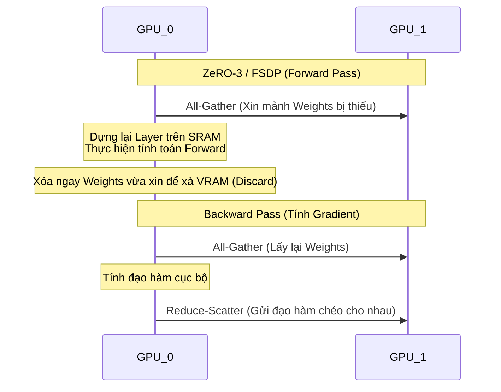

Đối với một Staff Data Engineer hoặc ML Engineer, việc tinh chỉnh (Fine-tuning) LLM không dừng lại ở việc gọi API từ Hugging Face. Đó là một bài toán **Distributed Systems (Hệ thống phân tán)**, nơi bạn phải đối phó với giới hạn vật lý của băng thông mạng (Network Bandwidth), PCIe, NVLink, và bộ nhớ GPU VRAM.

---

## 1. Kiến Trúc Bộ Nhớ (VRAM) & Sự Phân Mảnh (Sharding)

### 1.1. Ảo Tưởng Về Kích Thước Mô Hình
Nhiều kỹ sư nhầm tưởng rằng: *"Mô hình 7B (7 tỷ tham số) dùng chuẩn FP16 (2 bytes/tham số) nặng khoảng 14GB, nên một card GPU 24GB là đủ để Full Fine-tuning"*. Đây là nguyên nhân số một gây ra lỗi **CUDA Out of Memory (OOM)**.

Trong lúc Training, GPU VRAM phải chứa 4 thành phần (Model States):
1. **Model Weights (Trọng số gốc):** 2 bytes/tham số.
2. **Gradients (Đạo hàm):** 2 bytes/tham số.
3. **Optimizer States:** Ví dụ AdamW lưu `Momentum` và `Variance` ở FP32 $\rightarrow$ tốn thêm 8 bytes/tham số.
4. **Activations:** Giá trị kích hoạt dùng cho backward pass (phụ thuộc Batch Size & Sequence Length).

**Tổng cộng:** Để train một mô hình 7B bằng AdamW, bạn cần ~**16-20 bytes cho mỗi tham số**. Mô hình 7B sẽ ngốn **>120GB VRAM** — một card A100 80GB cũng gục ngã.

### 1.2. DeepSpeed ZeRO & FSDP
Để giải quyết bài toán VRAM, hệ thống sử dụng Sharding (Chia cắt trạng thái). Hai kiến trúc thống trị là **DeepSpeed ZeRO (Zero Redundancy Optimizer)** và **FSDP (Fully Sharded Data Parallel)**.
Thay vì mỗi GPU giữ toàn bộ bản sao của Model States, hệ thống cắt chúng thành $N$ phần ($N$ là số GPU).

**Trade-off Cốt lõi (Compute vs. Network):**
ZeRO-3 cứu bạn khỏi OOM, nhưng cái giá phải trả là **Network Shuffle** khổng lồ. Nếu cluster không có **InfiniBand** hoặc **NVLink**, các GPU sẽ rơi vào trạng thái *Communication Bottleneck* (GPU ngồi chơi chờ mạng tải dữ liệu).

---

## 2. Kỹ thuật PEFT: Toán học của LoRA & QLoRA

Nếu không có Cluster H100, bạn phải dùng **PEFT (Parameter-Efficient Fine-Tuning)**, nổi bật nhất là **LoRA (Low-Rank Adaptation)**.

### 2.1. Kiến Trúc LoRA
Thay vì tính toán Gradient để cập nhật trực tiếp ma trận trọng số $W \in \mathbb{"R"}^{d \times k}$ khổng lồ (ta đóng băng nó - Frozen), LoRA bơm thêm một Bypass-Network gồm hai ma trận hạng thấp $A$ và $B$.

$$ W' = W + B \times A $$
Với $A \in \mathbb{"R"}^{r \times k}$ và $B \in \mathbb{"R"}^{d \times r}$, với Rank $r \ll d, k$.

**Sự Đánh đổi của Rank ($r$):**
- **$r$ nhỏ (4 - 8):** VRAM siêu thấp, hội tụ nhanh. Chỉ hợp dạy model định dạng JSON/XML.
- **$r$ lớn (64 - 256):** Khả năng học sâu ngữ nghĩa phức tạp, nhưng kích thước Checkpoint lớn và dễ Overfitting.

### 2.2. QLoRA
QLoRA tối ưu xa hơn bằng cách tải Base Weights ở định dạng nén **4-bit NormalFloat (NF4)**. Kỹ thuật `Paged Optimizers` được dùng để tràn (Spill-to-disk) Optimizer States từ GPU sang CPU RAM khi có đột biến bộ nhớ.

---

## 3. Post-SFT Alignment: RLHF vs DPO

Sau khi qua bước SFT (Supervised Fine-Tuning), model cần được "căn chỉnh" (Alignment) để trả lời an toàn, không chửi thề.
- **RLHF (Reinforcement Learning from Human Feedback):** Train thêm một Reward Model riêng biệt, sau đó dùng thuật toán PPO để tối ưu. Rất phức tạp, thiếu ổn định, dễ bị sập (Collapse) lúc train.
- **DPO (Direct Preference Optimization):** Giải pháp hiện đại. Trực tiếp đưa dữ liệu cặp (Câu trả lời Tốt / Câu trả lời Xấu) vào hàm Loss của model, bỏ qua hoàn toàn bước PPO cồng kềnh. Đơn giản, cực kỳ ổn định.

---

## 4. Rủi Ro Vận Hành & Incidents Thực Chiến

### Incident 1: Spill-to-Disk Thrashing (OOMKilled)
- **Triệu chứng:** Khi dùng `Paged Optimizers`, CPU RAM và PCIe bus bị quá tải do dữ liệu liên tục swap (tràn) giữa GPU và RAM chủ. Tốc độ train giảm 100x (Thrashing) và tiến trình bị Linux OOM Killer chém đứt.
- **Khắc phục:** Bật **Gradient Checkpointing**. Thay vì lưu toàn bộ Activations để backward pass, chỉ lưu một nửa và tính lại (recompute) phần còn lại. Đánh đổi: Tiết kiệm VRAM cực mạnh nhưng tốn thêm Compute (Train chậm hơn 30%).

### Incident 2: Loss Spikes (Gradient Explosion)
- **Triệu chứng:** Đồ thị Training Loss trên WandB đang giảm đều đặn thì đột ngột vọt thẳng đứng (Loss Spike) hoặc biến thành `NaN`. Checkpoint hỏng toàn bộ.
- **Căn nguyên:** Dùng `fp16` (Float16). Kiểu dữ liệu này có dải số quá hẹp, rất dễ bị tràn biến (Overflow) khi đạo hàm lớn.
- **Khắc phục:** Bắt buộc chuyển từ `fp16` sang **`bf16` (BFloat16)** trên các card Ampere (A100, H100). BFloat16 hy sinh độ chính xác đuôi phân số để lấy dải số nguyên rộng tương đương FP32, triệt tiêu 100% lỗi tràn biến.

### Incident 3: Catastrophic Forgetting (Quên Thảm Họa)
- **Triệu chứng:** Sau khi Fine-tune để dạy model y tế, nó bỗng dưng... quên mất cách viết Code Python hoặc tính toán cơ bản.
- **Khắc phục:** Kỹ thuật **Data Mix**. Trộn thêm 10-20% dữ liệu Pre-training chung (General Knowledge) vào tập SFT Y tế để neo giữ (anchor) trọng số cũ.

---

## 5. Tối Ưu Chi Phí Hệ Thống (FinOps)

Chạy Cluster GPU ngốn hàng chục ngàn USD mỗi tháng:
1. **Spot Instances & Fault Tolerance:** Dùng EC2 Spot instances rẻ hơn 70%. Nhưng nó có thể bị AWS thu hồi bất cứ lúc nào. Bắt buộc phải có cơ chế Auto-Resume từ Checkpoint gần nhất.
2. **Nút thắt I/O Checkpoint:** Ghi checkpoint của model 70B tốn 140GB. Nếu ghi trực tiếp qua mạng lên S3, Cluster GPU sẽ "đóng băng" [Idling] trong 15 phút chỉ để đợi mạng, gây lãng phí tiền GPU.
   $\rightarrow$ **Giải pháp:** Ghi checkpoint tạm xuống NVMe SSD nội bộ (cực nhanh), sau đó có một tiến trình Background (Asynchronous) đồng bộ file đó lên S3.

---

## Nguồn Tham Khảo (References)
* [DeepSpeed: ZeRO (Zero Redundancy Optimizer]][https://arxiv.org/abs/1910.02054]
* [PyTorch FSDP (Fully Sharded Data Parallel]][https://pytorch.org/docs/stable/fsdp.html]
* [QLoRA: Efficient Finetuning of Quantized LLMs][https://arxiv.org/abs/2305.14314]
* [Direct Preference Optimization (DPO]](https://arxiv.org/abs/2305.18290)
