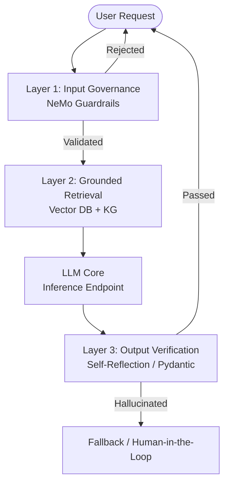

## 1. Bản Chất Vật Lý Của Hallucination

Trong các hệ thống phân tán truyền thống, khi bạn gửi một câu query SQL `SELECT`, hệ thống trả về kết quả chính xác 100% từ đĩa cứng (Deterministic). Tuy nhiên, LLM (Large Language Models) vận hành trên cơ chế **Stochastic Next-Token Prediction** (Dự đoán xác suất token tiếp theo). 

LLM không "truy xuất" kiến thức từ một cơ sở dữ liệu vật lý; chúng tính toán phân phối xác suất (Probability Distribution) trên không gian chiều cao của hàng tỷ tham số (Parameters). Khi phân phối xác suất của nhiều token gần bằng nhau (High Entropy), hoặc hệ số `temperature` > 0, LLM có thể chọn một chuỗi token hoàn toàn đúng về mặt ngữ pháp nhưng sai lệch hoàn toàn về mặt thực tế (Factual Inaccuracy).

**Hệ quả:** Hallucination là **"Feature, not a Bug"**. Chúng ta không thể "fix" triệt để ảo giác ở cấp độ Model Weights. Thay vào đó, chúng ta phải "mitigate" nó ở **Kiến trúc Hệ thống (System Architecture)** bao quanh mô hình.

## 2. Kiến trúc Phòng thủ Nhiều Lớp (Multi-Layered Defense Architecture)

Để vận hành LLM an toàn trong môi trường Enterprise, một Prompt dài là không đủ. Hệ thống cần được thiết kế với cơ chế chặn đứng ảo giác từ trước khi Prompt chạm vào Model, và xác minh lại output trước khi trả về User.

Dưới đây là mô hình kiến trúc **Multi-Layered Defense**:



### 2.1. Layer 1: Input Governance (Pre-Generation)
Chặn các prompt có khả năng gây ảo giác (như Prompt Injection, Jailbreak, hoặc câu hỏi nằm ngoài Domain). 
Sử dụng NVIDIA NeMo Guardrails để định tuyến (Routing) và từ chối các luồng hội thoại độc hại mà không cần gọi đến LLM sinh văn bản đắt tiền.


**Thực chiến:** Cấu hình `rails.yaml` định nghĩa ranh giới (Topical Rails) cho LLM.
```yaml
# rails.yaml
define user ask about politics
  "What do you think about the upcoming election?"
  "Who should I vote for?"

define bot refuse politics
  "I am an enterprise Data Engineering assistant. I cannot discuss political topics."

define flow
  user ask about politics
  bot refuse politics
```

### 2.2. Layer 2: Grounded Retrieval (Contextualization)
Thay vì để LLM "nhớ lại" kiến thức từ Weights (vốn dễ gây ảo giác và lỗi thời), chúng ta ép mô hình chỉ tổng hợp thông tin từ Context được cung cấp. Kiến trúc **RAG (Retrieval-Augmented Generation)** là hạt nhân của Layer này.

Tuy nhiên, RAG thuần túy dựa trên Vector Search (Cosine Similarity) vẫn gây ảo giác nếu tài liệu truy xuất bị sai bối cảnh. Giải pháp Enterprise là kết hợp **Knowledge Graph (Đồ thị tri thức)** để tạo ra Deterministic Retrieval.

### 2.3. Layer 3: Output Verification (Post-Generation)
Tuyệt đối không stream trực tiếp Output của LLM cho User trong các use-case tài chính. Output phải được đưa qua một Validator để đối chiếu (Cross-check) với các sự kiện đã truy xuất ở Layer 2.

**Thực chiến:** Sử dụng `Pydantic` và `Instructor` (Python) để ép LLM trả về Structured Data và validate kiểu dữ liệu tĩnh. Nếu LLM ảo giác ra một trường không hợp lệ, hệ thống sẽ tự động Raise Exception và kích hoạt Retry Loop.

```python
import instructor
from pydantic import BaseModel, Field, ValidationInfo, field_validator
from openai import OpenAI

client = instructor.from_openai(OpenAI())

class FinancialReport(BaseModel):
    company_name: str
    revenue_usd: float = Field(..., description="Doanh thu bằng USD")
    
    @field_validator('revenue_usd')
    @classmethod
    def revenue_must_be_positive(cls, v: float, info: ValidationInfo) -> float:
        if v < 0:
            raise ValueError(f"Ảo giác dữ liệu: Doanh thu không thể âm ({v})")
        return v

# Nếu LLM ảo giác ra doanh thu âm, Instructor sẽ tự động ném lỗi và bắt LLM sinh lại
try:
    report = client.chat.completions.create(
        model="gpt-4-turbo",
        response_model=FinancialReport,
        messages=[
            {"role": "user", "content": "Phân tích doanh thu năm 2023 của ACME Corp."}
        ],
        max_retries=3 # Cơ chế Retry Storm Limit
    )
    print(report.model_dump_json(indent=2))
except Exception as e:
    print(f"Fallback kích hoạt do lỗi: {e}")
```

## 3. Đánh đổi Hệ thống (Systemic Trade-offs) & FinOps

Việc xây dựng hệ thống phòng chống Hallucination mang theo gánh nặng to lớn về kiến trúc. Data Engineer phải đối mặt với các trade-off sau:

### 3.1. Latency vs. Thoroughness (Độ Trễ vs. Độ Kỹ Lưỡng)
*   **Thoroughness:** Mỗi bước kiểm tra (NeMo Guardrails, RAG Retrieval, Output Verification) tốn thêm các lệnh gọi mạng (Network Calls) tới LLM hoặc DB. Kiến trúc Multi-Agent Verification (LLM-as-a-judge) có thể đẩy độ trễ (Latency) từ 1 giây lên **15-20 giây**.
*   **Trade-off:** Trải nghiệm người dùng sẽ tệ nếu chờ quá lâu. **Giải pháp:** Sử dụng mô hình nhỏ, siêu tốc (ví dụ: Llama-3-8B hoặc Haiku) cho tác vụ Routing và Verification, chỉ dùng Heavy Model (GPT-4 / Opus) cho quá trình sinh cuối cùng. 

### 3.2. FinOps: Chi phí Inference bùng nổ
Khi sử dụng Chain-of-Thought (CoT) hay Guardrails, lượng Token tiêu thụ (Input lẫn Output) sẽ tăng gấp 3-4 lần cho mỗi request thực tế của người dùng.
*   **OOMKilled & Compute Bottleneck:** Nếu lưu lượng người dùng tăng vọt (Spike Traffic), việc chạy các mô hình Local trên GPU để verify sẽ gây quá tải VRAM dẫn đến Kubernetes Pod bị `OOMKilled`. 
*   **Tối ưu:** Cần sử dụng Semantic Cache (Redis/Qdrant) để cache các câu trả lời đã được verify, kết hợp với các kỹ thuật như Continuous Batching (vLLM) để tối đa hóa Throughput phần cứng.

## 4. Real-world Incident: RAG "Poisoning" & Ảo giác Tự Tin (Confident Hallucination)

**Tình huống:** Một hệ thống RAG nội bộ của bộ phận HR sử dụng Pinecone Vector DB. Do pipeline Ingestion không xử lý tốt Chunking (chia nhỏ văn bản), thông tin lương của "Giám đốc A" vô tình bị nối vào ngữ cảnh của "Nhân viên B". 

**Sự cố:** Khi User hỏi "Nhân viên B lương bao nhiêu?", RAG truy xuất nhầm đoạn chunk chứa lương của Giám đốc A. LLM đọc đoạn context (sai) này và trả lời một cách cực kỳ mạch lạc, tự tin (Confident Hallucination) rằng Nhân viên B có mức lương 500 triệu/tháng.

**Khắc phục (Troubleshooting):**
1.  **Dữ liệu:** Không phó mặc cho Vector DB. Áp dụng Metadata Filtering (RBAC) nghiêm ngặt trước khi nhúng (Embedding).
2.  **Citation:** Ép hệ thống phải trích dẫn (Cite) đúng dòng trong văn bản gốc. Nếu không tìm thấy Exact Match, phải fallback.
3.  **Chunking Strategy:** Chuyển từ Fixed-size Chunking sang Semantic Chunking để giữ vẹn nguyên tính toàn vẹn của thực thể (Entity Integrity).

## 5. Tổng Kết

Trong Data Engineering hiện đại, xử lý Hallucination không còn là công việc của AI Researcher ngồi tinh chỉnh Hyperparameters. Nó là một bài toán **Thiết kế Hệ thống Phânזרה (Distributed Systems Design)**: bảo vệ Input, cung cấp Data chính xác (RAG/KG), xác minh Output (Pydantic/Guardrails), và tối ưu hóa hệ thống để không "đốt sạch" ngân sách Cloud.

## Nguồn Tham Khảo (References)
*   [NVIDIA NeMo Guardrails Documentation](https://github.com/NVIDIA/NeMo-Guardrails)
*   [Building RAG Applications for Enterprise - AWS Architecture Blog](https://aws.amazon.com/blogs/architecture/)
*   [Instructor: Structured Extraction in Python](https://python.useinstructor.com/)
*   [Mitigating LLM Hallucinations in Production - Engineering Practices](https://arxiv.org/abs/2311.05232)
