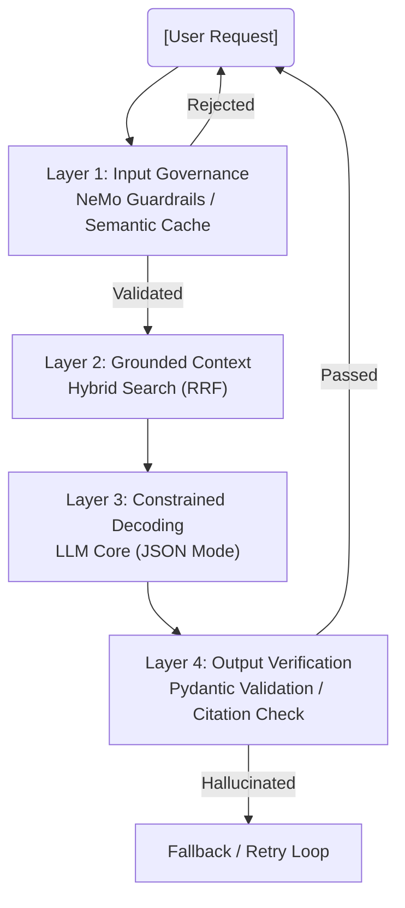

## 1. Bản Chất Vật Lý Của Hallucination

Trong các hệ thống phân tán truyền thống, khi bạn gửi một câu query SQL `SELECT`, hệ thống trả về kết quả chính xác 100% từ đĩa cứng (Deterministic). Tuy nhiên, LLM (Large Language Models) vận hành trên cơ chế **Stochastic Next-Token Prediction** (Dự đoán xác suất token tiếp theo). 

LLM không "truy xuất" kiến thức từ một cơ sở dữ liệu vật lý; chúng tính toán phân phối xác suất (Probability Distribution) trên không gian chiều cao của hàng tỷ tham số (Parameters). Khi phân phối xác suất của nhiều token gần bằng nhau (High Entropy), LLM có thể chọn một chuỗi token hoàn toàn đúng về mặt ngữ pháp nhưng sai lệch hoàn toàn về mặt thực tế (Factual Inaccuracy).

**Hệ quả dưới góc nhìn Staff Engineer:** Hallucination là **"Feature, not a Bug"**. Chúng ta không thể "fix" triệt để ảo giác ở cấp độ Model Weights bằng cách tinh chỉnh hyper-parameters. Thay vào đó, chúng ta phải "mitigate" (giảm thiểu) nó thông qua **Kiến trúc Hệ thống (System Architecture)** bao quanh mô hình.

---

## 2. Kiến trúc Phòng thủ Nhiều Lớp (Multi-Layered Defense)

Để vận hành LLM an toàn trong môi trường Enterprise cao cấp (High-stakes), một Prompt dài là sự ảo tưởng về bảo mật. Hệ thống cần được thiết kế với cơ chế chặn đứng ảo giác từ trước khi Prompt chạm vào Model, và xác minh lại output trước khi trả về User.



### 2.1. Layer 1: Input Governance (Pre-Generation)
Mục tiêu là chặn các prompt có khả năng gây ảo giác (như Prompt Injection, Jailbreak, hoặc câu hỏi out-of-domain) trước khi chúng tiêu tốn GPU compute đắt đỏ.
- **Giải pháp:** Sử dụng NVIDIA NeMo Guardrails để định tuyến (Routing).
- **Semantic Caching:** Dùng Vector DB để lookup các truy vấn tương tự đã được verified từ trước. Trả về kết quả Cache ngay lập tức, tiết kiệm 100% chi phí LLM.

### 2.2. Layer 2: Contextual Grounding (RAG)
Thay vì để LLM "nhớ lại" kiến thức từ Weights (vốn dễ gây ảo giác và lỗi thời), chúng ta ép mô hình chỉ tổng hợp thông tin từ Context được cung cấp.
- **RAG (Retrieval-Augmented Generation)** là hạt nhân. Tuy nhiên, RAG thuần túy dựa trên Dense Vector vẫn gây ảo giác nếu tài liệu truy xuất bị sai bối cảnh. Giải pháp Enterprise là kết hợp **Hybrid Search (BM25 + HNSW)** và Reranking.

### 2.3. Layer 3: Constrained Decoding (Generation)
Ép buộc LLM chỉ được phép sinh ra các cấu trúc từ vựng cụ thể (ví dụ: JSON Schema). Các framework như OpenAI JSON Mode, hoặc thư viện `Outlines` / `Guidance` thao túng trực tiếp vào quá trình dự đoán Logits của LLM để đảm bảo cú pháp không bao giờ hỏng.

### 2.4. Layer 4: Output Verification (Post-Generation)
Tuyệt đối không stream trực tiếp Output của LLM cho User trong các use-case tài chính. Output phải được đưa qua một Validator để đối chiếu (Cross-check) với các sự kiện đã truy xuất ở Layer 2 thông qua **Citations (Trích dẫn)**.

**Thực chiến Python (Sử dụng Pydantic & Instructor để ép trích dẫn):**
```python
import instructor
from pydantic import BaseModel, Field, ValidationInfo, field_validator
from openai import OpenAI
from typing import List

client = instructor.from_openai(OpenAI())

class Citation(BaseModel):
    source_id: str = Field(..., description="ID của tài liệu RAG đã cung cấp")
    exact_quote: str = Field(..., description="Trích dẫn chính xác từng chữ từ tài liệu")

class FinancialReport(BaseModel):
    company_name: str
    revenue_usd: float = Field(..., description="Doanh thu bằng USD")
    citations: List[Citation] = Field(..., description="Bắt buộc phải có trích dẫn chứng minh doanh thu")
    
    @field_validator('revenue_usd')
    @classmethod
    def revenue_must_be_positive(cls, v: float) -> float:
        if v < 0:
            raise ValueError(f"Ảo giác dữ liệu: Doanh thu không thể âm ({v})")
        return v

# Instructor ép LLM trả về cấu trúc trên. Nếu LLM tự bịa ra doanh thu mà
# không trích dẫn được exact_quote từ Context, hệ thống sẽ Reject và Retry.
try:
    report = client.chat.completions.create(
        model="gpt-4-turbo",
        response_model=FinancialReport,
        messages=[
            {"role": "system", "content": "Ngữ cảnh: [DOC_123] ACME Corp có doanh thu 5M USD."},
            {"role": "user", "content": "Phân tích doanh thu của ACME Corp."}
        ],
        max_retries=3 # Chống Retry Storm Limit
    )
    print(report.model_dump_json(indent=2))
except Exception as e:
    print(f"Fallback kích hoạt do ảo giác liên tục: {e}")
```

---

## 3. Sự Đánh Đổi Hệ Thống (Systemic Trade-offs)

Việc xây dựng Multi-Layered Defense mang theo gánh nặng to lớn về kiến trúc. Data Engineer phải đối mặt với các trade-off sau:

### 3.1. Accuracy vs. Latency (Độ Chính xác vs. Độ Trễ)
- **Vấn đề:** Mỗi bước kiểm tra (NeMo Guardrails, Reranking, Multi-Agent Verification) tốn thêm các lệnh gọi API. Kiến trúc LLM-as-a-judge (dùng một LLM khác để chấm điểm output) có thể đẩy độ trễ (Latency) từ 1 giây lên **15-20 giây**.
- **Staff-Level Solution:** Chấp nhận mất một chút "creativity". Chuyển phần Verification cho các thư viện Code tĩnh (Pydantic) hoặc dùng các mô hình cực nhỏ chạy Local (Llama-3-8B-Instruct) chuyên làm nhiệm vụ Judge để giảm Latency mạng lưới.

### 3.2. RAG vs. Fine-Tuning để chống Ảo giác
- **Fine-Tuning:** Dùng để dạy mô hình "Giọng văn" (Tone/Format). **Tuyệt đối KHÔNG dùng Fine-Tuning để cập nhật kiến thức mới**. Kiến thức đóng gói trong Weights rất dễ lỗi thời và sinh ảo giác mới.
- **RAG:** Dùng để cung cấp "Sự thật" (Grounding). Đổi lại, RAG làm tăng chi phí Token (Context Tax) và phụ thuộc 100% vào chất lượng thuật toán Search (nếu Search sai $\rightarrow$ LLM chắc chắn ảo giác).

### 3.3. Hallucination vs. Refusal Rate
- **Vấn đề:** Khi bạn thiết lập Guardrails quá chặt, hệ thống sinh ra một "phản ứng phụ" là **Refusal Rate** cao. LLM trở nên quá nhút nhát và liên tục trả lời "Tôi không biết" ngay cả với các câu hỏi hợp lệ.
- **Giải pháp:** Cần thiết lập hệ thống Observability (như LangSmith/Opik) để track đồng thời 2 chỉ số: *Hallucination Rate* và *Refusal Rate*.

---

## 4. Rủi ro Vận hành: Confident Hallucination do Data Poisoning

**Tình huống Production:** Một hệ thống RAG nội bộ sử dụng Vector DB. Do pipeline Ingestion không xử lý tốt Chunking (chia nhỏ văn bản), thông tin lương của "Giám đốc A" bị dính vào chunk của "Nhân viên B".

**Sự cố:** Khi User hỏi "Lương của B?", RAG truy xuất nhầm đoạn chunk bị nhiễu. LLM đọc context sai này và trả lời một cách cực kỳ tự tin [Confident Hallucination] rằng B có mức lương 500 triệu/tháng.

**Troubleshooting:**
1.  **Chất lượng Context:** Rác vào, ảo giác ra (Garbage in, Hallucination out).
2.  **Chunking Strategy:** Chuyển từ Fixed-size Chunking sang Semantic Chunking hoặc Document Hierarchy để giữ vẹn nguyên tính toàn vẹn của thực thể (Entity Integrity).
3.  **Bắt buộc Citation:** Áp dụng Code Pydantic ở phần 2.4 để ép mô hình trích xuất y hệt nguyên văn (Exact Match). Nếu LLM bóp méo dữ liệu khi tóm tắt, Pydantic Validator sẽ báo lỗi so khớp chuỗi.

---

## 5. Tổng Kết

Trong Data Engineering hiện đại, xử lý Hallucination không còn là công việc của AI Researcher ngồi tinh chỉnh Hyperparameters. Nó là một bài toán **Thiết kế Hệ thống Phân tán (Distributed Systems Design)**: bảo vệ Input, cung cấp Data chính xác (RAG), xác minh Output (Pydantic), và thiết kế cho sự thất bại (Graceful Degradation / Fallback) để không làm sập trải nghiệm người dùng cuối.

## Nguồn Tham Khảo
1.  [NVIDIA NeMo Guardrails Documentation][https://github.com/NVIDIA/NeMo-Guardrails]
2.  [Instructor: Structured Extraction in Python][https://python.useinstructor.com/]
3.  [Mitigating LLM Hallucinations in Production - Engineering Practices](https://arxiv.org/abs/2311.05232]
