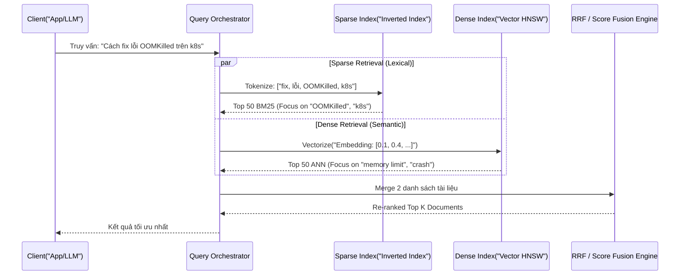

Trong các hệ thống RAG (Retrieval-Augmented Generation) cấp doanh nghiệp (Enterprise), việc chỉ dựa vào Semantic Search (Tìm kiếm theo ngữ nghĩa - Dense Vector) bộc lộ một điểm mù chết người: **Nó hoàn toàn bất lực trước các Exact Keyword** (mã sản phẩm, UUID, danh từ riêng hoặc các từ lóng hiếm gặp). Nếu user tìm kiếm `TX-90210 Error`, Vector Model có thể bối rối và trả về các lỗi tương tự nhưng khác mã, làm sập toàn bộ logic của LLM sau đó.

**Hybrid Search (Tìm kiếm lai/kết hợp)** ra đời để giải quyết vấn đề này bằng cách chạy song song hai engine: Sparse Retrieval (dựa trên keyword/BM25) và Dense Retrieval (dựa trên vector semantics), sau đó kết hợp điểm số của chúng. Đây là tiêu chuẩn kiến trúc (De facto standard) cho bất kỳ hệ thống tìm kiếm hiện đại nào.

---

## 1. Kiến trúc Thực thi Vật lý (Physical Execution of Dual Retrieval)

Dưới góc nhìn thiết kế hệ thống, Hybrid Search không phải là một thuật toán đơn lẻ, mà là một quy trình Orchestration (Điều phối) hai luồng I/O độc lập. 




### Cơ chế Dual Engine:
1. **Sparse Index (Inverted Index / SPLADE):** Biểu diễn văn bản thành các Sparse Vector cực lớn (hàng triệu chiều tương ứng với số lượng từ vựng) nhưng chủ yếu là số `0`. Cấu trúc Inverted Index dưới nền giúp tra cứu keyword với độ trễ cực thấp (Sub-millisecond).
2. **Dense Index (HNSW / IVF-PQ):** Biểu diễn văn bản thành Dense Vector (ví dụ: 1536 chiều với text-embedding-3-small). Sử dụng thuật toán ANN (Approximate Nearest Neighbor) thường là HNSW để duyệt đồ thị tìm láng giềng.

---

## 2. Giải thuật Kết hợp (Score Fusion Mechanisms)

Làm sao để kết hợp điểm của hai hệ thống đo lường hoàn toàn khác nhau? Điểm BM25 có thể dao động từ `0` đến `+∞`, trong khi điểm Cosine Similarity của Dense Vector nằm trong đoạn `[-1, 1]` (hoặc `[0, 1]`). 

### 2.1. Reciprocal Rank Fusion (RRF)
RRF là thuật toán phổ biến nhất (được sử dụng mặc định trong Elasticsearch và Pinecone) vì nó không cần quan tâm đến điểm số tuyệt đối, mà chỉ dùng **thứ hạng (rank)**.

$$ RRF\_Score = \frac{1}{k + Rank_{dense}} + \frac{1}{k + Rank_{sparse}} $$

*(Trong đó $k$ là smoothing constant để tránh tài liệu top 1 có trọng số quá lớn, chuẩn công nghiệp thường đặt $k = 60$).*

### 2.2. Khai triển với Elasticsearch & Python
Dưới đây là một ví dụ thực chiến cấu hình truy vấn Hybrid Search với RRF bằng Elasticsearch Python Client (phiên bản hỗ trợ `retriever`).

```python
from elasticsearch import Elasticsearch

# Khởi tạo kết nối tới Elasticsearch Cluster
es = Elasticsearch("https://es-cluster.vpc.internal:9200", api_key="...")

# Giả định query đã được convert sang embedding vector
query_text = "Fix lỗi OOMKilled trên K8s"
query_vector = embedding_model.encode(query_text).tolist()

response = es.search(
    index="incident_postmortems",
    # Sử dụng retriever API mới của ES cho RRF
    retriever={
        "rrf": {
            "retrievers": [
                {
                    "standard": {
                        "query": {
                            "match": {
                                "content": query_text
                            }
                        }
                    }
                },
                {
                    "knn": {
                        "field": "content_vector",
                        "query_vector": query_vector,
                        "k": 10, # Top K của Dense
                        "num_candidates": 100
                    }
                }
            ],
            "rank_window_size": 50, # Tính RRF trên top 50
            "rank_constant": 60     # k = 60
        }
    },
    _source=["incident_id", "resolution_notes"]
)

for hit in response['hits']['hits']:
    print(f"ID: {hit['_source']['incident_id']} - Score RRF: {hit['_rank']}")
```

### 2.3. Alpha / Convex Combination (Nội suy Tuyến tính)
Một số hệ thống như **Weaviate** cho phép Normalize điểm số về `[0, 1]` rồi sử dụng tham số $\alpha$ để tinh chỉnh sức nặng:
$$ Final\_Score = \alpha \times Dense\_Score + (1 - \alpha) \times Sparse\_Score $$
- $\alpha = 1$: Thuần Semantic Vector Search.
- $\alpha = 0$: Thuần BM25 Keyword Search.
- Thiết lập thực tế thường dùng: $\alpha \approx 0.75$ (Ưu tiên semantic, fallback về keyword).

---

## 3. Rủi ro Vận hành & Real-world Incidents

Đưa Hybrid Search vào Production không chỉ là "bật 2 cái cờ (flags) lên", mà là sự thách thức trực diện về kiến trúc Hệ thống Phân tán (Distributed Systems).

### Incident 1: JVM OOMKilled trên Cluster (Elasticsearch/OpenSearch)
- **Bối cảnh:** Team kỹ sư kích hoạt Vector Search trên một index có sẵn vài trăm GB dữ liệu text (Inverted Index).
- **Nguyên nhân:** Thuật toán HNSW yêu cầu **Toàn bộ Graph phải nằm trên RAM (In-memory)** để duyệt với tốc độ thấp. Khi dữ liệu phình to, JVM heap bị tràn, dẫn đến chuỗi Garbage Collection (GC) tàn khốc (Stop-the-world) và OOMKilled. Node bị văng khỏi cluster, gây hiệu ứng domino sập toàn bộ Elasticsearch.
- **Khắc phục:** 
    - Áp dụng các kỹ thuật nén lượng tử hóa: **Scalar Quantization (SQ) / Product Quantization (PQ)** để giảm kích thước vector xuống 4x-32x lần.
    - Chuyển sang kiến trúc Vector DB hỗ trợ **Disk-ANN** (Milvus, Qdrant, hoặc index memory-mapped), đánh đổi Latency (tăng Disk I/O) để cứu vãn RAM.

### Incident 2: Query Latency Spike (Bottleneck khi Scatter-Gather)
- **Bối cảnh:** Truy vấn Hybrid Search đột ngột có p99 latency > 2s.
- **Nguyên nhân:** Trong một cluster nhiều phân mảnh (shards), truy vấn Hybrid phải phát đi tới toàn bộ các shard (Scatter). Mỗi shard thực hiện HNSW và BM25 riêng, sau đó tổng hợp (Gather). Với RRF, coordinator node phải thu thập danh sách cực lớn (e.g. `num_candidates=100` x số shard) trước khi có thể xếp hạng lại RRF, gây nghẽn cổ chai CPU và Network băng thông tại Coordinator.
- **Khắc phục:** Giảm tham số `num_candidates` (hay `efSearch`), tinh gọn số lượng shards, hoặc scale-up tài nguyên Network/CPU cho Coordinator Node.

---

## 4. Tối ưu Chi phí (FinOps) & Systemic Trade-offs

Việc chọn triển khai Hybrid Search đồng nghĩa với việc bạn phải trả chi phí Infra cho **cả hai thế giới**.

| Tiêu chí | Thuần BM25 (Keyword) | Thuần HNSW (Vector) | Hybrid Search |
| :--- | :--- | :--- | :--- |
| **Storage (Disk)** | Trung bình (Inverted Index) | Rất lớn (Vector + Graph) | Cực lớn (Cả hai Index) |
| **Compute (RAM)** | Rất thấp (OS Page Cache) | Cực đắt (HNSW in RAM) | Cực đắt |
| **Latency** | < 10ms | 20ms - 50ms | 50ms - 100ms+ (Cộng gộp + RRF) |
| **Recall Rate** | Thấp với intent phức tạp | Thấp với từ lóng/mã | **Cao nhất (Best-in-class)** |

### FinOps Checklist:
1. **Có thực sự cần Hybrid?** Nếu hệ thống chỉ tìm kiếm tài liệu chung chung (không có mã sản phẩm, danh từ riêng khó), Semantic Search đơn thuần kết hợp với Reranker model (như Cohere Rerank) có thể mang lại hiệu quả tương tự mà ít phức tạp hơn ở lớp DB.
2. **Sử dụng Serverless Vector DB:** Nếu tải (traffic) không đều, cân nhắc dùng Pinecone Serverless. Pinecone tách rời Compute và Storage (Compute-Storage Separation), tính tiền trên RCU/WCU (Read/Write Compute Units), giảm thiểu rủi ro phải ôm cluster khổng lồ 24/7 chỉ để chứa RAM cho HNSW.
3. **Cơ chế Fallback:** Thay vì gộp điểm, thiết kế luồng pipeline: Nếu Semantic Search trả về confidence score thấp -> Rẽ nhánh (Fallback) sang BM25. Đánh đổi: Có thể mất một chút Recall nhưng tiết kiệm > 50% Compute.

---

## 5. Nguồn Tham Khảo (References)

* [Pinecone - The intuition behind Reciprocal Rank Fusion (RRF)](https://www.pinecone.io/learn/hybrid-search-intro/)
* [Elasticsearch Documentation: Hybrid search and RRF](https://www.elastic.co/guide/en/elasticsearch/reference/current/rrf.html)
* [Weaviate Blog - Hybrid Search Explained: Architecture & Alpha tuning](https://weaviate.io/blog/hybrid-search-explained)
* **Designing Data-Intensive Applications (Martin Kleppmann)** - *Chương 3: Storage and Retrieval (Đọc thêm về Inverted Index).*
* Nghiên cứu về nén Vector: *Product quantization for nearest neighbor search (Hervé Jégou et al.)*
