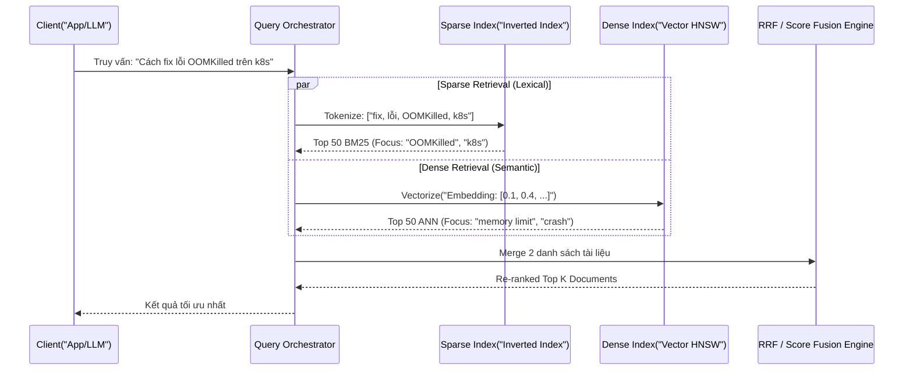

Trong các hệ thống RAG (Retrieval-Augmented Generation) cấp doanh nghiệp (Enterprise), việc chỉ dựa vào Semantic Search (Tìm kiếm ngữ nghĩa - Dense Vector) bộc lộ một điểm mù kiến trúc cực kỳ nghiêm trọng: **Nó hoàn toàn bất lực trước các Exact Keyword** (mã sản phẩm SKU, UUID, danh từ riêng hoặc các từ lóng hiếm gặp). 

Nếu user tìm kiếm `TX-90210 Error`, Vector Model có thể bối rối và trả về các lỗi có ngữ nghĩa tương tự nhưng khác mã, làm sập toàn bộ logic của LLM sau đó. Ngược lại, BM25 (Keyword search) truyền thống lại rất giỏi tìm mã chính xác nhưng lại "mù tịt" về context và từ đồng nghĩa.

Dưới góc nhìn của một **Staff Data Engineer**, **Hybrid Search (Tìm kiếm lai)** không chỉ là một thuật toán, mà là một mẫu kiến trúc (Design Pattern) bắt buộc phải có để xây dựng hệ thống Search đạt độ chính xác (Recall) cao nhất, bằng cách chạy song song cả hai engine.

---

## 1. Kiến trúc Thực thi Vật lý (Dual Retrieval Architecture)

Hybrid Search là quá trình Orchestration (Điều phối) hai luồng I/O độc lập và sau đó hợp nhất kết quả.



### Cơ chế Dual Engine:
1.  **Sparse Index [Inverted Index]:** Chạy thuật toán BM25. Văn bản được biểu diễn thành các Sparse Vector cực lớn (hàng triệu chiều) nhưng chủ yếu là số `0`. Cấu trúc Inverted Index dưới nền giúp tra cứu keyword với độ trễ cực thấp (Sub-millisecond). Tốn rất ít RAM (chủ yếu dùng OS Page Cache).
2.  **Dense Index (HNSW / IVF-PQ):** Biểu diễn văn bản thành Dense Vector (VD: 1536 chiều với text-embedding-3-small). Sử dụng thuật toán ANN (Approximate Nearest Neighbor) để duyệt đồ thị không gian. Yêu cầu **Toàn bộ Graph nằm trên RAM**, tốn tài nguyên cực lớn.

---

## 2. Giải thuật Hợp nhất (Score Fusion Mechanisms)

Vấn đề hóc búa nhất của Hybrid Search là: Điểm BM25 không bị giới hạn (từ `0` đến `+∞`), trong khi điểm Cosine Similarity của Dense Vector nằm trong khoảng `[0, 1]`. Làm sao cộng táo với cam?

### 2.1. Reciprocal Rank Fusion (RRF] - Kẻ Thống Trị
RRF là thuật toán mặc định của hầu hết các DB hiện đại (Elasticsearch, Pinecone, Redis). Nó hoàn toàn lờ đi điểm số tuyệt đối, và chỉ dùng **Thứ hạng (Rank)**.

$$ RRF\_Score = \frac{"1"}{k + Rank_{"dense"}} + \frac{"1"}{k + Rank_{"sparse"}} $$

-   **Systemic Trade-offs:**
    -   **Pros:** Zero-shot (không cần train), cực kỳ bền bỉ với các dữ liệu ngoại lai (outliers), tự động giải quyết bài toán lệch scale điểm số. Phù hợp cho 90% use-cases.
    -   **Cons:** Phụ thuộc vào hằng số $k$ (smoothing factor, mặc định thường là 60). Kém linh hoạt nếu bạn muốn "ép" hệ thống luôn ưu tiên Keyword hơn Vector.

### 2.2. Weighted Fusion [Nội suy Tuyến tính]
Chuẩn hóa điểm số về `[0, 1]` rồi dùng hằng số $\alpha$ để tinh chỉnh:
$$ Final\_Score = \alpha \times Dense\_Score + (1 - \alpha] \times Sparse\_Score $$

-   **Systemic Trade-offs:**
    -   **Pros:** Cho phép Control tuyệt đối (ví dụ $\alpha=0.2$ để hệ thống nặng về Keyword search).
    -   **Cons:** Cực kỳ giòn (Brittle). Điểm số phân phối thay đổi liên tục, đòi hỏi team Data Science phải liên tục tuning tham số $\alpha$ cho từng tập dữ liệu mới.

---

## 3. Thực chiến với Elasticsearch (Code Example)

Dưới đây là cách một Staff Engineer cấu hình truy vấn Hybrid Search với RRF bằng Elasticsearch Python Client, đẩy toàn bộ tính toán phức tạp xuống Database layer (Server-side RRF) để tránh nghẽn mạng.

```python
from elasticsearch import Elasticsearch

# Khởi tạo kết nối tới Elasticsearch Cluster
es = Elasticsearch("https://es-cluster.vpc.internal:9200", api_key="...")

query_text = "Fix lỗi OOMKilled trên K8s"
# Giả định query đã được convert sang embedding vector
query_vector = embedding_model.encode(query_text).tolist()

response = es.search(
    index="incident_postmortems",
    # Sử dụng retriever API mới của ES cho RRF (Server-side fusion)
    retriever={
        "rrf": {
            "retrievers": [
                {
                    "standard": {
                        "query": {
                            "match": {
                                "content": query_text
                            }
                        }
                    }
                },
                {
                    "knn": {
                        "field": "content_vector",
                        "query_vector": query_vector,
                        "k": 10, # Top K của Dense
                        "num_candidates": 100
                    }
                }
            ],
            "rank_window_size": 50, # Tính RRF trên top 50 (Tối ưu CPU)
            "rank_constant": 60     # k = 60
        }
    },
    _source=["incident_id", "resolution_notes"]
)

for hit in response['hits']['hits']:
    print(f"ID: {hit['_source']['incident_id']} - Score RRF: {hit['_rank']}")
```

---

## 4. Rủi ro Vận hành (Operational Incidents) & FinOps

Đưa Hybrid Search vào Production là một thách thức trực diện về kiến trúc Hệ thống Phân tán (Distributed Systems).

### 4.1. Incident: JVM OOMKilled trên Cluster (Elasticsearch/OpenSearch)
-   **Nguyên nhân:** Thuật toán HNSW (Vector Index) yêu cầu **Toàn bộ Graph phải nằm trên RAM** để duyệt với tốc độ thấp. Khi dữ liệu phình to, JVM heap bị tràn, dẫn đến chuỗi Garbage Collection (GC) tàn khốc và node bị văng khỏi cluster (OOMKilled).
-   **Staff-level Tuning:** Áp dụng các kỹ thuật nén lượng tử hóa: **Scalar Quantization (SQ)** hoặc **Product Quantization (PQ)** để giảm kích thước vector xuống 4x-32x lần trước khi nạp vào RAM.

### 4.2. Bottleneck khi Scatter-Gather
-   **Nguyên nhân:** Trong một cluster phân mảnh (shards), truy vấn Hybrid phải phát đi tới toàn bộ các shard (Scatter). Mỗi shard thực hiện HNSW và BM25 riêng. Với RRF, Coordinator Node phải thu thập danh sách cực lớn (VD: `num_candidates=100` x 10 shards) trước khi có thể xếp hạng lại, gây nghẽn CPU.
-   **Khắc phục:** Giảm `num_candidates` (hoặc `efSearch`), hoặc áp dụng kỹ thuật Reranker chéo (Cross-Encoder) chỉ trên Top 10 kết quả cuối cùng để tiết kiệm CPU.

### 4.3. FinOps Trade-offs
Việc chạy Hybrid Search đồng nghĩa bạn phải trả tiền cho CẢ HAI kiến trúc lưu trữ.
-   **Quyết định Kiến trúc:** Đừng mù quáng dùng Hybrid. Nếu hệ thống chỉ tìm kiếm tài liệu chung chung, Semantic Search đơn thuần kết hợp với Reranker model (như Cohere Rerank) có thể mang lại hiệu quả tương đương mà hạ tầng DB đơn giản hơn rất nhiều. Nếu có mã sản phẩm (SKU) dày đặc, hãy fallback về BM25 thay vì bắt LLM/Vector xử lý.

---

## 5. Nguồn Tham Khảo
1.  **Pinecone** - *The intuition behind Reciprocal Rank Fusion (RRF)*.
2.  **Elasticsearch Documentation** - *Hybrid search and RRF*.
3.  **Designing Data-Intensive Applications** - Martin Kleppmann (Chương 3).
