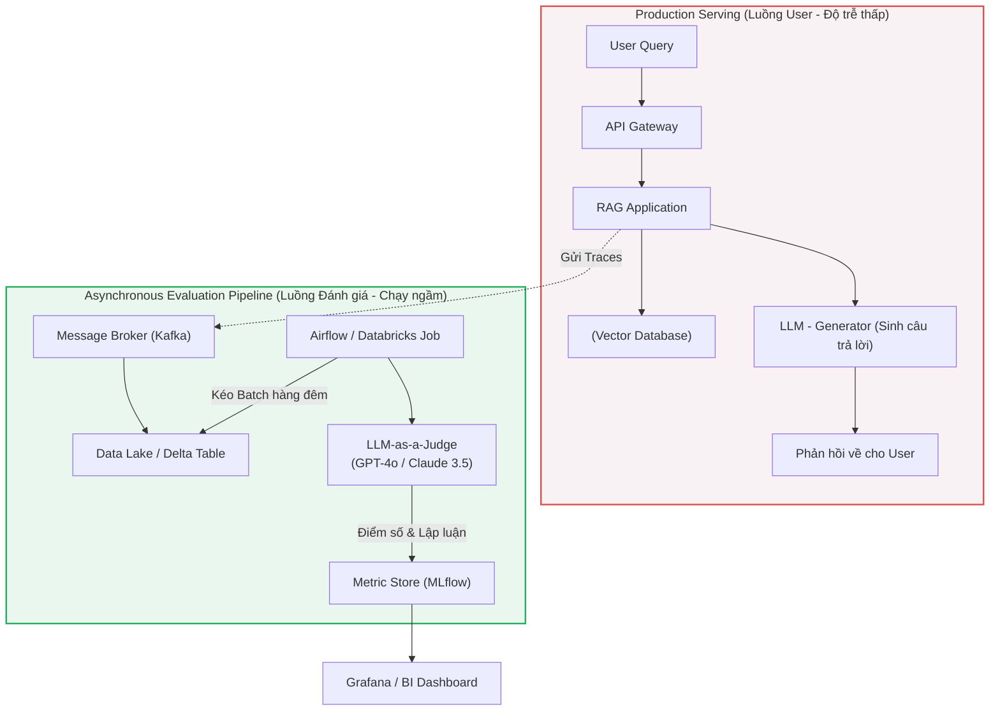

Trong môi trường Lab, bạn có thể tự mình đọc bằng mắt vài chục câu trả lời của mô hình ngôn ngữ (LLM) và gật gù khen hay. Nhưng khi đẩy ứng dụng GenAI (Ví dụ: Hệ thống RAG đọc tài liệu nội bộ, Agentic Workflows) lên môi trường Production với hàng trăm nghìn Requests mỗi ngày, câu hỏi sinh tử đặt ra là: *"Làm sao để biết phiên bản Prompt V2 có thực sự tốt hơn V1, hay nó đang sinh ra hàng loạt Ảo giác (Hallucination) đe dọa uy tín công ty?"*

Thuê hàng nghìn Reviewers con người (Human-in-the-loop) để đọc từng log chat là điều không tưởng về cả thời gian và tài chính. Từ đó, kiến trúc **LLM-as-a-judge** (Sử dụng các mô hình LLM siêu việt như GPT-4 hay Claude 3.5 làm Giám khảo chấm điểm) ra đời. Tuy nhiên, ở quy mô Enterprise, nó không phải là một file Script chạy lặt vặt. Nó là một **Hạ tầng Đánh giá (Evaluation Infrastructure)** đồ sộ, dính líu chặt chẽ đến FinOps, Data Engineering và System Trade-offs.

---

## 1. Kiến trúc Hệ thống Đánh giá (Asynchronous Evaluation Architecture)

Điều cấm kỵ đầu tiên trong thiết kế hệ thống GenAI: **Tuyệt đối không chặn (Block) luồng thực thi chính của User để chờ LLM Judge chấm điểm.**
Gọi API của LLM tốn từ 2-5 giây. Nếu bạn bắt User chờ thêm 5 giây chỉ để hệ thống tự chấm điểm câu trả lời, trải nghiệm người dùng sẽ bị phá hủy. Kiến trúc bắt buộc phải là **Asynchronous Offline Evaluation** (Đánh giá Bất đồng bộ / Chạy ngầm).



**Phân tích Chi tiết Kiến trúc:**
1. **Telemetry & Tracing:** Ứng dụng RAG không chỉ Log lại mỗi "Câu hỏi" và "Câu trả lời". Nó phải Log toàn bộ **Trace**, bao gồm các Chunks (Đoạn tài liệu) được móc lên từ Vector DB, metadata, và User Feedback (Nút Like/Dislike). Toàn bộ cục dữ liệu này được Serialize thành JSON và ném vào Kafka để xử lý sau.
2. **Batch Processing:** Các Data Jobs (Chạy trên Apache Airflow hoặc Databricks) sẽ thức dậy vào 2 giờ sáng. Nó kéo hàng chục ngàn Logs của ngày hôm trước từ Data Lake, nạp vào Prompt đính kèm **Rubric (Tiêu chí chấm điểm khắt khe)**, và bắn hàng loạt (Batching) lên LLM Judge.
3. **Observability (Giám sát Model Drift):** Mỗi điểm số (Ví dụ `Faithfulness = 0.2`) bắt buộc phải đi kèm một chuỗi **Reasoning (Lập luận Chain-of-Thought)** giải thích tại sao LLM Judge lại cho điểm thấp. Dữ liệu này được đẩy vào MLflow để theo dõi sự suy thoái (Drift) của hệ thống qua từng ngày.

---

## 2. Tiêu chuẩn Đánh giá: RAG Triad (Tam giác RAG)

Thay vì hỏi LLM Judge một câu ngây ngô *"Câu trả lời này có tốt không?"*, các kỹ sư chia nhỏ việc đánh giá thành 3 trục tọa độ toán học (Được gọi là **The RAG Triad**):

1. **Context Precision (Độ chuẩn xác của Ngữ cảnh):** Các mảnh tài liệu (Chunks) mà khối Retriever moi lên từ Vector DB có thực sự chứa thông tin giải quyết được câu hỏi không? (Để chấm điểm khối Truy xuất).
2. **Faithfulness / Groundedness (Độ trung thực):** LLM có dựa **100%** vào tài liệu được cung cấp để trả lời không? Hay nó lén lút "Bịa" thêm thông tin (Hallucination) từ kiến thức có sẵn của nó?
3. **Answer Relevance (Độ bám sát câu hỏi):** Câu trả lời có đúng trọng tâm User hỏi không, hay chỉ trả lời lan man dài dòng?

### Code Thực chiến: LLM Judge với Structured Outputs (Pydantic)
Sự cố kinh điển nhất của LLM Judge là nó sinh ra output Rác (Ví dụ: *"Dạ, điểm số là: {'score': 5}"*), làm sập (Crash) toàn bộ các hàm JSON Parser ở Data Pipeline phía sau. Dưới đây là cách sử dụng Pydantic để Ép (Force) LLM Judge phải trả về đúng Schema Toán học.

```python
import openai
from pydantic import BaseModel, Field

# 1. Định nghĩa Lược đồ (Schema) trả về cực kỳ nghiêm ngặt
class EvaluationResult(BaseModel):
    reasoning: str = Field(description="Lập luận từng bước (Chain-of-thought) giải thích tại sao cho điểm số này.")
    score: int = Field(description="Điểm số từ 1 đến 5 dựa trên Rubric.")
    is_hallucinated: bool = Field(description="True nếu LLM sinh ra thông tin không hề tồn tại trong Context.")

def evaluate_faithfulness(query: str, context: str, response: str) -> EvaluationResult:
    client = openai.Client()
    
    prompt = f"""
    Bạn là một Giám khảo khắt khe. Nhiệm vụ của bạn là đánh giá độ Trung thực [Faithfulness] của hệ thống RAG.
    Tuyệt đối tuân thủ tiêu chí (Rubric) sau:
    - Điểm 1: Câu trả lời hoàn toàn bịa đặt, không có dấu vết trong Ngữ cảnh.
    - Điểm 3: Câu trả lời có phần đúng, nhưng chắp vá thông tin bên ngoài.
    - Điểm 5: Câu trả lời lấy 100% từ Ngữ cảnh, không chế thêm.
    
    [User Query]: {query}
    [Retrieved Context]: {context}
    [LLM Response]: {response}
    
    Bắt buộc phải lập luận từng bước (Reasoning] trước khi đưa ra điểm số.
    """

    # 2. Gọi API và ép kiểu với response_format
    completion = client.chat.completions.parse(
        model="gpt-4o",
        messages=[{"role": "user", "content": prompt}],
        response_format=EvaluationResult, # OpenAI tự động ép LLM trả về đúng Object này
    )
    
    # Kết quả trả về là một Object Python an toàn tuyệt đối, không bao giờ lỗi JSON Parse
    return completion.choices[0].message.parsed
```

---

## 3. Rủi ro Vận hành (Operational Risks] & Thảm Họa

Việc cắm một API vào là xong chỉ có trong bài viết Tutorial. Thực tế Enterprise ẩn chứa những rủi ro cháy máy chủ:

### 3.1. Thảm Họa Bão Giới Hạn (Rate Limit Storms)
- **Incident (Sự cố):** Đêm qua, Airflow Job chạy Batch Evaluation cho 100,000 tin nhắn Customer Service. Developer sử dụng `asyncio` để mở 500 kết nối song song gọi lên OpenAI API (Hoặc Azure OpenAI) cho nhanh.
- **Hậu quả:** Hệ thống quét sạch hạn mức (Quota) Token Per Minute (TPM) của toàn công ty trong 2 giây. Hàng nghìn lỗi `HTTP 429 Too Many Requests` dội về. Tệ hại hơn, các Microservice Production khác đang phục vụ khách hàng thật cũng bị sập lây vì dùng chung API Key.
- **Khắc phục Kiến trúc:** 
  1. **Network Isolation:** Tách biệt hoàn toàn API Key và TPM Quota giữa luồng Evaluation và luồng Production.
  2. **Batch API:** Đừng gọi REST API thời gian thực. Hãy sử dụng tính năng **Batch API** của OpenAI (Gửi 1 file `.jsonl` khổng lồ lên, nhận kết quả vào ngày hôm sau). Nó giảm **50% giá tiền** và không tính vào Rate Limit Real-time.

### 3.2. Cơn Ác Mộng FinOps (Cost vs. Rigor)
Dùng mô hình tối tân như GPT-4o để làm Giám khảo cho 1 triệu tin nhắn mỗi ngày sẽ khiến công ty nộp mạng hàng chục ngàn USD mỗi tháng chỉ riêng cho tiền... chấm điểm.
- **The Judge Cascade (Giải pháp Cask Kiến trúc):** 
  - Bước 1: Dùng GPT-4o (Gold Judge) chấm một tập dữ liệu nhỏ đại diện (Khoảng 5,000 mẫu).
  - Bước 2: Lấy 5,000 mẫu "Điểm 10" này mang đi **Fine-tune (Huấn luyện lại)** một mô hình mã nguồn mở siêu nhỏ (Như `LLaMA-3-8B` hoặc `Phi-3`) biến nó thành một **Routing Judge chuyên biệt**.
  - Bước 3: Đưa mô hình nhỏ này tự host (Self-hosted) trong công ty. Nó có thể chấm 1 triệu tin nhắn với chi phí điện năng gần như bằng 0. Khi mô hình nhỏ "Không chắc chắn" (Low Confidence), nó mới nhả Request về lại cho GPT-4o chấm.

### 3.3. Thiên Kiến Chết Người của Giám Khảo (Judge Biases)
LLM không phải là những vị thần công tâm. Nghiên cứu *Judging LLM-as-a-Judge* (Zheng et al.) chỉ ra rằng LLM có 3 thiên kiến khuyết tật:
1. **Position Bias (Thiên vị Vị trí đầu):** Nếu bạn đưa LLM Judge 2 câu trả lời A và B, bảo nó chọn cái nào hay hơn. Nó có xu hướng mù quáng chọn câu A (Câu nằm trước). 
   - *Cách fix hệ thống:* Đảo ngược vị trí (Swap) A-B và gọi API lần 2. Chỉ ghi nhận kết quả nếu cả 2 lần gọi nó đều chọn cùng 1 đáp án.
2. **Verbosity Bias (Thiên vị Chữ nghĩa Dài dòng):** LLM Judge mặc định "Đam mê" những câu trả lời dài lê thê, màu mè, cho dù câu trả lời ngắn gọn mới là chính xác nhất. Phải explicitly cấm điều này trong Rubric.
3. **Self-enhancement Bias (Thiên vị Tự thân):** Dòng dõi nhà OpenAI (GPT-4) thường ưu ái chấm điểm cao cho văn phong do chính họ nhà GPT sinh ra (Hơn là văn phong của Claude).

---

## 4. Các Framework Đánh giá Chuẩn Công Nghiệp

Thay vì code lại vòng lặp Retry hay tính toán Toán học từ đầu, Data Engineer sử dụng các Framework MLOps:

- **RAGAS (RAG Assessment):** Framework "Tiêu chuẩn ngành" hiện tại chuyên trị đánh giá RAG. Nó cung cấp sẵn các bộ Prompt Toán học siêu phức tạp để tính toán RAG Triad mà không cần tập dữ liệu Nhãn gốc (Reference-free evaluation).
- **DeepEval:** Framework mã nguồn mở đi theo triết lý "Test-Driven Development (TDD)". Hỗ trợ nhúng thẳng vào `pytest`. Bạn có thể dùng lệnh `assert metric.is_successful[)` trong luồng CI/CD (GitHub Actions) để tự động chặn (Block) việc Deploy nếu phiên bản Prompt mới làm rớt điểm số.
- **MLflow LLM Evaluate:** Tích hợp sâu vào Databricks, cho phép lưu trữ toàn bộ History của các cuộc đánh giá, dễ dàng so sánh Version 1 vs Version 2 bằng giao diện UI cực kỳ trực quan.

---

## Nguồn Tham Khảo (References)
1. **Zheng et al. (Arxiv 2023):** [Judging LLM-as-a-Judge with MT-Bench and Chatbot Arena][https://arxiv.org/abs/2306.05685]
2. **Databricks Engineering:** [Best Practices for LLM Evaluation of RAG Applications][https://www.databricks.com/blog/2023/09/12/best-practices-llm-evaluation-rag-applications]
3. **OpenAI Documentation:** [Batch API for Asynchronous Workloads][https://platform.openai.com/docs/guides/batch]
4. **DeepEval Official Docs:** [The Open-Source LLM Evaluation Framework](https://docs.confident-ai.com/]
